# 不仅仅是代码助手：用 Plugins 将 Claude Code 打造成你的专属工具链

## 第一篇：概念篇 - 打破 AI 助手的"次元壁"

> **系列说明**：本文是 Claude Code Plugins 系列的第一篇，聚焦核心概念与工作原理。后续将推出实战开发、企业应用和未来展望篇。敬请关注，多提宝贵意见。


## **Claude Code Plugins 的诞生背景**

`Claude`是Anthropic推出的大语言模型，以安全性和可用性著称。`Claude Code`则是基于Claude构建的命令行开发工具，旨在将AI深度融入开发者的日常工作流。随着开发者不断构建越来越强大的定制化配置，并希望与团队和社区分享这些经验，Anthropic于**2025年10月9日正式发布了Plugins机制**（currently in public beta），这标志着Claude Code从一个AI代码助手演进为一个可扩展的开发平台。

Plugins机制的核心目的很明确：**将原本分散的Slash Commands（斜杠命令）、Subagents（子代理）、MCP Servers（协议服务器）和Hooks（钩子）等功能统一打包，实现一键安装、轻松分享**。这不仅解决了配置管理的复杂性，更开启了AI原生开发工具生态建设的新篇章。如果你也和笔者一样之前试验过各种`Slash Commands`、`Subagents`、`MCPs`的话，看看你自己的`~/.claude`目录有多混乱就知道了。

---

## 一、场景切入：研发者的日常"囧境"

你是否也经历过这样的场景？

凌晨2点，线上系统突发故障。你急忙打开电脑，屏幕上瞬间铺满了十几个窗口：JIRA查工单、Confluence翻文档、GitLab看代码、Grafana查监控……在各个系统间疲于奔命，却发现你的AI代码助手对这一切一无所知，只能眼巴巴地看着你手动复制粘贴信息。

这不是某个倒霉开发者的偶遇，而是无数研发人员每天都在经历的"日常"。让我们通过一个具体案例，看看这种困境到底有多糟糕……

作为一名资深开发者，张三（虚构角色）的一天常常是这样开始的：线上监控系统告警，一个紧急 bug 需要立即修复。他的屏幕上瞬间铺满了各式各样的窗口：

**上午 10:05 - 问题定位的"工具马拉松"**

1. **JIRA**：他首先打开 JIRA，在项目看板上找到对应的 Ticket `PROJ-1234`，阅读用户反馈："支付接口偶发性超时，影响约 5% 的订单"。

2. **Confluence**：接着，他跳转到 Confluence，搜索与支付模块相关的技术设计文档，试图理解复杂的第三方对接逻辑和超时配置。

3. **GitLab**：然后，他切换到 GitLab，使用 `git blame` 和日志搜索，定位到最近三次可疑的代码提交，仔细审查每一个改动。

4. **Grafana**：为了复现问题，他还需要登录 Grafana，查询 bug 发生时间点的系统监控指标——API 延迟、数据库连接数、Redis 命中率。

5. **回到 AI 助手**：花了 30 分钟收集信息后，张三想让 AI 代码助手帮他分析问题根因。然而，AI 对 JIRA、Confluence、GitLab、Grafana 一无所知。他只能叹了口气，开始手动复制粘贴各个系统的关键信息到 AI 的对话框中。

**上午 10:40 - 疲惫的总结**

张三终于拼凑出一个完整的问题描述，但此时他已经：
- 切换了 **5 个不同的工具**
- 打开了 **12 个浏览器标签页**
- 复制粘贴了 **7 段文本**
- 浪费了 **35 分钟**在工具切换和信息整理上

这正是无数研发人员每天都在上演的"囧境"：**频繁的上下文切换、割裂的信息孤岛、以及无法真正融入团队真实工作流的 AI 助手**。

---

## 二、问题的根源：通用 AI 的"知识边界"

### 2.1 通用模型的局限性

问题的根源在于，当前大多数 AI 代码助手本质上是基于公开数据训练的"通才模型"。它们在公开代码、算法知识、编程语言上表现出色，但对以下内容却一无所知：

- 你公司的私有代码库和业务逻辑
- 内部 API 和微服务架构
- 团队特有的工作流程和规范
- 实时的系统运行状态和监控数据

它们仿佛被困在一个透明的"黑盒"里，能看到你输入的信息，却无法触及你真实的工作环境。

### 2.2 传统 AI 助手的能力边界

让我们通过一个对比表格，清晰地看到这种局限：

| 维度 | 传统 AI 代码助手 | 理想的 AI 工作伙伴 |
|------|-----------------|------------------|
| **知识来源** | 静态训练数据（截止某时间点） | 实时访问企业系统和动态数据 |
| **工作模式** | 旁观者、顾问角色 | 执行者、深度协作者 |
| **能力范围** | 知识问答、代码生成、文本总结 | 跨系统操作、任务自动执行 |
| **系统边界** | 封闭系统，无法扩展 | 开放平台，可无限扩展 |
| **团队适配** | 通用配置，难以定制 | 深度定制，适配团队流程 |

### 2.3 "张三"真正需要的是什么？

回到开头的场景，张三理想中的工作流应该是这样的：

```
张三："Claude，帮我分析 PROJ-1234 这个支付超时问题的根因。"

AI 助手：
1. [自动查询 JIRA] 获取问题描述和用户反馈
2. [自动搜索 GitLab] 定位支付模块最近的代码变更
3. [自动查询 Grafana] 获取问题时间段的性能指标
4. [自动检索 Confluence] 查找相关技术文档

综合分析结果：
问题根因：上周三的提交 a3f9c2b 将支付网关超时配置从 5s 改为 3s，
在高并发场景下导致偶发超时。同时监控显示该时段第三方支付接口
P99 延迟达到 3.2s，超过了新的超时阈值。

建议方案：
1. 将超时配置回退到 5s 或调整为 8s
2. 添加重试机制和降级策略
3. 与第三方支付确认其 SLA 保障

需要我帮你创建修复 PR 吗？
```

这才是真正能提升效率的 AI 助手——它不再是信息的搬运工，而是能够**主动获取数据、自主分析问题、提供可执行方案**的智能协作者。

### 2.4 Plugins之前的"工具割裂"时代

在Plugins机制推出之前，开发者面临着配置管理的挑战：

**四大功能各自独立**：
- **Slash Commands**：需要单独在`.claude`目录下配置
- **Subagents**：独立的agent配置文件
- **MCP Servers**：分散的server配置
- **Hooks**：各自的hooks定义

**带来的问题**：
1. **配置分散**：想要分享一个完整的工作流，需要分别复制多个配置文件
2. **版本管理困难**：各组件版本独立，缺乏统一的依赖管理
3. **团队协作障碍**：难以保证团队成员使用相同的配置
4. **知识孤岛**：优秀的配置难以在社区传播

**Plugins的解决方案**：
将这四大组件统一打包进一个plugin，实现：
- ✅ 一键安装完整功能
- ✅ 统一的版本管理
- ✅ 便捷的团队共享
- ✅ 活跃的社区生态

那么，如何实现这样的理想工作流？这正是 Claude Code Plugins 要解决的核心问题。

---

## 三、破局者登场：Claude Code Plugins


### 3.1 核心定位

现在，是时候打破这堵"次元壁"了。Anthropic 推出的 **Claude Code Plugins** 机制，为我们提供了一把钥匙：

> **Plugins 是连接 Claude 与外部世界（尤其是团队私有工具链）的桥梁**

通过 Plugins，Claude Code 实现了三大突破：

1. **打破知识边界**：从静态训练数据到动态 API 调用，实时获取企业系统信息
2. **重新定义能力**：从"对话生成"到"任务执行"，AI 成为真正的行动者
3. **用户掌控权**：你精确定义 Claude 能访问什么、调用什么、操作什么

### 3.2 核心理念：Bring Your Own Tools (BYOT)

Claude Code Plugins 的设计哲学可以用一句话概括：**"Bring Your Own Tools"（带上你自己的工具）**。

**类比理解**：
- 如果 **Claude** 是一个智能手机操作系统（OS）
- 那么 **Plugins** 就是你可以安装在上面的应用程序（App）

一部没有 App 的手机功能非常有限，而丰富的 App 生态则赋予了它连接世界、处理特定任务的无限可能。

**BYOT 的核心含义**：

1. **你是工具的提供者**
   - 决定提供哪些工具给 Claude
   - 完全掌控数据访问和操作权限

2. **安全性由你掌控**
   - 精确定义每个插件的权限范围
   - 所有数据交互都在你的监控之下

3. **灵活性与扩展性**
   - 可以为任何内部系统构建插件
   - 随时添加、更新、移除插件

### 3.3 范式转变：从"对话"到"执行"

Plugins 的引入，带来的是根本性的范式转变。让我们通过表格看清这种革命性的差异：

| 特性 | 传统 AI 代码助手 | 集成 Plugins 的 Claude Code |
|------|-----------------|---------------------------|
| **知识来源** | 静态的、截止于某个时间的训练数据 | 动态的、可实时访问任何 API 获取的数据 |
| **能力范围** | 知识问答、代码生成、文本总结 | 所有前述能力 + **执行操作**（查数据库、创建工单、触发部署） |
| **工作模式** | 作为独立的"顾问"在旁辅助 | 作为"智能代理"深度嵌入工作流 |
| **系统边界** | 封闭系统，功能固定 | 开放系统，可无限扩展 |
| **团队协作** | 个人工具，难以共享配置 | 团队共享，统一工作流 |

**举例说明转变**：

**传统模式**：
```
开发者："这段代码有什么问题？"
AI："这里可能有性能问题，建议优化查询语句。"
开发者：[手动修改代码] → [手动运行测试] → [手动提交]
```

**Plugins 模式**：
```
开发者："优化这段代码的性能，并运行测试验证。"
Claude Code：
1. [分析代码] 识别性能瓶颈
2. [生成优化方案] 改进查询逻辑
3. [调用 test_runner_plugin] 自动运行单元测试
4. [调用 profiler_plugin] 对比优化前后性能
5. [汇报结果] "优化后查询时间从 230ms 降至 45ms，所有测试通过"
```

### 3.4 本文导读

理解了Plugins的核心理念和价值后，你可能会好奇：这个"魔法"背后到底是如何工作的？让我们深入技术细节。

在接下来的内容中，我们将深入探讨：

- **第四章**：Plugins 的四大核心组件及其协作机制
- **第五章**：Claude 如何通过 OpenAPI 规范"学会"使用工具
- **第六章**：插件市场生态及其对开发者的意义

让我们开始这场探索之旅。

---

## 四、核心概念：Plugins 的四大组成部分

Claude Code Plugins 并非单一的技术机制，而是由四个核心组件协同工作的生态系统。理解这四个组件及其协作方式，是掌握 Plugins 的关键。

### 4.1 整体架构

```mermaid
graph TB
    A[Claude Code] --> B[Slash Commands<br/>斜杠命令]
    A --> C[Subagents<br/>子代理]
    A --> D[MCP Servers<br/>协议服务器]
    A --> E[Hooks<br/>钩子]

    B --> F[快捷操作入口<br/>用户主动触发]
    C --> G[专业任务代理<br/>复杂任务分工]
    D --> H[外部工具连接<br/>数据与服务集成]
    E --> I[自动化触发器<br/>工作流关键节点]

    style A fill:#e1f5ff
    style B fill:#fff3e0
    style C fill:#f3e5f5
    style D fill:#e8f5e9
    style E fill:#fce4ec
```



### 4.2 Slash Commands（斜杠命令）

#### 定义
通过输入 `/command` 触发的自定义快捷操作，类似 VS Code 的 Command Palette 或 Slack 的斜杠命令。

#### 典型应用场景

```bash
# 代码审查
/review-pr
→ 自动分析当前分支的变更，对比团队编码规范，生成审查报告

# 日志分析
/query-logs "payment error" --last 1h
→ 搜索生产环境日志，筛选支付相关错误，按时间聚合

# 工单创建
/create-ticket "API 超时问题" --priority high
→ 在 JIRA 创建工单，自动填充当前上下文信息
```

#### 工作机制

Slash Commands 通过 Markdown 文件定义，结构如下：

```markdown
---
name: review-pr
description: Automated Pull Request review
tags: [code-review, git]
---

# Pull Request Review Instructions

You are helping review a Pull Request. Follow these steps:

1. **Analyze Changes**
   - Read the git diff
   - Identify modified files and functions

2. **Check Standards**
   - Compare against style guide: ./docs/CODE_STYLE.md
   - Verify test coverage requirements

3. **Security Scan**
   - Check for hardcoded credentials
   - Identify potential SQL injection risks

4. **Generate Report**
   Format findings as:
   ✅ Passed checks
   ⚠️ Warnings
   ❌ Must fix before merge
```

**关键特性**：
- 使用自然语言描述任务步骤
- Claude 根据指令自主执行
- 可引用项目文档和配置文件

### 4.3 Subagents（子代理）

#### 定义
为特定领域或任务优化的专用 AI 代理，拥有独立的 system prompt 和工具集。

#### 协作模式

```mermaid
sequenceDiagram
    participant U as User
    participant M as Main Agent<br/>(Claude Code)
    participant F as Frontend Subagent
    participant B as Backend Subagent
    participant D as DevOps Subagent

    U->>M: "构建一个待办事项应用"
    M->>M: 任务分解与规划

    par 并行处理
        M->>F: 构建 React 前端
        M->>B: 设计 REST API
        M->>D: 配置部署流程
    end

    F-->>M: 前端代码完成
    B-->>M: 后端代码完成
    D-->>M: Docker 配置完成

    M->>M: 集成与测试
    M->>U: 完整应用交付
```



#### 应用示例

**场景：代码安全审查**

```JSON
# security-reviewer subagent 的专业化配置
{
  "name": "security-reviewer",
  "system_prompt": """
    You are a security expert specializing in code vulnerability detection.

    Focus areas:
    - SQL injection and XSS vulnerabilities
    - Authentication and authorization flaws
    - Sensitive data exposure
    - Insecure dependencies

    Always provide:
    1. Severity level (Critical/High/Medium/Low)
    2. Affected code location
    3. Remediation steps
    4. CWE reference if applicable
  """,
  "tools": [
    "static_analysis_scanner",
    "dependency_checker",
    "secret_detector"
  ]
}
```

**使用效果**：

```
开发者："审查这段代码的安全性"

[security-reviewer subagent 接手]

🔴 Critical: SQL Injection Vulnerability
Location: src/api/users.py:45
Code: f"SELECT * FROM users WHERE id = {user_id}"
CWE: CWE-89

Remediation:
Use parameterized queries:
cursor.execute("SELECT * FROM users WHERE id = ?", (user_id,))

🟡 Medium: Hardcoded Secret Detected
Location: src/config.py:12
Code: API_KEY = "sk_live_abc123..."
Recommendation: Use environment variables or secret management services
```

**关键优势**：
- **专业化**：每个 subagent 专注特定领域，表现更出色
- **并行化**：多个 subagent 可同时工作，提升效率
- **可复用**：优秀的 subagent 可在团队内共享

### 4.4 MCP Servers（Model Context Protocol）


#### MCP (Model Context Protocol) 简介

**定义**：MCP是Anthropic推出的开放标准协议，用于连接AI工具（如Claude Code）与外部服务和数据源。因其通用适配性，已被行业整体接受，成为事实上的工业标准；也因此有人称其为大语言模型时代的USB。其基本组成一般由`MCP Host`、`MCP Client以及MCP Server`三个部分组成。

**核心特性**：

- **标准化接口**：统一的协议规范，支持HTTP、SSE、stdio等多种连接方式
- **广泛兼容**：可连接数百种工具和服务，从数据库到监控系统
- **灵活部署**：支持Local（项目级）、Project（团队级）、User（用户级）三种安装范围

**当前状态（2025年10月）**：
- 已有丰富的社区MCP Servers
- 支持Issue Trackers、Monitoring、Databases、Design Tools等多种集成
- 通过CLI命令轻松添加和配置

MCP的引入，让Claude Code从封闭走向开放，成为真正可扩展的AI开发平台。

#### MCP Server定义

基于标准化协议的外部工具和数据源连接器，是 Claude 访问外部系统的"翻译器"。

#### 核心价值

1. **统一接口**：无论后端是数据库、API 还是文件系统，都通过统一的 MCP 协议交互
2. **安全边界**：明确的权限控制和数据访问规则
3. **生态互通**：可复用社区已有的 MCP 服务器

#### 连接能力示例

**场景一：安全的数据库查询**

```json
{
  "mcpServers": {
    "analytics-db": {
      "command": "python",
      "args": ["${CLAUDE_PLUGIN_ROOT}/servers/db_server.py"],
      "env": {
        "DB_URL": "${ANALYTICS_DB_URL}",
        "READ_ONLY": "true",
        "ALLOWED_TABLES": "users,orders,events"
      }
    }
  }
}
```

**对话示例**：
```
开发者："昨天通过小程序渠道注册的新用户有多少？"

Claude Code：
1. [调用 analytics-db MCP Server]
2. [NL to SQL] 将自然语言转为查询：
   SELECT COUNT(*) FROM users
   WHERE registration_channel = 'miniprogram'
   AND created_at >= '2025-10-09 00:00:00'
3. [执行查询] 在只读副本上安全执行
4. [返回结果] "昨天新增 1,247 名小程序用户"
```

**场景二：内部 API 集成**

```json
{
  "mcpServers": {
    "k8s-cluster": {
      "command": "npx",
      "args": ["-y", "@company/mcp-k8s-server"],
      "env": {
        "KUBE_CONFIG": "${HOME}/.kube/config",
        "CLUSTER": "production"
      }
    }
  }
}
```

**对话示例**：
```
开发者："payment-service 的 Pod 状态如何？"

Claude Code：
[调用 k8s-cluster MCP Server]

当前状态：
- Total Pods: 5
- Running: 3
- CrashLoopBackOff: 2 ⚠️

异常 Pods：
1. payment-service-7d9f8-x4k2j
   Restart count: 12
   Last error: "Database connection timeout"

2. payment-service-7d9f8-p8m1q
   Restart count: 8
   Last error: "OOMKilled (memory limit exceeded)"

建议：需要检查数据库连接配置和内存限制设置
```

### 4.5 Hooks（钩子）

#### 定义
在工作流的特定事件点自动触发的动作，类似 Git Hooks 但更强大。

#### 关键触发点

| Hook 类型 | 触发时机 | 典型用途 |
|----------|---------|---------|
| `PreToolUse` | 工具调用前 | 权限检查、参数验证 |
| `PostToolUse` | 工具调用后 | 自动测试、代码格式化 |
| `PrePrompt` | 用户输入处理前 | 注入上下文、安全过滤 |
| `PostResponse` | Claude 回复生成后 | 审计日志、合规检查 |

#### 应用示例

**场景：自动化测试 Hook**

```json
{
  "hooks": {
    "PostToolUse": [
      {
        "matcher": "Write.*\\.py$",
        "hooks": [
          {
            "type": "command",
            "command": "pytest tests/ -v",
            "description": "Running unit tests..."
          }
        ],
        "onFailure": "warn",
        "failureMessage": "⚠️ Tests failed. Review changes before committing."
      }
    ]
  }
}
```

**工作流程**：
```
1. Claude 修改 Python 文件（例如 src/api/payment.py）
2. [触发 PostToolUse Hook]
3. 自动运行 pytest tests/
4. 如果测试失败 → 警告提示，但不阻止操作
5. 如果测试通过 → 静默继续
```

**场景：合规审计 Hook**

```json
{
  "hooks": {
    "PostToolUse": [
      {
        "matcher": "Write|Edit",
        "hooks": [
          {
            "type": "command",
            "command": "${CLAUDE_PLUGIN_ROOT}/scripts/audit_log.sh",
            "async": true
          }
        ]
      }
    ]
  }
}
```

**审计日志输出**：
```json
{
  "timestamp": "2025-10-10T14:32:15Z",
  "user": "[email protected]",
  "action": "file_write",
  "file": "src/payment/processor.py",
  "changes": {
    "lines_added": 12,
    "lines_removed": 3
  },
  "compliance_tags": ["PCI-DSS", "SOC2"]
}
```

### 4.6 四大组件的协同工作

让我们通过一个完整场景，看四个组件如何协同工作：

**场景：全栈应用生成器插件**

```
开发者：/create-app "待办事项应用"
```

**执行流程**：

```mermaid
sequenceDiagram
    participant U as User
    participant SC as Slash Command
    participant SA as Subagents
    participant H as Hooks
    participant M as MCP Server

    U->>SC: /create-app "待办事项应用"
    SC->>SC: 解析需求，规划架构

    SC->>SA: 调用 architect-agent
    SA->>SA: 设计技术栈<br/>(React + FastAPI + PostgreSQL)

    SA->>H: 准备创建文件
    H->>H: PreToolUse: 检查项目目录

    par 并行生成代码
        SA->>SA: frontend-agent 生成 React 代码
        SA->>SA: backend-agent 生成 FastAPI 代码
    end

    SA->>M: 调用 database MCP
    M->>M: 初始化 PostgreSQL schema

    SA->>H: 文件写入完成
    H->>H: PostToolUse: 运行 linter + 测试

    H->>SC: 所有检查通过
    SC->>U: ✅ 应用创建完成<br/>运行 `npm run dev` 启动
```



**关键洞察**：
- **Slash Commands** 作为入口，协调整个流程
- **Subagents** 并行处理不同技术栈的代码生成
- **Hooks** 在关键节点自动执行检查和测试
- **MCP Servers** 处理数据库初始化等外部操作
- 四者边界清晰但协作流畅

---

## 五、工作原理：Claude 如何"学会"使用工具

理解了四大组件后，一个关键问题浮现：Claude 如何知道何时以及如何使用这些工具？答案是：**OpenAPI Specification**。

### 5.1 交互生命周期：完整的工具调用之旅

让我们通过一个具体例子，走完一次完整的工具调用流程：

**用户输入**：
```
"Claude, check the status of ticket PROJ-123 on JIRA."
```

**执行步骤**：

```mermaid
sequenceDiagram
    participant U as User
    participant C as Claude
    participant P as JIRA Plugin
    participant A as JIRA API

    U->>C: "Check status of PROJ-123"

    Note over C: Step 1: 意图识别
    C->>C: 分析 → 查询 JIRA ticket

    Note over C: Step 2: 工具选择
    C->>C: 匹配 → jira_plugin.get_ticket_status

    Note over C: Step 3: 参数提取
    C->>C: 提取 → ticket_id = "PROJ-123"

    Note over C: Step 4: API 请求构建
    C->>P: GET /rest/api/3/issue/PROJ-123

    Note over P: Step 5: 工具执行
    P->>A: HTTP Request
    A-->>P: {"status": "In Progress", "assignee": "Alice"}

    Note over C: Step 6: 结果合成
    P-->>C: JSON Response
    C->>C: 翻译为自然语言

    C->>U: "JIRA ticket PROJ-123 is currently<br/>'In Progress' and assigned to Alice"
```



**六个关键步骤详解**：

1. **意图识别（Intent Recognition）**
   - Claude 分析用户的自然语言输入
   - 识别核心意图：查询一个 JIRA ticket 的状态

2. **工具选择（Tool Selection）**
   - 在已注册的插件"工具箱"中检索
   - 找到 `jira_plugin` 包含的 `get_ticket_status` 功能

3. **参数提取（Parameter Extraction）**
   - 从用户输入中提取所需参数
   - `ticket_id` = "PROJ-123"

4. **API 请求构建（Request Formulation）**
   - 按照插件定义的规范组装请求
   - 构造符合 JIRA API 格式的调用

5. **工具执行（Tool Execution）**
   - 实际向 JIRA API 发起 HTTP 请求
   - 等待并接收返回数据

6. **结果合成（Response Synthesis）**
   - 将机器可读的 JSON 数据翻译为自然语言
   - 融入对话上下文，流畅回复用户

### 5.2 技术基石：OpenAPI Specification

整个流程中最关键的环节是：**Claude 如何精确理解工具的使用方法？**

答案不是模糊的自然语言描述，而是一份精确、机器可读的"工具说明书"——**OpenAPI Specification**（前身为 Swagger）。

#### 为什么选择 OpenAPI？

1. **行业标准**：被广泛采用的 API 描述规范
2. **机器可读**：结构化的 YAML/JSON 格式
3. **工具生态**：丰富的编辑器、验证器、代码生成器
4. **精确无歧义**：明确定义输入、输出、数据类型

#### 完整示例：内部 GitLab 服务插件

```yaml
# 这是一份教 Claude 如何使用内部 Git 服务的工具定义文件
openapi: 3.0.1

info:
  # 基础元数据
  title: Internal GitLab Service Plugin
  description: A plugin for interacting with company's private GitLab repository
  version: 1.0.0

servers:
  # API 基础 URL
  - url: https://gitlab.internal.company.com/api/v4

paths:
  # 定义所有可用端点
  /projects/{project_id}/repository/commits:
    get:
      # Claude 用这个理解工具功能
      summary: Get recent commits for a project
      description: Retrieves a list of the most recent commits from a specified project repository
      operationId: getRecentCommits

      parameters:
        # 所有输入参数
        - name: project_id
          in: path              # URL 路径参数
          required: true
          description: The ID of the project
          schema:
            type: string
            example: "42"

        - name: ref_name
          in: query             # URL 查询参数 (?ref_name=main)
          required: false
          description: The name of a branch or tag
          schema:
            type: string
            default: "main"

        - name: per_page
          in: query
          required: false
          description: Number of commits to return
          schema:
            type: integer
            minimum: 1
            maximum: 100
            default: 20

      responses:
        # 描述可能的响应结果
        '200':
          description: A successful response with a list of commits
          content:
            application/json:
              schema:
                type: array
                items:
                  type: object
                  properties:
                    id:
                      type: string
                      description: Commit SHA
                      example: "a3f9c2b1d5e8..."
                    message:
                      type: string
                      description: Commit message
                      example: "feat: add payment integration"
                    author_name:
                      type: string
                      description: Author of the commit
                      example: "Alice Wang"
                    created_at:
                      type: string
                      format: date-time
                      description: Commit timestamp

        '404':
          description: Project not found
          content:
            application/json:
              schema:
                type: object
                properties:
                  error:
                    type: string
                    example: "Project not found"

        '401':
          description: Unauthorized - invalid or missing credentials
```

#### OpenAPI 文件的关键组成

让我们逐一解析每个部分：

**1. Info 块：插件身份信息**
```yaml
info:
  title: Internal GitLab Service Plugin
  description: A plugin for interacting with company's private GitLab repository
  version: 1.0.0
```
- 提供插件的基础信息
- Claude 用这些信息识别和描述插件

**2. Servers 块：API 基础地址**
```yaml
servers:
  - url: https://gitlab.internal.company.com/api/v4
```
- 定义 API 的根 URL
- 支持多个环境（开发、测试、生产）

**3. Paths 块：可用操作**
```yaml
paths:
  /projects/{project_id}/repository/commits:
    get:
      summary: Get recent commits for a project
      operationId: getRecentCommits
```
- 列出所有可用的 API 端点
- `operationId` 是 Claude 内部引用的唯一标识

**4. Parameters 块：输入参数**
```yaml
parameters:
  - name: project_id
    in: path              # 参数位置：path/query/header/cookie
    required: true        # 是否必需
    schema:
      type: string        # 数据类型
      example: "42"       # 示例值
```
- 详细描述每个参数的类型、位置、约束
- Claude 根据这些信息构造正确的 API 调用

**5. Responses 块：返回数据结构**
```yaml
responses:
  '200':
    description: A successful response
    content:
      application/json:
        schema:
          type: array
          items:
            properties:
              id: {type: string}
              message: {type: string}
```
- 定义不同状态码下的响应格式
- Claude 用这些信息解析和理解返回数据

#### Claude 如何使用 OpenAPI 规范

**场景：用户查询最近提交**

```
用户："Show me the last 5 commits on the payment-gateway project"

Claude 内部处理：
1. [匹配 operationId] getRecentCommits
2. [提取参数]
   - project_id: "payment-gateway"（需要通过项目名查找 ID）
   - per_page: 5
   - ref_name: "main"（使用默认值）
3. [构造 API 调用]
   GET https://gitlab.internal.company.com/api/v4/projects/{id}/repository/commits?per_page=5
4. [解析响应] 根据 schema 理解返回的 JSON 结构
5. [生成回复] 将数据转换为自然语言
```

**Claude 的回复**：
```
最近 5 次提交记录：

1. a3f9c2b - feat: add payment integration (2025-10-09)
   作者：Alice Wang

2. b7e4d1a - fix: resolve timeout issue (2025-10-08)
   作者：Bob Chen

3. c9f2e5b - refactor: improve error handling (2025-10-08)
   作者：Alice Wang

4. d1a8c3f - docs: update API documentation (2025-10-07)
   作者：Carol Liu

5. e5b9d2a - test: add integration tests (2025-10-07)
   作者：Bob Chen
```

### 5.3 为什么 OpenAPI 是最佳选择？

**对比其他方案**：

| 方案 | 优点 | 缺点 |
|------|------|------|
| **自然语言描述** | 易于理解 | 模糊、易产生歧义、难以机器解析 |
| **代码注释** | 与实现紧密 | 格式不统一、缺乏标准化 |
| **自定义 DSL** | 灵活定制 | 学习成本高、工具支持少 |
| **OpenAPI** ✅ | 标准化、精确、工具丰富、被广泛采用 | 需要学习规范格式 |

**OpenAPI 的独特优势**：

1. **精确性**：每个字段都有明确的类型和约束
2. **可验证**：工具可自动验证规范的正确性
3. **可视化**：可生成交互式 API 文档（Swagger UI）
4. **代码生成**：可自动生成客户端和服务端代码
5. **社区支持**：大量工具和库可直接使用

---

## 六、插件市场生态体系

> **核心亮点**：**Plugin Marketplaces是此次Plugins更新的重要基础设施**，它不仅解决了插件的分发问题，更重要的是为Claude Code生态的繁荣奠定了基础。通过市场机制，开发者可以轻松分享和复用插件，避免重复造轮子，加速整个社区的创新速度。

如果每个开发者都需要从零开始为所有工具编写插件，那将是一项巨大的工程。幸运的是，**插件市场（Plugin Marketplaces）**机制让我们能够发现、共享和管理插件。

### 6.1 核心概念：能力的"应用商店"

#### 类比理解

**Plugin Marketplace** 就像：
- **VS Code Extension Marketplace**：发现和安装编辑器扩展
- **Chrome Web Store**：浏览和安装浏览器插件
- **npm Registry**：查找和使用 JavaScript 包

但它更加灵活——你可以：
- 使用官方公共市场
- 创建企业私有市场
- 同时连接多个市场源

#### 市场的核心价值

```mermaid
mindmap
  root((Plugin<br/>Marketplace))
    发现
      按类别浏览
      关键词搜索
      评分排序
    分发
      一键安装
      版本管理
      自动更新
    协作
      团队共享
      统一配置
      知识沉淀
    治理
      安全审核
      权限控制
      合规管理
```



### 6.2 公共市场 vs 私有市场

#### 对比分析

| 维度 | Public Marketplace | Private Marketplace |
|------|-------------------|---------------------|
| **访问范围** | 全球所有开发者 | 企业内部员工 |
| **插件类型** | 通用 SaaS 服务（GitHub、AWS、Slack） | 内部系统集成（企业数据库、监控） |
| **安全模型** | 社区审核 + 用户评价 + Anthropic 官方审查 | 企业安全团队审计 + 细粒度权限 |
| **发布流程** | 提交 → 审核 → 公开发布 | 内部提交 → 安全扫描 → 内部发布 |
| **托管方式** | Anthropic 官方托管 | 企业自建（GitLab/GitHub Enterprise） |
| **典型用户** | 个人开发者、小团队 | 中大型企业、有合规要求的组织 |

#### 公共市场示例

```bash
# 添加 Anthropic 官方市场
/plugin marketplace add anthropics/claude-code-plugins

# 浏览可用插件
/plugin

# 输出示例：
📦 Available Plugins (anthropics/claude-code-plugins)

🔧 Development Tools
  - github-integration (v2.1.0)
    Connect to GitHub repos, PRs, and issues
    ⭐ 4.8/5.0 | 12.5k installs

  - gitlab-integration (v1.8.3)
    GitLab repository management
    ⭐ 4.6/5.0 | 8.2k installs

☁️ Cloud Services
  - aws-toolkit (v3.0.1)
    Manage AWS resources (EC2, S3, Lambda)
    ⭐ 4.9/5.0 | 15.1k installs

  - gcp-helper (v2.5.0)
    Google Cloud Platform integration
    ⭐ 4.7/5.0 | 9.8k installs

🔒 Security
  - security-scanner (v1.5.2)
    Static code analysis and vulnerability detection
    ⭐ 4.8/5.0 | 11.3k installs
```

#### 私有市场架构

```mermaid
graph TB
    subgraph "企业内网"
        A[开发者] -->|提交插件| B[GitLab Repository]
        B -->|CI/CD Pipeline| C[安全扫描]
        C -->|通过| D[Private Marketplace]
        C -->|失败| E[安全团队审查]
        E -->|修复后| B

        D -->|分发| F[Claude Code 客户端]

        G[LDAP/AD] -.->|身份认证| F
        H[权限管理系统] -.->|访问控制| D
        I[审计系统] -.->|日志记录| D
    end

    J[外网公共市场] -.->|定期同步| B

    style D fill:#e1f5ff
    style C fill:#fff3e0
    style I fill:#fce4ec
```



**私有市场的关键特性**：

1. **安全隔离**：完全在企业内网运行，无数据外泄风险
2. **细粒度权限**：可按部门、角色、项目分配插件访问权限
3. **合规保障**：满足 SOC 2、ISO 27001、GDPR 等要求
4. **审计追溯**：所有插件安装、使用行为完整记录

### 6.3 市场的核心功能

#### 6.3.1 插件发现与安装

**添加市场源**：

```bash
# 方式 1：GitHub 仓库（最常用）
/plugin marketplace add anthropics/claude-code-plugins

# 方式 2：完整 Git URL
/plugin marketplace add https://gitlab.com/company/plugins.git

# 方式 3：本地目录（开发测试）
/plugin marketplace add /Users/alice/my-marketplace

# 方式 4：HTTP(S) URL（CDN 托管）
/plugin marketplace add https://plugins.company.com/marketplace.json
```

**交互式浏览**：（界面示例）

```bash
/plugin

# 启动插件浏览器界面：
┌─────────────────────────────────────────┐
│ Plugin Browser                          │
├─────────────────────────────────────────┤
│ Marketplaces: ▼                         │
│ ☑ anthropics/claude-code-plugins        │
│ ☑ company-internal                      │
│                                         │
│ Categories:                             │
│ → Development Tools (24)                │
│   Cloud Services (18)                   │
│   Security (12)                         │
│   Data & Analytics (9)                  │
│                                         │
│ Search: [payment________]  [Search]     │
│                                         │
│ Results:                                │
│ 📦 payment-gateway-plugin               │
│    Integrate with Stripe, PayPal        │
│    ⭐ 4.7 | company-internal            │
│    [Install] [More Info]                │
└─────────────────────────────────────────┘
```

**命令行安装**：

```bash
# 从指定市场安装
/plugin install payment-gateway@company-internal

# 安装特定版本
/plugin install [email protected]

# 安装最新版
/plugin install security-scanner@anthropics
```

#### 6.3.2 版本管理

**语义化版本（SemVer）**：

```json
{
  "name": "my-plugin",
  "version": "2.3.1",
  //          │ │ └─ Patch: 向后兼容的 bug 修复
  //          │ └─── Minor: 向后兼容的新功能
  //          └───── Major: 破坏性变更（不兼容旧版）
}
```

**版本约束示例**：

```bash
# 精确版本
/plugin install my-plugin@2.3.1

# 最新的 2.x 版本（未来可能支持）
/plugin install my-plugin@^2.0.0

# 最新版本
/plugin install my-plugin@latest
```

**更新管理**：

```bash
# 刷新市场插件列表
/plugin marketplace update <marketplace-name>

# 更新所有市场
/plugin marketplace update --all

# 重新安装插件（获取最新版本）
/plugin uninstall <plugin-name>
/plugin install <plugin-name>@latest
```

**提示**：目前Claude Code通过重新安装插件来更新版本。未来版本可能会添加更便捷的更新机制。

#### 6.3.3 安全与权限声明

**插件 Manifest 示例**：

```json
{
  "name": "internal-db-query",
  "version": "1.0.0",
  "description": "Safe database query interface",

  "permissions": [
    "database:read:users",
    "database:read:orders",
    "network:internal:10.0.0.0/8"
  ],

  "denied_permissions": [
    "database:write",
    "database:delete",
    "filesystem:write",
    "network:external"
  ],

  "security": {
    "data_retention": "none",
    "audit_logging": true,
    "encryption_required": true
  },

  "compliance": {
    "certifications": ["SOC2", "ISO27001"],
    "data_classification": "confidential"
  }
}
```

**用户安装时的权限提示**：

```
📦 Installing: internal-db-query v1.0.0

⚠️ This plugin requires the following permissions:

✅ Read access to:
   - users table
   - orders table

✅ Network access:
   - Internal network only (10.0.0.0/8)

🔒 Security features:
   - No data retention
   - Audit logging enabled
   - Encrypted connections required

❌ Denied permissions:
   - Cannot write to database
   - Cannot delete records
   - Cannot write to filesystem
   - Cannot access external network

Do you want to proceed? [y/N]
```

### 6.4 与其他插件生态的对比

#### Claude Plugins vs ChatGPT Plugins

| 特性 | Claude Plugins | ChatGPT Plugins |
|------|---------------|----------------|
| **架构模型** | 四大组件（Commands/Agents/MCP/Hooks） | 单一 API 调用模型 |
| **本地执行** | 支持本地命令和脚本 | 仅支持远程 API 调用 |
| **安全模型** | 细粒度权限 + 企业级控制 | OAuth 2.0 授权 |
| **企业支持** | 原生支持私有市场和内网部署 | 主要面向公开 SaaS 服务 |
| **工作流集成** | Hooks 支持自动化工作流 | 需要手动触发 |
| **开发复杂度** | 中等（需理解多组件协作） | 较低（标准 REST API） |

#### Claude Plugins vs VS Code Extensions

| 维度 | Claude Plugins | VS Code Extensions |
|------|---------------|-------------------|
| **主要目的** | 扩展 AI 能力，连接外部系统 | 扩展编辑器功能，提升开发体验 |
| **运行环境** | Claude Code 上下文 | VS Code 进程内 |
| **API 访问** | 远程 API + 本地命令 | 本地文件系统 + VS Code API |
| **分发方式** | Git 仓库 + Marketplace | 中心化 Marketplace |
| **相似点** | 版本管理、权限声明、市场化分发 | 版本管理、权限声明、市场化分发 |

### 6.5 开发者生态展望

#### 当前状态（2025年10月）

- **官方插件**：Anthropic 提供约 20+ 官方插件（GitHub、AWS、Google Cloud 等）
- **社区贡献**：早期阶段，已有活跃开发者贡献专业插件
- **企业采用**：部分科技公司开始构建内部私有市场

#### 知名贡献者案例

[**Dan Ávila - DevOps 自动化套件**](https://github.com/davila7/claude-code-templates)

```
📦 devops-automation
   - 80+ 预配置的 DevOps 工具
   - CI/CD 集成（Jenkins、GitLab CI、GitHub Actions）
   - 监控集成（Prometheus、Grafana、Datadog）
   - 日志分析（ELK、Loki）
   ⭐ 4.9/5.0 | 企业级采用
```

[**Seth Hobson - 专家代理集合**](https://github.com/wshobson/agents)

```
📦 expert-agents-collection
   - 80+ 领域专业 subagents
   - 分类：安全、性能、文档、测试、架构
   - 每个 agent 针对特定任务深度优化
   ⭐ 4.8/5.0 | 社区推荐
```

#### 未来发展方向

1. **插件数量增长**：预计 2026 年突破 1000+ 插件
2. **商业模式**：可能出现付费高级插件
3. **标准化演进**：插件协议持续迭代和完善
4. **AI 辅助开发**：Claude 帮助开发者生成插件代码

---

## 七、总结与展望

### 7.1 核心价值回顾

通过本文，我们系统地探讨了 Claude Code Plugins 的核心概念和工作原理。让我们回顾关键要点：

**1. 问题与机遇**
- 传统 AI 助手被困在"知识边界"内，无法访问企业私有系统
- 开发者面临频繁的工具切换和信息孤岛
- Plugins 机制打破了这些限制，重新定义了 AI 助手的能力边界

**2. 四大核心组件**
```
Slash Commands  → 快捷操作入口，用户主动触发
Subagents       → 专业任务代理，复杂任务分工
MCP Servers     → 外部工具连接，数据与服务集成
Hooks           → 自动化触发器，工作流关键节点
```

**3. 技术基石**
- OpenAPI Specification 是 Claude "学会"使用工具的关键
- 精确的 API 规范消除了歧义，实现了可靠的工具调用

**4. 生态价值**
- 插件市场促进了能力共享和知识沉淀
- 公共市场 + 私有市场满足不同场景需求
- 开发者社区正在快速成长

### 7.2 范式转变的深层意义

Claude Code Plugins 代表的不仅是技术创新，更是开发范式的根本转变：

**从"工具"到"平台"**：
- 过去：Claude 是一个封闭的代码助手工具
- 现在：Claude 是一个开放的 AI 开发平台

**从"对话"到"执行"**：
- 过去：AI 提供建议，人类执行操作
- 现在：AI 直接执行任务，人类监督结果

**从"通用"到"定制"**：
- 过去：所有用户使用相同的 AI 能力
- 现在：每个团队打造专属的 AI 工作环境

### 7.3 下期预告

在本系列的第二篇文章中，我们将进入**实战开发**阶段：

**📘 第二篇：实战篇 - 从零构建第一个插件**

内容预告：
- 完整构建"提交前检查"插件（包含完整代码）
- 目录结构设计与文件组织
- 本地测试与调试技巧
- 插件组合与性能优化
- 常见问题排查清单

**🎯 你将学会**：
- 如何将日常重复任务插件化
- 编写 plugin.json、commands、hooks 的实战技巧
- 如何测试和调试插件
- 多插件协同工作的最佳实践

### 7.4 行动建议

**现在，请花 1 分钟思考：**

在你的日常工作中，哪个任务最适合成为你的**第一个插件**？

判断标准：
- ✅ 每天重复 3 次以上
- ✅ 需要切换 2+ 个工具
- ✅ 步骤相对固定和标准化
- ✅ 能节省 10+ 分钟/次

**示例场景：**
- 代码提交前的自动检查（linter + test + 文档更新）
- 生产环境日志快速查询和分析
- JIRA 工单创建和状态同步
- 代码审查清单自动化检查
- 部署前的安全扫描和合规检查

**欢迎留言分享：**
- 💬 你计划构建什么插件？
- 🤔 遇到了什么技术疑问？
- 💡 有什么独特的应用场景想法？

让我们在评论区交流，一起探索 AI 原生开发的无限可能！

---

## 相关资源

- [📚 **Claude Code Plugins**](https://docs.anthropic.com/claude/docs/claude-code/plugins) - Tutorials and practical usage
- [📚 **Claude Code Plugin marketplaces**](https://docs.anthropic.com/claude/docs/claude-code/plugin-marketplaces) - Creating and managing marketplaces
- [📚 **Claude Code Slash commands**](https://docs.anthropic.com/claude/docs/claude-code/slash-commands) - Command development details
- [📚 **Claude Code Subagents**](https://docs.anthropic.com/claude/docs/claude-code/sub-agents) - Agent configuration and capabilities
- [📚 **Claude Code Hooks**](https://docs.anthropic.com/claude/docs/claude-code/hooks) - Event handling and automation
- [📚 **Claude Code MCP**](https://docs.anthropic.com/claude/docs/claude-code/mcp) - External tool integration
- [📚 **Claude Code Settings**](https://docs.anthropic.com/claude/docs/claude-code/settings) - Configuration options for plugins
- 💻 **官方GitHub 示例**：https://github.com/anthropics/claude-code-plugins
- [💠 **OpenAPI Specification**](https://swagger.io/specification/)
- 📖 **本系列下篇**：实战篇 - 从零构建第一个插件（即将发布）

---

**作者注**：本文是 Claude Code Plugins 系列的第一篇，后续将持续更新实战开发、企业应用、安全最佳实践等内容。如果你觉得有帮助，欢迎关注、点赞、转发！


---

*声明：本文部分场景和案例为了说明概念进行了简化处理，实际应用中请根据具体情况调整。*
