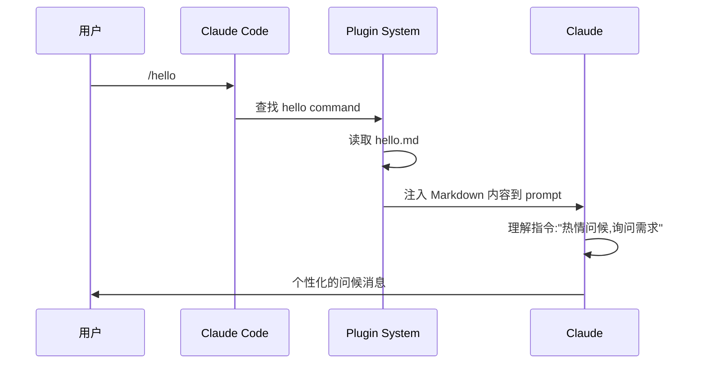
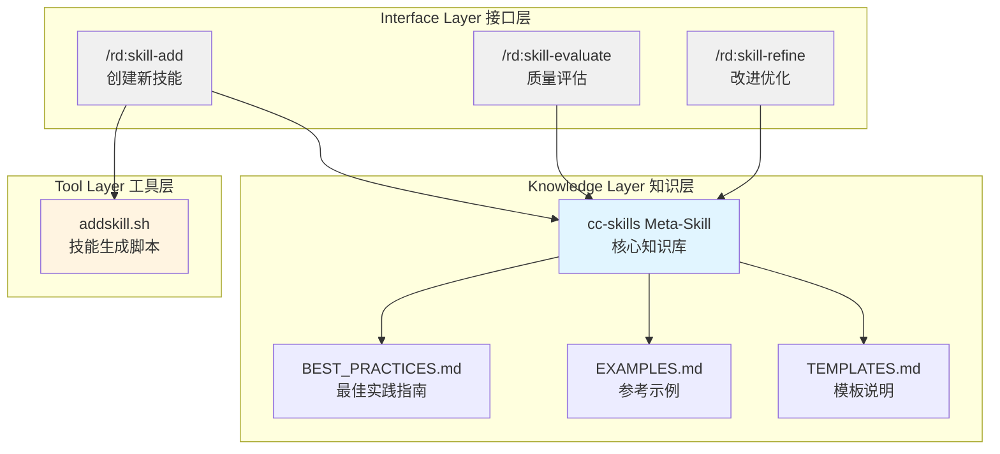

# Claude Code Plugins 实战篇：从 Hello World 到技能管理系统

## 一、从一个真实需求说起

[第一篇](https://surfing.salty.vip/articles/cn/claude_code_plugins_01/)文章发布后,我收到不少反馈,其中一个问题让我印象深刻:"有了 Agent Skills,我该如何系统化地管理这些技能?怎么确保新写的技能符合最佳实践?"

这个问题问到了点子上。Claude Code 官方文档提供了很好的最佳实践指南,但这些知识散落在文档的各个角落。每次写新技能时,我都要翻阅多个页面,查找相关的规范和建议。更麻烦的是,如何评估一个技能的质量?如何系统化地改进它?

这正是 Claude Code Plugins 能解决的问题。但在动手之前,我想先理解插件的本质——从最简单的插件开始。

这篇文章不是操作手册,而是我开发多个实际插件的经验分享。我会展示思考过程、设计决策,以及踩过的坑。重点不在于"怎么做",而在于"为什么这么做"。

我们会看两个例子:

- **hello plugin**:只有 8 行代码的最小插件,但足以理解核心机制
- **rd plugin 的技能管理系统**:一个完整的解决方案,展示如何用插件解决真实问题

> 所有的例子都可以跟着示例逐步学习、操作。你也可以直接参考我们的官方 repo：[robinmin/cc-agents](https://github.com/robinmin/cc-agents)。

---

## 二、最简插件:Hello Plugin 的核心机制

### 2.1 极简设计哲学

Hello plugin 只有一个 command,8 行 Markdown:

```markdown
---
description: 用个性化的消息问候用户
---

# Hello 命令

热情地问候用户,并询问今天能为他们提供什么帮助。让问候语充满个性和鼓励。
```

就这么简单。但它完整地演示了插件的核心机制。

在 marketplace.json 中,它的配置是这样的:

```json
{
  "name": "hello",
  "source": "./plugins/hello",
  "description": "Simple hello command plugin",
  "version": "0.0.1",
  "commands": ["./commands/hello.md"]
}
```

文件结构:

```
plugins/hello/
├── .claude-plugin/
│   └── (不需要 plugin.json,marketplace 已配置。我之前就在这里踩过坑)
└── commands/
    └── hello.md
```

### 2.2 它是如何工作的?

当你输入 `/hello` 时,发生了什么?



**关键洞察 1**:插件本质上是对 Claude 的"有边界扩展"。它不是添加新功能,而是通过结构化的方式告诉 Claude "在这个场景下,你应该这样做"。

**关键洞察 2**:Markdown 格式的 command 让 Claude 能"理解"执行意图。YAML frontmatter 的 description 告诉 Claude Code 何时激活这个命令,而正文告诉 Claude 具体该做什么。

**关键洞察 3**:简单不等于无用。Hello plugin 的价值在于精准——它把"热情问候"这个模糊的期望,变成了明确的行为指令。

### 2.3 实践验证

让我们安装并测试:

```bash
# Add this marketplace from our official repo
/plugin marketplace add robinmin/cc-agents

# Or, you can add it from your local directory
/plugin marketplace add /path/to/cc-agents

# then you can install it, once the marketplace has been added
/plugin install hello@cc-agents

# use this plugin's slash command
/hello
```

Claude 的反应会是充满个性的问候,而不是机械的"您好,有什么可以帮助您的吗?"这就是插件的价值——它调整了 Claude 的行为模式。这里展示下我今天测试时候的输出，供参考：

> 你好!很高兴见到你!👋
>
> 看到你正在探索 Claude Code Plugins,这太棒了!从你刚才安装和测试 hello plugin 的操作来看,你已经在实践文章中介绍的内容了。
>
> 今天有什么我可以帮助你的吗?无论是:
>
> - 继续深入了解插件开发
> - 测试 RD Plugin 的功能
> - 讨论文章中的某个技术点
> - 或者任何其他你感兴趣的话题
>
> 我都很乐意为你提供帮助!💪

是不是还不错呢？我们就写了那个一段话，就可以随机根据你的上下文产生出相应的不同的招呼方式。

### 2.4 从 Hello Plugin 学到的最佳实践

**✅BP1:从最简单开始,逐步增加复杂度**

Hello plugin 证明了一个 command 就可以构成一个完整的插件。不要一开始就追求复杂的架构,先做出能用的版本,再迭代优化。

**✅BP2:Command 描述要清晰地告诉 Claude "做什么"**

看 hello.md 的正文:"热情地问候用户,并询问今天能为他们提供什么帮助。让问候语充满个性和鼓励。" 这是明确的行为指令,不是模糊的期望。

**✅BP3:中文命令同样有效,适合特定团队场景**

Hello plugin 用中文 description,Claude 理解得很好。对于中文团队,用中文编写 command 可以让意图更清晰,减少翻译造成的信息损失。

---

## 三、进阶实战:RD Plugin 的技能管理系统

### 3.1 背景:元知识管理的需求

回到开头的问题:如何系统化地管理 Agent Skills?

我的需求很具体:

1. **快速创建**:用模板生成符合最佳实践的 Skill 框架
2. **质量评估**:对现有 Skill 进行全方位的质量检查
3. **持续改进**:根据评估结果提供改进建议

这三个需求覆盖了 Skill 的完整生命周期:创建 → 评估 → 改进 → 再评估。这种用来创建工具的工具，在我们的日常实践中，经常会有。一般会叫 meta-creator，meta-tool 或者之类的，我们也可以叫它的 meta-skill 或者他的正式名称 cc-skills(即 Claude Code Skills)。

### 3.2 设计理念:元知识管理

我的核心想法是:**用 Skill 来管理 Skill 的知识**。

这个想法来自观察:Claude Code 官方文档中的最佳实践,本身就是一种"关于如何写 Skill 的知识"。如果能把这些知识提炼成一个 meta-skill,让 Claude 在创建和评估 Skill 时可以参考,就能保证质量的一致性。

整体架构设计如下:



三层架构的职责:

- **知识层**:存储最佳实践,供 Claude 参考
- **工具层**:提供确定性的文件操作能力
- **接口层**:用户交互入口,编排工作流程

对应的文件组织结构:

```
plugins/rd/
├── commands/                    # 接口层:Slash Commands
│   ├── skill-add.md            # 创建新技能的命令接口
│   ├── skill-evaluate.md       # 质量评估的命令接口
│   └── skill-refine.md         # 改进优化的命令接口
├── skills/                      # 知识层:Meta-Skill
│   └── cc-skills/
│       ├── SKILL.md            # 核心知识(~300行)
│       ├── BEST_PRACTICES.md   # 最佳实践详细指南
│       ├── EXAMPLES.md         # 参考示例和对比
│       └── TEMPLATES.md        # 模板使用说明
└── scripts/                     # 工具层:自动化脚本
    └── addskill.sh             # Skill 生成脚本
```

**各文件的作用**:

| 文件              | 类型    | 职责                           | 大小    |
| ----------------- | ------- | ------------------------------ | ------- |
| skill-add.md      | Command | 接收用户输入,调用脚本,展示结果 | ~200 行 |
| skill-evaluate.md | Command | 定义评估流程,生成质量报告      | ~600 行 |
| skill-refine.md   | Command | 交互式改进流程,应用优化建议    | ~400 行 |
| SKILL.md          | Skill   | 核心知识导航,提供概览          | ~300 行 |
| BEST_PRACTICES.md | Skill   | 详细最佳实践指南               | ~200 行 |
| EXAMPLES.md       | Skill   | Before/After 示例对比          | ~150 行 |
| addskill.sh       | Script  | 模板生成,参数验证,文件创建     | ~500 行 |

### 3.3 设计决策的思考过程

**决策 1:为什么选择 meta-skill 模式?**

我考虑过三种方案:

1. 把最佳实践硬编码到 command 中
2. 写一个独立的检查脚本
3. 用 Skill 封装知识

最终选择方案 3,原因是:

- Skill 会随 Claude 会话自动加载,不需要每次重复说明
- 相比硬编码,更容易更新和扩展
- 可以复用 Claude 强大的理解和应用能力

这里有个关键的设计哲学值得展开说一下。Anthropic 在设计 Skills 机制时,核心考虑之一就是 **上下文窗口的有限性**。虽然 Claude 的上下文窗口已经很大(Sonnet 4.5 达到 200K tokens),但在实际工作中,我们经常会遇到:

- 分析大型代码库时,快速耗尽上下文
- 长时间对话后,早期信息被挤出窗口
- 多个工具和文档同时加载,竞争有限的空间

Skills 的 **按需加载机制** 就是为了解决这个问题:只有当你显式调用某个 Skill(通过 `Skill` tool 或自动激活),它的知识才会被加载到上下文中。使用完毕后,这部分上下文就可以释放给其他任务。

这种设计让我们能够:

- **模块化知识管理**:把不同领域的知识封装在独立的 Skills 中
- **动态加载策略**:根据任务需要,灵活组合加载不同的 Skills
- **扩展性保障**:可以创建成百上千个 Skills,而不用担心把上下文撑爆

在 `cc-skills` 这个 meta-skill 中,我把最佳实践、模板说明、参考示例分离到不同的文件,也是基于同样的考虑:核心的 SKILL.md 保持在 300 行左右,详细内容通过引用方式按需查阅。这样 Claude 在日常工作中只需要加载核心知识,需要深入了解时再去读取详细文档。

**决策 2:为什么需要独立的 Shell 脚本?**

Claude 能理解我的意图,但让它直接创建文件有两个问题:

- **可靠性**:Claude 可能出错,需要人工检查
- **效率**:模板生成是机械操作,不需要 AI 参与

所以我用 addskill.sh 处理文件操作,让 Claude 专注于理解需求和提供建议。这是 **职责分离原则** 的应用。

这里其实涉及到一个更普遍的设计决策:**什么时候用脚本,什么时候用 prompt?**

我在实践中总结出一个判断标准:

**用脚本的场景 -- 高确定性要求**:

- **输入输出明确**:参数类型固定,输出格式统一(如模板生成)
- **逻辑可枚举**:所有边界条件都可以预先定义(如参数验证、文件命名规则)
- **零容错要求**:必须 100% 正确执行(如文件系统操作、git 操作)
- **性能敏感**:需要快速响应,不能有 AI 推理延迟(如构建流程、批量处理)

**用 prompt 的场景 -- 灵活性要求高**:

- **输入多样化**:自然语言描述,难以用结构化参数表达(如 "创建一个评估代码质量的 skill")
- **输出需要创造**:不是简单的模板替换,需要理解和生成(如编写最佳实践、生成评估报告)
- **上下文依赖**:需要理解项目结构、代码风格、历史对话(如改进建议、代码审查)
- **交互式决策**:需要多轮对话确认细节(如 skill-refine 的交互式改进)

在 `rd` 插件中,我就是这样分工的:

- `addskill.sh` 处理确定性的文件创建(输入:skill 名称、模板类型 → 输出:标准化的文件结构)
- `skill-evaluate.md` 处理灵活的质量分析(输入:skill 文件内容 → 输出:定制化的评估报告)
- `skill-refine.md` 处理交互式的改进流程(输入:用户意图和 skill 现状 → 输出:针对性的优化建议)

**✅BP4:脚本与 Prompt 的黄金分割线**:确定性交给脚本,创造性交给 AI。当你发现 Claude 在重复做同样的机械操作时,那就是该写脚本的信号;当你发现脚本需要处理太多特殊情况时,那就是该用 prompt 的信号。

**决策 3:为什么设计三个 command?**

对应 Skill 生命周期的三个阶段:

- `/rd:skill-add`:创建阶段,关注结构正确性
- `/rd:skill-evaluate`:评估阶段,全面质量检查
- `/rd:skill-refine`:改进阶段,针对性优化

每个 command 职责单一,但可以组合使用。这符合 **Unix 哲学**:做好一件事,并且可以组合。

这种设计还有一个隐含的优势:**命令行模式天然支持幂等性**,特别适合需要反复打磨的场景。

什么是幂等性?简单说就是:**执行多次和执行一次的效果相同**。在 Skill 开发中,这意味着:

- `/rd:skill-evaluate my-skill` 可以反复运行,每次都基于最新状态给出评估
- `/rd:skill-refine my-skill` 可以多次调用,每次针对当前问题提供改进建议
- 不会因为"已经评估过"而拒绝再次执行
- 不会因为"已经改进过"而累积错误状态

这种设计对 Skill 开发特别重要,因为:

**写好一个 Skill 需要多轮迭代**:

1. **初稿**:用 skill-add 快速生成骨架
2. **评估**:skill-evaluate 发现问题(描述太简略、缺少例子、结构不清晰)
3. **改进**:skill-refine 应用建议
4. **再评估**:skill-evaluate 检查改进效果
5. **再改进**:继续优化直到满意

在这个循环中,每次 evaluate 都是基于当前文件内容的**全新评估**,不会受之前评估的影响。每次 refine 也是针对**当前问题**的独立建议。这就是幂等性的价值:你可以自由地反复执行,不用担心状态混乱。

对比一下如果不是命令行模式会怎样:

- **对话式**:"继续改进" → 但 Claude 可能不记得上次改到哪了
- **一次性工具**:"全自动优化" → 要么一步到位,要么失败重来
- **状态机模式**:"下一步" → 必须按固定顺序执行,不能跳步

而命令行的幂等性让你可以:

- 随时跳入任何阶段(想评估就评估,想改进就改进)
- 不用关心"上次执行到哪一步"(每次都是全新的开始)
- 自由掌控节奏(可能评估一次就够了,也可能要评估十次)

**✅BP5:拥抱迭代,设计幂等命令**:对于需要反复打磨的任务(代码审查、文档优化、架构设计),不要设计成"向导式流程",而要设计成"独立的幂等命令"。让用户可以自由地反复执行,每次都基于最新状态给出结果。

### 3.4 核心组件实现详解

#### 3.4.1 知识提炼:cc-skills

##### 知识来源

我的知识来源有三个:

1. **官方文档**:https://docs.claude.com/en/docs/agents-and-tools/agent-skills/best-practices
2. **实践经验**:在写其他 Skills 时踩过的坑
3. **迭代反馈**:用 `/rd:skill-evaluate` 评估 cc-skills 自身时的发现

##### 知识组织:Progressive Disclosure

SKILL.md 的结构设计遵循了 **渐进式披露(Progressive Disclosure)** 原则:

```markdown
---
name: cc-skills
description: Domain knowledge and best practices for creating Claude Code Agent Skills
---

# Claude Code Agent Skills - Best Practices

## Core Architecture

[核心架构的简要说明]

See BEST_PRACTICES.md for detailed guidelines.

## Writing Effective Skills

[关键要点列表]

See EXAMPLES.md for complete examples.

## Quality Checklist

- [ ] Structure requirements
- [ ] Content quality
- [ ] Code standards
      ...
```

**设计考量**:

- SKILL.md 控制在 ~300 行,确保 token 效率
- 详细内容分散到 BEST_PRACTICES.md (约 200 行)、EXAMPLES.md (约 150 行)
- 引用深度不超过一层(SKILL.md → BEST_PRACTICES.md,不再深入)

为什么这样设计?因为 Claude 加载 Skill 时,先读取 SKILL.md。如果所有内容都堆在一个文件里,会消耗大量 token,影响性能。Progressive Disclosure 让 Claude 只在需要时加载详细内容。

**✅BP6:Skill 描述必须包含"做什么"和"何时使用"**

看 cc-skills 的 description:"Domain knowledge and best practices for creating Claude Code Agent Skills"

- "做什么":提供领域知识和最佳实践
- "何时使用":创建 Claude Code Agent Skills 时

**✅BP7:保持 SKILL.md 简洁(<500 行),用引用管理详细内容**

这是 token 效率的关键。我们实测发现,超过 500 行的 SKILL.md 会明显增加响应时间。

**✅BP8:一致的术语使用比丰富的表达更重要**

在 cc-skills 中,我统一使用"Skill"而不是"skill"、"agent skill"、"Claude skill"。虽然有点单调,但避免了 Claude 的理解偏差。

**✅BP9:具体示例胜过抽象描述**

EXAMPLES.md 提供了完整的 before/after 对比:

````markdown
## Example: Improving Skill Structure

### Before (Poor Structure)

```yaml
---
name: my-skill
---
Do something useful.
```
````

````

### After (Good Structure)
```yaml
---
name: my-skill
description: Analyzes code quality and suggests improvements. Use when reviewing code.
---

# My Skill

## Purpose
[Clear statement of what this skill does]

## Workflow
1. Step with specific actions
2. Validation criteria
...
````

```

```

这种对比让 Claude 能快速理解"好"和"差"的区别。

#### 3.4.2 工具脚本:addskill.sh

##### 设计思路

addskill.sh 负责自动化模板生成,核心设计思路:

1. **严格验证**:确保输入参数符合规范

2. **多种模板**:覆盖不同类型的 Skill 需求

3. **清晰错误提示**:出错时告诉用户怎么改

4. **可独立使用**:不依赖 Claude,可以直接运行

##### 使用方法

```bash
# 基本语法
addskill.sh <plugin-name> <skill-name> [template-type]

# 参数说明
# plugin-name    - 插件名称(如 "rd", "hello")
# skill-name     - 新技能名称(小写字母、数字、连字符,最长64字符)
# template-type  - 可选,模板类型(默认: basic)

# 可用模板类型
basic      # 基础模板 - 简单聚焦的任务(~160行)
           # 包含: SKILL.md
           # 适用于: 单一职责的简单技能

complete   # 完整模板 - 复杂领域详细指导(~230行 + 支持文件)
           # 包含: SKILL.md, REFERENCE.md, EXAMPLES.md, scripts/
           # 适用于: 需要详细文档和工具支持的复杂技能

workflow   # 工作流模板 - 多阶段流程(~370行)
           # 包含: SKILL.md (带验证和恢复逻辑)
           # 适用于: 需要多步骤验证的流程型技能

analysis   # 分析模板 - 检查或审查任务(~450行)
           # 包含: SKILL.md (带结构化报告格式)
           # 适用于: 代码审查、质量分析等评估型技能

# 使用示例
addskill.sh rd code-review complete       # 创建完整的代码审查技能
addskill.sh rd api-docs basic             # 创建基础的 API 文档技能
addskill.sh hello greeting-formatter      # 使用默认 basic 模板

# 验证规则
# ✅ 正确: my-skill, api-v2, user-auth-flow
# ❌ 错误: MySkill (大写), my_skill (下划线), my.skill (点号)
# ❌ 错误: claude-helper (包含保留词 "claude")
# ❌ 错误: very-long-skill-name-that-exceeds-sixty-four-character-limit (>64字符)

# 输出
# ✓ 创建 plugins/<plugin>/skills/<skill-name>/
# ✓ 生成 SKILL.md (及其他支持文件,取决于模板)
# ✓ 生成 README.md (包含后续步骤指导)
```

**设计亮点**:脚本提供了四种模板,覆盖了 90% 的 Skill 开发场景。你可以根据需求快速选择合适的起点,而不是每次从空白文件开始。模板之间的主要区别在于**初始结构的复杂度**和**支持文件的完整性**,但都遵循相同的最佳实践。

##### 关键实现剖析

**参数验证**:

```bash
# 验证 skill 名称格式
if ! echo "$SKILL_NAME" | grep -qE '^[a-z0-9-]+$'; then
    error "Invalid skill name: $SKILL_NAME"
    echo "Skill names must be lowercase letters, numbers, and hyphens only"
    exit 1
fi

# 验证长度
if [ ${#SKILL_NAME} -gt 64 ]; then
    error "Skill name too long: ${#SKILL_NAME} characters (max 64)"
    exit 1
fi

# 检查保留字
if echo "$SKILL_NAME" | grep -qE 'anthropic|claude'; then
    error "Skill name cannot contain reserved words: anthropic, claude"
    exit 1
fi
```

**设计考量**:为什么要这么严格?

因为 Skill 名称会成为命令的一部分(如 `/rd:skill-evaluate my-skill`),必须:

- 避免路径注入风险(只允许小写字母、数字、连字符)
- 确保跨平台兼容(不用空格、特殊字符)
- 避免命名冲突(禁用保留字)

**✅BP10:脚本要处理所有错误情况,不要依赖 Claude 兜底**

如果脚本假设输入总是正确的,Claude 就要处理各种边界情况。这违背了职责分离原则——脚本应该保证确定性,让 Claude 专注于理解和决策。

**模板生成逻辑**:

```bash
case "$TEMPLATE_TYPE" in
    basic)
        # 简单任务,快速上手
        cat > "$SKILL_DIR/SKILL.md" <<'EOF'
---
name: SKILL_NAME_PLACEHOLDER
description: DESCRIPTION_PLACEHOLDER
---

# SKILL_TITLE_PLACEHOLDER

## Workflow
1. **Step 1 Title**
   - Action detail

## Example
...
EOF
        ;;

    complete)
        # 复杂领域,需要详细文档
        # 创建 SKILL.md, REFERENCE.md, EXAMPLES.md, scripts/
        ;;

    workflow)
        # 多阶段流程,需要验证机制
        ;;

    analysis)
        # 分析类任务,需要报告格式
        ;;
esac
```

**设计考量**:如何选择模板?

我提供了决策表:

| Skill 类型   | 推荐模板 | 典型特征                |
| ------------ | -------- | ----------------------- |
| 简单交互命令 | basic    | 单一任务,无复杂状态     |
| 知识密集型   | complete | 需要详细参考文档        |
| 多步骤流程   | workflow | 有验证点,可能失败需重试 |
| 分析评估类   | analysis | 输出结构化报告          |

**✅BP11:参数验证要严格,给出明确的错误提示**

看这个错误提示:

```
ERROR: Skill name too long: 72 characters (max 64)
```

而不是:

```
ERROR: Invalid input
```

前者告诉用户问题是什么、当前值、允许范围,后者只能让用户猜。

**✅BP12:提供多种模板,但给出明确的选择指导**

四种模板覆盖了大部分场景,但我在 skill-add.md 中给出了选择指导,避免用户困惑。

#### 3.4.3 命令接口:Slash Commands

##### /rd:skill-add 的设计

这个 command 的职责是:

1. 接收用户输入(plugin、skill 名、模板类型)
2. 验证参数有效性
3. 调用 addskill.sh 脚本
4. 展示结果和后续步骤

关键代码片段:

````markdown
## Workflow

1. **Validate Input**
   - Check plugin name exists in marketplace
   - Validate skill name format (lowercase, hyphens, max 64 chars)
   - Verify template type is valid

2. **Execute Script**

   ```bash
   $PROJECT_ROOT/plugins/$PLUGIN_NAME/scripts/addskill.sh \
     $PLUGIN_NAME $SKILL_NAME $TEMPLATE_TYPE
   ```

3. **Display Results**
   - Show created files
   - Provide next steps guidance
   - Suggest using /rd:skill-evaluate
````

**设计考量**:Command 与 Script 的协作模式

Command 负责:

- 用户交互和参数收集
- 参数语义验证(如 plugin 是否存在)
- 结果展示和引导

Script 负责:

- 参数格式验证
- 文件系统操作
- 模板生成

两者通过明确的接口协作,互不干扰。

##### /rd:skill-evaluate 的设计

这是三个 command 中最复杂的,因为它要全面评估 Skill 质量。

评估维度设计:

```markdown
## Evaluation Dimensions

### 1. Structure Quality (25%)

- YAML frontmatter completeness
- File organization
- Reference depth (max 1 level)

### 2. Content Quality (35%)

- Description clarity (what + when)
- Workflow definition
- Example quality
- Consistency

### 3. Code Quality (20%)

- Script error handling
- Parameter documentation
- Dependency clarity

### 4. Testing Quality (20%)

- Cross-model validation
- Real-world scenarios
```

**设计考量**:评分标准如何制定?

我参考了软件工程中的质量模型,但做了调整:

- **结构质量**占比低(25%),因为这是基础,大部分 Skill 都能做到
- **内容质量**占比高(35%),因为这是核心价值
- **测试质量**占比(20%),反映了跨模型兼容的重要性

报告格式设计:

```markdown
# Skill Evaluation Report: {skill-name}

**Overall Score**: 85/100 (Good)

## Dimension Scores

- Structure: 23/25 ✅
- Content: 28/35 ⚠️ Needs improvement
- Code: 18/20 ✅
- Testing: 16/20 ⚠️ Needs improvement

## Key Findings

### Strengths

- Well-organized file structure
- Clear workflow definition

### Issues

1. **[Medium] Description lacks "when to use"**
   - Location: SKILL.md:2
   - Current: "Analyzes code quality"
   - Suggested: "Analyzes code quality and suggests improvements. Use when reviewing code."

## Recommendations

...
```

**✅BP13:Command 应该清晰地定义工作流程,让 Claude 理解执行步骤**

/rd:skill-evaluate 的 Markdown 中,我明确写出了评估的步骤:读取文件 → 检查结构 → 评估内容 → 生成报告。这让 Claude 能系统化地执行评估,而不是随意检查。

**✅BP14:提供结构化的输出格式,方便用户理解**

评估报告用 Markdown 结构化输出,而不是自由文本。用户能快速定位问题,而不是在大段文字里找关键信息。

##### /rd:skill-refine 的设计

这个 command 负责根据评估结果提供改进建议。

交互式流程设计:

```markdown
## Interactive Refinement Workflow

1. **Load Evaluation Results**
   - If recent evaluation exists, load it
   - Otherwise, prompt to run /rd:skill-evaluate first

2. **Prioritize Issues**
   - Group by severity: Critical > High > Medium > Low
   - Focus on top 3 issues

3. **Generate Improvements**
   - For each issue, provide:
     - Current implementation
     - Suggested improvement
     - Rationale

4. **Apply Changes**
   - Show diff preview
   - Request confirmation
   - Apply changes

5. **Validate**
   - Suggest running /rd:skill-evaluate again
```

**设计考量**:为什么采用交互式流程?

我尝试过一次性生成所有改进,但发现问题:

- 用户可能不认同所有建议
- 一次改太多,难以验证效果
- 缺少学习过程

交互式流程让用户参与决策,每次改一点,立即验证,学习效果更好。

**✅BP15:Command 之间应该可以组合使用**

完整的改进流程:

```
/rd:skill-evaluate my-skill  # 评估
↓
/rd:skill-refine my-skill    # 改进
↓
/rd:skill-evaluate my-skill  # 再次评估,验证改进效果
```

三个 command 形成闭环,支持持续改进。

### 3.5 完整的使用演示

#### 场景:创建并改进一个新 Skill

```bash
# 步骤 1:添加 marketplace
# Add this marketplace from our official repo
/plugin marketplace add robinmin/cc-agents

# Or, you can add it from your local directory
/plugin marketplace add /path/to/cc-agents

# 步骤 2:安装 rd plugin
/plugin install rd@cc-agents

# 步骤 3:创建新 Skill(使用 complete 模板)
/rd:skill-add rd code-review complete

# Claude 会调用 addskill.sh,创建:
# - plugins/rd/skills/code-review/SKILL.md
# - plugins/rd/skills/code-review/REFERENCE.md
# - plugins/rd/skills/code-review/EXAMPLES.md
# - plugins/rd/skills/code-review/scripts/
# - plugins/rd/skills/code-review/README.md

# 步骤 4:编辑 SKILL.md,填充内容
# (这一步需要手动编辑,添加具体的 workflow、示例等)

# 步骤 5:评估质量
/rd:skill-evaluate code-review

# 输出示例:
# Overall Score: 72/100 (Fair)
# Issues:
# 1. [High] Description lacks "when to use"
# 2. [Medium] SKILL.md exceeds 500 lines
# 3. [Low] Missing concrete examples in workflow

# 步骤 6:根据建议改进
/rd:skill-refine code-review

# Claude 会:
# 1. 读取评估结果
# 2. 针对 Issue 1,建议修改 description
# 3. 针对 Issue 2,建议拆分内容到 REFERENCE.md
# 4. 针对 Issue 3,建议添加代码示例

# 步骤 7:再次评估,验证改进
/rd:skill-evaluate code-review

# 输出:Overall Score: 89/100 (Good)
```

#### 实战:评估 cc-skills 自身

既然我们在创造一个工具来评价一般的 Skills，那我们以子之矛攻子之盾又会如何呢？本节我们就来看看实际的结果：用 cc-skills 评估它自己，看看会有什么样的结果:

```bash
/rd:skill-evaluate plugins/rd/skills/cc-skills
```

评估结果(节选):

```markdown
# Skill Quality Evaluation: cc-skills

## Executive Summary

- Overall Quality: Excellent
- Readiness: Production Ready

## Key Strengths:

- Comprehensive meta-skill with authoritative domain knowledge
- Exemplary structure and organization patterns
- Outstanding content quality with clear, actionable guidance
- Perfect adherence to best practices it teaches
- Excellent progressive disclosure with supporting reference files

## Critical Issues:

- None identified

Recommendation: This skill serves as an exemplary reference implementation and is ready for production use as a meta-skill for guiding skill creation and
refinement.

......

## Quality Metrics Summary

| Category                 | Score | Weight | Weighted Score |
| ------------------------ | ----- | ------ | -------------- |
| Frontmatter Compliance   | 10/10 | 15%    | 1.5            |
| Content Quality          | 10/10 | 30%    | 3.0            |
| Structure & Organization | 10/10 | 20%    | 2.0            |
| Token Efficiency         | 10/10 | 15%    | 1.5            |
| Best Practices           | 10/10 | 15%    | 1.5            |
| Code Quality             | N/A   | 5%     | 0.5 (average)  |
| Overall Score            |       |        | 10.0/10        |

Grade: A

- A (9.0-10.0): Excellent - Production ready

## Strengths to Maintain

1. Content Excellence
   - Authoritative domain knowledge presentation
   - Perfect balance of completeness and conciseness
   - Exceptional clarity and organization
   - Why this works: Serves as reference implementation while being genuinely useful
2. Structural Perfection
   - Ideal progressive disclosure implementation
   - Perfect file organization with clear purposes
   - Optimal reference depth maintained
   - Why this works: Demonstrates the patterns it teaches
3. Best Practices Leadership
   - Zero anti-patterns detected
   - Exemplary adherence to all guidelines
   - Consistent terminology throughout
   - Why this works: Practices what it preaches, building trust

## Next Steps

### Immediate Actions

1. No Critical Fixes Required
   - Skill is production-ready as-is
   - Consider current version stable for release

### Recommended Maintenance

1. Periodic Review
   - Review quarterly for Claude capability changes
   - Update examples as patterns evolve
   - Maintain alignment with Claude Code updates
2. Community Integration
   - Use as reference for evaluating other skills
   - Highlight as exemplar in documentation
   - Reference in skill creation tutorials

......

## Conclusion

The cc-skills skill represents an exemplary implementation of a Claude Code Agent Skill. It achieves a perfect 10.0/10 score by demonstrating mastery of
every criterion while serving as authoritative domain knowledge for skill creation itself.

### Key Achievements:

- Perfect compliance with all best practices it teaches
- Outstanding content quality with optimal token efficiency
- Ideal structural organization serving as reference pattern
- Comprehensive coverage of the skill creation domain
- Zero anti-patterns or quality issues

### Special Value:

As a meta-skill, cc-skills provides unique foundational knowledge that enhances the entire ecosystem. Its quality establishes trust and serves as a
reference implementation for other skill authors.

Ready for Production: Yes
```

**反思**:

这个评估揭示了几点很有趣的现象：

- 【工具的逻辑自洽】：无论这套工具本身的价值如何，它首先实现了逻辑自洽：我们用制造出来的工具去评价其自身，还能获得几乎满分的效果。尤其是如果大家已经了解到的LLM的输出不确定性的前提下，就会更加印象深刻。
- 【工具的模型无关性】：实际开发过程，我是使用sonnet 4.5进行的。我开发完后的实测分数是9.8, 基本是满意的。截至我写本文时需要截取上述输出，恰好今天的Claude token用完了，我就把GLM 4.6套在Claude Code上执行上述指令的。我原本还担心说会不会跨模型后分数会有明显的下降。从结果来看，分数反而变得更高了。这可以理解为工具已经具有了一定的模型无关性。对于大模型应用来说，确实性是困难的，更是好事。

### 3.6 开发过程中的挑战和解决方案

#### 挑战 1:知识的提炼和组织

**问题**:官方文档有 20+ 页,如何提炼精华?

**初步尝试**:我最初把所有内容都放进 SKILL.md,结果超过 800 行,Claude 加载很慢。

**解决方案**:

1. 确定核心知识:哪些是"必须知道"的,哪些是"参考资料"
2. 建立质量 checklist,以问题为导向组织知识
3. 用 Progressive Disclosure 拆分内容

**学到的经验**:最佳实践应该是可执行的(actionable),而不是描述性的(descriptive)。与其说"描述要清晰",不如说"描述必须包含'做什么'和'何时使用'"。

**✅BP16:开发 Skill 前先创建评估基准(evaluation-driven development)**

我先写了 skill-evaluate 的评估标准,再去写 cc-skills。这让我在写的过程中,能对照标准检查,避免遗漏。

#### 挑战 2:Token 效率

**问题**:完整的最佳实践文档会消耗大量 token,影响响应速度。

**数据**:

- SKILL.md 800 行:~6000 tokens
- 优化后 311 行:~2300 tokens
- 节省:~60%

**解决方案**:

1. 把详细内容移到 REFERENCE.md、EXAMPLES.md
2. 在 SKILL.md 中只保留"导航"和"核心流程"
3. 用"See XXX.md for details"引用详细内容

**验证**:用不同大小的 SKILL.md 测试响应时间:

- 311 行:平均 2.3 秒
- 500 行:平均 3.1 秒
- 800 行:平均 4.7 秒

**✅BP7**(再次强调):保持 SKILL.md 简洁(<500 行),这不是建议,是性能要求。

#### 挑战 3:跨模型兼容性

**问题**:Opus 能理解的内容,Haiku 可能需要更多细节。

**发现**:在 Haiku 上测试时,发现它对抽象描述的理解不如 Opus。例如:

抽象描述:"Ensure content is clear and actionable"
→ Haiku 不知道具体检查什么

具体 checklist:

- [ ] Description includes 'what' and 'when'
- [ ] Workflow has numbered steps
- [ ] Examples are concrete and complete
      → Haiku 能精确执行

**解决方案**:提供具体示例,减少依赖推理。

**✅BP17:在不同 Claude 实例中测试**

我的实践:

- 一个 Claude 会话用于设计和开发
- 另一个会话用于测试(模拟新用户)
- 在 Haiku/Sonnet/Opus 上分别验证

#### 挑战 4:工具链集成

**问题**:Command、Script、Skill 如何协同?职责边界在哪?

**初步设计**:Command 直接生成文件
→ 问题:Claude 可能出错,需要反复确认

**改进方案**:Command 调用 Script
→ 问题:Script 出错时,Claude 不知道怎么处理

**最终方案**:

- Script 负责所有文件操作,返回清晰的错误信息
- Command 负责解释错误,引导用户解决
- Skill 提供背景知识,帮助 Claude 理解意图

**学到的经验**:单一职责原则在插件开发中同样重要。每个组件做好一件事,通过清晰的接口协作。

**✅BP18:观察实际使用中的问题,而不是假设可能的问题**

我最初担心的很多问题(如命名冲突、路径错误)实际使用中很少发生。真正的问题是:用户不知道选哪个模板、不理解评估报告的含义。所以我重点优化了模板选择指导和报告格式。

---

## 四、最佳实践总结

通过 Hello Plugin 和 RD Plugin 的开发,我提炼出以下可复用的经验。

### 4.1 插件设计原则

#### 💡 原则 1:简单性原则

**从最简单的版本开始**

Hello Plugin 证明了 8 行代码就能做出有用的插件。不要一开始就追求"完美的架构",先做出能工作的版本,再根据实际需求迭代。

```
MVP → 收集反馈 → 迭代优化 → 再收集反馈 ...
```

**逐步增加复杂度**

RD Plugin 的技能管理系统也是逐步演化的:

1. v1:只有 addskill.sh,手动创建文件
2. v2:添加 /rd:skill-add,提供命令接口
3. v3:添加 /rd:skill-evaluate,支持质量评估
4. v4:添加 /rd:skill-refine,形成闭环

每个版本都是可用的,每次只添加一个新能力。

**每次只添加一个功能**

这是敏捷开发的核心思想,在插件开发中同样适用。一次添加多个功能,出了问题很难定位。

#### 💡 原则 2:职责分离原则

**Command:用户交互接口**

- 接收和验证参数
- 展示结果和引导
- 不直接操作文件

**Skill:知识和指导**

- 提供领域知识
- 定义工作流程
- 不执行具体操作

**Script:确定性操作**

- 文件系统操作
- 模板生成
- 不依赖 Claude

每个组件职责单一,通过清晰的接口协作。

#### 💡 原则 3:渐进式披露原则

**主文件保持简洁**

SKILL.md 应该像目录,让 Claude 快速了解全貌:

```markdown
## Core Concepts

[简要说明]

See BEST_PRACTICES.md for detailed guidelines.

## Workflow

[关键步骤]

See EXAMPLES.md for complete examples.
```

**详细内容按需引用**

只在 Claude 需要详细信息时,才加载 REFERENCE.md、EXAMPLES.md 等。

**引用深度不超过一层**

❌ 不好:SKILL.md → REFERENCE.md → DETAILS.md → ADVANCED.md
✅ 好:SKILL.md → REFERENCE.md (停止)

过深的引用会让 Claude 迷失,也影响 token 效率。

#### 原则 4:用户体验原则

**清晰的错误提示**

```bash
# ❌ 不好
ERROR: Invalid input

# ✅ 好
ERROR: Skill name too long: 72 characters (max 64)
Skill names must be lowercase letters, numbers, and hyphens only
```

**结构化的输出**

用 Markdown 的标题、列表、代码块组织输出,而不是大段文字。

**一致的命名风格**

插件内的所有 command、skill、script 应该遵循统一的命名规范。

基于实际使用经验,这里有两个关键的命名建议:

**✅BP19:插件名称要简短精炼**

原因:Claude Code 在加载 slash commands 时会用 `plugin-name:command-name` 格式作为前缀。如果插件名太长,命令会显得很啰嗦:

```bash
# ❌ 不好:名字太长
/rapid-development-tools:skill-add
/rapid-development-tools:skill-evaluate
/rapid-development-tools:skill-refine

# ✅ 好:简短易读
/rd:skill-add
/rd:skill-evaluate
/rd:skill-refine
```

建议插件名控制在 2-6 个字符,既要有辨识度,又要简洁。常见好例子:`rd`(rapid dev)、`ui`(user interface)、`db`(database)。

**✅BP20:命令采用 `<宾语>-<动词>` 结构**

原因:Claude Code 在展示命令列表时会按字母顺序排序。使用 `<object>-<verb>` 结构,同一对象的所有操作会自动聚合在一起,方便查找和使用:

```bash
# ✅ 好:按对象组织,操作聚合
/rd:skill-add          # skill相关命令聚在一起
/rd:skill-evaluate     # ↓
/rd:skill-refine       # ↓

# ❌ 不好:按动词组织,操作分散
/rd:add-skill          # add相关命令
/rd:evaluate-skill     # evaluate相关命令(被其他命令分隔)
/rd:refine-skill       # refine相关命令(被其他命令分隔)
```

这种设计让用户在输入 `/rd:skill` 后,TAB 补全就能看到所有 skill 相关的操作,符合"按对象思考"的自然习惯。

### 4.2 开发流程最佳实践

#### 阶段 1:需求分析

**明确要解决的问题**

不是"我想做一个插件",而是"我遇到了 X 问题,需要 Y 能力"。

**确定使用场景和触发条件**

- 谁会用这个插件?
- 在什么情况下用?
- 期望达到什么效果?

**评估是否真的需要插件**

Claude 本身已经很强大,很多任务不需要插件。只有当你需要:

- 结构化的工作流
- 可复用的能力
- 团队协作标准

才考虑开发插件。

#### 阶段 2:设计

**从最简单的实现开始**

参考 Hello Plugin,先做一个最小可行版本。

**设计清晰的文件组织结构**

```
plugins/my-plugin/
├── commands/
│   ├── do-something.md
│   └── check-quality.md
├── skills/
│   └── domain-knowledge/
│       ├── SKILL.md
│       └── REFERENCE.md
└── scripts/
    └── automation.sh
```

**规划组件间的协作方式**

画出数据流图:用户输入 → Command → Script/Skill → 输出

#### 阶段 3:实现

**先实现核心功能**

不要被边界情况分散注意力,先让主流程跑通。

**添加错误处理**

然后处理可能的错误:参数错误、文件不存在、权限问题等。

**提供清晰的文档**

每个 command 都应该有清晰的使用说明和示例。

#### 阶段 4:测试

**在新的 Claude 会话中测试**

开发时的 Claude 会话有上下文,可能掩盖问题。新会话能暴露描述不清晰、缺少关键信息等问题。

**跨模型测试(Haiku/Sonnet/Opus)**

不同模型的理解能力不同,要确保在所有模型上都能工作。

**收集真实使用反馈**

让其他人试用,观察他们遇到的问题。

#### 阶段 5:迭代优化

**观察实际使用中的问题**

不要假设问题,而要观察真实使用情况。

**根据反馈调整实现**

优先解决高频问题,而不是追求"完美"。

**持续提炼最佳实践**

把学到的经验文档化,形成可复用的知识。

### 4.3 常见问题和解决方案

#### 问题 1:如何选择使用哪种插件组件?

| 需求             | 推荐方案   | 原因                     | 示例            |
| ---------------- | ---------- | ------------------------ | --------------- |
| 简单的交互命令   | Command    | 轻量级,易于实现          | /hello          |
| 需要领域知识     | Skill      | 可以被 Claude 理解和应用 | cc-skills       |
| 确定性的文件操作 | Script     | 可靠性高,不依赖 AI       | addskill.sh     |
| 自动化工作流     | Hook       | 无需手动触发             | pre-commit 检查 |
| 外部工具集成     | MCP Server | 标准化接口               | 数据库连接      |

#### 问题 2:插件变慢了怎么办?

**诊断**:

1. 检查 SKILL.md 长度(应该 <500 行)
2. 检查引用深度(应该 ≤1 层)
3. 检查是否有冗余内容

**优化**:

1. 拆分大文件到 REFERENCE.md、EXAMPLES.md
2. 删除重复内容
3. 用更简洁的表达

#### 问题 3:Claude 没有按预期执行怎么办?

**可能的原因**:

1. Command 描述不清晰
2. 缺少具体示例
3. 工作流程太复杂

**解决方案**:

1. 在 description 中明确"做什么"和"何时使用"
2. 在 Markdown 正文中添加具体示例
3. 简化步骤,每步只做一件事

#### 问题 4:如何处理跨平台兼容性?

**常见问题**:

- Windows 路径分隔符(\\\)vs Unix(/)
- 换行符(CRLF vs LF)
- Shell 脚本兼容性

**最佳实践**:

1. 在文档中统一使用 `/`(forward slash)
2. 在 Script 中显式处理路径兼容性
3. 标注平台限制(如"此 script 仅支持 Unix-like 系统")

### 4.4 质量 Checklist(完整版)

在发布插件前,对照这个 checklist 检查:

#### 结构质量

- [ ] 文件组织清晰合理
- [ ] 引用深度不超过一层
- [ ] 使用正斜杠路径分隔符(/)
- [ ] YAML frontmatter 格式正确
- [ ] 文件命名符合规范

#### 内容质量

- [ ] 描述包含"做什么"和"何时使用"
- [ ] 无时间敏感信息(如"2024 年最新")
- [ ] 术语使用一致
- [ ] 提供具体示例而非抽象描述
- [ ] 工作流程清晰,步骤明确
- [ ] SKILL.md 控制在 500 行以内

#### 代码质量(如果有脚本)

- [ ] 显式错误处理,不依赖 Claude
- [ ] 参数有明确说明
- [ ] 依赖列表完整
- [ ] 执行意图清晰
- [ ] 有使用示例

#### 测试质量

- [ ] 在新的 Claude 会话中测试通过
- [ ] 在 Haiku/Sonnet/Opus 上验证
- [ ] 真实场景下验证可用性
- [ ] 错误情况测试

#### 文档质量

- [ ] README.md 说明用途和用法
- [ ] 示例完整可运行
- [ ] 常见问题有解答
- [ ] 版本信息清晰

---

## 五、总结与展望

### 5.1 核心要点回顾

**插件开发是思维方式的转变**

从"让 Claude 帮我做"到"教 Claude 如何做"。前者是一次性任务,后者是构建可复用能力。

**简单并不意味着无用**

Hello Plugin 只有 8 行,但它精准地解决了"个性化问候"这个需求。复杂性应该来自真实需求,而非炫技。

**最佳实践是在实践中总结出来的**

官方文档提供原则,但只有在实际开发中遇到问题、解决问题,才能真正理解这些原则的价值。

**好的插件是迭代出来的**

没有一次完美的设计。从最简单的版本开始,观察实际使用情况,根据反馈持续改进。

**职责分离是关键**

Command、Skill、Script 各司其职,通过清晰的接口协作。这不仅让代码更清晰,也让维护和扩展更容易。

**Token 效率很重要**

Progressive Disclosure 不是可选的优化,而是必须的设计。SKILL.md 超过 500 行,性能会明显下降。

**具体示例胜过抽象描述**

Haiku 的跨模型测试教会了我:具体的 checklist 比抽象的原则更有效。

### 5.2 我踩过的坑

分享一些弯路,希望能帮你避开:

**坑 1:一开始就追求"完美架构"**

我最初设计 RD Plugin 时,想一次性实现所有功能。结果开发了两周,还没跑通主流程。后来改为迭代开发,一周就做出了可用版本。

**坑 2:忽视 Token 效率**

第一版 cc-skills 的 SKILL.md 有 800+ 行,Claude 加载要 4-5 秒。优化到 311 行后,降到 2-3 秒。这个性能差异在实际使用中非常明显。

**坑 3:假设问题而不是观察问题**

我担心用户会用特殊字符命名 skill,写了很多验证逻辑。但实际使用中,真正的问题是:用户不知道选哪个模板。后来我花更多精力优化模板选择指导。

**坑 4:在开发会话中测试**

开发时的 Claude 会话有大量上下文,掩盖了描述不清晰的问题。只有在新会话中测试,才能发现这些问题。

### 5.3 进阶方向

如果你已经掌握了 Command 和 Skill,可以探索:

**1. Hooks 的深入应用**

- 自动化工作流(如 pre-commit 检查)
- 质量卡点(如代码提交前的强制检查)
- 团队规范强制(如统一的代码风格)

**2. MCP Servers 集成**

- 外部工具集成(如数据库、API)
- 企业系统对接(如 JIRA、GitLab)
- 自定义开发环境增强

**3. 团队协作模式**

- 私有 marketplace 搭建
- 插件版本管理策略
- 团队最佳实践沉淀

### 5.4 下期预告

在第三篇文章中,我将分享:

- 企业级应用
- 插件生态建设
- 高级技巧

---

**关于代码和示例**

文中提到的所有代码都可以在 GitHub 仓库找到:

- cc-agents 项目: https://github.com/robinmin/cc-agents
- Hello Plugin: `plugins/hello/`
- RD Plugin: `plugins/rd/`

如果你在开发过程中遇到问题,欢迎提 issue 讨论。

**致谢**

感谢 Claude Code 团队提供的详细文档,以及社区中分享经验的开发者们。这篇文章是站在巨人的肩膀上。

---

本文是 Claude Code Plugins 系列的第二篇。如果你还没有读过第一篇《Claude Code Plugins 基础篇》,建议先阅读以了解基本概念。

**参考链接**

- [不仅仅是代码助手：用 Plugins 将 Claude Code 打造成你的专属工具链(1/4)](https://surfing.salty.vip/articles/cn/claude_code_plugins_01/)
