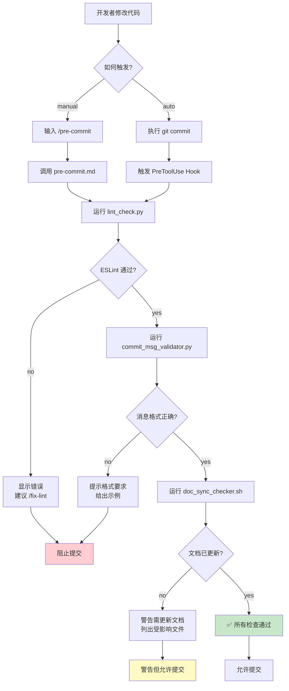
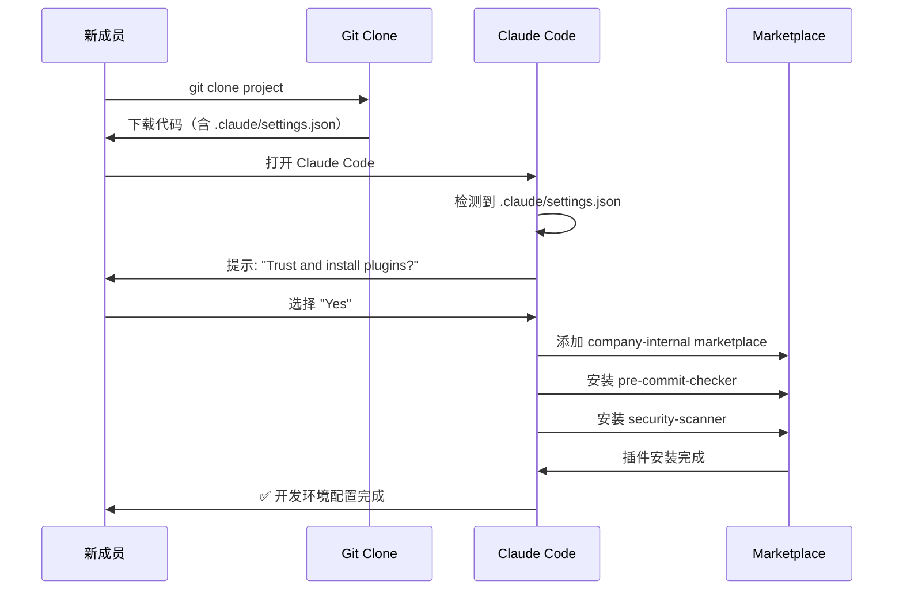

## 第二篇：实战篇 - 从零构建第一个插件

> **系列回顾**：在第一篇中，我们探讨了 Claude Code Plugins 的核心概念、四大组件和工作原理。本篇将进入实战阶段，手把手带你构建一个真实可用的插件。

---

## 一、场景设定与需求分析

### 1.1 真实的团队痛点

在开始编码前，让我们先明确要解决的问题。这是一个来自真实团队的场景：

**团队背景**：

- 15 人的全栈开发团队
- 使用 Git 进行版本控制
- 采用 ESLint 作为代码规范工具
- 遵循 Conventional Commits 规范

**当前问题**：

```
代码审查会议上的典型对话：

Tech Lead: "这个 PR 又有 18 处 ESLint 错误..."
开发者 A: "抱歉，我忘记运行 linter 了。"

Tech Lead: "Commit message 写的是 'update code'，看不出改了什么..."
开发者 B: "我赶着提交，下次注意。"

Tech Lead: "你修改了支付 API，但没更新 API 文档..."
开发者 C: "哦对，我一会儿补上。"

结果：每次 Code Review 浪费 30 分钟在这些低级问题上。
```

**统计数据**（团队实测）：

- 60% 的 PR 首次提交有格式问题
- 平均每个 PR 需要 2.3 次返工
- 每周浪费约 4 小时在重复性问题修复上

### 1.2 需求拆解

基于以上痛点，我们需要构建一个**提交前检查插件**，具备以下功能：

**核心功能**：

1. ✅ **代码质量检查**：运行 ESLint，确保代码符合规范
2. ✅ **Commit 消息验证**：检查是否遵循 Conventional Commits
3. ✅ **文档同步检查**：API 代码变更时提醒更新文档

**使用方式**：

- **手动触发**：开发者执行 `/pre-commit` 主动检查
- **自动触发**：Git commit 前自动拦截并检查

**期望效果**：

- 减少 80% 的格式相关返工
- 提升 Commit 消息质量
- 确保文档与代码同步

### 1.3 技术选型

**插件组件选择**：

```
✅ Slash Commands → 提供手动检查入口 (/pre-commit, /fix-lint)
✅ Hooks          → Git commit 前自动拦截检查
❌ Subagents      → 本场景不需要复杂任务委派
❌ MCP Servers    → 不涉及外部系统集成
```

**脚本语言选择**：

```python
# 主检查逻辑：Python（团队主力语言，便于维护）
# 快速辅助：bash（简单任务，执行效率高）
```

**依赖工具**：

- ESLint（代码检查）
- Git（版本控制）
- Python 3.8+（脚本运行）

---

## 二、项目结构设计

### 2.1 目录树规划

```
pre-commit-checker/
├── .claude-plugin/
│   └── plugin.json              # 插件元数据（必需）
│
├── commands/
│   ├── pre-commit.md            # 手动完整检查
│   ├── fix-lint.md              # 自动修复 lint 错误
│   └── check-docs.md            # 单独检查文档同步
│
├── hooks/
│   └── hooks.json               # Hook 触发配置
│
├── scripts/
│   ├── lint_check.py            # ESLint 检查主逻辑
│   ├── commit_msg_validator.py  # Commit 消息验证
│   ├── doc_sync_checker.sh      # 文档同步检查
│   └── utils.py                 # 共用工具函数
│
├── tests/
│   ├── test_lint_check.py       # 单元测试
│   └── test_commit_validator.py
│
├── .gitignore
├── README.md                    # 插件使用文档
└── requirements.txt             # Python 依赖
```

### 2.2 文件职责说明

| 文件/目录                    | 职责                              | 是否必需 |
| ---------------------------- | --------------------------------- | -------- |
| `.claude-plugin/plugin.json` | 插件元数据，Claude 识别插件的入口 | ✅ 必需  |
| `commands/*.md`              | 用户可见的命令定义                | ✅ 必需  |
| `hooks/hooks.json`           | 自动化触发规则                    | 可选     |
| `scripts/*`                  | 实际执行逻辑                      | ✅ 必需  |
| `tests/*`                    | 单元测试                          | 推荐     |
| `README.md`                  | 使用文档                          | 推荐     |

### 2.3 工作流程图



---

## 三、核心文件实现

### 3.1 插件清单：plugin.json

```json
{
  "name": "pre-commit-checker",
  "version": "1.0.0",
  "description": "Automated pre-commit quality checks for code, commit messages, and documentation",

  "author": {
    "name": "DevTools Team",
    "email": "[email protected]"
  },

  "homepage": "https://github.com/yourcompany/pre-commit-checker",
  "repository": "https://github.com/yourcompany/pre-commit-checker",
  "license": "MIT",

  "keywords": ["git", "lint", "commit", "quality", "pre-commit"],

  "commands": "./commands",
  "hooks": "./hooks/hooks.json",

  "requirements": {
    "python": ">=3.8",
    "node": ">=14.0.0"
  }
}
```

**字段解析**：

| 字段          | 说明                         | 示例                                     |
| ------------- | ---------------------------- | ---------------------------------------- |
| `name`        | 插件唯一标识符（kebab-case） | `pre-commit-checker`                     |
| `version`     | 遵循 SemVer 规范             | `1.0.0`                                  |
| `description` | 简短描述（80 字符内）        | `Automated pre-commit quality checks...` |
| `keywords`    | 搜索关键词（数组）           | `["git", "lint", "commit"]`              |
| `commands`    | 命令目录路径                 | `./commands`                             |
| `hooks`       | Hook 配置文件路径            | `./hooks/hooks.json`                     |

### 3.2 命令定义：commands/pre-commit.md

````markdown
---
name: pre-commit
description: Run comprehensive pre-commit quality checks
tags: [git, quality, lint]
---

# Pre-Commit Quality Checks

Execute all quality checks before committing code changes.

## Step 1: ESLint Code Check

Run the linter on staged files:

```bash
python ${CLAUDE_PLUGIN_ROOT}/scripts/lint_check.py
```
````

**Expected output:**

- ✅ `All lint checks passed` → Continue to next step
- ❌ `Lint errors found` → Show errors and suggest `/fix-lint`

If errors found:

- Display specific error locations and descriptions
- Provide actionable fix suggestions
- Remind user of `/fix-lint` command for auto-fix

## Step 2: Commit Message Validation

Verify commit message follows Conventional Commits:

```bash
python ${CLAUDE_PLUGIN_ROOT}/scripts/commit_msg_validator.py
```

**Requirements:**

- Must start with type: `feat`, `fix`, `docs`, `refactor`, `test`, `chore`
- Format: `type(scope): description`
- Minimum 10 characters (excluding type prefix)
- Avoid generic terms: "update", "change", "fix stuff"

**Valid examples:**

```
feat(payment): add Stripe integration
fix(auth): resolve token expiration issue
docs(api): update authentication endpoints
```

If invalid:

- Show current commit message (if prepared)
- Explain what's wrong
- Provide 2-3 correct examples

## Step 3: Documentation Sync Check

Verify documentation is updated when API code changes:

```bash
bash ${CLAUDE_PLUGIN_ROOT}/scripts/doc_sync_checker.sh
```

**Check rules:**

- If files in `src/api/` modified → check `docs/API.md` updated
- If files in `src/models/` modified → check `docs/MODELS.md` updated
- Compare git diff timestamps

If documentation not updated:

- ⚠️ Warning (not blocking)
- List affected files
- Suggest documentation to update

## Final Output

Provide a structured summary:

**✅ All checks passed - Ready to commit**

```
✅ ESLint: No errors
✅ Commit message: Valid format
✅ Documentation: Up to date
```

**⚠️ Issues found:**

```
❌ ESLint: 3 errors in src/utils.py
   - Line 42: Unused variable 'temp'
   - Line 58: Missing semicolon
   Run /fix-lint to auto-fix

⚠️ Documentation: API changes not documented
   - Modified: src/api/payment.py
   - Please update: docs/API.md
```

````

**设计要点**：

1. **结构化步骤**：清晰的 Step 1/2/3，便于 Claude 理解执行顺序
2. **环境变量**：`${CLAUDE_PLUGIN_ROOT}` 自动替换为插件安装路径
3. **明确预期**：每步都说明期望的输出和错误处理
4. **用户友好**：失败时提供可操作的建议

### 3.3 快速修复命令：commands/fix-lint.md

```markdown
---
name: fix-lint
description: Automatically fix ESLint errors
tags: [lint, fix, auto]
---

# Auto-Fix Lint Errors

Automatically fix common ESLint errors using `--fix` flag.

## Execution

```bash
python ${CLAUDE_PLUGIN_ROOT}/scripts/lint_check.py --fix
````

## Process

1. Run ESLint with `--fix` on staged files
2. Display fixed issues count
3. Show remaining unfixable issues (if any)

## Output Format

**If all fixed:**

```
✅ Auto-fixed 12 lint issues:
   - 8 × Missing semicolons
   - 3 × Incorrect indentation
   - 1 × Trailing whitespace

All errors resolved. Ready to commit.
```

**If some unfixable:**

```
✅ Auto-fixed 8 issues
❌ 2 issues require manual fix:
   - src/utils.py:42 - Unused variable 'temp'
   - src/api.py:18 - Undefined function 'processData'

Please fix manually and run /pre-commit again.
```

````

### 3.4 Hook 配置：hooks/hooks.json

```json
{
  "PreToolUse": [
    {
      "name": "pre-commit-quality-gate",
      "description": "Automatic quality checks before git commit",

      "matcher": "ExecuteBash.*git\\s+commit",

      "hooks": [
        {
          "type": "command",
          "command": "python ${CLAUDE_PLUGIN_ROOT}/scripts/lint_check.py",
          "description": "🔍 Running ESLint checks...",
          "timeout": 30
        },
        {
          "type": "command",
          "command": "python ${CLAUDE_PLUGIN_ROOT}/scripts/commit_msg_validator.py",
          "description": "📝 Validating commit message format...",
          "timeout": 10
        },
        {
          "type": "command",
          "command": "bash ${CLAUDE_PLUGIN_ROOT}/scripts/doc_sync_checker.sh",
          "description": "📚 Checking documentation sync...",
          "timeout": 15,
          "onFailure": "warn"
        }
      ],

      "onFailure": "block",
      "failureMessage": "❌ Pre-commit checks failed. Fix issues or run /fix-lint"
    }
  ]
}
````

**配置解析**：

| 字段        | 说明             | 值                              |
| ----------- | ---------------- | ------------------------------- |
| `matcher`   | 正则匹配工具调用 | `ExecuteBash.*git\\s+commit`    |
| `type`      | 执行类型         | `command`（执行外部命令）       |
| `timeout`   | 超时时间（秒）   | `30`                            |
| `onFailure` | 失败处理         | `block`（阻止）/ `warn`（警告） |
| `order`     | 执行顺序（可选） | 数字越小越先执行                |

**关键设计**：

- 前两个检查失败会**阻止** commit（`block`）
- 文档检查失败仅**警告**（`warn`），不阻止提交
- 每个 hook 都有独立的超时设置

---

## 四、脚本实现

### 4.1 ESLint 检查：scripts/lint_check.py

```python
#!/usr/bin/env python3
"""
ESLint checker for pre-commit hook
Checks staged files and optionally auto-fixes issues
"""

import subprocess
import sys
import argparse
from pathlib import Path
from typing import List, Tuple


def check_eslint_config() -> bool:
    """Check if ESLint configuration exists"""
    config_files = ['.eslintrc.js', '.eslintrc.json', '.eslintrc.yml', '.eslintrc.yaml']
    return any(Path(f).exists() for f in config_files)


def get_staged_files() -> List[str]:
    """Get list of staged JS/TS files"""
    try:
        result = subprocess.run(
            ['git', 'diff', '--cached', '--name-only', '--diff-filter=ACM'],
            capture_output=True,
            text=True,
            check=True
        )

        files = result.stdout.strip().split('\n')
        # Filter JS/TS files
        js_ts_files = [
            f for f in files
            if f and f.endswith(('.js', '.jsx', '.ts', '.tsx'))
        ]
        return js_ts_files

    except subprocess.CalledProcessError as e:
        print(f"❌ Error getting staged files: {e}", file=sys.stderr)
        return []


def run_eslint(files: List[str], fix: bool = False) -> Tuple[bool, str]:
    """
    Run ESLint on specified files

    Args:
        files: List of file paths
        fix: Whether to auto-fix issues

    Returns:
        (success, output) tuple
    """
    cmd = ['npx', 'eslint']

    if fix:
        cmd.append('--fix')

    cmd.extend(files)

    try:
        result = subprocess.run(
            cmd,
            capture_output=True,
            text=True,
            check=False  # Don't raise on non-zero exit
        )

        success = result.returncode == 0
        output = result.stdout + result.stderr

        return success, output

    except FileNotFoundError:
        return False, "❌ ESLint not found. Run: npm install -g eslint"


def parse_eslint_output(output: str) -> dict:
    """Parse ESLint output to extract error statistics"""
    lines = output.split('\n')

    errors = 0
    warnings = 0

    for line in lines:
        if '✖' in line and 'problem' in line:
            # Parse line like: "✖ 3 problems (2 errors, 1 warning)"
            parts = line.split()
            for i, part in enumerate(parts):
                if 'error' in part and i > 0:
                    errors = int(parts[i-1])
                if 'warning' in part and i > 0:
                    warnings = int(parts[i-1])

    return {'errors': errors, 'warnings': warnings}


def main():
    parser = argparse.ArgumentParser(description='Run ESLint checks')
    parser.add_argument('--fix', action='store_true', help='Auto-fix issues')
    args = parser.parse_args()

    print("🔍 Running ESLint checks...")

    # Check if ESLint is configured
    if not check_eslint_config():
        print("⚠️  No ESLint config found, skipping lint check")
        return 0

    # Get staged files
    staged_files = get_staged_files()

    if not staged_files:
        print("✅ No JS/TS files staged, skipping lint check")
        return 0

    print(f"📝 Checking {len(staged_files)} file(s)...")

    # Run ESLint
    success, output = run_eslint(staged_files, fix=args.fix)

    if success:
        if args.fix:
            print("✅ All issues auto-fixed")
        else:
            print("✅ All lint checks passed")
        return 0
    else:
        stats = parse_eslint_output(output)

        print(f"\n❌ Lint errors found:")
        print(f"   Errors: {stats['errors']}")
        print(f"   Warnings: {stats['warnings']}")
        print(f"\n{output}\n")

        if not args.fix:
            print("💡 Tip: Run /fix-lint or 'npx eslint --fix' to auto-fix")
        else:
            print("⚠️  Some issues require manual fixing")

        return 1


if __name__ == '__main__':
    sys.exit(main())
```

**代码要点**：

1. **优雅降级**：没有 ESLint 配置时跳过而非报错
2. **精准检查**：仅检查 staged 的 JS/TS 文件
3. **统计解析**：提取错误和警告数量
4. **清晰输出**：用 emoji 增强可读性
5. **退出码**：0=成功，1=失败（符合 shell 约定）

### 4.2 Commit 消息验证：scripts/commit_msg_validator.py

```python
#!/usr/bin/env python3
"""
Commit message validator
Ensures messages follow Conventional Commits specification
"""

import re
import sys
import subprocess


# Conventional Commits types
VALID_TYPES = [
    'feat',     # New feature
    'fix',      # Bug fix
    'docs',     # Documentation
    'style',    # Formatting
    'refactor', # Code restructuring
    'test',     # Testing
    'chore',    # Maintenance
    'perf',     # Performance
    'ci',       # CI/CD
    'build',    # Build system
    'revert'    # Revert commit
]

# Pattern: type(scope): description
COMMIT_PATTERN = re.compile(
    r'^(' + '|'.join(VALID_TYPES) + r')(\(.+\))?: .{10,}$'
)

# Generic terms to avoid
GENERIC_TERMS = ['update', 'change', 'modify', 'fix stuff', 'wip', 'tmp']


def get_commit_message() -> str:
    """Get the prepared commit message"""
    try:
        # Try to get message from git (if already prepared)
        result = subprocess.run(
            ['git', 'log', '--format=%B', '-n', '1', 'HEAD'],
            capture_output=True,
            text=True,
            check=False
        )

        if result.returncode == 0 and result.stdout.strip():
            return result.stdout.strip()

        # If no commit yet, check COMMIT_EDITMSG
        commit_msg_file = '.git/COMMIT_EDITMSG'
        try:
            with open(commit_msg_file, 'r') as f:
                return f.read().strip()
        except FileNotFoundError:
            return ""

    except Exception as e:
        print(f"⚠️  Could not read commit message: {e}")
        return ""


def validate_commit_message(message: str) -> dict:
    """
    Validate commit message

    Returns:
        dict with 'valid' (bool) and 'errors' (list)
    """
    errors = []

    if not message:
        errors.append("Commit message is empty")
        return {'valid': False, 'errors': errors}

    # Get first line (commit title)
    first_line = message.split('\n')[0]

    # Check pattern match
    if not COMMIT_PATTERN.match(first_line):
        errors.append("Message doesn't follow Conventional Commits format")
        errors.append(f"Expected: type(scope): description")
        errors.append(f"Valid types: {', '.join(VALID_TYPES)}")

    # Check for generic terms
    message_lower = first_line.lower()
    for term in GENERIC_TERMS:
        if term in message_lower:
            errors.append(f"Avoid generic term: '{term}'")

    # Check minimum length (excluding type prefix)
    if ':' in first_line:
        description = first_line.split(':', 1)[1].strip()
        if len(description) < 10:
            errors.append(f"Description too short ({len(description)} chars, minimum 10)")

    return {
        'valid': len(errors) == 0,
        'errors': errors
    }


def print_examples():
    """Print valid commit message examples"""
    examples = [
        "feat(auth): add OAuth2 login support",
        "fix(payment): resolve Stripe webhook timeout",
        "docs(api): update authentication endpoints",
        "refactor(utils): simplify date formatting logic",
        "test(auth): add unit tests for JWT validation"
    ]

    print("\n✅ Valid commit message examples:")
    for example in examples:
        print(f"   - {example}")


def main():
    print("📝 Validating commit message format...")

    message = get_commit_message()

    if not message:
        print("⚠️  No commit message found")
        print("💡 Prepare your commit message and try again")
        return 0  # Don't block if message not prepared yet

    result = validate_commit_message(message)

    if result['valid']:
        print("✅ Commit message format is valid")
        return 0
    else:
        print("\n❌ Commit message validation failed:\n")
        for error in result['errors']:
            print(f"   • {error}")

        print_examples()

        print("\n💡 Fix your commit message and try again")
        return 1


if __name__ == '__main__':
    sys.exit(main())
```

**验证规则**：

1. **格式匹配**：必须符合 `type(scope): description` 模式
2. **类型检查**：type 必须是预定义的 11 个之一
3. **长度要求**：描述至少 10 个字符
4. **避免通用词**：拒绝 "update"、"change" 等模糊描述
5. **提供示例**：失败时展示 5 个正确示例

### 4.3 文档同步检查：scripts/doc_sync_checker.sh

```bash
#!/bin/bash
# Documentation sync checker
# Warns if API code changed but docs not updated

set -e

echo "📚 Checking documentation sync..."

# Configuration: file patterns to check
declare -A DOC_RULES=(
    ["src/api/"]="docs/API.md"
    ["src/models/"]="docs/MODELS.md"
    ["src/config/"]="docs/CONFIG.md"
)

# Get list of staged files
STAGED_FILES=$(git diff --cached --name-only --diff-filter=ACM)

if [ -z "$STAGED_FILES" ]; then
    echo "✅ No files staged"
    exit 0
fi

WARNINGS=()

# Check each rule
for pattern in "${!DOC_RULES[@]}"; do
    doc_file="${DOC_RULES[$pattern]}"

    # Check if any staged file matches pattern
    MATCHED_FILES=$(echo "$STAGED_FILES" | grep "^$pattern" || true)

    if [ -n "$MATCHED_FILES" ]; then
        # Code in this area was modified

        # Check if corresponding doc was also staged
        DOC_STAGED=$(echo "$STAGED_FILES" | grep "^$doc_file$" || true)

        if [ -z "$DOC_STAGED" ]; then
            # Doc was not updated
            WARNINGS+=("⚠️  Files in '$pattern' modified, but '$doc_file' not updated")

            # List affected files
            while IFS= read -r file; do
                if [ -n "$file" ]; then
                    WARNINGS+=("   - $file")
                fi
            done <<< "$MATCHED_FILES"
        fi
    fi
done

# Output results
if [ ${#WARNINGS[@]} -eq 0 ]; then
    echo "✅ Documentation is up to date"
    exit 0
else
    echo ""
    echo "⚠️  Documentation sync warnings:"
    echo ""

    for warning in "${WARNINGS[@]}"; do
        echo "$warning"
    done

    echo ""
    echo "💡 Please update the corresponding documentation files"

    # Return 0 (warning only, don't block commit)
    exit 0
fi
```

**检查逻辑**：

1. **规则映射**：定义"代码目录 → 文档文件"的映射关系
2. **智能匹配**：检查 staged 文件是否在监控目录内
3. **交叉验证**：如果代码改了，检查文档是否也 staged
4. **友好输出**：列出所有需要更新的文档
5. **非阻塞**：仅警告，不阻止提交（exit 0）

### 4.4 工具函数：scripts/utils.py

```python
"""Shared utility functions"""

import subprocess
from typing import List, Optional


def run_command(
    cmd: List[str],
    check: bool = True,
    timeout: Optional[int] = None
) -> subprocess.CompletedProcess:
    """
    Run shell command with error handling

    Args:
        cmd: Command and arguments as list
        check: Raise exception on non-zero exit
        timeout: Command timeout in seconds

    Returns:
        CompletedProcess instance
    """
    try:
        result = subprocess.run(
            cmd,
            capture_output=True,
            text=True,
            check=check,
            timeout=timeout
        )
        return result
    except subprocess.TimeoutExpired:
        raise TimeoutError(f"Command timed out after {timeout}s: {' '.join(cmd)}")
    except subprocess.CalledProcessError as e:
        raise RuntimeError(f"Command failed: {' '.join(cmd)}\n{e.stderr}")


def is_git_repository() -> bool:
    """Check if current directory is a Git repository"""
    try:
        subprocess.run(
            ['git', 'rev-parse', '--git-dir'],
            capture_output=True,
            check=True
        )
        return True
    except subprocess.CalledProcessError:
        return False


def get_git_root() -> str:
    """Get Git repository root directory"""
    result = run_command(['git', 'rev-parse', '--show-toplevel'])
    return result.stdout.strip()
```

---

## 五、本地测试流程

### 5.1 环境准备

**Step 1: 创建测试项目**

```bash
# 创建测试目录
mkdir test-plugin-project
cd test-plugin-project

# 初始化 Git
git init

# 创建测试文件
cat > test.js << 'EOF'
function hello() {
    console.log("hello world")  // Missing semicolon
}

let unused = 42;  // Unused variable
EOF

# 配置 ESLint
npm init -y
npm install --save-dev eslint
npx eslint --init

# 创建简单的 ESLint 配置
cat > .eslintrc.json << 'EOF'
{
  "env": {
    "browser": true,
    "es2021": true
  },
  "extends": "eslint:recommended",
  "rules": {
    "semi": ["error", "always"],
    "no-unused-vars": "error"
  }
}
EOF
```

**Step 2: 安装插件依赖**

```bash
cd /path/to/pre-commit-checker

# 创建虚拟环境
python3 -m venv .venv
source .venv/bin/activate  # Linux/Mac
# .venv\Scripts\activate   # Windows

# 安装依赖（如果有）
pip install -r requirements.txt

# 给脚本添加执行权限
chmod +x scripts/*.py scripts/*.sh
```

### 5.2 创建测试 Marketplace

**Step 1: 配置本地市场**

```bash
cd /path/to/pre-commit-checker

# 创建 marketplace 配置
mkdir -p .claude-plugin

cat > .claude-plugin/marketplace.json << 'EOF'
{
  "name": "local-test-marketplace",
  "owner": {
    "name": "Test User",
    "email": "[email protected]"
  },
  "metadata": {
    "description": "Local testing marketplace for plugin development",
    "version": "1.0.0"
  },
  "plugins": [
    {
      "name": "pre-commit-checker",
      "description": "Automated pre-commit quality checks",
      "version": "1.0.0",
      "source": ".",
      "author": {
        "name": "DevTools Team"
      },
      "keywords": ["git", "lint", "quality"],
      "category": "development"
    }
  ]
}
EOF
```

**Step 2: 添加到 Claude Code**

```bash
# 在 Claude Code 中执行
/plugin marketplace add /absolute/path/to/pre-commit-checker

# 验证市场已添加
/plugin marketplace list

# 预期输出：
# ✓ local-test-marketplace (local: /path/to/pre-commit-checker)
#   - 1 plugin available
```

### 5.3 安装并激活插件

```bash
# 安装插件
/plugin install pre-commit-checker@local-test-marketplace

# 查看已安装插件
/plugin list

# 预期输出：
# Installed Plugins:
# ✓ pre-commit-checker (v1.0.0)
#   Status: Enabled
#   Commands: /pre-commit, /fix-lint, /check-docs
#   Hooks: PreToolUse (git commit)

# 重启 Claude Code 使插件生效
exit
claude
```

### 5.4 功能测试

#### 测试 1：手动命令测试

```bash
# 切换到测试项目
cd /path/to/test-plugin-project

# Stage 测试文件
git add test.js

# 测试手动检查命令
/pre-commit
```

**预期输出：**

```
🔍 Running ESLint checks...
📝 Checking 1 file(s)...

❌ Lint errors found:
   Errors: 2
   Warnings: 0

/path/to/test.js
  2:32  error  Missing semicolon                semi
  5:5   error  'unused' is assigned but never used  no-unused-vars

✖ 2 problems (2 errors, 0 warnings)
  1 error potentially fixable with the `--fix` option

💡 Tip: Run /fix-lint or 'npx eslint --fix' to auto-fix

📝 Validating commit message format...
⚠️  No commit message found
💡 Prepare your commit message and try again

⚠️ Issues found:
  ❌ ESLint: 2 errors in test.js
  ⚠️ Commit message: Not prepared yet
```

#### 测试 2：自动修复测试

```bash
# 测试自动修复命令
/fix-lint
```

**预期输出：**

```
🔍 Running ESLint checks...
📝 Checking 1 file(s)...

✅ Auto-fixed 1 issue:
   - 1 × Missing semicolon

❌ 1 issue requires manual fix:
   - test.js:5 - 'unused' is assigned but never used

Please fix manually and run /pre-commit again.
```

#### 测试 3：Hook 自动触发测试

```bash
# 手动修复剩余问题
# 编辑 test.js，删除 unused 变量

# 准备提交（触发 Hook）
# 在 Claude Code 中执行
git commit -m "test: add hello function"
```

**预期流程：**

```
Claude Code 检测到 git commit 命令
↓
触发 PreToolUse Hook
↓
🔍 Running ESLint checks...
✅ All lint checks passed

📝 Validating commit message format...
✅ Commit message format is valid

📚 Checking documentation sync...
✅ Documentation is up to date
↓
✅ All checks passed
↓
允许 commit 继续执行
```

#### 测试 4：失败阻止测试

```bash
# 故意制造错误
cat > test.js << 'EOF'
function bad() {
    console.log("error"  // Missing closing parenthesis
}
EOF

git add test.js

# 尝试提交
git commit -m "bad code"
```

**预期行为：**

```
🔍 Running ESLint checks...

❌ Lint errors found:
   test.js:2 - Parsing error: Unexpected token

❌ Pre-commit checks failed. Fix issues or run /fix-lint

[Commit 被阻止]
```

### 5.5 调试技巧

#### 技巧 1：查看插件日志

```bash
# 查看最近的插件执行日志
/plugin logs pre-commit-checker

# 输出示例：
[2025-10-10 14:32:15] Command executed: /pre-commit
[2025-10-10 14:32:16] Script: lint_check.py started
[2025-10-10 14:32:18] Script: lint_check.py exited with code 1
[2025-10-10 14:32:18] Hook: PreToolUse triggered
[2025-10-10 14:32:20] Hook: PreToolUse failed (blocked commit)
```

#### 技巧 2：验证插件结构

```bash
# 验证插件配置是否正确
/plugin validate /path/to/pre-commit-checker

# 输出示例：
✅ plugin.json: Valid
✅ Commands: 3 found
   - pre-commit.md
   - fix-lint.md
   - check-docs.md
✅ Hooks: hooks.json valid
✅ Scripts: All referenced scripts exist
⚠️ Warning: No tests found

Overall: Plugin structure is valid
```

#### 技巧 3：单独测试脚本

```bash
# 直接运行 Python 脚本测试
cd /path/to/pre-commit-checker

# 测试 lint_check.py
python scripts/lint_check.py

# 测试 commit_msg_validator.py
python scripts/commit_msg_validator.py

# 测试 doc_sync_checker.sh
bash scripts/doc_sync_checker.sh
```

#### 技巧 4：调试 Hook 匹配

```bash
# 测试 Hook matcher 是否正确
/plugin test-hook pre-commit-checker "ExecuteBash git commit -m 'test'"

# 输出：
✅ Hook matched: pre-commit-quality-gate
   Matcher: ExecuteBash.*git\s+commit
   Would execute: 3 commands
```

---

## 六、常见问题排查

### 6.1 问题诊断流程图

```mermaid
graph TD
    A[插件异常] --> B{插件是否安装?}

    B -->|no| C[/plugin install]
    B -->|yes| D{命令是否存在?}

    D -->|no| E[检查 plugin.json<br/>commands 路径配置]
    D -->|yes| F{命令能否执行?}

    F -->|no| G[检查脚本权限<br/>chmod +x scripts/*]
    F -->|yes| H{Hook 是否触发?}

    H -->|no| I[简化 matcher 测试<br/>"git commit"]
    H -->|yes| J{脚本执行失败?}

    J -->|yes| K[查看日志<br/>/plugin logs]
    J -->|no| L[检查退出码<br/>和输出格式]

    E --> M[修复配置]
    G --> M
    I --> M
    K --> M
    L --> M

    style A fill:#ffcdd2
    style M fill:#c8e6c9
```

### 6.2 高频问题与解决方案

#### 问题 1：脚本权限错误

**症状：**

```
PermissionError: [Errno 13] Permission denied:
'./scripts/lint_check.py'
```

**原因：** 脚本文件没有执行权限

**解决：**

```bash
# 给所有脚本添加执行权限
chmod +x scripts/*.py scripts/*.sh

# 或单独设置
chmod +x scripts/lint_check.py
chmod +x scripts/commit_msg_validator.py
chmod +x scripts/doc_sync_checker.sh
```

**验证：**

```bash
ls -l scripts/

# 预期输出（注意 x 权限）：
-rwxr-xr-x  lint_check.py
-rwxr-xr-x  commit_msg_validator.py
-rwxr-xr-x  doc_sync_checker.sh
```

#### 问题 2：环境变量未解析

**症状：**

```
FileNotFoundError:
${CLAUDE_PLUGIN_ROOT}/scripts/lint_check.py
```

**原因：** hooks.json 中使用了单引号（JSON 不支持变量替换）

**错误示例：**

```json
{
  "command": "${CLAUDE_PLUGIN_ROOT}/scripts/lint_check.py"
}
```

**正确写法：**

```json
{
  "command": "${CLAUDE_PLUGIN_ROOT}/scripts/lint_check.py"
}
```

**验证：**

```bash
# 使用 JSON 验证工具
cat hooks/hooks.json | python -m json.tool

# 或在线验证
# https://jsonlint.com
```

#### 问题 3：Hook 未触发

**症状：** git commit 时没有执行检查

**调试步骤：**

```bash
# Step 1: 确认插件已启用
/plugin list

# 应该看到：
✓ pre-commit-checker (v1.0.0) - Enabled

# Step 2: 检查 Hook 配置
/plugin info pre-commit-checker

# 应该显示：
Hooks:
  - PreToolUse: ExecuteBash.*git\s+commit

# Step 3: 测试 matcher
/plugin test-hook pre-commit-checker "git commit -m 'test'"

# 应该输出：
✅ Hook matched

# Step 4: 简化 matcher 测试
# 临时修改 hooks.json:
{
  "matcher": "git commit"  # 简化的 matcher
}

# 重新测试
```

**常见原因：**

1. Matcher 正则表达式太严格
2. Claude 调用的命令格式不匹配
3. Hook 被其他插件覆盖

**解决方案：**

```json
{
  "matcher": "ExecuteBash.*git.*commit", // 更宽松的匹配
  "priority": 10 // 提高优先级
}
```

#### 问题 4：Python 模块导入失败

**症状：**

```
ModuleNotFoundError: No module named 'xxx'
```

**原因：** 缺少 Python 依赖

**解决：**

```bash
# 方案 1: 使用虚拟环境
cd /path/to/pre-commit-checker
python3 -m venv .venv
source .venv/bin/activate
pip install -r requirements.txt

# 方案 2: 在 Hook 中指定 Python 路径
{
  "command": "/path/to/.venv/bin/python ${CLAUDE_PLUGIN_ROOT}/scripts/lint_check.py"
}

# 方案 3: 使用系统 Python 安装依赖
pip install --user -r requirements.txt
```

#### 问题 5：ESLint 未找到

**症状：**

```
❌ ESLint not found. Run: npm install -g eslint
```

**解决：**

```bash
# 方案 1: 全局安装
npm install -g eslint

# 方案 2: 项目本地安装
cd /your/project
npm install --save-dev eslint

# 方案 3: 使用 npx（推荐）
# 脚本中已使用 npx eslint，会自动使用本地版本
```

#### 问题 6：超时错误

**症状：**

```
TimeoutError: Command timed out after 30s
```

**原因：** 检查的文件太多或网络慢

**解决：**

```json
{
  "hooks": [
    {
      "command": "python ${CLAUDE_PLUGIN_ROOT}/scripts/lint_check.py",
      "timeout": 60, // 增加到 60 秒
      "async": false // 确保同步执行
    }
  ]
}
```

#### 问题 7：Git 仓库检测失败

**症状：**

```
fatal: not a git repository
```

**原因：** 不在 Git 仓库目录中

**解决：**

```python
# 在脚本开头添加检查
import os
import sys

def check_git_repo():
    try:
        subprocess.run(
            ['git', 'rev-parse', '--git-dir'],
            capture_output=True,
            check=True
        )
    except subprocess.CalledProcessError:
        print("❌ Not a git repository")
        sys.exit(1)

check_git_repo()
```

### 6.3 调试清单

在提交 issue 前，请检查以下项目：

```markdown
## 调试清单

- [ ] 插件已正确安装（/plugin list 可见）
- [ ] 插件已启用（Status: Enabled）
- [ ] 脚本有执行权限（ls -l scripts/）
- [ ] JSON 格式正确（python -m json.tool）
- [ ] 环境变量正确（${CLAUDE_PLUGIN_ROOT}）
- [ ] 依赖已安装（Python/Node packages）
- [ ] 在 Git 仓库中运行
- [ ] ESLint 已配置
- [ ] Hook matcher 正确
- [ ] 查看了日志（/plugin logs）
```

---

## 七、插件组合与高级技巧

### 7.1 多插件协同工作

#### 场景：同时使用代码检查和安全扫描

```json
// .claude/settings.json（项目级配置）
{
  "enabledPlugins": ["pre-commit-checker", "security-scanner", "test-runner"],

  "pluginSettings": {
    "pre-commit-checker": {
      "autoFix": true,
      "strictMode": false
    },
    "security-scanner": {
      "severity": "high",
      "excludePaths": ["vendor/", "node_modules/"]
    }
  }
}
```

#### Hook 执行顺序控制

```json
{
  "PreToolUse": [
    {
      "name": "security-scan",
      "hooks": [
        {
          "type": "command",
          "command": "security-scanner scan",
          "order": 10 // 最先执行
        }
      ]
    },
    {
      "name": "lint-check",
      "hooks": [
        {
          "type": "command",
          "command": "python lint_check.py",
          "order": 20 // 然后执行
        }
      ]
    },
    {
      "name": "test-run",
      "hooks": [
        {
          "type": "command",
          "command": "pytest",
          "order": 30 // 最后执行
        }
      ]
    }
  ]
}
```

**执行流程：**

```
git commit
  ↓
安全扫描 (order: 10)
  ↓ 通过
代码检查 (order: 20)
  ↓ 通过
运行测试 (order: 30)
  ↓ 通过
✅ 允许提交
```

### 7.2 命名冲突处理

#### 问题：两个插件都有 /check 命令

**解决方案 1：命名空间前缀**

```json
// Plugin A: pre-commit-checker
{
  "commands": [{
    "name": "precommit:check",
    "alias": ["check"]  // 无冲突时可用
  }]
}

// Plugin B: security-scanner
{
  "commands": [{
    "name": "security:check",
    "alias": ["check"]
  }]
}
```

**使用方式：**

```bash
/precommit:check  # 明确指定插件
/security:check

# 如果没有冲突，简短别名生效：
/check  # 会提示选择：
# Which plugin's /check?
# 1. pre-commit-checker
# 2. security-scanner
```

**解决方案 2：优先级控制**

```json
{
  "name": "pre-commit-checker",
  "priority": 10, // 数字越大优先级越高
  "commands": "./commands"
}
```

### 7.3 性能优化

#### 优化 1：条件化执行

```json
{
  "hooks": [{
    "matcher": "Write.*\\.py$",
    "condition": "${GIT_BRANCH} == 'main'",  // 仅 main 分支
    "hooks": [...]
  }]
}
```

#### 优化 2：文件过滤

```python
def get_staged_files(extensions: List[str]) -> List[str]:
    """仅获取指定扩展名的文件"""
    all_files = get_all_staged_files()

    return [
        f for f in all_files
        if any(f.endswith(ext) for ext in extensions)
    ]

# 使用
js_files = get_staged_files(['.js', '.jsx', '.ts', '.tsx'])
```

#### 优化 3：并行检查

```python
import concurrent.futures

def check_multiple_files(files: List[str]) -> List[dict]:
    """并行检查多个文件"""
    with concurrent.futures.ThreadPoolExecutor(max_workers=4) as executor:
        futures = [
            executor.submit(check_single_file, f)
            for f in files
        ]

        results = [
            future.result()
            for future in concurrent.futures.as_completed(futures)
        ]

    return results
```

#### 优化 4：缓存机制

```python
import hashlib
import json
from pathlib import Path

CACHE_DIR = Path('.claude-cache')

def get_file_hash(filepath: str) -> str:
    """计算文件 hash"""
    with open(filepath, 'rb') as f:
        return hashlib.sha256(f.read()).hexdigest()

def check_with_cache(filepath: str) -> dict:
    """带缓存的检查"""
    file_hash = get_file_hash(filepath)
    cache_file = CACHE_DIR / f"{file_hash}.json"

    # 检查缓存
    if cache_file.exists():
        with open(cache_file) as f:
            return json.load(f)

    # 执行检查
    result = run_actual_check(filepath)

    # 保存缓存
    CACHE_DIR.mkdir(exist_ok=True)
    with open(cache_file, 'w') as f:
        json.dump(result, f)

    return result
```

### 7.4 团队配置同步

#### 仓库级配置文件

```json
// .claude/settings.json（提交到 Git）
{
  "extraKnownMarketplaces": {
    "company-internal": {
      "source": {
        "source": "git",
        "url": "https://git.company.com/devtools/claude-plugins.git"
      }
    }
  },

  "enabledPlugins": ["pre-commit-checker", "security-scanner"],

  "hooks": {
    "enabled": true,
    "strictMode": true // 所有检查失败都阻止
  }
}
```

#### 自动安装流程



---

## 八、扩展与定制

### 8.1 添加新的检查规则

#### 示例：TypeScript 类型检查

```python
# scripts/type_check.py
#!/usr/bin/env python3
"""TypeScript type checker"""

import subprocess
import sys

def run_tsc():
    """Run TypeScript compiler in check mode"""
    try:
        result = subprocess.run(
            ['npx', 'tsc', '--noEmit'],
            capture_output=True,
            text=True,
            check=False
        )

        if result.returncode == 0:
            print("✅ TypeScript type check passed")
            return 0
        else:
            print("❌ TypeScript type errors found:")
            print(result.stdout)
            return 1

    except FileNotFoundError:
        print("⚠️  TypeScript not configured, skipping")
        return 0

if __name__ == '__main__':
    sys.exit(run_tsc())
```

**添加到插件：**

1. 更新 `commands/pre-commit.md`：

````markdown
## Step 4: TypeScript Type Check

```bash
python ${CLAUDE_PLUGIN_ROOT}/scripts/type_check.py
```
````

````

2. 更新 `hooks/hooks.json`：
```json
{
  "hooks": [
    ...,
    {
      "type": "command",
      "command": "python ${CLAUDE_PLUGIN_ROOT}/scripts/type_check.py",
      "description": "🔷 Type checking TypeScript..."
    }
  ]
}
````

### 8.2 集成外部工具

#### 示例：Prettier 格式化

```bash
# scripts/format_check.sh
#!/bin/bash

echo "🎨 Checking code formatting..."

# Get staged files
STAGED_FILES=$(git diff --cached --name-only --diff-filter=ACM)

# Filter formattable files
FORMAT_FILES=$(echo "$STAGED_FILES" | grep -E '\.(js|jsx|ts|tsx|css|md) || true)

if [ -z "$FORMAT_FILES" ]; then
    echo "✅ No files need formatting"
    exit 0
fi

# Check formatting
npx prettier --check $FORMAT_FILES

if [ $? -eq 0 ]; then
    echo "✅ All files properly formatted"
    exit 0
else
    echo "❌ Some files need formatting"
    echo "💡 Run: npx prettier --write <files>"
    exit 1
fi
```

### 8.3 自定义报告格式

#### 示例：生成 HTML 报告

```python
# scripts/generate_report.py
import json
from datetime import datetime
from pathlib import Path

def generate_html_report(results: dict) -> str:
    """Generate HTML report from check results"""

    html = f"""
    <!DOCTYPE html>
    <html>
    <head>
        <title>Pre-Commit Report</title>
        <style>
            body {{ font-family: Arial; margin: 20px; }}
            .pass {{ color: green; }}
            .fail {{ color: red; }}
            .warn {{ color: orange; }}
        </style>
    </head>
    <body>
        <h1>Pre-Commit Quality Report</h1>
        <p>Generated: {datetime.now().strftime('%Y-%m-%d %H:%M:%S')}</p>

        <h2>ESLint Check</h2>
        <p class="{results['lint']['status']}">{results['lint']['message']}</p>

        <h2>Commit Message</h2>
        <p class="{results['commit']['status']}">{results['commit']['message']}</p>

        <h2>Documentation</h2>
        <p class="{results['docs']['status']}">{results['docs']['message']}</p>
    </body>
    </html>
    """

    return html

# Save report
report_dir = Path('.claude-reports')
report_dir.mkdir(exist_ok=True)

timestamp = datetime.now().strftime('%Y%m%d_%H%M%S')
report_file = report_dir / f"pre-commit_{timestamp}.html"

with open(report_file, 'w') as f:
    f.write(generate_html_report(results))

print(f"📊 Report saved: {report_file}")
```

---

## 九、最佳实践总结

### 9.1 插件开发清单

```markdown
## 开发阶段

- [ ] 明确需求和使用场景
- [ ] 设计合理的目录结构
- [ ] 编写清晰的 plugin.json
- [ ] 命令定义结构化（Step 1/2/3）
- [ ] 脚本添加错误处理
- [ ] 使用有意义的退出码（0=成功）
- [ ] 输出使用 emoji 增强可读性

## 测试阶段

- [ ] 创建本地 marketplace 测试
- [ ] 测试所有命令
```
