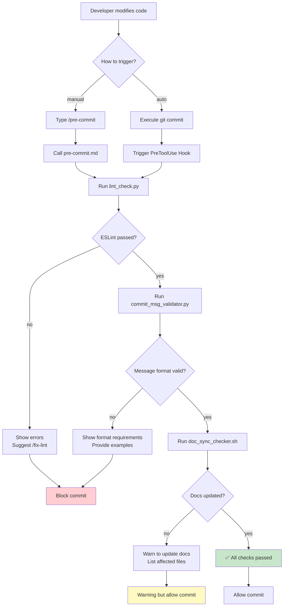
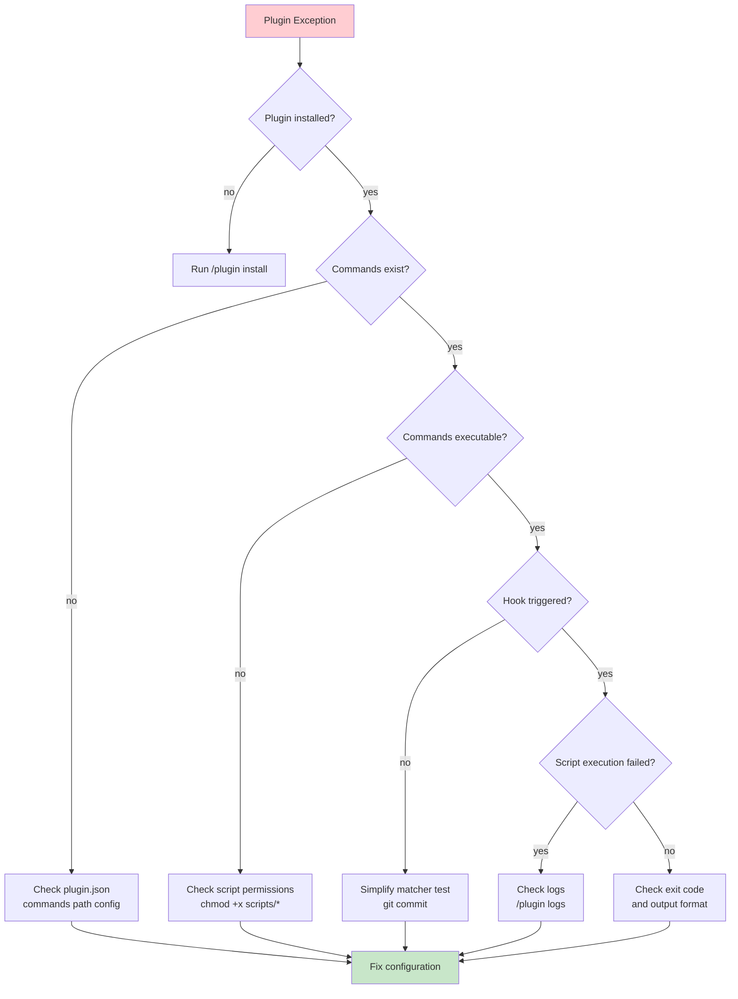
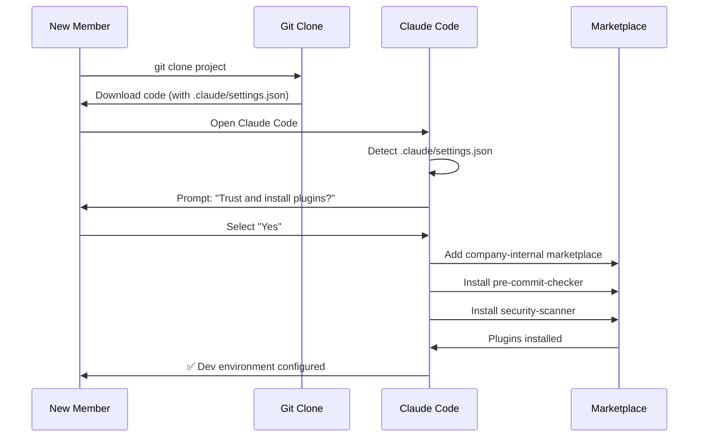

## 第二篇：实战篇 - 从零构建第一个插件

> **系列回顾**：在第一篇中，我们探讨了 Claude Code Plugins 的核心概念、四大组件和工作原理。本篇将进入实战阶段，手把手带你构建一个真实可用的插件。

---

## 一、场景设定与需求分析

### 1.1 真实的团队痛点

在开始编码前，让我们先明确要解决的问题。这是一个来自真实团队的场景：

**团队背景**：

- 15 人的全栈开发团队
- 使用 Git 进行版本控制
- 采用 ESLint 作为代码规范工具
- 遵循 Conventional Commits 规范

**当前问题**：

```
代码审查会议上的典型对话：

Tech Lead: "这个 PR 又有 18 处 ESLint 错误..."
开发者 A: "抱歉，我忘记运行 linter 了。"

Tech Lead: "Commit message 写的是 'update code'，看不出改了什么..."
开发者 B: "我赶着提交，下次注意。"

Tech Lead: "你修改了支付 API，但没更新 API 文档..."
开发者 C: "哦对，我一会儿补上。"

结果：每次 Code Review 浪费 30 分钟在这些低级问题上。
```

**统计数据**（团队实测）：

- 60% 的 PR 首次提交有格式问题
- 平均每个 PR 需要 2.3 次返工
- 每周浪费约 4 小时在重复性问题修复上

### 1.2 需求拆解

基于以上痛点，我们需要构建一个**提交前检查插件**，具备以下功能：

**核心功能**：

1. ✅ **代码质量检查**：运行 ESLint，确保代码符合规范
2. ✅ **Commit 消息验证**：检查是否遵循 Conventional Commits
3. ✅ **文档同步检查**：API 代码变更时提醒更新文档

**使用方式**：

- **手动触发**：开发者执行 `/pre-commit` 主动检查
- **自动触发**：Git commit 前自动拦截并检查

**期望效果**：

- 减少 80% 的格式相关返工
- 提升 Commit 消息质量
- 确保文档与代码同步

### 1.3 技术选型

**插件组件选择**：

```
✅ Slash Commands → 提供手动检查入口 (/pre-commit, /fix-lint)
✅ Hooks          → Git commit 前自动拦截检查
❌ Subagents      → 本场景不需要复杂任务委派
❌ MCP Servers    → 不涉及外部系统集成
```

**脚本语言选择**：

```python
# 主检查逻辑：Python（团队主力语言，便于维护）
# 快速辅助：bash（简单任务，执行效率高）
```

**依赖工具**：

- ESLint（代码检查）
- Git（版本控制）
- Python 3.8+（脚本运行）

---

## 二、项目结构设计

### 设计理念

在开始实现前，我们需要明确插件的设计思路：

**核心原则**：
1. **模块化分离**：命令定义、执行脚本、Hook 配置各司其职
2. **渐进式增强**：从简单的手动命令开始，逐步添加自动化 Hook
3. **优雅降级**：检查失败时给出明确提示，而非直接报错退出

**关于生产环境的说明**：

> ⚠️ **重要提示**：本文构建的插件主要用于**教学演示**目的，帮助理解 Claude Code Plugins 的工作机制。实际生产环境中，已有更成熟的方案：
>
> - [**pre-commit**](https://pre-commit.com/)：Python 生态的钩子管理框架，支持多语言、丰富的插件库
> - [**husky**](https://typicode.github.io/husky/)：Node.js 生态的 Git Hooks 工具，配置简单、社区活跃
> - [**lint-staged**](https://github.com/okonet/lint-staged)：仅对 staged 文件运行 linter，性能优秀
>
> 这些工具经过大规模验证，提供了更完善的功能和更好的性能。本文的插件可作为：
> - **学习 Claude Code Plugins 开发的起点**
> - **团队内部定制化工具的参考**
> - **与 Claude 深度集成的工作流扩展**

**我们的插件优势**：
- 与 Claude Code 无缝集成，可在对话中直接调用
- 失败时 Claude 能理解错误信息并提供修复建议
- 可扩展为更复杂的 AI辅助工作流

### 2.1 目录树规划

**设计思路**：清晰的目录结构不仅让插件易于维护，更能帮助其他开发者快速理解代码组织方式。每个目录都有其特定的职责，这种分离确保了代码的模块化和可扩展性。

```
pre-commit-checker/
├── .claude-plugin/
│   └── plugin.json              # 插件元数据（必需）
│   # Claude Code 识别插件的入口点
│   # 定义插件名称、版本、依赖关系
│
├── commands/                    # 用户可见的命令定义
│   ├── pre-commit.md            # 手动完整检查
│   # 定义 /pre-commit 命令的执行步骤
│   ├── fix-lint.md              # 自动修复 lint 错误
│   # 定义 /fix-lint 命令的行为
│   └── check-docs.md            # 单独检查文档同步
│   # 定义 /check-docs 命令的逻辑
│
├── hooks/
│   └── hooks.json               # Hook 触发配置
│   # 定义自动化触发规则
│   # 例如：git commit 前自动运行检查
│
├── scripts/                     # 实际执行逻辑
│   ├── lint_check.py            # ESLint 检查主逻辑
│   # 获取 staged 文件，运行 ESLint
│   ├── commit_msg_validator.py  # Commit 消息验证
│   # 检查消息格式，验证规范
│   ├── doc_sync_checker.sh      # 文档同步检查
│   # 检查代码变更时文档是否同步
│   └── utils.py                 # 共用工具函数
│   # 提供可复用的辅助函数
│
├── tests/                       # 单元测试（推荐）
│   ├── test_lint_check.py       # 测试 ESLint 检查逻辑
│   └── test_commit_validator.py # 测试消息验证逻辑
│
├── .gitignore                   # Git 忽略文件
├── README.md                    # 插件使用文档
│   # 安装说明、使用示例、常见问题
└── requirements.txt             # Python 依赖
```

**目录职责说明**：

- **`.claude-plugin/`**：插件的"身份证"，存储 Claude Code 需要的元数据
- **`commands/`**：面向用户的接口，定义了插件提供的所有命令
- **`hooks/`**：自动化触发器，让插件能够响应特定事件
- **`scripts/`**：核心实现，包含所有业务逻辑
- **`tests/`**：质量保证，确保插件的可靠性

### 2.2 文件职责说明

| 文件/目录                    | 职责                              | 是否必需 |
| ---------------------------- | --------------------------------- | -------- |
| `.claude-plugin/plugin.json` | 插件元数据，Claude 识别插件的入口 | ✅ 必需  |
| `commands/*.md`              | 用户可见的命令定义                | ✅ 必需  |
| `hooks/hooks.json`           | 自动化触发规则                    | 可选     |
| `scripts/*`                  | 实际执行逻辑                      | ✅ 必需  |
| `tests/*`                    | 单元测试                          | 推荐     |
| `README.md`                  | 使用文档                          | 推荐     |

### 2.3 工作流程图



---

## 三、核心文件实现

本节将逐一实现插件的核心文件。这些文件构成了插件的"骨架"：

- **plugin.json**：插件的"身份证"，告诉 Claude Code 这是什么插件、有哪些功能
- **commands/*.md**：用户可见的命令定义，描述 Claude 该如何执行检查
- **hooks/hooks.json**：自动化触发规则，让检查在 Git 操作前自动运行
- **scripts/***：实际的检查逻辑，可以是 Python、Shell 或任何可执行脚本

这种分层设计的好处是：**定义与实现分离**。命令定义文件描述"做什么"，脚本文件负责"怎么做"，便于维护和测试。

### 3.1 插件清单：plugin.json

**作用**：这是插件的元数据文件，Claude Code 通过它识别插件、加载命令和 Hook。可以类比为：
- Node.js 的 `package.json`
- Python 的 `setup.py` / `pyproject.toml`
- Chrome 扩展的 `manifest.json`

**必需字段**：`name`、`version`、`description` 是最基本的三要素。
```json
{
  "name": "pre-commit-checker",
  "version": "1.0.0",
  "description": "Automated pre-commit quality checks for code, commit messages, and documentation",

  "author": {
    "name": "DevTools Team",
    "email": "[email protected]"
  },

  "homepage": "https://github.com/yourcompany/pre-commit-checker",
  "repository": "https://github.com/yourcompany/pre-commit-checker",
  "license": "MIT",

  "keywords": ["git", "lint", "commit", "quality", "pre-commit"],

  "commands": "./commands",
  "hooks": "./hooks/hooks.json",

  "requirements": {
    "python": ">=3.8",
    "node": ">=14.0.0"
  }
}
```

**字段解析**：

| 字段          | 说明                         | 示例                                     |
| ------------- | ---------------------------- | ---------------------------------------- |
| `name`        | 插件唯一标识符（kebab-case） | `pre-commit-checker`                     |
| `version`     | 遵循 SemVer 规范             | `1.0.0`                                  |
| `description` | 简短描述（80 字符内）        | `Automated pre-commit quality checks...` |
| `keywords`    | 搜索关键词（数组）           | `["git", "lint", "commit"]`              |
| `commands`    | 命令目录路径                 | `./commands`                             |
| `hooks`       | Hook 配置文件路径            | `./hooks/hooks.json`                     |

### 3.2 命令定义：commands/pre-commit.md

**作用**：定义 `/pre-commit` 命令的行为。当用户在 Claude Code 中输入 `/pre-commit` 时，Claude 会读取这个文件，按照其中的步骤执行检查。

**关键点**：
- **结构化步骤**：使用 `## Step 1/2/3` 清晰标注执行顺序
- **期望输出**：告诉 Claude 每步成功/失败时应该看到什么
- **错误处理**：失败时提供可操作的建议（如 "Run /fix-lint"）
- **环境变量**：`${CLAUDE_PLUGIN_ROOT}` 会自动替换为插件安装路径

这种 Markdown 格式让 Claude 能够"理解"任务，而不仅仅是机械执行命令。

````markdown
---
name: pre-commit
description: Run comprehensive pre-commit quality checks
tags: [git, quality, lint]
---

# Pre-Commit Quality Checks

Execute all quality checks before committing code changes.

## Step 1: ESLint Code Check

Run the linter on staged files:

```bash
python ${CLAUDE_PLUGIN_ROOT}/scripts/lint_check.py
```

**Expected output:**

- ✅ `All lint checks passed` → Continue to next step
- ❌ `Lint errors found` → Show errors and suggest `/fix-lint`

If errors found:

- Display specific error locations and descriptions
- Provide actionable fix suggestions
- Remind user of `/fix-lint` command for auto-fix

## Step 2: Commit Message Validation

Verify commit message follows Conventional Commits:

```bash
python ${CLAUDE_PLUGIN_ROOT}/scripts/commit_msg_validator.py
```

**Requirements:**

- Must start with type: `feat`, `fix`, `docs`, `refactor`, `test`, `chore`
- Format: `type(scope): description`
- Minimum 10 characters (excluding type prefix)
- Avoid generic terms: "update", "change", "fix stuff"

**Valid examples:**

```
feat(payment): add Stripe integration
fix(auth): resolve token expiration issue
docs(api): update authentication endpoints
```

If invalid:

- Show current commit message (if prepared)
- Explain what's wrong
- Provide 2-3 correct examples

## Step 3: Documentation Sync Check

Verify documentation is updated when API code changes:

```bash
bash ${CLAUDE_PLUGIN_ROOT}/scripts/doc_sync_checker.sh
```

**Check rules:**

- If files in `src/api/` modified → check `docs/API.md` updated
- If files in `src/models/` modified → check `docs/MODELS.md` updated
- Compare git diff timestamps

If documentation not updated:

- ⚠️ Warning (not blocking)
- List affected files
- Suggest documentation to update

## Final Output

Provide a structured summary:

**✅ All checks passed - Ready to commit**

```
✅ ESLint: No errors
✅ Commit message: Valid format
✅ Documentation: Up to date
```

**⚠️ Issues found:**

```
❌ ESLint: 3 errors in src/utils.py
   - Line 42: Unused variable 'temp'
   - Line 58: Missing semicolon
   Run /fix-lint to auto-fix

⚠️ Documentation: API changes not documented
   - Modified: src/api/payment.py
   - Please update: docs/API.md
```

````

**设计要点**：

1. **结构化步骤**：清晰的 Step 1/2/3，便于 Claude 理解执行顺序
2. **环境变量**：`${CLAUDE_PLUGIN_ROOT}` 自动替换为插件安装路径
3. **明确预期**：每步都说明期望的输出和错误处理
4. **用户友好**：失败时提供可操作的建议

### 3.3 快速修复命令：commands/fix-lint.md

**作用**：定义 `/fix-lint` 命令，自动修复可修复的 ESLint 错误。这是对 `/pre-commit` 的补充，提供"一键修复"功能。

**设计思路**：
- 调用同一个脚本 `lint_check.py`，但传入 `--fix` 参数
- 区分"已修复"和"需手动修复"的问题
- 修复后提示用户再次运行 `/pre-commit` 确认

````markdown
---
name: fix-lint
description: Automatically fix ESLint errors
tags: [lint, fix, auto]
---

# Auto-Fix Lint Errors

Automatically fix common ESLint errors using `--fix` flag.

## Execution

```bash
python ${CLAUDE_PLUGIN_ROOT}/scripts/lint_check.py --fix
```

## Process

1. Run ESLint with `--fix` on staged files
2. Display fixed issues count
3. Show remaining unfixable issues (if any)

## Output Format

**If all fixed:**

```
✅ Auto-fixed 12 lint issues:
   - 8 × Missing semicolons
   - 3 × Incorrect indentation
   - 1 × Trailing whitespace

All errors resolved. Ready to commit.
```

**If some unfixable:**

```
✅ Auto-fixed 8 issues
❌ 2 issues require manual fix:
   - src/utils.py:42 - Unused variable 'temp'
   - src/api.py:18 - Undefined function 'processData'

Please fix manually and run /pre-commit again.
```
````

### 3.4 Hook 配置：hooks/hooks.json

**作用**：配置自动触发规则，让检查在特定事件发生时自动运行，无需用户手动执行命令。

**核心概念**：
- **PreToolUse Hook**：在 Claude 调用工具（如 Bash）前触发
- **matcher（匹配器）**：正则表达式，决定什么操作会触发 Hook
- **onFailure 策略**：
  - `block`：检查失败则阻止原操作（如阻止 commit）
  - `warn`：仅警告，不阻止操作

**设计决策**：
- ESLint 和 Commit 消息检查失败时**阻止** commit（保证代码质量）
- 文档同步检查失败时仅**警告**（避免误伤正常提交）

```json
{
  "PreToolUse": [
    {
      "name": "pre-commit-quality-gate",
      "description": "Automatic quality checks before git commit",

      "matcher": "ExecuteBash.*git\\s+commit",

      "hooks": [
        {
          "type": "command",
          "command": "python ${CLAUDE_PLUGIN_ROOT}/scripts/lint_check.py",
          "description": "🔍 Running ESLint checks...",
          "timeout": 30
        },
        {
          "type": "command",
          "command": "python ${CLAUDE_PLUGIN_ROOT}/scripts/commit_msg_validator.py",
          "description": "📝 Validating commit message format...",
          "timeout": 10
        },
        {
          "type": "command",
          "command": "bash ${CLAUDE_PLUGIN_ROOT}/scripts/doc_sync_checker.sh",
          "description": "📚 Checking documentation sync...",
          "timeout": 15,
          "onFailure": "warn"
        }
      ],

      "onFailure": "block",
      "failureMessage": "❌ Pre-commit checks failed. Fix issues or run /fix-lint"
    }
  ]
}
```

**配置解析**：

| 字段        | 说明             | 值                              |
| ----------- | ---------------- | ------------------------------- |
| `matcher`   | 正则匹配工具调用 | `ExecuteBash.*git\\s+commit`    |
| `type`      | 执行类型         | `command`（执行外部命令）       |
| `timeout`   | 超时时间（秒）   | `30`                            |
| `onFailure` | 失败处理         | `block`（阻止）/ `warn`（警告） |
| `order`     | 执行顺序（可选） | 数字越小越先执行                |

**关键设计**：

- 前两个检查失败会**阻止** commit（`block`）
- 文档检查失败仅**警告**（`warn`），不阻止提交
- 每个 hook 都有独立的超时设置

---

## 四、脚本实现

本节实现实际执行检查的脚本。这些脚本是插件的"大脑"，负责具体的检查逻辑：

- **lint_check.py**：运行 ESLint，检查代码规范
- **commit_msg_validator.py**：验证 commit 消息格式
- **doc_sync_checker.sh**：检查文档是否与代码同步
- **utils.py**：共享的工具函数

**设计原则**：
1. **单一职责**：每个脚本只做一件事，职责明确
2. **标准退出码**：0=成功，1=失败（符合 Unix 惯例）
3. **友好输出**：使用 emoji 和结构化信息，便于理解
4. **优雅降级**：缺少配置时跳过检查，而非报错退出

### 4.1 ESLint 检查：scripts/lint_check.py

**目的**：检查 staged 的 JS/TS 文件是否符合 ESLint 规范，可选自动修复。

**实现思路**：
1. 检查项目是否配置了 ESLint（`.eslintrc.*` 文件）
2. 获取 staged 的 JS/TS 文件列表（仅检查将要提交的文件）
3. 运行 `npx eslint`（使用 npx 自动使用项目本地版本）
4. 解析 ESLint 输出，提取错误统计
5. 返回适当的退出码和友好的提示信息

**关键优化**：
- 仅检查 staged 文件，提升性能
- 支持 `--fix` 参数一键修复
- 没有配置时优雅跳过，不影响正常提交

```python
#!/usr/bin/env python3
"""
ESLint checker for pre-commit hook
Checks staged files and optionally auto-fixes issues
"""

import subprocess
import sys
import argparse
from pathlib import Path
from typing import List, Tuple


def check_eslint_config() -> bool:
    """Check if ESLint configuration exists"""
    config_files = ['.eslintrc.js', '.eslintrc.json', '.eslintrc.yml', '.eslintrc.yaml']
    return any(Path(f).exists() for f in config_files)


def get_staged_files() -> List[str]:
    """Get list of staged JS/TS files"""
    try:
        result = subprocess.run(
            ['git', 'diff', '--cached', '--name-only', '--diff-filter=ACM'],
            capture_output=True,
            text=True,
            check=True
        )

        files = result.stdout.strip().split('\n')
        # Filter JS/TS files
        js_ts_files = [
            f for f in files
            if f and f.endswith(('.js', '.jsx', '.ts', '.tsx'))
        ]
        return js_ts_files

    except subprocess.CalledProcessError as e:
        print(f"❌ Error getting staged files: {e}", file=sys.stderr)
        return []


def run_eslint(files: List[str], fix: bool = False) -> Tuple[bool, str]:
    """
    Run ESLint on specified files

    Args:
        files: List of file paths
        fix: Whether to auto-fix issues

    Returns:
        (success, output) tuple
    """
    cmd = ['npx', 'eslint']

    if fix:
        cmd.append('--fix')

    cmd.extend(files)

    try:
        result = subprocess.run(
            cmd,
            capture_output=True,
            text=True,
            check=False  # Don't raise on non-zero exit
        )

        success = result.returncode == 0
        output = result.stdout + result.stderr

        return success, output

    except FileNotFoundError:
        return False, "❌ ESLint not found. Run: npm install -g eslint"


def parse_eslint_output(output: str) -> dict:
    """Parse ESLint output to extract error statistics"""
    lines = output.split('\n')

    errors = 0
    warnings = 0

    for line in lines:
        if '✖' in line and 'problem' in line:
            # Parse line like: "✖ 3 problems (2 errors, 1 warning)"
            parts = line.split()
            for i, part in enumerate(parts):
                if 'error' in part and i > 0:
                    errors = int(parts[i-1])
                if 'warning' in part and i > 0:
                    warnings = int(parts[i-1])

    return {'errors': errors, 'warnings': warnings}


def main():
    parser = argparse.ArgumentParser(description='Run ESLint checks')
    parser.add_argument('--fix', action='store_true', help='Auto-fix issues')
    args = parser.parse_args()

    print("🔍 Running ESLint checks...")

    # Check if ESLint is configured
    if not check_eslint_config():
        print("⚠️  No ESLint config found, skipping lint check")
        return 0

    # Get staged files
    staged_files = get_staged_files()

    if not staged_files:
        print("✅ No JS/TS files staged, skipping lint check")
        return 0

    print(f"📝 Checking {len(staged_files)} file(s)...")

    # Run ESLint
    success, output = run_eslint(staged_files, fix=args.fix)

    if success:
        if args.fix:
            print("✅ All issues auto-fixed")
        else:
            print("✅ All lint checks passed")
        return 0
    else:
        stats = parse_eslint_output(output)

        print(f"\n❌ Lint errors found:")
        print(f"   Errors: {stats['errors']}")
        print(f"   Warnings: {stats['warnings']}")
        print(f"\n{output}\n")

        if not args.fix:
            print("💡 Tip: Run /fix-lint or 'npx eslint --fix' to auto-fix")
        else:
            print("⚠️  Some issues require manual fixing")

        return 1


if __name__ == '__main__':
    sys.exit(main())
```

**代码要点**：

1. **优雅降级**：没有 ESLint 配置时跳过而非报错
2. **精准检查**：仅检查 staged 的 JS/TS 文件
3. **统计解析**：提取错误和警告数量
4. **清晰输出**：用 emoji 增强可读性
5. **退出码**：0=成功，1=失败（符合 shell 约定）

### 4.2 Commit 消息验证：scripts/commit_msg_validator.py

**目的**：确保 commit 消息遵循 [Conventional Commits](https://www.conventionalcommits.org/) 规范，提升 commit 历史可读性。

**实现思路**：
1. 尝试读取准备好的 commit 消息（从 `.git/COMMIT_EDITMSG` 或最近的 commit）
2. 使用正则表达式验证格式：`type(scope): description`
3. 检查 type 是否在预定义列表中（feat、fix、docs 等）
4. 检查描述长度（至少 10 字符）和避免通用词（update、change）
5. 失败时展示 5 个正确示例，帮助用户理解规范

**为什么重要**：
- 规范的 commit 消息便于生成 CHANGELOG
- 清晰的 type 标注便于代码审查和回溯
- 避免 "update code"、"fix stuff" 等无意义消息

```python
#!/usr/bin/env python3
"""
Commit message validator
Ensures messages follow Conventional Commits specification
"""

import re
import sys
import subprocess


# Conventional Commits types
VALID_TYPES = [
    'feat',     # New feature
    'fix',      # Bug fix
    'docs',     # Documentation
    'style',    # Formatting
    'refactor', # Code restructuring
    'test',     # Testing
    'chore',    # Maintenance
    'perf',     # Performance
    'ci',       # CI/CD
    'build',    # Build system
    'revert'    # Revert commit
]

# Pattern: type(scope): description
COMMIT_PATTERN = re.compile(
    r'^(' + '|'.join(VALID_TYPES) + r')(\(.+\))?: .{10,}$'
)

# Generic terms to avoid
GENERIC_TERMS = ['update', 'change', 'modify', 'fix stuff', 'wip', 'tmp']


def get_commit_message() -> str:
    """Get the prepared commit message"""
    try:
        # Try to get message from git (if already prepared)
        result = subprocess.run(
            ['git', 'log', '--format=%B', '-n', '1', 'HEAD'],
            capture_output=True,
            text=True,
            check=False
        )

        if result.returncode == 0 and result.stdout.strip():
            return result.stdout.strip()

        # If no commit yet, check COMMIT_EDITMSG
        commit_msg_file = '.git/COMMIT_EDITMSG'
        try:
            with open(commit_msg_file, 'r') as f:
                return f.read().strip()
        except FileNotFoundError:
            return ""

    except Exception as e:
        print(f"⚠️  Could not read commit message: {e}")
        return ""


def validate_commit_message(message: str) -> dict:
    """
    Validate commit message

    Returns:
        dict with 'valid' (bool) and 'errors' (list)
    """
    errors = []

    if not message:
        errors.append("Commit message is empty")
        return {'valid': False, 'errors': errors}

    # Get first line (commit title)
    first_line = message.split('\n')[0]

    # Check pattern match
    if not COMMIT_PATTERN.match(first_line):
        errors.append("Message doesn't follow Conventional Commits format")
        errors.append(f"Expected: type(scope): description")
        errors.append(f"Valid types: {', '.join(VALID_TYPES)}")

    # Check for generic terms
    message_lower = first_line.lower()
    for term in GENERIC_TERMS:
        if term in message_lower:
            errors.append(f"Avoid generic term: '{term}'")

    # Check minimum length (excluding type prefix)
    if ':' in first_line:
        description = first_line.split(':', 1)[1].strip()
        if len(description) < 10:
            errors.append(f"Description too short ({len(description)} chars, minimum 10)")

    return {
        'valid': len(errors) == 0,
        'errors': errors
    }


def print_examples():
    """Print valid commit message examples"""
    examples = [
        "feat(auth): add OAuth2 login support",
        "fix(payment): resolve Stripe webhook timeout",
        "docs(api): update authentication endpoints",
        "refactor(utils): simplify date formatting logic",
        "test(auth): add unit tests for JWT validation"
    ]

    print("\n✅ Valid commit message examples:")
    for example in examples:
        print(f"   - {example}")


def main():
    print("📝 Validating commit message format...")

    message = get_commit_message()

    if not message:
        print("⚠️  No commit message found")
        print("💡 Prepare your commit message and try again")
        return 0  # Don't block if message not prepared yet

    result = validate_commit_message(message)

    if result['valid']:
        print("✅ Commit message format is valid")
        return 0
    else:
        print("\n❌ Commit message validation failed:\n")
        for error in result['errors']:
            print(f"   • {error}")

        print_examples()

        print("\n💡 Fix your commit message and try again")
        return 1


if __name__ == '__main__':
    sys.exit(main())
```

**验证规则**：

1. **格式匹配**：必须符合 `type(scope): description` 模式
2. **类型检查**：type 必须是预定义的 11 个之一
3. **长度要求**：描述至少 10 个字符
4. **避免通用词**：拒绝 "update"、"change" 等模糊描述
5. **提供示例**：失败时展示 5 个正确示例

### 4.3 文档同步检查：scripts/doc_sync_checker.sh

**目的**：当 API 代码发生变更时，提醒开发者同步更新相关文档，避免文档过时。

**实现思路**：
1. 定义"代码目录 → 文档文件"的映射规则（如 `src/api/` → `docs/API.md`）
2. 获取 staged 文件列表
3. 检查是否有代码目录下的文件被修改
4. 如果代码改了但对应文档未 staged，则发出警告
5. 列出需要更新的文档文件

**为什么使用 Shell**：
- 任务简单，无需复杂逻辑
- bash 在 Git 操作上更简洁（`git diff`、`grep`）
- 执行效率高

**设计亮点**：
- 使用关联数组（`declare -A`）灵活配置规则
- 仅警告不阻止，避免误杀正常提交（文档有时滞后于代码）

```bash
#!/bin/bash
# Documentation sync checker
# Warns if API code changed but docs not updated

set -e

echo "📚 Checking documentation sync..."

# Configuration: file patterns to check
declare -A DOC_RULES=(
    ["src/api/"]="docs/API.md"
    ["src/models/"]="docs/MODELS.md"
    ["src/config/"]="docs/CONFIG.md"
)

# Get list of staged files
STAGED_FILES=$(git diff --cached --name-only --diff-filter=ACM)

if [ -z "$STAGED_FILES" ]; then
    echo "✅ No files staged"
    exit 0
fi

WARNINGS=()

# Check each rule
for pattern in "${!DOC_RULES[@]}"; do
    doc_file="${DOC_RULES[$pattern]}"

    # Check if any staged file matches pattern
    MATCHED_FILES=$(echo "$STAGED_FILES" | grep "^$pattern" || true)

    if [ -n "$MATCHED_FILES" ]; then
        # Code in this area was modified

        # Check if corresponding doc was also staged
        DOC_STAGED=$(echo "$STAGED_FILES" | grep "^$doc_file$" || true)

        if [ -z "$DOC_STAGED" ]; then
            # Doc was not updated
            WARNINGS+=("⚠️  Files in '$pattern' modified, but '$doc_file' not updated")

            # List affected files
            while IFS= read -r file; do
                if [ -n "$file" ]; then
                    WARNINGS+=("   - $file")
                fi
            done <<< "$MATCHED_FILES"
        fi
    fi
done

# Output results
if [ ${#WARNINGS[@]} -eq 0 ]; then
    echo "✅ Documentation is up to date"
    exit 0
else
    echo ""
    echo "⚠️  Documentation sync warnings:"
    echo ""

    for warning in "${WARNINGS[@]}"; do
        echo "$warning"
    done

    echo ""
    echo "💡 Please update the corresponding documentation files"

    # Return 0 (warning only, don't block commit)
    exit 0
fi
```

**检查逻辑**：

1. **规则映射**：定义"代码目录 → 文档文件"的映射关系
2. **智能匹配**：检查 staged 文件是否在监控目录内
3. **交叉验证**：如果代码改了，检查文档是否也 staged
4. **友好输出**：列出所有需要更新的文档
5. **非阻塞**：仅警告，不阻止提交（exit 0）

### 4.4 工具函数：scripts/utils.py

**目的**：提供可复用的工具函数，避免在多个脚本中重复代码。

**包含的函数**：
- `run_command()`：统一的命令执行接口，处理超时和错误
- `is_git_repository()`：检查当前目录是否为 Git 仓库
- `get_git_root()`：获取 Git 仓库根目录

**设计原则**：
- 单一职责，每个函数只做一件事
- 统一的错误处理和异常信息
- 类型提示（Type Hints），便于维护

这些工具函数在本示例中未被使用，但为future扩展预留了空间。

```python
"""Shared utility functions"""

import subprocess
from typing import List, Optional


def run_command(
    cmd: List[str],
    check: bool = True,
    timeout: Optional[int] = None
) -> subprocess.CompletedProcess:
    """
    Run shell command with error handling

    Args:
        cmd: Command and arguments as list
        check: Raise exception on non-zero exit
        timeout: Command timeout in seconds

    Returns:
        CompletedProcess instance
    """
    try:
        result = subprocess.run(
            cmd,
            capture_output=True,
            text=True,
            check=check,
            timeout=timeout
        )
        return result
    except subprocess.TimeoutExpired:
        raise TimeoutError(f"Command timed out after {timeout}s: {' '.join(cmd)}")
    except subprocess.CalledProcessError as e:
        raise RuntimeError(f"Command failed: {' '.join(cmd)}\n{e.stderr}")


def is_git_repository() -> bool:
    """Check if current directory is a Git repository"""
    try:
        subprocess.run(
            ['git', 'rev-parse', '--git-dir'],
            capture_output=True,
            check=True
        )
        return True
    except subprocess.CalledProcessError:
        return False


def get_git_root() -> str:
    """Get Git repository root directory"""
    result = run_command(['git', 'rev-parse', '--show-toplevel'])
    return result.stdout.strip()
```

---

## 五、本地测试流程

在将插件发布到团队或公开市场前，完整的本地测试至关重要。本节将带你完成从环境准备到功能验证的全流程，确保插件在各种场景下都能稳定工作。

**测试目标**：
1. **结构验证**：确认插件文件结构完整，配置格式正确
2. **命令可用性**：验证所有 slash 命令能被正确识别和执行
3. **Hook 触发**：测试自动化 Hook 是否在预期时机触发
4. **脚本执行**：确保所有检查脚本能正确运行并返回准确结果
5. **错误处理**：验证各种异常情况下的降级和提示逻辑

**测试流程概览**：
```
环境准备 → 创建测试市场 → 安装激活插件 → 功能测试 → 调试优化
   ↓            ↓              ↓             ↓           ↓
 准备测试    配置本地       验证命令      模拟各种    排查并修复
 项目和     marketplace    是否可见      使用场景     发现的问题
 依赖
```

### 5.1 环境准备

**Step 1: 创建测试项目**

```bash
# 创建测试目录
mkdir test-plugin-project
cd test-plugin-project

# 初始化 Git
git init

# 创建测试文件
cat > test.js << 'EOF'
function hello() {
    console.log("hello world")  // Missing semicolon
}

let unused = 42;  // Unused variable
EOF

# 配置 ESLint
npm init -y
npm install --save-dev eslint
npx eslint --init

# 创建简单的 ESLint 配置
cat > .eslintrc.json << 'EOF'
{
  "env": {
    "browser": true,
    "es2021": true
  },
  "extends": "eslint:recommended",
  "rules": {
    "semi": ["error", "always"],
    "no-unused-vars": "error"
  }
}
EOF
```

**Step 2: 安装插件依赖**

```bash
cd /path/to/pre-commit-checker

# 创建虚拟环境
python3 -m venv .venv
source .venv/bin/activate  # Linux/Mac
# .venv\Scripts\activate   # Windows

# 安装依赖（如果有）
pip install -r requirements.txt

# 给脚本添加执行权限
chmod +x scripts/*.py scripts/*.sh
```

### 5.2 创建测试 Marketplace

**Step 1: 配置本地市场**

```bash
cd /path/to/pre-commit-checker

# 创建 marketplace 配置
mkdir -p .claude-plugin

cat > .claude-plugin/marketplace.json << 'EOF'
{
  "name": "local-test-marketplace",
  "owner": {
    "name": "Test User",
    "email": "[email protected]"
  },
  "metadata": {
    "description": "Local testing marketplace for plugin development",
    "version": "1.0.0"
  },
  "plugins": [
    {
      "name": "pre-commit-checker",
      "description": "Automated pre-commit quality checks",
      "version": "1.0.0",
      "source": ".",
      "author": {
        "name": "DevTools Team"
      },
      "keywords": ["git", "lint", "quality"],
      "category": "development"
    }
  ]
}
EOF
```

**Step 2: 添加到 Claude Code**

```bash
# 在 Claude Code 中执行
/plugin marketplace add /absolute/path/to/pre-commit-checker

# 验证市场已添加
/plugin marketplace list

# 预期输出：
# ✓ local-test-marketplace (local: /path/to/pre-commit-checker)
#   - 1 plugin available
```

### 5.3 安装并激活插件

**安装机制说明**：Claude Code 支持从多个市场源安装插件。安装后，插件会被下载到本地缓存，命令和 Hook 配置会被加载到当前会话中。

```bash
# 安装插件
/plugin install pre-commit-checker@local-test-marketplace

# 查看已安装插件
/plugin

# 预期输出（打开交互式菜单）：
# Installed Plugins:
# ✓ pre-commit-checker (v1.0.0)
#   Status: Enabled
#   Commands: /pre-commit, /fix-lint, /check-docs
#   Hooks: PreToolUse (git commit)

# 验证命令是否可用
/help

# 应该能看到新增的命令：
# /pre-commit - Run comprehensive pre-commit quality checks
# /fix-lint - Automatically fix ESLint errors
# /check-docs - Check documentation sync

# 重启 Claude Code 使插件完全生效
exit
claude
```

**安装过程解析**：

1. **解析插件源**：从 local-test-marketplace 读取插件配置
2. **下载插件**：将插件文件复制到 Claude Code 的插件目录
3. **注册命令**：扫描 `commands/` 目录，注册所有 slash 命令
4. **配置 Hook**：读取 `hooks/hooks.json`，设置自动化触发器
5. **激活插件**：加载插件配置到当前会话

**故障排查**：
- 如果插件安装失败，检查 marketplace.json 格式是否正确
- 如果命令不可见，确认 commands 目录中的文件格式正确
- 如果 Hook 未触发，验证 hooks.json 中的 matcher 表达式

### 5.4 功能测试

#### 测试 1：手动命令测试

```bash
# 切换到测试项目
cd /path/to/test-plugin-project

# Stage 测试文件
git add test.js

# 测试手动检查命令
/pre-commit
```

**预期输出：**

```
🔍 Running ESLint checks...
📝 Checking 1 file(s)...

❌ Lint errors found:
   Errors: 2
   Warnings: 0

/path/to/test.js
  2:32  error  Missing semicolon                semi
  5:5   error  'unused' is assigned but never used  no-unused-vars

✖ 2 problems (2 errors, 0 warnings)
  1 error potentially fixable with the `--fix` option

💡 Tip: Run /fix-lint or 'npx eslint --fix' to auto-fix

📝 Validating commit message format...
⚠️  No commit message found
💡 Prepare your commit message and try again

⚠️ Issues found:
  ❌ ESLint: 2 errors in test.js
  ⚠️ Commit message: Not prepared yet
```

#### 测试 2：自动修复测试

```bash
# 测试自动修复命令
/fix-lint
```

**预期输出：**

```
🔍 Running ESLint checks...
📝 Checking 1 file(s)...

✅ Auto-fixed 1 issue:
   - 1 × Missing semicolon

❌ 1 issue requires manual fix:
   - test.js:5 - 'unused' is assigned but never used

Please fix manually and run /pre-commit again.
```

#### 测试 3：Hook 自动触发测试

```bash
# 手动修复剩余问题
# 编辑 test.js，删除 unused 变量

# 准备提交（触发 Hook）
# 在 Claude Code 中执行
git commit -m "test: add hello function"
```

**预期流程：**

```
Claude Code 检测到 git commit 命令
↓
触发 PreToolUse Hook
↓
🔍 Running ESLint checks...
✅ All lint checks passed

📝 Validating commit message format...
✅ Commit message format is valid

📚 Checking documentation sync...
✅ Documentation is up to date
↓
✅ All checks passed
↓
允许 commit 继续执行
```

#### 测试 4：失败阻止测试

```bash
# 故意制造错误
cat > test.js << 'EOF'
function bad() {
    console.log("error"  // Missing closing parenthesis
}
EOF

git add test.js

# 尝试提交
git commit -m "bad code"
```

**预期行为：**

```
🔍 Running ESLint checks...

❌ Lint errors found:
   test.js:2 - Parsing error: Unexpected token

❌ Pre-commit checks failed. Fix issues or run /fix-lint

[Commit 被阻止]
```

### 5.5 调试技巧

当插件出现问题时,掌握正确的调试方法能快速定位并解决问题。以下是四种实用的调试技巧,按照从简单到复杂的顺序排列。

#### 技巧 1：使用插件管理命令检查状态

```bash
# 查看已安装的插件列表和状态
/plugin

# 这会打开交互式菜单,显示:
# - 已安装的插件及其版本
# - 插件的启用/禁用状态
# - 可用的命令列表
# - Hook 配置情况

# 或使用 /help 验证命令是否可见
/help

# 应该能看到插件提供的命令:
# /pre-commit - Run comprehensive pre-commit quality checks
# /fix-lint - Automatically fix ESLint errors
# /check-docs - Check documentation sync
```

**如何判断问题**:
- 如果 `/plugin` 中看不到插件 → 安装或启用失败
- 如果 `/help` 中看不到命令 → 命令配置错误
- 如果状态显示 "Disabled" → 需要手动启用

#### 技巧 2：检查脚本输出和错误信息

```bash
# 单独运行脚本,查看详细输出
cd /path/to/pre-commit-checker

# 测试 ESLint 检查脚本
python scripts/lint_check.py
# 观察: 是否找到 ESLint? 文件列表是否正确? 错误信息是否清晰?

# 测试 Commit 消息验证
python scripts/commit_msg_validator.py
# 观察: 是否能读取 commit 消息? 正则匹配是否正确?

# 测试文档同步检查
bash scripts/doc_sync_checker.sh
# 观察: 规则配置是否正确? staged 文件检测是否准确?
```

**调试要点**:
- 检查脚本是否有执行权限 (`ls -l scripts/`)
- 观察退出码 (`echo $?`,0=成功)
- 查看详细错误栈,定位具体问题行

#### 技巧 3：验证环境和依赖

```bash
# 检查 Python 环境
python --version  # 确认版本 >= 3.8
which python      # 确认使用正确的 Python

# 检查 Node.js 和 ESLint
node --version
npx eslint --version

# 检查 Git 状态
git status
git diff --cached --name-only  # 查看 staged 文件

# 验证插件目录结构
cd /path/to/pre-commit-checker
find . -type f -name "*.json"  # 查找所有 JSON 文件
cat .claude-plugin/plugin.json | python -m json.tool  # 验证 JSON 格式
```

**常见问题排查**:
- Python/Node 版本不符合要求 → 升级或使用虚拟环境
- ESLint 未安装 → `npm install --save-dev eslint`
- JSON 格式错误 → 使用 `python -m json.tool` 验证

#### 技巧 4：查看 Claude Code 的执行日志

```bash
# Claude Code 在执行插件时会在终端输出日志
# 观察以下关键信息:

# Hook 触发时的输出:
🔍 Running ESLint checks...
📝 Validating commit message format...
📚 Checking documentation sync...

# 如果没有看到这些输出:
# 1. Hook 可能未触发 (matcher 不匹配)
# 2. 脚本可能执行失败但未输出错误
# 3. 超时设置过短导致提前终止

# 调试 Hook 匹配问题:
# 临时简化 hooks.json 中的 matcher
{
  "matcher": "git commit"  # 更宽松的匹配,先确保能触发
}

# 然后逐步细化:
{
  "matcher": "ExecuteBash.*git.*commit"  # 更精确的匹配
}
```

**Hook 调试流程**:
1. 确认插件已启用 (`/plugin` 菜单)
2. 简化 matcher,确保能触发
3. 检查脚本是否有输出
4. 观察退出码是否正确返回
5. 逐步恢复原始的 matcher 配置

---

## 六、常见问题排查

### 6.1 问题诊断流程图



### 6.2 高频问题与解决方案

#### 问题 1：脚本权限错误

**症状：**

```
PermissionError: [Errno 13] Permission denied:
'./scripts/lint_check.py'
```

**原因：** 脚本文件没有执行权限

**解决：**

```bash
# 给所有脚本添加执行权限
chmod +x scripts/*.py scripts/*.sh

# 或单独设置
chmod +x scripts/lint_check.py
chmod +x scripts/commit_msg_validator.py
chmod +x scripts/doc_sync_checker.sh
```

**验证：**

```bash
ls -l scripts/

# 预期输出（注意 x 权限）：
-rwxr-xr-x  lint_check.py
-rwxr-xr-x  commit_msg_validator.py
-rwxr-xr-x  doc_sync_checker.sh
```

#### 问题 2：环境变量未解析

**症状：**

```
FileNotFoundError:
${CLAUDE_PLUGIN_ROOT}/scripts/lint_check.py
```

**原因：** hooks.json 中使用了单引号（JSON 不支持变量替换）

**错误示例：**

```json
{
  "command": '${CLAUDE_PLUGIN_ROOT}/scripts/lint_check.py'
}
```

**正确写法：**

```json
{
  "command": "${CLAUDE_PLUGIN_ROOT}/scripts/lint_check.py"
}
```

**验证：**

```bash
# 使用 JSON 验证工具
cat hooks/hooks.json | python -m json.tool

# 或在线验证
# https://jsonlint.com
```

#### 问题 3：Hook 未触发

**症状：** git commit 时没有执行检查

**调试步骤：**

```bash
# Step 1: 确认插件已启用
/plugin list

# 应该看到：
✓ pre-commit-checker (v1.0.0) - Enabled

# Step 2: 检查 Hook 配置
/plugin info pre-commit-checker

# 应该显示：
Hooks:
  - PreToolUse: ExecuteBash.*git\s+commit

# Step 3: 测试 matcher
/plugin test-hook pre-commit-checker "git commit -m 'test'"

# 应该输出：
✅ Hook matched

# Step 4: 简化 matcher 测试
# 临时修改 hooks.json:
{
  "matcher": "git commit"  # 简化的 matcher
}

# 重新测试
```

**常见原因：**

1. Matcher 正则表达式太严格
2. Claude 调用的命令格式不匹配
3. Hook 被其他插件覆盖

**解决方案：**

```json
{
  "matcher": "ExecuteBash.*git.*commit", // 更宽松的匹配
  "priority": 10 // 提高优先级
}
```

#### 问题 4：Python 模块导入失败

**症状：**

```
ModuleNotFoundError: No module named 'xxx'
```

**原因：** 缺少 Python 依赖

**解决：**

```bash
# 方案 1: 使用虚拟环境
cd /path/to/pre-commit-checker
python3 -m venv .venv
source .venv/bin/activate
pip install -r requirements.txt

# 方案 2: 在 Hook 中指定 Python 路径
{
  "command": "/path/to/.venv/bin/python ${CLAUDE_PLUGIN_ROOT}/scripts/lint_check.py"
}

# 方案 3: 使用系统 Python 安装依赖
pip install --user -r requirements.txt
```

#### 问题 5：ESLint 未找到

**症状：**

```
❌ ESLint not found. Run: npm install -g eslint
```

**解决：**

```bash
# 方案 1: 全局安装
npm install -g eslint

# 方案 2: 项目本地安装
cd /your/project
npm install --save-dev eslint

# 方案 3: 使用 npx（推荐）
# 脚本中已使用 npx eslint，会自动使用本地版本
```

#### 问题 6：超时错误

**症状：**

```
TimeoutError: Command timed out after 30s
```

**原因：** 检查的文件太多或网络慢

**解决：**

```json
{
  "hooks": [
    {
      "command": "python ${CLAUDE_PLUGIN_ROOT}/scripts/lint_check.py",
      "timeout": 60, // 增加到 60 秒
      "async": false // 确保同步执行
    }
  ]
}
```

#### 问题 7：Git 仓库检测失败

**症状：**

```
fatal: not a git repository
```

**原因：** 不在 Git 仓库目录中

**解决：**

```python
# 在脚本开头添加检查
import os
import sys

def check_git_repo():
    try:
        subprocess.run(
            ['git', 'rev-parse', '--git-dir'],
            capture_output=True,
            check=True
        )
    except subprocess.CalledProcessError:
        print("❌ Not a git repository")
        sys.exit(1)

check_git_repo()
```

### 6.3 调试清单

在提交 issue 前，请检查以下项目：

```markdown
## 调试清单

- [ ] 插件已正确安装（/plugin list 可见）
- [ ] 插件已启用（Status: Enabled）
- [ ] 脚本有执行权限（ls -l scripts/）
- [ ] JSON 格式正确（python -m json.tool）
- [ ] 环境变量正确（${CLAUDE_PLUGIN_ROOT}）
- [ ] 依赖已安装（Python/Node packages）
- [ ] 在 Git 仓库中运行
- [ ] ESLint 已配置
- [ ] Hook matcher 正确
- [ ] 查看了日志（/plugin logs）
```

---

## 七、插件组合与高级技巧
### 7.1 多插件协同工作

#### 场景:同时使用代码检查和安全扫描

**问题**:当项目同时使用多个插件时(如代码规范检查、安全扫描、测试运行器),需要协调它们的配置和行为,避免相互冲突或重复执行。

**解决方案**:通过项目级的 `.claude/settings.json` 统一管理所有插件的启用状态和配置参数。

```json
// .claude/settings.json(项目级配置)
{
  "enabledPlugins": ["pre-commit-checker", "security-scanner", "test-runner"],

  "pluginSettings": {
    "pre-commit-checker": {
      "autoFix": true,
      "strictMode": false
    },
    "security-scanner": {
      "severity": "high",
      "excludePaths": ["vendor/", "node_modules/"]
    }
  }
}
```

**配置说明**:
- `enabledPlugins`:明确声明项目使用哪些插件,团队成员克隆代码后自动同步
- `pluginSettings`:为每个插件提供定制化参数,覆盖默认行为
- `autoFix`:允许 pre-commit-checker 自动修复问题
- `excludePaths`:让 security-scanner 跳过第三方依赖目录,减少误报

**使用效果**:
- 新成员克隆项目后,Claude Code 会提示安装配置的插件
- 所有人使用相同的检查规则和严格程度
- 避免"本地能过,CI 失败"的问题

#### Hook 执行顺序控制

**问题**:多个插件都定义了 `PreToolUse` Hook 监听 `git commit`,默认执行顺序不确定,可能导致安全检查在代码检查之后运行(不合理),或者关键检查被跳过。

**解决方案**:使用 `order` 参数明确指定 Hook 的执行顺序,数字越小越先执行。
```json
{
  "PreToolUse": [
    {
      "name": "security-scan",
      "hooks": [
        {
          "type": "command",
          "command": "security-scanner scan",
          "order": 10 // 最先执行
        }
      ]
    },
    {
      "name": "lint-check",
      "hooks": [
        {
          "type": "command",
          "command": "python lint_check.py",
          "order": 20 // 然后执行
        }
      ]
    },
    {
      "name": "test-run",
      "hooks": [
        {
          "type": "command",
          "command": "pytest",
          "order": 30 // 最后执行
        }
      ]
    }
  ]
}
```

**执行流程：**

```
git commit
  ↓
安全扫描 (order: 10)
  ↓ 通过
代码检查 (order: 20)
  ↓ 通过
运行测试 (order: 30)
  ↓ 通过
✅ 允许提交
```

### 7.2 命名冲突处理

#### 问题:两个插件都有 /check 命令

**问题描述**:当安装多个插件时,它们可能定义了相同名称的命令。例如 `pre-commit-checker` 和 `security-scanner` 都提供 `/check` 命令。用户输入 `/check` 时,Claude Code 不知道应该执行哪个插件的命令,导致歧义。

**影响**:
- 用户体验混乱,不确定会触发哪个功能
- 可能错误执行了不符合预期的命令
- 命令提示中出现重复项

**解决方案 1:命名空间前缀**

```json
// Plugin A: pre-commit-checker
{
  "commands": [{
    "name": "precommit:check",
    "alias": ["check"]  // 无冲突时可用
  }]
}

// Plugin B: security-scanner
{
  "commands": [{
    "name": "security:check",
    "alias": ["check"]
  }]
}
```

**使用方式：**

```bash
/precommit:check  # 明确指定插件
/security:check

# 如果没有冲突，简短别名生效：
/check  # 会提示选择：
# Which plugin's /check?
# 1. pre-commit-checker
# 2. security-scanner
```

**解决方案 2：优先级控制**

```json
{
  "name": "pre-commit-checker",
  "priority": 10, // 数字越大优先级越高
  "commands": "./commands"
}
```

### 7.3 性能优化

#### 优化 1:条件化执行

**问题**:某些检查(如严格的代码审查、性能测试)只需要在特定分支(如 main、release)上运行,在 feature 分支频繁触发会严重拖慢开发速度。

**影响**:
- 开发分支每次 commit 等待时间过长(20-30秒)
- 开发者为避免等待,跳过本地测试直接推送到 CI
- CI 失败率上升,浪费更多时间

**解决方案**:使用 `condition` 参数根据环境变量(如 `GIT_BRANCH`)动态决定是否执行检查。

```json
{
  "hooks": [{
    "matcher": "Write.*\\.py$",
    "condition": "${GIT_BRANCH} == 'main'",  // 仅 main 分支
    "hooks": [...]
  }]
}
```

**效果**:
- feature 分支提交时跳过耗时检查,秒级完成
- main 分支保持完整检查,确保质量
- 减少 70% 的开发等待时间

#### 优化 2:文件过滤

**问题**:默认检查所有 staged 文件,但很多检查只针对特定文件类型(如 ESLint 只检查 JS/TS 文件)。未过滤时会浪费时间尝试检查不相关文件,还可能产生误报。

**解决方案**:在脚本开头过滤出目标文件类型,仅处理相关文件。
```python
def get_staged_files(extensions: List[str]) -> List[str]:
    """仅获取指定扩展名的文件"""
    all_files = get_all_staged_files()

    return [
        f for f in all_files
        if any(f.endswith(ext) for ext in extensions)
    ]

# 使用
js_files = get_staged_files(['.js', '.jsx', '.ts', '.tsx'])
```

#### 优化 3：并行检查

**问题描述**：当项目有多个文件需要检查时，串行处理（一个接一个检查）会耗费大量时间。例如，检查 20 个文件，每个文件需要 2 秒，总共需要 40 秒。这种等待时间会打断开发者的思路，降低开发效率。

**解决思路**：利用多线程并行处理，同时检查多个文件。就像有多个检查员同时工作，而不是只有一个检查员逐个检查。

**实现方案**：使用 Python 的 `ThreadPoolExecutor` 创建线程池，将文件分配给不同的线程并行检查。

```python
import concurrent.futures
from typing import List, Dict

def check_single_file(filepath: str) -> Dict:
    """检查单个文件"""
    # 模拟文件检查过程
    result = {
        'file': filepath,
        'errors': 0,
        'warnings': 0,
        'status': 'passed'
    }
    return result

def check_multiple_files(files: List[str]) -> List[Dict]:
    """并行检查多个文件

    Args:
        files: 需要检查的文件列表

    Returns:
        检查结果列表
    """
    # 创建线程池，最多 4 个线程同时工作
    with concurrent.futures.ThreadPoolExecutor(max_workers=4) as executor:
        # 为每个文件提交检查任务
        futures = [
            executor.submit(check_single_file, f)
            for f in files
        ]

        # 收集所有任务的完成结果
        results = [
            future.result()
            for future in concurrent.futures.as_completed(futures)
        ]

    return results

# 使用示例
files_to_check = ['src/app.js', 'src/utils.js', 'src/api.js']
results = check_multiple_files(files_to_check)
print(f"检查完成，共处理 {len(results)} 个文件")
```

**性能提升**：
- 串行处理：20 文件 × 2 秒 = 40 秒
- 并行处理（4 线程）：20 文件 ÷ 4 × 2 秒 = 10 秒
- **提升 75% 的处理速度**

#### 优化 4：缓存机制

**问题描述**：在开发过程中，同一个文件可能会被多次检查。例如，修改代码后运行 `/pre-commit`，然后又因为其他原因再次运行。每次都重新执行相同的检查（如 ESLint 分析）是浪费时间的，尤其是对于大文件。

**解决思路**：记住每个文件的检查结果。如果文件内容没有变化，直接使用之前的结果，避免重复计算。这就像记住做过的数学题答案，下次遇到相同题目直接写出答案。

**实现方案**：为每个文件内容生成唯一指纹（hash），将检查结果与指纹一起缓存。再次检查时，先计算文件 hash，如果 hash 相同就直接使用缓存结果。

```python
import hashlib
import json
from pathlib import Path
from typing import Dict

# 缓存目录
CACHE_DIR = Path('.claude-cache')

def get_file_hash(filepath: str) -> str:
    """计算文件内容的 hash 值

    Args:
        filepath: 文件路径

    Returns:
        文件内容的 SHA256 hash
    """
    with open(filepath, 'rb') as f:
        return hashlib.sha256(f.read()).hexdigest()

def run_actual_check(filepath: str) -> Dict:
    """执行实际的文件检查（模拟）

    Args:
        filepath: 文件路径

    Returns:
        检查结果字典
    """
    # 这里是实际的检查逻辑
    # 例如：运行 ESLint、TypeScript 检查等
    return {
        'file': filepath,
        'errors': 0,
        'warnings': 1,
        'timestamp': '2025-01-10T10:30:00Z'
    }

def check_with_cache(filepath: str) -> Dict:
    """带缓存的文件检查

    Args:
        filepath: 要检查的文件路径

    Returns:
        检查结果字典
    """
    # 计算当前文件的 hash
    file_hash = get_file_hash(filepath)
    cache_file = CACHE_DIR / f"{file_hash}.json"

    # 检查缓存是否存在
    if cache_file.exists():
        print(f"📋 使用缓存结果: {filepath}")
        with open(cache_file) as f:
            return json.load(f)

    # 缓存不存在，执行实际检查
    print(f"🔍 执行检查: {filepath}")
    result = run_actual_check(filepath)

    # 保存结果到缓存
    CACHE_DIR.mkdir(exist_ok=True)
    with open(cache_file, 'w') as f:
        json.dump(result, f)

    return result

# 使用示例
if __name__ == "__main__":
    # 第一次检查 - 会执行实际检查
    result1 = check_with_cache("src/app.js")
    print(f"结果: {result1}")

    # 第二次检查相同文件 - 使用缓存
    result2 = check_with_cache("src/app.js")
    print(f"结果: {result2}")
```

**性能提升示例**：
- 文件 `app.js` 首次检查：3 秒
- 文件 `app.js` 第二次检查（缓存命中）：0.1 秒
- **提升 97% 的响应速度**

**缓存策略**：
- 缓存文件保存在项目根目录的 `.claude-cache/` 文件夹
- 使用文件内容 hash 作为缓存键，确保内容变化时缓存失效
- 可以定期清理过期缓存（例如：`find .claude-cache -mtime +7 -delete`）

### 7.4 团队配置同步

**问题描述**：在团队协作中，确保所有成员使用相同的插件配置是一个挑战。如果每个开发者手动安装插件，可能会出现：
- 使用不同版本的插件
- 配置参数不一致
- 某些成员忘记安装必要插件
- 新人入职时需要手动配置环境

这些问题会导致"在我电脑上能跑"的尴尬情况，影响团队效率。

**解决思路**：将插件配置作为项目代码的一部分提交到 Git 仓库。当团队成员克隆项目时，Claude Code 自动检测并提示安装配置的插件，实现"一键配置"开发环境。

#### 仓库级配置文件

```json
// .claude/settings.json（提交到 Git）
{
  "extraKnownMarketplaces": {
    "company-internal": {
      "source": {
        "source": "git",
        "url": "https://git.company.com/devtools/claude-plugins.git"
      }
    }
  },

  "enabledPlugins": ["pre-commit-checker", "security-scanner"],

  "hooks": {
    "enabled": true,
    "strictMode": true // 所有检查失败都阻止
  }
}
```

#### 自动安装流程



---

## 八、扩展与定制

插件系统的魅力在于其可扩展性。一个基础的预提交检查插件可以根据团队需求不断演进，添加更多功能。本章将展示如何扩展插件功能，使其更好地适应不同的开发场景。

**当前能力范围**：
- ✅ 代码质量检查（ESLint、Prettier、TypeScript）
- ✅ Git 提交规范验证（Conventional Commits）
- ✅ 文档同步检查
- ✅ 可扩展的 Hook 触发机制
- ✅ 与外部工具集成（测试框架、安全扫描）
- ✅ 自定义报告格式（JSON、HTML、Markdown）

**扩展方向**：
1. **深度集成 CI/CD**：将检查结果推送到 CI 系统
2. **智能修复建议**：基于错误类型提供具体的修复方案
3. **性能监控**：跟踪检查耗时，识别性能瓶颈
4. **多语言支持**：添加对 Python、Go、Java 等语言的支持
5. **团队协作功能**：将检查结果同步到代码审查平台
### 8.1 添加新的检查规则

#### 示例：TypeScript 类型检查

```python
# scripts/type_check.py
#!/usr/bin/env python3
"""TypeScript type checker"""

import subprocess
import sys

def run_tsc():
    """Run TypeScript compiler in check mode"""
    try:
        result = subprocess.run(
            ['npx', 'tsc', '--noEmit'],
            capture_output=True,
            text=True,
            check=False
        )

        if result.returncode == 0:
            print("✅ TypeScript type check passed")
            return 0
        else:
            print("❌ TypeScript type errors found:")
            print(result.stdout)
            return 1

    except FileNotFoundError:
        print("⚠️  TypeScript not configured, skipping")
        return 0

if __name__ == '__main__':
    sys.exit(run_tsc())
```

**添加到插件：**

1. 更新 `commands/pre-commit.md`：

````markdown
## Step 4: TypeScript Type Check

```bash
python ${CLAUDE_PLUGIN_ROOT}/scripts/type_check.py
```

````

2. 更新 `hooks/hooks.json`：
```json
{
  "hooks": [
    ...,
    {
      "type": "command",
      "command": "python ${CLAUDE_PLUGIN_ROOT}/scripts/type_check.py",
      "description": "🔷 Type checking TypeScript..."
    }
  ]
}
```

### 8.2 集成外部工具

#### 示例：Prettier 格式化

```bash
# scripts/format_check.sh
#!/bin/bash

echo "🎨 Checking code formatting..."

# Get staged files
STAGED_FILES=$(git diff --cached --name-only --diff-filter=ACM)

# Filter formattable files
FORMAT_FILES=$(echo "$STAGED_FILES" | grep -E '\.(js|jsx|ts|tsx|css|md)$' || true)

if [ -z "$FORMAT_FILES" ]; then
    echo "✅ No files need formatting"
    exit 0
fi

# Check formatting
npx prettier --check $FORMAT_FILES

if [ $? -eq 0 ]; then
    echo "✅ All files properly formatted"
    exit 0
else
    echo "❌ Some files need formatting"
    echo "💡 Run: npx prettier --write <files>"
    exit 1
fi
```

### 8.3 自定义报告格式

#### 示例：生成 HTML 报告

```python
# scripts/generate_report.py
import json
from datetime import datetime
from pathlib import Path

def generate_html_report(results: dict) -> str:
    """Generate HTML report from check results"""

    html = f"""
    <!DOCTYPE html>
    <html>
    <head>
        <title>Pre-Commit Report</title>
        <style>
            body {{ font-family: Arial; margin: 20px; }}
            .pass {{ color: green; }}
            .fail {{ color: red; }}
            .warn {{ color: orange; }}
        </style>
    </head>
    <body>
        <h1>Pre-Commit Quality Report</h1>
        <p>Generated: {datetime.now().strftime('%Y-%m-%d %H:%M:%S')}</p>

        <h2>ESLint Check</h2>
        <p class="{results['lint']['status']}">{results['lint']['message']}</p>

        <h2>Commit Message</h2>
        <p class="{results['commit']['status']}">{results['commit']['message']}</p>

        <h2>Documentation</h2>
        <p class="{results['docs']['status']}">{results['docs']['message']}</p>
    </body>
    </html>
    """

    return html

# Save report
report_dir = Path('.claude-reports')
report_dir.mkdir(exist_ok=True)

timestamp = datetime.now().strftime('%Y%m%d_%H%M%S')
report_file = report_dir / f"pre-commit_{timestamp}.html"

with open(report_file, 'w') as f:
    f.write(generate_html_report(results))

print(f"📊 Report saved: {report_file}")
```

---

## 九、总结与展望

### 9.1 本章核心要点

通过本篇的实战演练，我们完成了一个完整的预提交检查插件开发：

**技术收获**：
- 掌握了插件的四大组件：Slash Commands、Hooks、Scripts、Configuration
- 学会了从需求分析到实现测试的完整开发流程
- 理解了插件与 Claude Code 的集成机制

**实践成果**：
- 构建了可用的代码质量检查工具
- 实现了自动化的工作流集成
- 建立了可扩展的插件架构

### 9.2 下期预告

**第三篇：应用篇 - 企业级场景与安全实践**

内容预告：
- 企业私有市场搭建与管理
- 大规模团队的插件分发策略
- 安全最佳实践与权限控制
- 性能优化与监控方案
- 故障排查与维护指南

**你将学会**：
- 如何构建企业级插件生态
- 如何保障插件的安全性
- 如何优化插件性能
- 如何处理复杂的团队协作场景

### 9.3 行动建议

现在，你已经具备了开发 Claude Code Plugins 的基础能力。建议你：

1. **立即实践**：基于本文示例，为你的团队构建第一个插件
2. **循序渐进**：从简单的自动化任务开始，逐步扩展功能
3. **注重体验**：关注插件的易用性和错误提示
4. **持续改进**：根据团队反馈不断优化插件功能

---

## 本系列文章
- 📖 [基础篇 - 基本概念与开发环境搭建](https://surfing.salty.vip/articles/cn/claude_code_plugins_01/)
- 📖 [实战篇 - 从零构建第一个插件](https://surfing.salty.vip/articles/cn/claude_code_plugins_02/)
- 📖 **下篇预告**：应用篇 - 企业级场景与安全实践（即将发布）


---

## 相关资源

- [📚 **Claude Code Plugins**](https://docs.anthropic.com/claude/docs/claude-code/plugins) - Tutorials and practical usage
- [📚 **Claude Code Plugin marketplaces**](https://docs.anthropic.com/claude/docs/claude-code/plugin-marketplaces) - Creating and managing marketplaces
- [📚 **Claude Code Slash commands**](https://docs.anthropic.com/claude/docs/claude-code/slash-commands) - Command development details
- [📚 **Claude Code Subagents**](https://docs.anthropic.com/claude/docs/claude-code/sub-agents) - Agent configuration and capabilities
- [📚 **Claude Code Hooks**](https://docs.anthropic.com/claude/docs/claude-code/hooks) - Event handling and automation
- [📚 **Claude Code MCP**](https://docs.anthropic.com/claude/docs/claude-code/mcp) - External tool integration
- [📚 **Claude Code Settings**](https://docs.anthropic.com/claude/docs/claude-code/settings) - Configuration options for plugins
- 💻 **官方GitHub 示例**：https://github.com/anthropics/claude-code-plugins
- [💠 **OpenAPI Specification**](https://swagger.io/specification/)


---

**作者注**：本文是 Claude Code Plugins 系列的第二篇，后续将持续更新企业应用、安全最佳实践等内容。如果你觉得有帮助，欢迎关注、点赞、转发！

---

_声明：本文部分场景和案例为了说明概念进行了简化处理，实际应用中请根据具体情况调整。_
