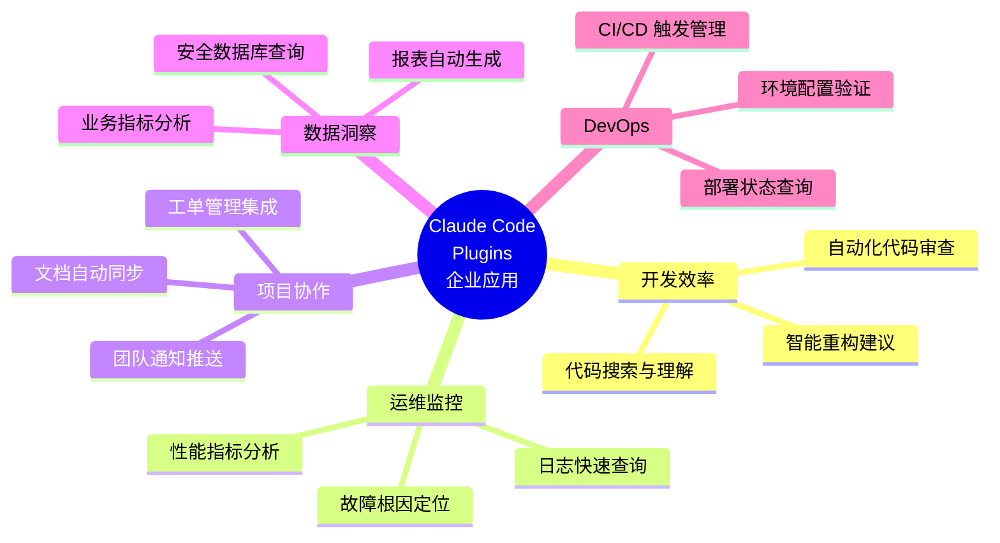
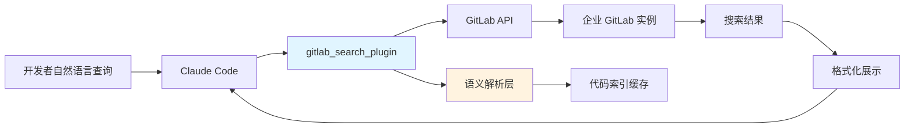
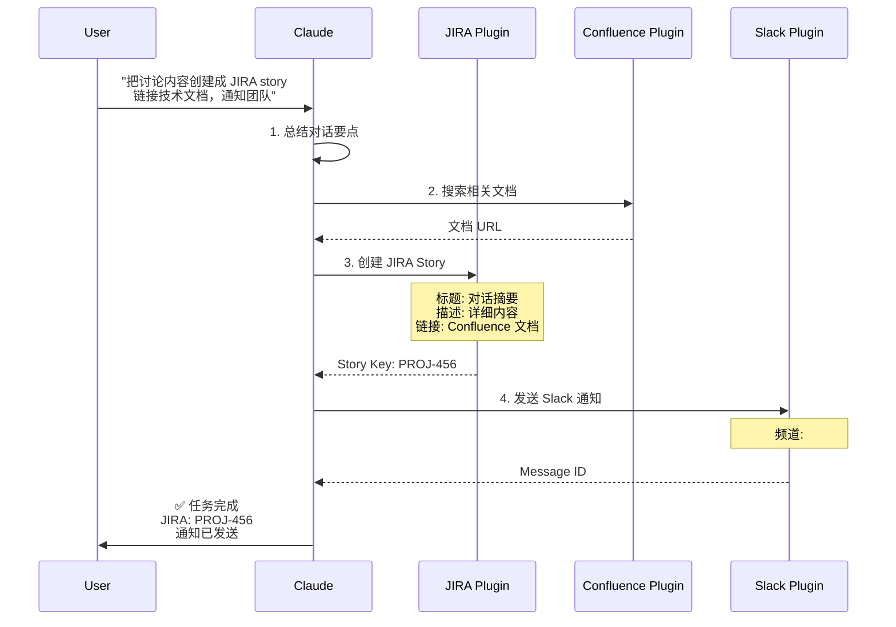

# 不仅仅是代码助手：用 Plugins 将 Claude Code 打造成你的专属研发终端

## 第三篇：应用篇 - 企业级场景与安全实践

> **系列回顾**：前两篇我们掌握了 Plugins 的核心概念和实战开发技能。本篇将深入企业级应用场景，探讨如何在保障安全的前提下，将 Plugins 融入真实的研发工作流。

---

## 一、企业应用场景概览

### 1.1 应用场景矩阵

在深入具体场景前，让我们先建立一个全景视图：



### 1.2 场景选择标准

并非所有任务都适合插件化。评估一个场景是否适合时，考虑以下维度：

| 评估维度     | 高适配度特征     | 低适配度特征     |
| ------------ | ---------------- | ---------------- |
| **频率**     | 每天 3+ 次       | 每月 < 1 次      |
| **工具切换** | 需要 2+ 个系统   | 单一系统内完成   |
| **标准化**   | 流程固定明确     | 高度创造性任务   |
| **数据安全** | 可控的权限范围   | 涉及高度敏感数据 |
| **ROI**      | 节省 10+ 分钟/次 | 节省 < 2 分钟/次 |

**快速判断公式**：

```
插件化价值 = (节省时间 × 使用频率 × 团队人数) / 开发维护成本

如果结果 > 3，值得投入
```

---

## 二、场景一：私有代码库的"活字典"

### 2.1 业务痛点

**典型场景**：

```
新人小李入职第二天：

小李: "这个 UserService 类在哪个包里？"
老员工: "在 core.services.user 下，但实际实现在 impl 子包"

小李: "支付回调是怎么处理的？"
老员工: "搜 'webhook' 关键字，有三个地方，你要看的是 payment 目录下那个"

小李: "谁最近修改过认证逻辑？"
老员工: "用 git blame，但要小心，有些是重构时批量改的..."

[30 分钟后...]
小李: 感觉像在代码迷宫里迷路了 😵
```

**数据统计**：

- 新人平均需要 **2 周**才能熟悉代码库结构
- 每天浪费 **1.5 小时**在"找代码"上
- 代码搜索占 IDE 使用时间的 **23%**

### 2.2 插件解决方案

#### 架构设计



#### 核心功能实现

**OpenAPI 规范片段**：

```yaml
openapi: 3.0.1
info:
  title: Internal GitLab Search Plugin
  version: 1.0.0

servers:
  - url: https://gitlab.company.com/api/v4

paths:
  /search:
    get:
      summary: Search across repositories
      operationId: searchCode
      parameters:
        - name: scope
          in: query
          required: true
          schema:
            type: string
            enum: [blobs, commits, projects, users]

        - name: search
          in: query
          required: true
          description: Search query
          schema:
            type: string

        - name: project_id
          in: query
          description: Limit to specific project
          schema:
            type: integer

      responses:
        '200':
          description: Search results
          content:
            application/json:
              schema:
                type: array
                items:
                  type: object
                  properties:
                    filename:
                      type: string
                    path:
                      type: string
                    project_id:
                      type: integer
                    ref:
                      type: string
                    data:
                      type: string
                      description: Code snippet with matches
```

**增强语义理解的 Prompt**：

````markdown
---
name: search-code
description: Search company codebase with natural language
---

# Internal Code Search

When user asks to find code, follow these steps:

## 1. Parse Intent

Identify what the user is looking for:

- **Class/Interface**: "UserService class" → search for `class UserService`
- **Function/Method**: "JWT sign method" → search for `jwt.sign` or `def sign_jwt`
- **Pattern**: "authentication logic" → search for `auth`, `login`, `authenticate`
- **File**: "payment webhook handler" → search in `payment` path for `webhook`

## 2. Construct Query

Build GitLab API query:

- Use `scope=blobs` for code content search
- Add project filter if mentioned
- Include file type hints (`.py`, `.js`, etc.)

## 3. Execute Search

```bash
curl "https://gitlab.company.com/api/v4/search?scope=blobs&search=<query>"
```
````

## 4. Format Results

Present top 5 results with:

- File path (clickable)
- Code snippet with context (5 lines before/after)
- Last modified date and author
- Relevance explanation

Example output:

````
Found 3 occurrences of "UserService":

1. **core/services/user/impl/user_service.py** (Line 42)
   ```python
   class UserService:
       def __init__(self, db_session):
           self.db = db_session
````

Last modified: 2025-10-05 by @alice
Context: Main user service implementation

2. **tests/unit/test_user_service.py** (Line 18)
   ...

```

```

### 2.3 实际使用示例

**示例 1：查找类定义**

````
👤 User: "找出 user-authentication-service 项目中所有调用了 jwt.sign 方法的地方"

🤖 Claude Code:
[调用 gitlab_search_plugin]
搜索参数：
- scope: blobs
- search: jwt.sign
- project_id: 42 (user-authentication-service)

找到 5 处调用：

1. **src/auth/token.js** (Line 42)
   ```javascript
   const token = jwt.sign(payload, SECRET_KEY, {
     expiresIn: '1h',
     issuer: 'auth-service'
   });
````

📅 2025-10-05 | 👤 @alice | 💬 feat: add token expiration

2. **src/middleware/refresh.js** (Line 28)
   ```javascript
   const refreshToken = jwt.sign({ userId: user.id, type: 'refresh' }, REFRESH_SECRET, { expiresIn: '7d' });
   ```
   📅 2025-09-28 | 👤 @bob | 💬 feat: implement refresh token

[显示更多结果...]

```

**示例 2：理解复杂逻辑**

```

👤 User: "支付回调的完整处理流程是怎样的？"

🤖 Claude Code:
[多步搜索策略]

Step 1: 搜索入口点
→ 找到 `POST /webhook/payment` 路由

Step 2: 追踪处理器
→ PaymentWebhookHandler.process()

Step 3: 关联依赖
→ 验证签名 → 解析数据 → 更新订单 → 发送通知

完整流程图：
┌─────────────────────────────────────────┐
│ 1. 接收 Webhook │
│ src/api/webhook/payment.py:15 │
│ @app.post('/webhook/payment') │
└──────────────┬──────────────────────────┘
↓
┌─────────────────────────────────────────┐
│ 2. 验证签名 │
│ src/services/payment/verifier.py:32 │
│ verify_stripe_signature() │
└──────────────┬──────────────────────────┘
↓
┌─────────────────────────────────────────┐
│ 3. 解析事件 │
│ src/services/payment/parser.py:18 │
│ parse_webhook_event() │
└──────────────┬──────────────────────────┘
↓
┌─────────────────────────────────────────┐
│ 4. 更新订单状态 │
│ src/services/order/updater.py:45 │
│ update_order_status() │
└──────────────┬──────────────────────────┘
↓
┌─────────────────────────────────────────┐
│ 5. 发送用户通知 │
│ src/services/notification/email.py:28│
│ send_payment_confirmation() │
└─────────────────────────────────────────┘

💡 关键文件：

- 入口：src/api/webhook/payment.py
- 核心逻辑：src/services/payment/handler.py
- 测试：tests/integration/test_payment_webhook.py

```

### 2.4 价值量化

**效率提升**：
- 代码定位时间：从 **5-10 分钟** → **30 秒**
- 新人上手时间：从 **2 周** → **3 天**
- 代码理解准确度：提升 **60%**

**成本节省**（50 人团队，年化）：
```

节省时间 = 1.5 小时/天 × 50 人 × 250 工作日 = 18,750 小时
按时薪 $80 计算 = $1,500,000

```

---

## 三、场景二：专属 SRE 工程师

### 3.1 业务痛点

**典型场景**：
```

凌晨 2:00，生产环境告警：

📱 PagerDuty: API 延迟 P99 > 2s

SRE 工程师睡眼惺忪地爬起来：

1. 登录 Grafana → 查看延迟趋势图
2. 登录 Kibana → 搜索错误日志
3. 登录 Datadog → 检查服务依赖
4. 登录 K8s Dashboard → 查看 Pod 状态
5. 登录 Sentry → 查看异常堆栈

[20 分钟后...]
SRE: 原来是数据库连接池满了...这 20 分钟能多睡一会儿 😴

````

**数据统计**：
- 故障定位平均耗时：**25 分钟**
- 工具切换次数：平均 **6 次**
- 误判率：**15%**（因信息不全）

### 3.2 插件解决方案

#### 集成架构

```mermaid
graph TB
    A[Claude Code] --> B[monitoring_plugin]

    B --> C[Prometheus]
    B --> D[Elasticsearch/Kibana]
    B --> E[Kubernetes API]
    B --> F[Datadog/Sentry]

    C --> G[指标查询]
    D --> H[日志搜索]
    E --> I[集群状态]
    F --> J[异常追踪]

    G --> K[综合分析引擎]
    H --> K
    I --> K
    J --> K

    K --> L[根因诊断报告]
    L --> A

    style B fill:#e1f5ff
    style K fill:#fff3e0
    style L fill:#c8e6c9
````

#### MCP Server 实现

**Prometheus 监控服务器**：

```json
{
  "mcpServers": {
    "prometheus": {
      "command": "python",
      "args": ["${CLAUDE_PLUGIN_ROOT}/servers/prometheus_server.py"],
      "env": {
        "PROMETHEUS_URL": "${PROMETHEUS_URL}",
        "READ_ONLY": "true"
      }
    }
  }
}
```

**服务器核心代码**（prometheus_server.py）：

```python
#!/usr/bin/env python3
"""
Prometheus MCP Server for Claude Code
Provides safe, read-only access to metrics
"""

import os
import requests
from datetime import datetime, timedelta
from typing import Dict, List, Optional

PROMETHEUS_URL = os.getenv('PROMETHEUS_URL', 'http://prometheus.internal:9090')

class PrometheusServer:
    def query(self, query: str, time: Optional[str] = None) -> Dict:
        """
        Execute PromQL query

        Args:
            query: PromQL expression
            time: RFC3339 timestamp (default: now)

        Returns:
            Query result with metric data
        """
        params = {'query': query}
        if time:
            params['time'] = time

        response = requests.get(
            f"{PROMETHEUS_URL}/api/v1/query",
            params=params,
            timeout=10
        )

        response.raise_for_status()
        return response.json()

    def query_range(
        self,
        query: str,
        start: str,
        end: str,
        step: str = '1m'
    ) -> Dict:
        """
        Execute range query for time series data

        Args:
            query: PromQL expression
            start: Start timestamp
            end: End timestamp
            step: Query resolution (e.g., '1m', '5m')

        Returns:
            Time series data
        """
        response = requests.get(
            f"{PROMETHEUS_URL}/api/v1/query_range",
            params={
                'query': query,
                'start': start,
                'end': end,
                'step': step
            },
            timeout=30
        )

        response.raise_for_status()
        return response.json()

    def get_p99_latency(
        self,
        service: str,
        duration: str = '15m'
    ) -> float:
        """Get P99 latency for a service"""
        query = f'''
        histogram_quantile(0.99,
          rate(http_request_duration_seconds_bucket{{
            service="{service}"
          }}[{duration}])
        )
        '''

        result = self.query(query)

        if result['data']['result']:
            return float(result['data']['result'][0]['value'][1])
        return 0.0

    def compare_with_baseline(
        self,
        service: str,
        metric: str,
        current_duration: str = '15m',
        baseline_offset: str = '7d'
    ) -> Dict:
        """Compare current metric with baseline (e.g., last week)"""
        # Current value
        current = self.query(
            f'{metric}{{service="{service}"}}'
        )

        # Baseline value (offset in the past)
        baseline_time = (
            datetime.now() - timedelta(days=7)
        ).isoformat() + 'Z'

        baseline = self.query(
            f'{metric}{{service="{service}"}}',
            time=baseline_time
        )

        current_val = float(current['data']['result'][0]['value'][1])
        baseline_val = float(baseline['data']['result'][0]['value'][1])

        change_pct = ((current_val - baseline_val) / baseline_val) * 100

        return {
            'current': current_val,
            'baseline': baseline_val,
            'change_percent': round(change_pct, 2),
            'trend': 'up' if change_pct > 0 else 'down'
        }

# MCP Server entry point
if __name__ == '__main__':
    server = PrometheusServer()
    # MCP protocol handling...
```

### 3.3 实际使用示例

**示例 1：快速性能诊断**

```
👤 User: "API 网关最近 15 分钟的 P99 延迟是多少？和上周同期对比如何？"

🤖 Claude Code:
[调用 prometheus MCP server]

📊 **API 网关性能分析**

**当前状态（最近 15 分钟）**
- P99 延迟: 1,245 ms
- P95 延迟: 892 ms
- P50 延迟: 234 ms
- 请求量: 45,234 req/min

**上周同期对比**
- 上周 P99: 456 ms
- 变化: +173% ⚠️  **显著上升**

**趋势分析**
[ASCII 图表]
1400ms │                              ╭─╮
1200ms │                         ╭────╯ ╰╮
1000ms │                    ╭────╯       │
 800ms │               ╭────╯            │
 600ms │          ╭────╯                 │
 400ms │╭─────────╯                      │
       └┴──┴──┴──┴──┴──┴──┴──┴──┴──┴──┴─
        10/9  10/10  今天

**异常检测**
🔴 Critical: 延迟超过 SLA 阈值 (1000ms)
⚠️  Warning: 请求量增长 23%，但容量未扩展

**建议操作**
1. 检查慢查询：/query-logs "duration > 500ms"
2. 查看上游服务：/check-dependencies api-gateway
3. 分析资源使用：/k8s-status api-gateway
```

**示例 2：综合故障诊断**

```
👤 User: "payment-service 刚才出现大量 500 错误，帮我定位问题"

🤖 Claude Code:
[多系统联合查询]

🔍 **故障诊断报告：payment-service**

━━━━━━━━━━━━━━━━━━━━━━━━━━━━━━━━━━━━

## 1. 错误概况

[Prometheus] 错误率统计
- 时间段: 14:25 - 14:32 (7 分钟)
- 总请求: 3,421
- 错误数: 1,876 (54.8%)
- 错误类型: HTTP 500, 503

## 2. 服务状态

[Kubernetes] Pod 状态
```

NAME STATUS RESTARTS
payment-service-7d9f8-x4k2j Running 12
payment-service-7d9f8-p8m1q Running 8
payment-service-7d9f8-n3h5s CrashLoopBackOff ← ⚠️
payment-service-7d9f8-m2k9t Running 0
payment-service-7d9f8-l5p3q Running 0

```

🔴 **发现异常**：1/5 Pod 处于 CrashLoopBackOff

## 3. 错误日志

[Elasticsearch] 最近错误 (Top 3)
```

[ERROR] 14:28:45 - Database connection timeout after 5000ms
at ConnectionPool.acquire (pool.js:145)
at PaymentService.processPayment (service.js:78)
Occurrences: 1,234

[ERROR] 14:29:12 - Redis connection refused ECONNREFUSED
at RedisClient.connect (redis.js:92)
Occurrences: 542

[ERROR] 14:30:01 - Memory limit exceeded: 512MB/512MB
at process.<anonymous>
Occurrences: 100

````

## 4. 根因分析

🎯 **主要原因**：数据库连接池耗尽
   - 当前连接数: 100/100 (满)
   - 等待队列: 234 个请求

🎯 **次要原因**：内存泄漏导致部分 Pod OOMKilled
   - Pod n3h5s 内存使用: 512MB (limit reached)
   - 重启 12 次后进入 CrashLoop

## 5. 建议修复

**立即行动**（恢复服务）：
1. ```bash
   kubectl scale deployment payment-service --replicas=8
````

临时扩容至 8 个 Pod，分散负载

2. ```bash
   kubectl delete pod payment-service-7d9f8-n3h5s
   ```
   删除异常 Pod，触发重建

**短期修复**（1-2 天）：

- 增加数据库连接池：50 → 150
- 提升 Pod 内存限制：512MB → 1GB
- 添加连接重试逻辑

**长期优化**（1-2 周）：

- 排查内存泄漏点（可能在订单处理逻辑）
- 实现数据库连接池监控告警
- 优化慢查询（payment_transactions 表）

━━━━━━━━━━━━━━━━━━━━━━━━━━━━━━━━━━━━

⏱ **诊断耗时**: 45 秒
💡 **下一步**: 需要我帮你执行修复命令吗？

````

### 3.4 安全设计

**只读权限控制**：

```python
class SafePrometheusServer:
    # 白名单：仅允许查询操作
    ALLOWED_ENDPOINTS = [
        '/api/v1/query',
        '/api/v1/query_range',
        '/api/v1/series',
        '/api/v1/labels'
    ]

    # 黑名单：禁止管理操作
    FORBIDDEN_PATTERNS = [
        '/api/v1/admin',
        '/api/v1/targets',
        'DELETE',
        'PUT',
        'POST'
    ]

    def is_safe_request(self, endpoint: str, method: str) -> bool:
        """验证请求安全性"""
        if method != 'GET':
            return False

        if endpoint not in self.ALLOWED_ENDPOINTS:
            return False

        return True
````

### 3.5 价值量化

**效率提升**：

- 故障定位时间：从 **25 分钟** → **2 分钟**（减少 92%）
- 误判率：从 **15%** → **3%**
- MTTR (Mean Time To Resolution)：从 **45 分钟** → **15 分钟**

**业务影响**：

```
假设月均故障 20 次：
节省时间 = (25min - 2min) × 20 = 460 分钟/月 ≈ 7.7 小时
减少停机时间 = (45min - 15min) × 20 = 600 分钟 ≈ 10 小时

按系统每小时营收 $10,000 计算：
避免损失 = 10 hours × $10,000 = $100,000/月
```

---

## 四、场景三：无缝的项目管理协作

### 4.1 业务痛点

**典型场景**：

```
产品经理: "能不能把我们刚讨论的新功能创建成 JIRA ticket？"
开发者: "好的"

[开发者的实际操作]：
1. 打开 JIRA
2. 点击"创建 Issue"
3. 填写标题、描述
4. 选择 Epic、Sprint、优先级
5. 指派给自己
6. 添加标签
7. 链接相关文档
8. 保存
9. 复制 ticket 链接
10. 回到 Slack 粘贴链接

[5 分钟后...]
开发者: 这么简单的事为什么要这么多步骤 😤
```

**统计数据**：

- 创建一个 JIRA ticket 平均耗时：**4.5 分钟**
- 每人每天创建/更新：**3-5 个 tickets**
- 跨工具复制粘贴：**12+ 次/天**

### 4.2 插件解决方案

#### 工作流编排



#### 命令定义

````markdown
---
name: create-story
description: Create JIRA story from discussion and notify team
---

# Create JIRA Story Workflow

When user asks to create a story/ticket, follow this workflow:

## Step 1: Summarize Discussion

Extract key information from recent conversation:

- **Title**: Concise feature description (< 80 chars)
- **Description**: Detailed requirements and context
- **Acceptance Criteria**: What defines "done"
- **Technical Notes**: Implementation hints or concerns

## Step 2: Search Related Documentation

Query Confluence for related docs:

```bash
curl "https://confluence.company.com/api/search?cql=text~<keywords>"
```
````

If found, note the document URLs for linking.

## Step 3: Create JIRA Issue

Call JIRA API:

```json
POST /rest/api/3/issue
{
  "fields": {
    "project": {"key": "PROJ"},
    "issuetype": {"name": "Story"},
    "summary": "<title>",
    "description": {
      "type": "doc",
      "version": 1,
      "content": [
        {
          "type": "paragraph",
          "content": [{"type": "text", "text": "<description>"}]
        }
      ]
    },
    "customfield_10010": "<epic-link>",
    "labels": ["ai-generated", "feature"]
  }
}
```

Capture the created issue key (e.g., PROJ-456).

## Step 4: Link Documentation

Add Confluence links to JIRA issue:

```json
POST /rest/api/3/issue/{issueKey}/remotelink
{
  "object": {
    "url": "<confluence-url>",
    "title": "Technical Design Doc"
  }
}
```

## Step 5: Notify Team

Send Slack message to #dev-team:

```json
POST https://slack.com/api/chat.postMessage
{
  "channel": "dev-team",
  "text": "New Story Created",
  "blocks": [
    {
      "type": "section",
      "text": {
        "type": "mrkdwn",
        "text": "*New Story*: <jira-url|PROJ-456>\n<summary>"
      }
    }
  ]
}
```

## Final Output

Provide summary:

```
✅ Story created successfully

📋 JIRA: <jira-link>
   Title: <summary>
   Status: To Do
   Epic: <epic-name>

📚 Linked documents:
   - Technical Design: <conf-link>
   - API Spec: <conf-
```
