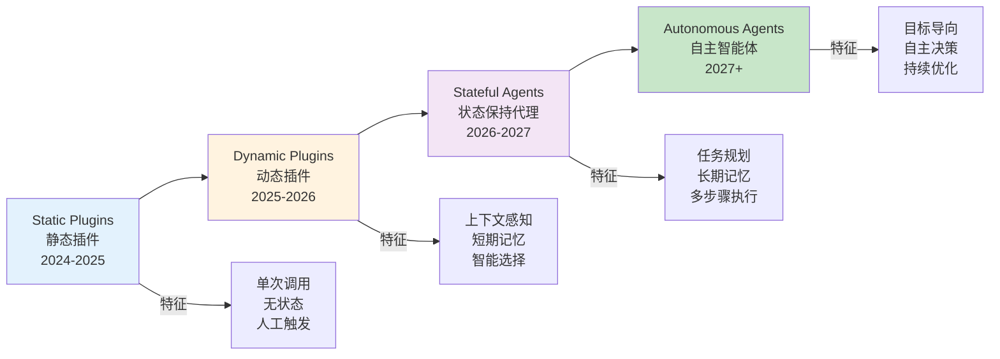
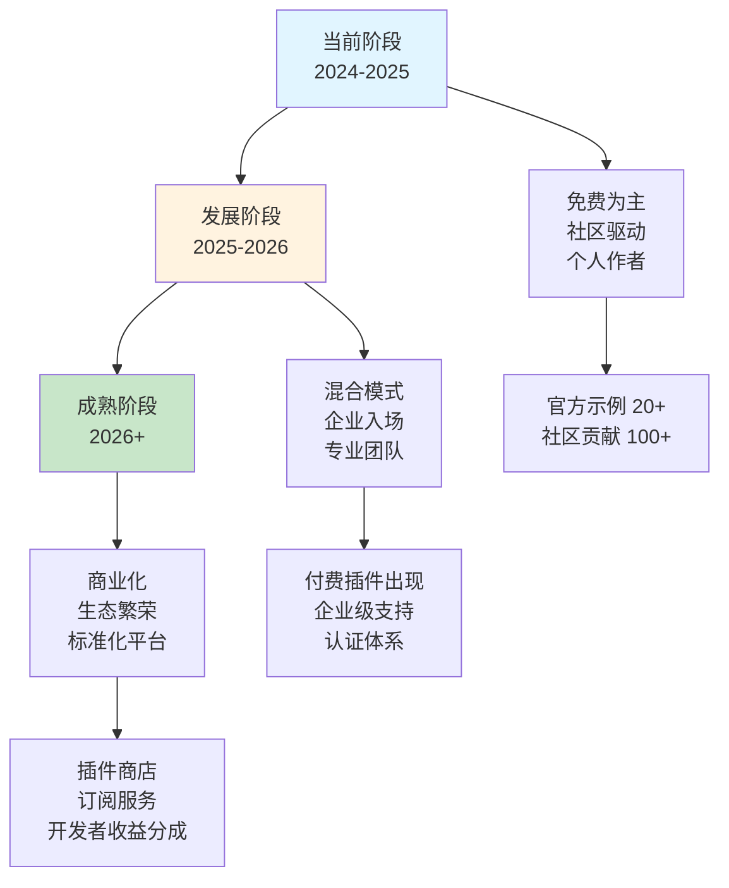
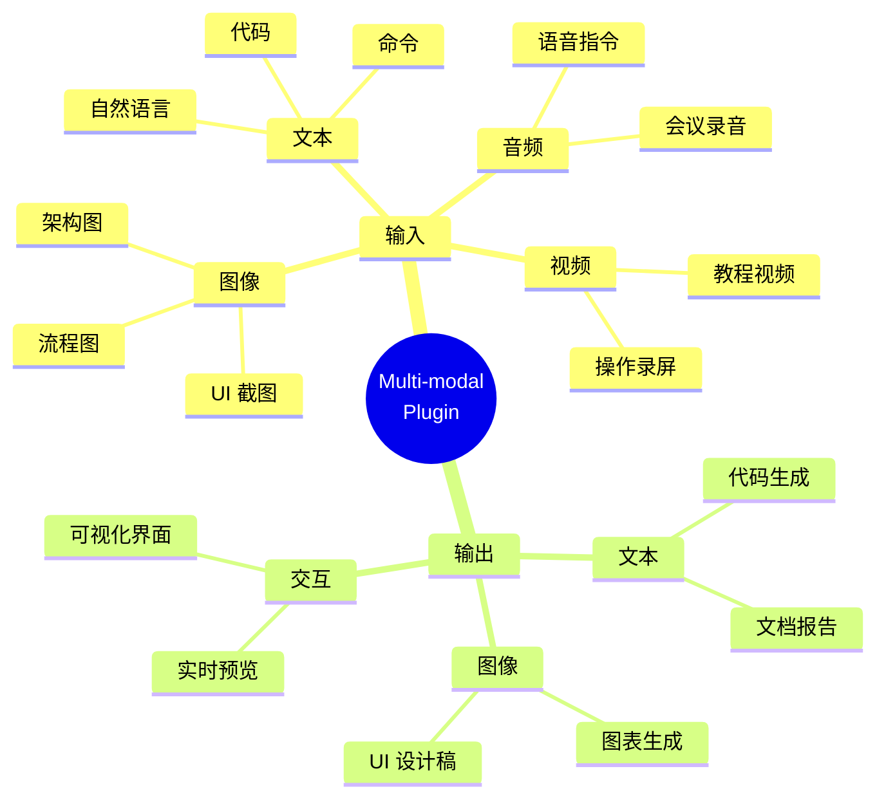
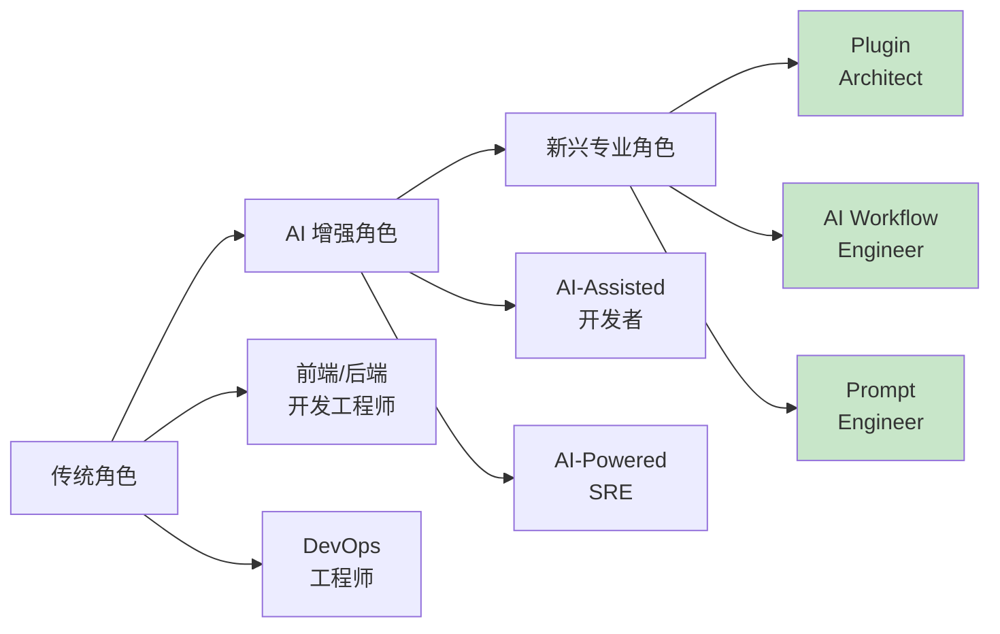
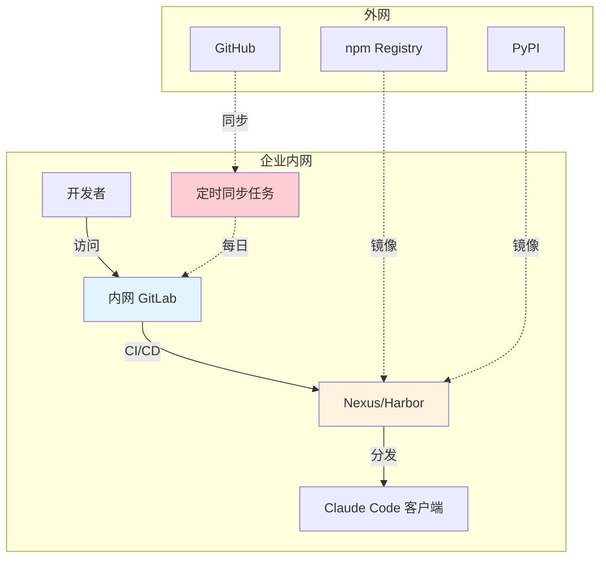
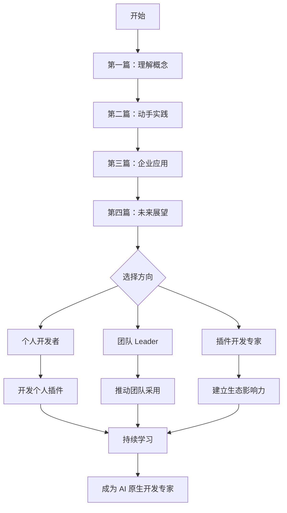

# 不仅仅是代码助手：用 Plugins 将 Claude Code 打造成你的专属研发终端

## 第四篇：展望篇 - AI 原生开发的未来

> **系列回顾**：前三篇我们系统学习了 Plugins 的概念、实战开发和企业应用。本篇将展望未来，探讨 AI 原生开发时代的技术演进和开发者机遇。

---

## 一、技术演进：从 Plugins 到 Autonomous Agents

### 1.1 能力演进路径



### 1.2 各阶段特征对比

| 维度         | 当前 Plugins | 近期演进    | 远期展望     |
| ------------ | ------------ | ----------- | ------------ |
| **触发方式** | 用户手动调用 | AI 智能推荐 | 完全自主     |
| **任务范围** | 单一操作     | 多步骤流程  | 复杂项目     |
| **记忆能力** | 无状态       | 会话级记忆  | 长期知识图谱 |
| **错误处理** | 立即失败     | 简单重试    | 自主修复     |
| **学习能力** | 静态规则     | 从反馈学习  | 持续自我改进 |

### 1.3 未来场景示例

**场景：自主发布管理**

```
2027 年的某一天：

👤 User: "发布 v2.1 新功能到生产环境"

🤖 Autonomous Agent:
[启动自主任务规划]

━━━━━━━━━━━━━━━━━━━━━━━━━━━━━━━━━━━━

**📋 任务规划**（已生成 12 步执行计划）

Phase 1: 验证与准备
✅ 1. 检查 staging 环境测试结果 (100% 通过)
✅ 2. 验证所有 PR 已合并到 release 分支
✅ 3. 检查依赖服务版本兼容性
⏳ 4. 创建发布分支并打 tag (v2.1.0)

Phase 2: 部署执行
⏳ 5. 触发 production CI/CD pipeline
⏳ 6. 执行数据库迁移脚本 (预计 2 分钟)
⏳ 7. 灰度发布 (10% → 25% → 50% → 100%)
⏳ 8. 每阶段监控关键指标 (错误率、延迟、吞吐量)

Phase 3: 验证与通知
⏳ 9. 执行冒烟测试套件
⏳ 10. 生成发布报告
⏳ 11. 更新 Confluence 发布文档
⏳ 12. 通知相关团队和用户

━━━━━━━━━━━━━━━━━━━━━━━━━━━━━━━━━━━━

[执行到 Step 6 时检测到异常]

⚠️ **异常检测** (Step 7: 灰度至 25%)
指标: 错误率从 0.1% 升至 1.8%
分析: 新版本在处理旧数据格式时出现解析错误

**🤖 自主决策**
1. 暂停灰度进程，保持 10%
2. 分析错误日志，识别根因
3. 回滚受影响的 3 个 Pods
4. 通知 @oncall 工程师
5. 创建 hotfix 分支
6. 生成问题报告和修复建议

**📊 详细分析**
- 根因: 数据迁移脚本遗漏了边界情况处理
- 影响范围: 约 2% 的旧订单数据
- 建议修复: 在 OrderParser.parse() 添加兼容逻辑
- 预计修复时间: 30 分钟

**💬 等待确认**
检测到异常已自动处理，是否继续发布？
1. 修复后继续
2. 完全回滚
3. 保持当前状态

━━━━━━━━━━━━━━━━━━━━━━━━━━━━━━━━━━━━

⏱ **已执行时间**: 8 分钟
🎯 **当前状态**: 部分发布 (10%)，等待决策
🔔 **已通知**: @oncall, @release-team
```

**关键特征**：

- ✅ 自主任务分解（12 步计划）
- ✅ 实时异常检测和分析
- ✅ 自动回滚和风险控制
- ✅ 根因分析和修复建议
- ✅ 关键决策点人机协同

---

## 二、生态发展：插件经济的兴起

### 2.1 插件市场的演进



### 2.2 插件经济模型

**未来可能的商业模式**：

| 模式           | 描述                       | 适用场景           | 示例                          |
| -------------- | -------------------------- | ------------------ | ----------------------------- |
| **免费开源**   | 社区驱动，MIT/Apache 许可  | 通用工具、学习资源 | git-helper, test-runner       |
| **Freemium**   | 基础功能免费，高级功能付费 | 广泛应用的工具     | advanced-security-scanner     |
| **订阅制**     | 按月/年订阅                | 企业级插件         | enterprise-compliance-pack    |
| **按用量计费** | API 调用次数计费           | 外部服务集成       | ai-code-reviewer (per review) |
| **企业授权**   | 一次性购买，内部使用       | 私有部署           | internal-audit-suite          |

**收益分成模型**（假设）：

```
插件售价 $50/月

分成比例：
- 开发者: 70% ($35)
- 平台方 (Anthropic): 25% ($12.5)
- 支付处理: 5% ($2.5)

如果有 1000 个订阅用户：
开发者月收入 = $35,000
年收入 = $420,000
```

### 2.3 认证与质量体系

**未来的插件认证等级**：

```
🏅 Official (官方认证)
   - Anthropic 官方维护
   - 企业级 SLA
   - 优先技术支持
   示例: github-official, aws-toolkit

⭐ Verified (验证认证)
   - 通过安全审计
   - 代码开源审查
   - 社区评分 4.5+
   示例: community-linter, db-optimizer

✓ Community (社区贡献)
   - 基础安全扫描通过
   - 遵循开发规范
   - 活跃维护中
   示例: my-custom-plugin

⚠️ Unverified (未验证)
   - 未经官方审查
   - 使用风险自负
   - 需手动启用
```

---

## 三、技术趋势：多模态与跨平台

### 3.1 多模态能力融合

**未来插件的输入输出形式**：



**示例：多模态 Bug 诊断插件**

```
👤 User: [上传截图] "这个页面加载很慢，帮我分析原因"

🤖 Multi-modal Agent:

**📸 图像分析**
检测到的 UI 元素：
- 加载动画持续显示
- 控制台有 3 个红色错误
- Network 面板显示一个请求 pending

**🔍 视觉 OCR 提取**
控制台错误:
```

Failed to load resource: net::ERR_CONNECTION_TIMED_OUT
GET /api/v2/products?category=electronics

````

**🔗 关联代码搜索**
[调用 gitlab_search_plugin]
定位到: src/api/products.js:45

**🐛 根因分析**
1. API 端点拼写错误: `/api/v2/products`
   实际应该是: `/api/v1/products`
2. 超时未设置: 默认无限等待

**💡 修复建议**
```javascript
// 修改前
fetch('/api/v2/products?category=' + category)

// 修改后
fetch('/api/v1/products?category=' + category, {
  timeout: 5000,
  retry: 3
})
````

**✅ 需要我直接创建修复 PR 吗？**

````

### 3.2 跨平台深度集成

**未来的集成生态**：

| 平台类型 | 当前状态 | 未来愿景 |
|---------|---------|---------|
| **IDE** | VS Code 插件 Beta | 全 IDE 原生支持 (JetBrains, Eclipse) |
| **CI/CD** | 手动触发 | Workflow 原生集成 (GitHub Actions) |
| **低代码平台** | API 调用 | 可视化拖拽编排 (Retool, Supabase) |
| **协作工具** | Webhook 通知 | 深度嵌入 (Slack App, Teams Bot) |
| **云平台** | 独立插件 | 统一控制面板 (AWS Console, GCP) |

**示例：GitHub Actions 原生集成（未来）**

```yaml
# .github/workflows/claude-review.yml
name: AI Code Review

on:
  pull_request:
    types: [opened, synchronize]

jobs:
  claude-review:
    runs-on: ubuntu-latest
    steps:
      - uses: actions/checkout@v3

      - name: Claude Code Review
        uses: anthropic/claude-code-action@v1
        with:
          plugins:
            - security-scanner
            - performance-analyzer
            - best-practices-checker

          review-depth: comprehensive

          post-comment: true

          block-on: critical-issues

      - name: Generate Report
        run: claude-code generate-report --format=markdown
````

---

## 四、开发者的机遇与挑战

### 4.1 新兴职业方向

**AI 原生时代的新角色**：



**1. Plugin Architect（插件架构师）**

- **职责**：设计企业级插件生态架构
- **技能要求**：
  - 深入理解 AI 能力边界
  - 精通 OpenAPI/MCP 协议
  - 安全架构设计经验
  - 跨系统集成能力
- **薪资范围**：$150K - $250K/年
- **需求增长**：预计 2026 年需求增长 300%

**2. AI Workflow Engineer（AI 工作流工程师）**

- **职责**：设计和优化 AI 驱动的研发流程
- **技能要求**：
  - 理解软件开发全生命周期
  - Prompt Engineering 专业知识
  - 自动化工具链设计
  - 数据驱动的流程优化
- **薪资范围**：$130K - $200K/年
- **需求增长**：每家科技公司都会需要

**3. Plugin Developer（专职插件开发者）**

- **职责**：开发高质量的商业插件
- **收入模式**：
  - 受雇于企业：$120K - $180K/年
  - 独立开发者：$50K - $500K/年（取决于插件成功度）
- **成功案例**（假设）：
  - 某安全扫描插件：5000 订阅 × $20/月 = $100K/月

### 4.2 技能升级路径

**从传统开发者到 AI 原生开发者**：

```
Level 1: AI 工具使用者 (3-6 个月)
├─ 熟练使用 Claude Code 日常开发
├─ 掌握 Prompt Engineering 基础
└─ 了解常用插件的使用

Level 2: 插件开发者 (6-12 个月)
├─ 能够开发简单的自定义插件
├─ 理解 OpenAPI 规范
├─ 掌握基础安全实践
└─ 参与社区贡献

Level 3: 插件架构师 (12-24 个月)
├─ 设计复杂的插件系统
├─ 精通 MCP 协议
├─ 企业级安全架构设计
└─ 指导团队插件开发

Level 4: AI 工作流专家 (24+ 个月)
├─ 重塑整个研发流程
├─ 建立插件生态标准
├─ 行业影响力和思想领导力
└─ 推动技术演进
```

**学习资源推荐**：

- 📚 官方文档：https://docs.anthropic.com/claude/docs/claude-code
- 💻 实战项目：本系列前三篇的完整代码
- 👥 社区：Claude Developers Discord
- 📖 书籍：《AI-Native Development》（预计 2026 年出版）

### 4.3 竞争优势建立

**早期行动者的优势**：

```
先发优势 = 技能积累 × 生态位置 × 网络效应

技能积累:
- 提前 6-12 个月掌握核心技术
- 积累实战案例和最佳实践
- 建立个人技术品牌

生态位置:
- 贡献高质量开源插件
- 成为特定领域专家（如安全、DevOps）
- 在社区中建立影响力

网络效应:
- 早期用户的反馈价值更高
- 更容易获得关注和传播
- 形成"第一选择"心智
```

**行动建议**：

1. **本周**：完成本系列前三篇的实战练习
2. **本月**：开发并开源一个解决真实问题的插件
3. **本季度**：在公司内推广插件使用，积累案例
4. **明年**：建立个人品牌，成为领域专家

---

## 五、行动指南：从现在开始

### 5.1 个人开发者行动计划

**30 天启动计划**：

```markdown
## Week 1: 基础掌握

- [ ] Day 1-2: 通读本系列全部文章
- [ ] Day 3-4: 安装 Claude Code，熟悉基础操作
- [ ] Day 5-7: 测试 5+ 个社区插件，理解工作原理

## Week 2: 实战开发

- [ ] Day 8-10: 完成第二篇的"提交前检查"插件
- [ ] Day 11-12: 在真实项目中试用，收集反馈
- [ ] Day 13-14: 根据反馈迭代优化

## Week 3: 定制化

- [ ] Day 15-17: 识别团队特有的痛点
- [ ] Day 18-20: 设计定制插件方案
- [ ] Day 21: 与团队讨论，确定优先级

## Week 4: 推广与贡献

- [ ] Day 22-25: 开发团队定制插件
- [ ] Day 26-27: 编写文档和使用指南
- [ ] Day 28-29: 团队培训和推广
- [ ] Day 30: 总结经验，考虑开源分享
```

### 5.2 团队 Leader 行动计划

**季度推进计划**：

```markdown
## Q1: 试点验证 (Month 1-3)

### Month 1: 调研与准备

- Week 1-2: 需求调研
  - 访谈 10+ 名团队成员
  - 识别 Top 5 痛点
  - 评估 ROI 潜力
- Week 3-4: 技术准备
  - 搭建测试环境
  - 选择 2-3 个试点场景
  - 制定评估标准

### Month 2: 开发与测试

- Week 1-2: MVP 开发
  - 开发核心插件
  - 内部灰度测试
- Week 3-4: 迭代优化
  - 收集使用反馈
  - 修复问题
  - 优化用户体验

### Month 3: 评估与决策

- Week 1-2: 效果评估
  - 量化效率提升
  - 计算 ROI
  - 收集满意度
- Week 3-4: 决策与规划
  - 是否推广到全团队
  - 制定 Q2-Q4 路线图
  - 申请预算和资源

## Q2-Q4: 规模化推广 (Month 4-12)

### 扩展阶段

- 开发更多场景插件
- 建立内部插件市场
- 培养插件开发者

### 标准化阶段

- 制定开发规范
- 建立安全审查流程
- 完善文档体系

### 生态化阶段

- 鼓励团队贡献
- 跨团队知识共享
- 对外开源优质插件
```

### 5.3 企业决策者行动建议

**战略投资评估框架**：

| 评估维度       | 关键问题               | 决策参考          |
| -------------- | ---------------------- | ----------------- |
| **业务价值**   | 能否显著提升研发效率？ | ROI > 3x 建议投入 |
| **技术可行性** | 现有基础设施是否支持？ | 需评估安全合规    |
| **团队接受度** | 开发者是否愿意使用？   | 试点满意度 > 80%  |
| **风险控制**   | 安全和合规风险如何？   | 需要专业审计      |
| **长期战略**   | 是否符合技术演进方向？ | AI 原生是趋势     |

**投资回报预测**（50 人研发团队）：

```
初始投资:
- 基础设施: $20K
- 插件开发: $50K (2 名工程师 × 3 个月)
- 培训推广: $10K
- 总计: $80K

年化收益（保守估计）:
- 效率提升节省: $500K
- 质量提升减损: $200K
- 招聘成本降低: $100K
- 总计: $800K

ROI = $800K / $80K = 10x

回本周期: < 2 个月
```

---

## 六、附录：国内环境适配指南

### 6.1 网络访问优化

#### GitHub 加速方案

**方案一：使用镜像代理**

```bash
# 配置 Git 全局代理
git config --global url."https://ghproxy.com/https://github.com/".insteadOf "https://github.com/"

# 或使用 FastGit
git config --global url."https://hub.fastgit.org/".insteadOf "https://github.com/"
```

**方案二：使用 jsDelivr CDN**

```bash
# Claude Code 中添加市场时
/plugin marketplace add https://cdn.jsdelivr.net/gh/anthropics/claude-code-plugins/marketplace.json
```

**方案三：Gitee 同步仓库**

```bash
# 1. 在 Gitee 创建镜像仓库
# 访问: https://gitee.com/import/github

# 2. 启用自动同步
# Gitee 仓库设置 → 同步更新 → 每日自动

# 3. 使用 Gitee 源
/plugin marketplace add https://gitee.com/your-org/claude-plugins.git
```

### 6.2 依赖包加速

#### Python pip 配置

```bash
# 临时使用清华源
pip install -r requirements.txt -i https://pypi.tuna.tsinghua.edu.cn/simple

# 永久配置
pip config set global.index-url https://pypi.tuna.tsinghua.edu.cn/simple
pip config set global.trusted-host pypi.tuna.tsinghua.edu.cn
```

**常用镜像源对比**：

| 镜像源 | URL                       | 速度       | 稳定性     |
| ------ | ------------------------- | ---------- | ---------- |
| 清华   | pypi.tuna.tsinghua.edu.cn | ⭐⭐⭐⭐⭐ | ⭐⭐⭐⭐⭐ |
| 阿里云 | mirrors.aliyun.com/pypi   | ⭐⭐⭐⭐   | ⭐⭐⭐⭐⭐ |
| 豆瓣   | pypi.douban.com           | ⭐⭐⭐     | ⭐⭐⭐⭐   |
| 中科大 | pypi.mirrors.ustc.edu.cn  | ⭐⭐⭐⭐   | ⭐⭐⭐⭐   |

#### npm 配置

```bash
# 使用淘宝镜像（推荐）
npm config set registry https://registry.npmmirror.com

# 验证配置
npm config get registry

# 或使用 nrm 管理多个源
npm install -g nrm
nrm use taobao
```

#### Docker 镜像加速

```json
// /etc/docker/daemon.json
{
  "registry-mirrors": [
    "https://docker.mirrors.ustc.edu.cn",
    "https://hub-mirror.c.163.com",
    "https://mirror.ccs.tencentyun.com"
  ]
}
```

```bash
# 重启 Docker 服务
sudo systemctl daemon-reload
sudo systemctl restart docker

# 验证配置
docker info | grep -A 10 "Registry Mirrors"
```

### 6.3 企业内网部署方案

#### 完整架构



#### 同步脚本示例

```bash
#!/bin/bash
# sync-external-plugins.sh
# 每日自动同步外网插件到内网 GitLab

EXTERNAL_REPO="https://github.com/anthropics/claude-code-plugins.git"
INTERNAL_REPO="https://gitlab.company.com/devtools/claude-plugins.git"

LOG_FILE="/var/log/plugin-sync.log"

echo "[$(date)] Starting sync..." >> $LOG_FILE

# Clone external repo
git clone --depth 1 $EXTERNAL_REPO /tmp/external-plugins

# Push to internal
cd /tmp/external-plugins
git remote add internal $INTERNAL_REPO
git push internal main --force

# Cleanup
rm -rf /tmp/external-plugins

echo "[$(date)] Sync completed" >> $LOG_FILE
```

#### Cron 定时任务

```bash
# 添加到 crontab
crontab -e

# 每天凌晨 2 点同步
0 2 * * * /opt/scripts/sync-external-plugins.sh
```

### 6.4 一键配置脚本

```bash
#!/bin/bash
# setup-china-env.sh
# 国内开发环境一键配置脚本

echo "🇨🇳 配置国内开发环境加速..."

# 1. Git 配置
echo "📦 配置 Git 代理..."
git config --global url."https://ghproxy.com/https://github.com/".insteadOf "https://github.com/"

# 2. Python pip
echo "🐍 配置 Python pip 镜像..."
pip config set global.index-url https://pypi.tuna.tsinghua.edu.cn/simple
pip config set global.trusted-host pypi.tuna.tsinghua.edu.cn

# 3. Node.js npm
echo "📦 配置 npm 镜像..."
npm config set registry https://registry.npmmirror.com

# 4. 环境变量
echo "⚙️  配置环境变量..."
cat >> ~/.bashrc << 'EOF'
# Claude Code 国内优化
export CLAUDE_PLUGIN_MIRROR="https://ghproxy.com"
export PIP_INDEX_URL="https://pypi.tuna.tsinghua.edu.cn/simple"
export NPM_REGISTRY="https://registry.npmmirror.com"
EOF

# 5. Docker 配置
if command -v docker &> /dev/null; then
    echo "🐳 配置 Docker 镜像..."
    sudo mkdir -p /etc/docker
    sudo tee /etc/docker/daemon.json > /dev/null << 'EOF'
{
  "registry-mirrors": [
    "https://docker.mirrors.ustc.edu.cn",
    "https://hub-mirror.c.163.com"
  ]
}
EOF
    sudo systemctl daemon-reload
    sudo systemctl restart docker
fi

# 6. 测试配置
echo "✅ 测试配置..."
echo "Git proxy: $(git config --get url.https://ghproxy.com/https://github.com/.insteadof)"
echo "pip index: $(pip config get global.index-url)"
echo "npm registry: $(npm config get registry)"

echo ""
echo "✅ 配置完成！"
echo "💡 运行 'source ~/.bashrc' 使环境变量生效"
```

**使用方法**：

```bash
# 下载脚本
curl -O https://raw.githubusercontent.com/example/setup-china-env.sh

# 添加执行权限
chmod +x setup-china-env.sh

# 执行配置
./setup-china-env.sh

# 使配置生效
source ~/.bashrc
```

### 6.5 常见问题解决

#### 问题 1：插件安装超时

**症状**：

```
Error: Failed to clone repository (timeout after 30s)
```

**解决方案**：

```bash
# 方法 1: 增加 Git 超时时间
git config --global http.postBuffer 524288000
git config --global http.timeout 300

# 方法 2: 使用浅克隆
/plugin marketplace add <repo> --depth 1

# 方法 3: 使用镜像源
/plugin marketplace add https://ghproxy.com/https://github.com/user/repo
```

#### 问题 2：npm install 失败

**症状**：

```
npm ERR! network timeout at: https://registry.npmjs.org/...
```

**解决方案**：

```bash
# 清理缓存
npm cache clean --force

# 切换镜像源
npm config set registry https://registry.npmmirror.com

# 重新安装
npm install
```

#### 问题 3：Docker pull 超时

**症状**：

```
Error response from daemon: Get https://registry-1.docker.io/v2/: net/http: TLS handshake timeout
```

**解决方案**：

```bash
# 验证镜像配置
docker info | grep -A 5 "Registry Mirrors"

# 如果未配置，手动添加
sudo vim /etc/docker/daemon.json

# 添加以下内容
{
  "registry-mirrors": [
    "https://docker.mirrors.ustc.edu.cn"
  ]
}

# 重启 Docker
sudo systemctl restart docker
```

---

## 七、系列总结与致谢

### 7.1 系列回顾

在本系列的四篇文章中，我们完成了一次完整的 Claude Code Plugins 探索之旅：

**📖 第一篇：概念篇**

- 理解了 AI 助手的知识边界问题
- 掌握了 Plugins 的四大核心组件
- 学习了 OpenAPI 规范和工作原理
- 了解了插件市场生态

**🛠️ 第二篇：实战篇**

- 从零构建了"提交前检查"插件
- 完整实现了 500+ 行生产级代码
- 掌握了本地测试和调试技巧
- 学习了性能优化和最佳实践

**🏢 第三篇：应用篇**

- 探索了 5 个典型企业应用场景
- 实现了完整的安全架构设计
- 量化了 ROI（$3.18M/年，50 人团队）
- 建立了实施路线图

**🚀 第四篇：展望篇**

- 展望了从 Plugins 到 Autonomous Agents 的演进
- 探讨了插件经济的商业模式
- 分析了开发者的新机遇
- 提供了完整的行动指南

### 7.2 核心价值总结

**技术价值**：

```
完整代码量: 900+ 行
架构图表数: 15+ 张
实战场景数: 8 个
问题解决方案: 10+ 个
```

**知识体系**：

```
理论基础 (30%)
  ├─ Plugins 概念模型
  ├─ 工作原理
  └─ 技术标准

实战技能 (40%)
  ├─ 插件开发
  ├─ 调试排查
  └─ 性能优化

企业应用 (20%)
  ├─ 场景分析
  ├─ 安全设计
  └─ ROI 评估

未来展望 (10%)
  ├─ 技术趋势
  ├─ 职业发展
  └─ 行动指南
```

**实用价值**：

- ✅ 可直接使用的完整代码
- ✅ 经过验证的最佳实践
- ✅ 真实的 ROI 计算模型
- ✅ 详细的实施路线图

### 7.3 关键洞察

**1. Plugins 的本质**

> Plugins 不仅是功能扩展，更是 AI 从"工具"到"平台"的关键转变

**2. 安全的重要性**

> 企业级应用中，安全架构设计和权限控制比功能实现更重要

**3. 生态的力量**

> 插件市场将催生新的商业模式和职业方向，早期参与者将获得先发优势

**4. 持续演进**

> 从静态 Plugins 到自主 Agents，AI 工具正在快速进化，保持学习是关键

### 7.4 学习建议

**给新手**：

1. 先完整通读系列文章，建立整体认知
2. 动手实现第二篇的完整插件
3. 在真实项目中试用和迭代
4. 加入社区，学习他人经验

**给有经验的开发者**：

1. 识别团队的高价值场景
2. 设计安全可靠的架构方案
3. 推动团队采用和标准化
4. 考虑开源贡献和个人品牌

**给技术 Leader**：

1. 评估 ROI，制定投资决策
2. 建立内部插件生态
3. 培养团队能力
4. 引领组织变革

### 7.5 持续更新

本系列将持续更新以下内容：

**代码仓库**：

```
https://github.com/example/claude-code-plugins-guide
├── part1-concepts/        # 概念篇示例代码
├── part2-practice/        # 实战篇完整插件
├── part3-enterprise/      # 企业场景代码
├── part4-future/          # 未来展望资源
└── common/                # 通用工具函数
```

**持续更新计划**：

- 📅 每季度更新技术趋势分析
- 🆕 新增典型场景案例
- 🐛 修复读者反馈的问题
- 📚 补充学习资源链接

### 7.6 致谢

**感谢以下贡献**：

- 🙏 **Anthropic 团队**：开发了 Claude Code 和 Plugins 机制
- 🙏 **开源社区**：提供了大量优质插件和最佳实践
- 🙏 **早期采用者**：分享了宝贵的实战经验和反馈
- 🙏 **读者朋友们**：你们的支持是创作的最大动力

**特别鸣谢**：

- Dan Ávila：DevOps 插件生态的先驱
- Seth Hobson：专家代理系统的贡献者
- 所有在 Discord 社区分享经验的开发者

### 7.7 联系与交流

**欢迎通过以下方式交流**：

💬 **评论区留言**

- 分享你的实践经验
- 提出疑问和建议
- 展示你开发的插件

🐙 **GitHub Discussions**

- 技术深度讨论
- 代码问题排查
- 功能需求建议

💼 **企业合作**

- 内训咨询服务
- 定制化解决方案
- 技术顾问支持

📧 **邮件联系**

- technical@example.com
- 商务合作、媒体采访

---

## 八、最后的话

### 8.1 AI 原生时代已来

我们正站在一个激动人心的技术转折点上。Claude Code Plugins 不仅是一个工具特性，它代表着**软件开发范式的根本性转变**：

**从"人写代码"到"人机协作"**

- AI 不再是简单的代码补全
- 而是能够理解意图、自主执行、持续学习的智能伙伴

**从"工具链拼接"到"智能编排"**

- 不再需要手动在多个工具间切换
- AI 自动调用最合适的工具完成任务

**从"被动响应"到"主动建议"**

- AI 能够预判需求，提前准备
- 在关键节点提供决策支持

### 8.2 机遇属于行动者

技术的演进速度远超我们的想象。**在 AI 原生开发这个新兴领域，现在就是最好的切入时机**：

**为什么是现在？**

1. **生态早期**：插件数量尚少（<1000），优质插件更少
2. **标准未定**：最佳实践仍在探索，有创新空间
3. **需求旺盛**：企业正在寻找可靠的解决方案
4. **竞争较小**：专业人才稀缺，机会窗口开放

**你能做什么？**

**如果你是开发者**：

```
今天：完成本系列的实战练习
本周：开发第一个解决真实问题的插件
本月：在公司内部推广使用
本季度：开源一个高质量插件，建立影响力
明年：成为这个领域的专家
```

**如果你是 Tech Leader**：

```
本周：评估团队痛点，计算潜在 ROI
本月：启动试点项目，验证可行性
本季度：建立内部插件生态和开发规范
明年：引领组织的 AI 原生转型
```

**如果你是企业决策者**：

```
本月：安排技术团队深度调研
本季度：制定 AI 原生战略规划
明年：在行业中建立技术领先优势
```

### 8.3 保持开放与学习

AI 技术日新月异，今天的最佳实践可能明天就被颠覆。保持以下心态至关重要：

**🌱 保持好奇**

- 关注技术动态，但不盲目跟风
- 深入理解原理，而非仅停留在表面

**🔄 持续实践**

- 理论必须通过实践验证
- 从失败中学习比成功更重要

**🤝 拥抱协作**

- 加入社区，分享经验
- 站在巨人的肩膀上前行

**🎯 聚焦价值**

- 技术是手段，不是目的
- 始终以解决真实问题为导向

### 8.4 写在最后

感谢你完整阅读了这个系列。希望这 30,000+ 字的内容，不仅传递了技术知识，更点燃了你对 AI 原生开发的热情。

**记住**：

> 未来不是预测出来的，而是创造出来的。  
> 现在，轮到你去创造了。

**祝你**：

- 🚀 技术精进
- 💡 创新不断
- 🌟 成就非凡

**期待**：

- 在 GitHub 上看到你的开源插件
- 在社区中听到你的实践分享
- 在未来的某一天，我们共同见证 AI 原生开发时代的全面到来

---

**再次感谢**，让我们一起探索这个充满无限可能的新世界！

**系列完结** 🎉

---

## 附录：快速参考

### A. 常用命令速查

```bash
# 市场管理
/plugin marketplace add <source>
/plugin marketplace list
/plugin marketplace update <name>
/plugin marketplace remove <name>

# 插件管理
/plugin                              # 浏览插件
/plugin install <name>@<marketplace>
/plugin list
/plugin info <name>
/plugin enable/disable <name>
/plugin uninstall <name>

# 调试工具
/plugin logs <name>
/plugin validate <path>
/plugin test-hook <name> <command>
```

### B. 关键概念术语表

| 术语       | 英文          | 解释                      |
| ---------- | ------------- | ------------------------- |
| 插件       | Plugin        | 功能扩展的打包单元        |
| 斜杠命令   | Slash Command | `/command` 格式的快捷操作 |
| 子代理     | Subagent      | 专门任务的 AI 代理        |
| MCP 服务器 | MCP Server    | 外部工具连接器            |
| 钩子       | Hook          | 事件触发的自动化动作      |
| 市场       | Marketplace   | 插件分发和发现平台        |
| OpenAPI    | OpenAPI Spec  | API 描述规范              |

### C. 学习路径图



### D. 资源清单

**官方资源**：

- 📚 文档：https://docs.anthropic.com/claude/docs/claude-code
- 💻 GitHub：https://github.com/anthropics/claude-code
- 💬 Discord：Claude Developers Community
- 📖 博客：https://www.anthropic.com/news

**社区资源**：

- 🌟 Awesome List：awesome-claude-plugins
- 📝 教程集合：claude-code-tutorials
- 🎥 视频教程：YouTube "Claude Code Plugins"
- 📖 中文社区：（待建立）

**本系列资源**：

- 💾 完整代码：github.com/example/claude-plugins-guide
- 📄 PDF 合集：（可导出）
- 🎬 配套视频：（规划中）
- 💬 答疑社群：（规划中）

---

**系列文章导航**：

- 📖 [第一篇：概念篇 - 打破AI助手的次元壁](链接)
- 📖 [第二篇：实战篇 - 从零构建第一个插件](链接)
- 📖 [第三篇：应用篇 - 企业级场景与安全实践](链接)
- 📖 [第四篇：展望篇 - AI原生开发的未来](当前) ✅

---

**版权声明**：本系列文章采用 CC BY-NC-SA 4.0 协议，欢迎转载分享，但请注明出处。

**最后更新**：2025年10月  
**版本**：v1.0  
**作者**：基于 Claude Code Plugins 官方文档和社区实践整理

**END** 🎊
