## Part One: Conceptual Foundation - Breaking the "Dimensional Barrier" of AI Assistants

> **Series Introduction**: This is the first article in the Claude Code Plugins series, focusing on core concepts and working principles. Upcoming articles will cover hands-on development, enterprise applications, and future perspectives. Your feedback and suggestions are highly appreciated.

## **The Genesis of Claude Code Plugins**

`Claude` is Anthropic's large language model, renowned for its safety and usability. `Claude Code` is a command-line development tool built on Claude, designed to deeply integrate AI into developers' daily workflows. As developers continuously built increasingly powerful custom configurations and sought to share these experiences with teams and communities, Anthropic **officially released the Plugins mechanism on October 9, 2025** (currently in public beta), marking Claude Code's evolution from an AI code assistant to an extensible development platform.

The core purpose of the Plugins mechanism is clear: **to unify previously scattered Slash Commands, Subagents, MCP Servers, and Hooks into a unified package for one-click installation and easy sharing**. This not only resolves configuration management complexity but also opens a new chapter in AI-native development tool ecosystem building. If you've experimented with various `Slash Commands`, `Subagents`, and `MCPs` like I have, just look at how chaotic your `~/.claude` directory is and you'll understand.

---

## I. Setting the Scene: The Daily "Predicament" of Developers

Have you ever experienced this scenario?

2 AM, production system outage. You frantically open your laptop, and your screen is instantly filled with dozens of windows: JIRA for tickets, Confluence for documentation, GitLab for code, Grafana for monitoring... Exhausted from switching between systems, you realize your AI code assistant knows nothing about any of this—you can only sigh and manually copy-paste information across systems.

This isn't some unlucky developer's isolated incident, but the "daily routine" countless engineers experience every day. Let's examine through a specific case just how problematic this predicament truly is...

As a senior developer, Zhang San's (fictional character) day often begins like this: the monitoring system alerts about an urgent bug requiring immediate attention. His screen instantly fills with various windows:

**10:05 AM - The "Tool Marathon" of Problem Diagnosis**

1. **JIRA**: First, he opens JIRA, finds the corresponding ticket `PROJ-1234` on the project board, reads user feedback: "Payment interface intermittent timeout, affecting approximately 5% of orders."

2. **Confluence**: Next, he jumps to Confluence, searches for technical design documents related to the payment module, attempting to understand complex third-party integration logic and timeout configurations.

3. **GitLab**: Then he switches to GitLab, uses `git blame` and log search to identify the last three suspicious code commits, carefully reviewing each change.

4. **Grafana**: To reproduce the issue, he also needs to log into Grafana, querying system monitoring metrics at the bug occurrence time—API latency, database connections, Redis hit rate.

5. **Back to AI Assistant**: After spending 30 minutes gathering information, Zhang San wants the AI code assistant to help analyze the root cause. However, the AI knows nothing about JIRA, Confluence, GitLab, or Grafana. He can only sigh and begin manually copy-pasting key information from each system into the AI's dialogue box.

**10:40 AM - An Exhausted Summary**

Zhang San finally pieces together a complete problem description, but by now he has:

- Switched between **5 different tools**
- Opened **12 browser tabs**
- Copy-pasted **7 text segments**
- Wasted **35 minutes** on tool switching and information organization

This is precisely the "predicament" countless developers experience daily: **frequent context switching, siloed information islands, and AI assistants that cannot truly integrate into the team's actual workflows**.

---

## II. The Root Cause: The "Knowledge Boundary" of General AI

### 2.1 Limitations of General Models

The root cause lies in the fact that most current AI code assistants are essentially "generalist models" trained on public data. They excel at public code, algorithmic knowledge, and programming languages, but know nothing about:

- Your company's private codebase and business logic
- Internal APIs and microservice architecture
- Team-specific workflows and standards
- Real-time system runtime status and monitoring data

They seem trapped in a transparent "black box"—able to see the information you input but unable to access your actual work environment.

### 2.2 Capability Boundaries of Traditional AI Assistants

Let's clearly see these limitations through a comparison table:

| Dimension             | Traditional AI Code Assistant                        | Ideal AI Work Partner                                   |
| --------------------- | ---------------------------------------------------- | ------------------------------------------------------- |
| **Knowledge Source**  | Static training data (up to a certain point in time) | Real-time access to enterprise systems and dynamic data |
| **Working Mode**      | Observer, consultant role                            | Executor, deep collaborator                             |
| **Capability Range**  | Q&A, code generation, text summarization             | Cross-system operations, automated task execution       |
| **System Boundaries** | Closed system, non-extensible                        | Open platform, infinitely extensible                    |
| **Team Adaptation**   | Generic configuration, difficult to customize        | Deep customization, adapted to team processes           |

### 2.3 What Does "Zhang San" Really Need?

Returning to the opening scenario, Zhang San's ideal workflow should be:

```
Zhang San: "Claude, help me analyze the root cause of the payment timeout issue PROJ-1234."

AI Assistant:
1. [Auto-query JIRA] Retrieve issue description and user feedback
2. [Auto-search GitLab] Locate recent code changes in the payment module
3. [Auto-query Grafana] Obtain performance metrics during the problem timeframe
4. [Auto-retrieve Confluence] Find relevant technical documentation

Comprehensive Analysis Result:
Root cause: Last Wednesday's commit a3f9c2b changed the payment gateway timeout
configuration from 5s to 3s, causing intermittent timeouts under high concurrency.
Monitoring also shows that during this period, the third-party payment interface
P99 latency reached 3.2s, exceeding the new timeout threshold.

Suggested Solutions:
1. Revert timeout configuration to 5s or adjust to 8s
2. Add retry mechanism and degradation strategy
3. Confirm SLA guarantees with third-party payment provider

Would you like me to create a fix PR for you?
```

This is a truly efficiency-enhancing AI assistant—no longer an information porter, but an intelligent collaborator capable of **proactively gathering data, autonomously analyzing problems, and providing actionable solutions**.

### 2.4 The "Tool Fragmentation" Era Before Plugins

Before the Plugins mechanism was introduced, developers faced configuration management challenges:

**Four Major Functions Operating Independently**:

- **Slash Commands**: Required separate configuration in the `.claude` directory
- **Subagents**: Independent agent configuration files
- **MCP Servers**: Scattered server configurations
- **Hooks**: Individual hooks definitions

**Problems This Created**:

1. **Scattered Configuration**: Sharing a complete workflow required separately copying multiple configuration files
2. **Difficult Version Management**: Component versions were independent, lacking unified dependency management
3. **Team Collaboration Barriers**: Difficult to ensure team members used identical configurations
4. **Knowledge Silos**: Excellent configurations were difficult to spread within the community

**Plugins' Solution**:
Package these four major components into a single plugin, achieving:

- ✅ One-click installation of complete functionality
- ✅ Unified version management
- ✅ Convenient team sharing
- ✅ Active community ecosystem

So how do we achieve such an ideal workflow? This is precisely the core problem Claude Code Plugins aims to solve.

---

## III. Enter the Game Changer: Claude Code Plugins


### 3.1 Core Positioning

Now, it's time to break down this "dimensional barrier." Anthropic's **Claude Code Plugins** mechanism provides us with the key:

> **Plugins are the bridge connecting Claude with the external world (especially team-private toolchains)**

Through Plugins, Claude Code achieves three major breakthroughs:

1. **Breaking Knowledge Boundaries**: From static training data to dynamic API calls, obtaining real-time enterprise system information
2. **Redefining Capabilities**: From "conversational generation" to "task execution," AI becomes a true actor
3. **User Control**: You precisely define what Claude can access, invoke, and operate

### 3.2 Core Philosophy: Bring Your Own Tools (BYOT)

Claude Code Plugins' design philosophy can be summarized in one phrase: **"Bring Your Own Tools"**.

**Analogical Understanding**:

- If **Claude** is a smartphone operating system (OS)
- Then **Plugins** are the applications (Apps) you can install on it

A phone without Apps has very limited functionality, while a rich App ecosystem grants it infinite possibilities to connect to the world and handle specific tasks.

**Core Meaning of BYOT**:

1. **You are the Tool Provider**
   - Decide which tools to provide to Claude
   - Fully control data access and operation permissions

2. **Security Under Your Control**
   - Precisely define the permission scope for each plugin
   - All data interactions are under your supervision

3. **Flexibility and Extensibility**
   - Can build plugins for any internal system
   - Add, update, or remove plugins at any time

### 3.3 Paradigm Shift: From "Conversation" to "Execution"

The introduction of Plugins brings a fundamental paradigm shift. Let's clearly see this revolutionary difference through a table:

| Feature                | Traditional AI Code Assistant                    | Claude Code with Plugins                                                                                     |
| ---------------------- | ------------------------------------------------ | ------------------------------------------------------------------------------------------------------------ |
| **Knowledge Source**   | Static, data cutoff at a certain time            | Dynamic, real-time access to any API-retrieved data                                                          |
| **Capability Range**   | Q&A, code generation, text summarization         | All aforementioned abilities + **Execute Operations** (query databases, create tickets, trigger deployments) |
| **Working Mode**       | Works as an independent "consultant" alongside   | Works as an "intelligent agent" deeply embedded in workflows                                                 |
| **System Boundaries**  | Closed system, fixed functionality               | Open system, infinitely extensible                                                                           |
| **Team Collaboration** | Personal tool, difficult to share configurations | Team sharing, unified workflows                                                                              |

**Illustrative Transformation**:

**Traditional Mode**:

```
Developer: "What's wrong with this code?"
AI: "There might be a performance issue here, suggest optimizing the query statement."
Developer: [Manually modify code] → [Manually run tests] → [Manually commit]
```

**Plugins Mode**:

```
Developer: "Optimize this code's performance and run tests to verify."
Claude Code:
1. [Analyze code] Identify performance bottlenecks
2. [Generate optimization plan] Improve query logic
3. [Call test_runner_plugin] Automatically run unit tests
4. [Call profiler_plugin] Compare pre and post-optimization performance
5. [Report results] "Optimized query time from 230ms to 45ms, all tests passed"
```

### 3.4 Article Roadmap

Having understood the core philosophy and value of Plugins, you might be curious: how does this "magic" actually work? Let's dive into the technical details.

In the following content, we will explore in depth:

- **Chapter IV**: The four core components of Plugins and their collaboration mechanisms
- **Chapter V**: How Claude "learns" to use tools through OpenAPI specifications
- **Chapter VI**: The plugin marketplace ecosystem and its significance to developers

Let's begin this exploratory journey.

---

## IV. Core Concepts: The Four Components of Plugins

Claude Code Plugins is not a single technical mechanism but an ecosystem where four core components work synergistically. Understanding these four components and their collaboration is key to mastering Plugins.

### 4.1 Overall Architecture


### 4.2 Slash Commands

#### Definition

Custom quick operations triggered by entering `/command`, similar to VS Code's Command Palette or Slack's slash commands.

#### Typical Application Scenarios

```bash
# Code Review
/review-pr
→ Automatically analyze current branch changes, compare against team coding standards, generate review report

# Log Analysis
/query-logs "payment error" --last 1h
→ Search production environment logs, filter payment-related errors, aggregate by time

# Ticket Creation
/create-ticket "API Timeout Issue" --priority high
→ Create JIRA ticket, auto-fill current context information
```

#### Working Mechanism

Slash Commands are defined through Markdown files with the following structure:

```markdown
---
name: review-pr
description: Automated Pull Request review
tags: [code-review, git]
---

# Pull Request Review Instructions

You are helping review a Pull Request. Follow these steps:

1. **Analyze Changes**
   - Read the git diff
   - Identify modified files and functions

2. **Check Standards**
   - Compare against style guide: ./docs/CODE_STYLE.md
   - Verify test coverage requirements

3. **Security Scan**
   - Check for hardcoded credentials
   - Identify potential SQL injection risks

4. **Generate Report**
   Format findings as:
   ✅ Passed checks
   ⚠️ Warnings
   ❌ Must fix before merge
```

**Key Features**:

- Uses natural language to describe task steps
- Claude executes autonomously based on instructions
- Can reference project documentation and configuration files

### 4.3 Subagents

#### Definition

Specialized AI agents optimized for specific domains or tasks, possessing independent system prompts and toolsets.

#### Collaboration Model


#### Application Example

**Scenario: Code Security Review**

```json
# Specialized configuration for security-reviewer subagent
{
  "name": "security-reviewer",
  "system_prompt": """
    You are a security expert specializing in code vulnerability detection.

    Focus areas:
    - SQL injection and XSS vulnerabilities
    - Authentication and authorization flaws
    - Sensitive data exposure
    - Insecure dependencies

    Always provide:
    1. Severity level (Critical/High/Medium/Low)
    2. Affected code location
    3. Remediation steps
    4. CWE reference if applicable
  """,
  "tools": [
    "static_analysis_scanner",
    "dependency_checker",
    "secret_detector"
  ]
}
```

**Usage Effect**:

```
Developer: "Review the security of this code"

[security-reviewer subagent takes over]

🔴 Critical: SQL Injection Vulnerability
Location: src/api/users.py:45
Code: f"SELECT * FROM users WHERE id = {user_id}"
CWE: CWE-89

Remediation:
Use parameterized queries:
cursor.execute("SELECT * FROM users WHERE id = ?", (user_id,))

🟡 Medium: Hardcoded Secret Detected
Location: src/config.py:12
Code: API_KEY = "sk_live_abc123..."
Recommendation: Use environment variables or secret management services
```

**Key Advantages**:

- **Specialization**: Each subagent focuses on a specific domain, performing more effectively
- **Parallelization**: Multiple subagents can work simultaneously, improving efficiency
- **Reusability**: Excellent subagents can be shared within the team

### 4.4 MCP Servers (Model Context Protocol)


#### MCP (Model Context Protocol) Introduction

**Definition**: MCP is an open standard protocol introduced by Anthropic for connecting AI tools (like Claude Code) with external services and data sources. Due to its universal adaptability, it has been widely accepted by the industry, becoming a de facto industrial standard; some even call it the USB of the large language model era. Its basic composition generally consists of three parts: `MCP Host`, `MCP Client`, and `MCP Server`.

**Core Features**:

- **Standardized Interface**: Unified protocol specification supporting multiple connection methods including HTTP, SSE, stdio
- **Broad Compatibility**: Can connect to hundreds of tools and services, from databases to monitoring systems
- **Flexible Deployment**: Supports Local (project-level), Project (team-level), User (user-level) three installation scopes

**Current Status (October 2025)**:

- Rich community MCP Servers available
- Supports multiple integrations including Issue Trackers, Monitoring, Databases, Design Tools
- Easy addition and configuration through CLI commands

The introduction of MCP has enabled Claude Code to transition from closed to open, becoming a truly extensible AI development platform.

#### MCP Server Definition

A standardized protocol-based connector for external tools and data sources, serving as Claude's "translator" for accessing external systems.

#### Core Value

1. **Unified Interface**: Whether the backend is a database, API, or file system, all interact through the unified MCP protocol
2. **Security Boundaries**: Clear permission control and data access rules
3. **Ecosystem Interoperability**: Can reuse existing MCP servers from the community

#### Connection Capability Examples

**Scenario 1: Secure Database Queries**

```json
{
  "mcpServers": {
    "analytics-db": {
      "command": "python",
      "args": ["${CLAUDE_PLUGIN_ROOT}/servers/db_server.py"],
      "env": {
        "DB_URL": "${ANALYTICS_DB_URL}",
        "READ_ONLY": "true",
        "ALLOWED_TABLES": "users,orders,events"
      }
    }
  }
}
```

**Dialogue Example**:

```
Developer: "How many new users registered through the mini-program channel yesterday?"

Claude Code:
1. [Call analytics-db MCP Server]
2. [NL to SQL] Convert natural language to query:
   SELECT COUNT(*) FROM users
   WHERE registration_channel = 'miniprogram'
   AND created_at >= '2025-10-09 00:00:00'
3. [Execute query] Safely execute on read-only replica
4. [Return result] "1,247 new mini-program users added yesterday"
```

**Scenario 2: Internal API Integration**

```json
{
  "mcpServers": {
    "k8s-cluster": {
      "command": "npx",
      "args": ["-y", "@company/mcp-k8s-server"],
      "env": {
        "KUBE_CONFIG": "${HOME}/.kube/config",
        "CLUSTER": "production"
      }
    }
  }
}
```

**Dialogue Example**:

```
Developer: "What's the status of the payment-service Pods?"

Claude Code:
[Call k8s-cluster MCP Server]

Current Status:
- Total Pods: 5
- Running: 3
- CrashLoopBackOff: 2 ⚠️

Abnormal Pods:
1. payment-service-7d9f8-x4k2j
   Restart count: 12
   Last error: "Database connection timeout"

2. payment-service-7d9f8-p8m1q
   Restart count: 8
   Last error: "OOMKilled (memory limit exceeded)"

Suggestion: Need to check database connection configuration and memory limit settings
```

### 4.5 Hooks

#### Definition

Actions automatically triggered at specific event points in workflows, similar to Git Hooks but more powerful.

#### Key Trigger Points

| Hook Type      | Trigger Timing                   | Typical Use                            |
| -------------- | -------------------------------- | -------------------------------------- |
| `PreToolUse`   | Before tool invocation           | Permission check, parameter validation |
| `PostToolUse`  | After tool invocation            | Auto testing, code formatting          |
| `PrePrompt`    | Before user input processing     | Inject context, security filtering     |
| `PostResponse` | After Claude response generation | Audit logging, compliance checking     |

#### Application Examples

**Scenario: Automated Testing Hook**

```json
{
  "hooks": {
    "PostToolUse": [
      {
        "matcher": "Write.*\\.py$",
        "hooks": [
          {
            "type": "command",
            "command": "pytest tests/ -v",
            "description": "Running unit tests..."
          }
        ],
        "onFailure": "warn",
        "failureMessage": "⚠️ Tests failed. Review changes before committing."
      }
    ]
  }
}
```

**Workflow**:

```
1. Claude modifies Python file (e.g., src/api/payment.py)
2. [Trigger PostToolUse Hook]
3. Automatically run pytest tests/
4. If tests fail → Warning prompt, but doesn't block operation
5. If tests pass → Silent continuation
```

**Scenario: Compliance Audit Hook**

```json
{
  "hooks": {
    "PostToolUse": [
      {
        "matcher": "Write|Edit",
        "hooks": [
          {
            "type": "command",
            "command": "${CLAUDE_PLUGIN_ROOT}/scripts/audit_log.sh",
            "async": true
          }
        ]
      }
    ]
  }
}
```

**Audit Log Output**:

```json
{
  "timestamp": "2025-10-10T14:32:15Z",
  "user": "[email protected]",
  "action": "file_write",
  "file": "src/payment/processor.py",
  "changes": {
    "lines_added": 12,
    "lines_removed": 3
  },
  "compliance_tags": ["PCI-DSS", "SOC2"]
}
```

### 4.6 Synergistic Work of the Four Components

Let's see how the four components work together through a complete scenario:

**Scenario: Full-Stack Application Generator Plugin**

```
Developer: /create-app "todo application"
```

**Execution Flow**:

```mermaid
sequenceDiagram
    participant U as User
    participant SC as Slash Command
    participant SA as Subagents
    participant H as Hooks
    participant M as MCP Server

    U->>SC: /create-app "todo application"
    SC->>SC: Parse requirements, plan architecture

    SC->>SA: Call architect-agent
    SA->>SA: Design tech stack<br/>(React + FastAPI + PostgreSQL)

    SA->>H: Prepare to create files
    H->>H: PreToolUse: Check project directory

    par Parallel Code Generation
        SA->>SA: frontend-agent generates React code
        SA->>SA: backend-agent generates FastAPI code
    end

    SA->>M: Call database MCP
    M->>M: Initialize PostgreSQL schema

    SA->>H: File writing complete
    H->>H: PostToolUse: Run linter + tests

    H->>SC: All checks passed
    SC->>U: ✅ Application created<br/>Run `npm run dev` to start
```



**Key Insights**:

- **Slash Commands** serve as the entry point, coordinating the entire process
- **Subagents** handle code generation for different tech stacks in parallel
- **Hooks** automatically execute checks and tests at critical points
- **MCP Servers** handle external operations like database initialization
- All four have clear boundaries yet collaborate seamlessly

---

## V. Working Principles: How Claude "Learns" to Use Tools

Having understood the four major components, a key question emerges: How does Claude know when and how to use these tools? The answer: **OpenAPI Specification**.

### 5.1 Interaction Lifecycle: The Complete Tool Invocation Journey

Let's walk through a complete tool invocation process with a specific example:

**User Input**:

```
"Claude, check the status of ticket PROJ-123 on JIRA."
```

**Execution Steps**:


**Six Key Steps Explained**:

1. **Intent Recognition**
   - Claude analyzes the user's natural language input
   - Identifies core intent: query a JIRA ticket's status

2. **Tool Selection**
   - Searches through registered plugin "toolbox"
   - Finds `jira_plugin` containing `get_ticket_status` functionality

3. **Parameter Extraction**
   - Extracts required parameters from user input
   - `ticket_id` = "PROJ-123"

4. **API Request Construction (Request Formulation)**
   - Assembles request according to plugin-defined specifications
   - Constructs JIRA API-compliant call

5. **Tool Execution**
   - Actually issues HTTP request to JIRA API
   - Waits for and receives returned data

6. **Response Synthesis**
   - Translates machine-readable JSON data to natural language
   - Integrates into conversation context, fluently responds to user

### 5.2 Technical Foundation: OpenAPI Specification

The most critical step in the entire process is: **How does Claude precisely understand how to use the tool?**

The answer isn't vague natural language descriptions, but a precise, machine-readable "tool manual"—the **OpenAPI Specification** (formerly known as Swagger).

#### Why Choose OpenAPI?

1. **Industry Standard**: Widely adopted API description specification
2. **Machine-Readable**: Structured YAML/JSON format
3. **Tool Ecosystem**: Rich editors, validators, code generators
4. **Precise and Unambiguous**: Clearly defines inputs, outputs, data types

#### Complete Example: Internal GitLab Service Plugin

```yaml
# This is a tool definition file teaching Claude how to use internal Git services
openapi: 3.0.1

info:
  # Basic metadata
  title: Internal GitLab Service Plugin
  description: A plugin for interacting with company's private GitLab repository
  version: 1.0.0

servers:
  # API base URL
  - url: https://gitlab.internal.company.com/api/v4

paths:
  # Define all available endpoints
  /projects/{project_id}/repository/commits:
    get:
      # Claude uses this to understand tool functionality
      summary: Get recent commits for a project
      description: Retrieves a list of the most recent commits from a specified project repository
      operationId: getRecentCommits

      parameters:
        # All input parameters
        - name: project_id
          in: path # URL path parameter
          required: true
          description: The ID of the project
          schema:
            type: string
            example: '42'

        - name: ref_name
          in: query # URL query parameter (?ref_name=main)
          required: false
          description: The name of a branch or tag
          schema:
            type: string
            default: 'main'

        - name: per_page
          in: query
          required: false
          description: Number of commits to return
          schema:
            type: integer
            minimum: 1
            maximum: 100
            default: 20

      responses:
        # Describe possible response results
        '200':
          description: A successful response with a list of commits
          content:
            application/json:
              schema:
                type: array
                items:
                  type: object
                  properties:
                    id:
                      type: string
                      description: Commit SHA
                      example: 'a3f9c2b1d5e8...'
                    message:
                      type: string
                      description: Commit message
                      example: 'feat: add payment integration'
                    author_name:
                      type: string
                      description: Author of the commit
                      example: 'Alice Wang'
                    created_at:
                      type: string
                      format: date-time
                      description: Commit timestamp

        '404':
          description: Project not found
          content:
            application/json:
              schema:
                type: object
                properties:
                  error:
                    type: string
                    example: 'Project not found'

        '401':
          description: Unauthorized - invalid or missing credentials
```

#### Key Components of OpenAPI Files

Let's parse each part:

**1. Info Block: Plugin Identity Information**

```yaml
info:
  title: Internal GitLab Service Plugin
  description: A plugin for interacting with company's private GitLab repository
  version: 1.0.0
```

- Provides basic plugin information
- Claude uses this information to identify and describe the plugin

**2. Servers Block: API Base Address**

```yaml
servers:
  - url: https://gitlab.internal.company.com/api/v4
```

- Defines the API's root URL
- Supports multiple environments (development, testing, production)

**3. Paths Block: Available Operations**

```yaml
paths:
  /projects/{project_id}/repository/commits:
    get:
      summary: Get recent commits for a project
      operationId: getRecentCommits
```

- Lists all available API endpoints
- `operationId` is Claude's internal unique reference identifier

**4. Parameters Block: Input Parameters**

```yaml
parameters:
  - name: project_id
    in: path # Parameter location: path/query/header/cookie
    required: true # Whether required
    schema:
      type: string # Data type
      example: '42' # Example value
```

- Describes in detail each parameter's type, location, constraints
- Claude constructs correct API calls based on this information

**5. Responses Block: Return Data Structure**

```yaml
responses:
  '200':
    description: A successful response
    content:
      application/json:
        schema:
          type: array
          items:
            properties:
              id: { type: string }
              message: { type: string }
```

- Defines response formats under different status codes
- Claude uses this information to parse and understand returned data

#### How Claude Uses OpenAPI Specifications

**Scenario: User Queries Recent Commits**

```
User: "Show me the last 5 commits on the payment-gateway project"

Claude Internal Processing:
1. [Match operationId] getRecentCommits
2. [Extract parameters]
   - project_id: "payment-gateway" (need to look up ID through project name)
   - per_page: 5
   - ref_name: "main" (use default value)
3. [Construct API call]
   GET https://gitlab.internal.company.com/api/v4/projects/{id}/repository/commits?per_page=5
4. [Parse response] Understand returned JSON structure based on schema
5. [Generate reply] Convert data to natural language
```

**Claude's Response**:

```
Last 5 commit records:

1. a3f9c2b - feat: add payment integration (2025-10-09)
   Author: Alice Wang

2. b7e4d1a - fix: resolve timeout issue (2025-10-08)
   Author: Bob Chen

3. c9f2e5b - refactor: improve error handling (2025-10-08)
   Author: Alice Wang

4. d1a8c3f - docs: update API documentation (2025-10-07)
   Author: Carol Liu

5. e5b9d2a - test: add integration tests (2025-10-07)
   Author: Bob Chen
```

### 5.3 Why is OpenAPI the Best Choice?

**Comparing Other Approaches**:

| Approach                         | Advantages                                       | Disadvantages                                     |
| -------------------------------- | ------------------------------------------------ | ------------------------------------------------- |
| **Natural Language Description** | Easy to understand                               | Vague, ambiguous, difficult for machines to parse |
| **Code Comments**                | Closely tied to implementation                   | Inconsistent format, lack of standardization      |
| **Custom DSL**                   | Flexible customization                           | High learning curve, limited tool support         |
| **OpenAPI** ✅                   | Standardized, precise, tool-rich, widely adopted | Requires learning specification format            |

**Unique Advantages of OpenAPI**:

1. **Precision**: Each field has clear types and constraints
2. **Verifiable**: Tools can automatically verify specification correctness
3. **Visualizable**: Can generate interactive API documentation (Swagger UI)
4. **Code Generation**: Can automatically generate client and server code
5. **Community Support**: Abundance of tools and libraries available for direct use

---

## VI. Plugin Marketplace Ecosystem

> **Core Highlight**: **Plugin Marketplaces are critical infrastructure in this Plugins update**, not only solving plugin distribution but, more importantly, laying the foundation for Claude Code ecosystem prosperity. Through marketplace mechanisms, developers can easily share and reuse plugins, avoiding reinventing the wheel and accelerating innovation across the entire community.

If every developer needed to build plugins for all tools from scratch, it would be a massive undertaking. Fortunately, the **Plugin Marketplaces** mechanism allows us to discover, share, and manage plugins.

### 6.1 Core Concept: The "App Store" for Capabilities

#### Analogical Understanding

**Plugin Marketplace** is like:

- **VS Code Extension Marketplace**: Discover and install editor extensions
- **Chrome Web Store**: Browse and install browser plugins
- **npm Registry**: Find and use JavaScript packages

But it's more flexible—you can:

- Use official public marketplaces
- Create enterprise private marketplaces
- Connect to multiple marketplace sources simultaneously

#### Core Value of the Marketplace


### 6.2 Public Marketplace vs Private Marketplace

#### Comparative Analysis

| Dimension           | Public Marketplace                                          | Private Marketplace                                                  |
| ------------------- | ----------------------------------------------------------- | -------------------------------------------------------------------- |
| **Access Scope**    | All developers globally                                     | Enterprise internal employees                                        |
| **Plugin Types**    | Generic SaaS services (GitHub, AWS, Slack)                  | Internal system integrations (enterprise databases, monitoring)      |
| **Security Model**  | Community review + user ratings + Anthropic official review | Enterprise security team audit + fine-grained permissions            |
| **Release Process** | Submit → Review → Public release                            | Internal submission → Security scan → Internal release               |
| **Hosting Method**  | Anthropic official hosting                                  | Enterprise self-built (GitLab/GitHub Enterprise)                     |
| **Typical Users**   | Individual developers, small teams                          | Medium-large enterprises, organizations with compliance requirements |

#### Public Marketplace Example

```bash
# Add Anthropic official marketplace
/plugin marketplace add anthropics/claude-code-plugins

# Browse available plugins
/plugin

# Output example:
📦 Available Plugins (anthropics/claude-code-plugins)

🔧 Development Tools
  - github-integration (v2.1.0)
    Connect to GitHub repos, PRs, and issues
    ⭐ 4.8/5.0 | 12.5k installs

  - gitlab-integration (v1.8.3)
    GitLab repository management
    ⭐ 4.6/5.0 | 8.2k installs

☁️ Cloud Services
  - aws-toolkit (v3.0.1)
    Manage AWS resources (EC2, S3, Lambda)
    ⭐ 4.9/5.0 | 15.1k installs

  - gcp-helper (v2.5.0)
    Google Cloud Platform integration
    ⭐ 4.7/5.0 | 9.8k installs

🔒 Security
  - security-scanner (v1.5.2)
    Static code analysis and vulnerability detection
    ⭐ 4.8/5.0 | 11.3k installs
```

#### Private Marketplace Architecture


**Key Features of Private Marketplaces**:

1. **Security Isolation**: Runs entirely on enterprise intranet, no data leakage risk
2. **Fine-Grained Permissions**: Can assign plugin access permissions by department, role, project
3. **Compliance Assurance**: Meets SOC 2, ISO 27001, GDPR and other requirements
4. **Audit Traceability**: All plugin installation and usage behaviors fully recorded

### 6.3 Core Marketplace Functions

#### 6.3.1 Plugin Discovery and Installation

**Adding Marketplace Sources**:

```bash
# Method 1: GitHub Repository (most common)
/plugin marketplace add anthropics/claude-code-plugins

# Method 2: Full Git URL
/plugin marketplace add https://gitlab.com/company/plugins.git

# Method 3: Local Directory (development testing)
/plugin marketplace add /Users/alice/my-marketplace

# Method 4: HTTP(S) URL (CDN hosted)
/plugin marketplace add https://plugins.company.com/marketplace.json
```

**Interactive Browsing**: (Interface example)

```bash
/plugin

# Launch plugin browser interface:
┌─────────────────────────────────────────┐
│ Plugin Browser                          │
├─────────────────────────────────────────┤
│ Marketplaces: ▼                         │
│ ☑ anthropics/claude-code-plugins        │
│ ☑ company-internal                      │
│                                         │
│ Categories:                             │
│ → Development Tools (24)                │
│   Cloud Services (18)                   │
│   Security (12)                         │
│   Data & Analytics (9)                  │
│                                         │
│ Search: [payment________]  [Search]     │
│                                         │
│ Results:                                │
│ 📦 payment-gateway-plugin               │
│    Integrate with Stripe, PayPal        │
│    ⭐ 4.7 | company-internal            │
│    [Install] [More Info]                │
└─────────────────────────────────────────┘
```

**Command-Line Installation**:

```bash
# Install from specified marketplace
/plugin install payment-gateway@company-internal

# Install specific version
/plugin install [email protected]

# Install latest version
/plugin install security-scanner@anthropics
```

#### 6.3.2 Version Management

**Semantic Versioning (SemVer)**:

```json
{
  "name": "my-plugin",
  "version": "2.3.1"
  //          │ │ └─ Patch: backward-compatible bug fixes
  //          │ └─── Minor: backward-compatible new features
  //          └───── Major: breaking changes (not backward compatible)
}
```

**Version Constraint Examples**:

```bash
# Exact version
/plugin install my-plugin@2.3.1

# Latest 2.x version (may be supported in future)
/plugin install my-plugin@^2.0.0

# Latest version
/plugin install my-plugin@latest
```

**Update Management**:

```bash
# Refresh marketplace plugin list
/plugin marketplace update <marketplace-name>

# Update all marketplaces
/plugin marketplace update --all

# Reinstall plugin (get latest version)
/plugin uninstall <plugin-name>
/plugin install <plugin-name>@latest
```

**Note**: Currently Claude Code updates versions by reinstalling plugins. Future versions may add more convenient update mechanisms.

#### 6.3.3 Security and Permission Declaration

**Plugin Manifest Example**:

```json
{
  "name": "internal-db-query",
  "version": "1.0.0",
  "description": "Safe database query interface",

  "permissions": ["database:read:users", "database:read:orders", "network:internal:10.0.0.0/8"],

  "denied_permissions": ["database:write", "database:delete", "filesystem:write", "network:external"],

  "security": {
    "data_retention": "none",
    "audit_logging": true,
    "encryption_required": true
  },

  "compliance": {
    "certifications": ["SOC2", "ISO27001"],
    "data_classification": "confidential"
  }
}
```

**Permission Prompt at User Installation**:

```
📦 Installing: internal-db-query v1.0.0

⚠️ This plugin requires the following permissions:

✅ Read access to:
   - users table
   - orders table

✅ Network access:
   - Internal network only (10.0.0.0/8)

🔒 Security features:
   - No data retention
   - Audit logging enabled
   - Encrypted connections required

❌ Denied permissions:
   - Cannot write to database
   - Cannot delete records
   - Cannot write to filesystem
   - Cannot access external network

Do you want to proceed? [y/N]
```

### 6.4 Comparison with Other Plugin Ecosystems

#### Claude Plugins vs ChatGPT Plugins

| Feature                    | Claude Plugins                                                  | ChatGPT Plugins                 |
| -------------------------- | --------------------------------------------------------------- | ------------------------------- |
| **Architecture Model**     | Four components (Commands/Agents/MCP/Hooks)                     | Single API call model           |
| **Local Execution**        | Supports local commands and scripts                             | Only supports remote API calls  |
| **Security Model**         | Fine-grained permissions + enterprise-level control             | OAuth 2.0 authorization         |
| **Enterprise Support**     | Native support for private marketplaces and intranet deployment | Mainly for public SaaS services |
| **Workflow Integration**   | Hooks support automated workflows                               | Requires manual triggering      |
| **Development Complexity** | Moderate (requires understanding multi-component collaboration) | Lower (standard REST API)       |

#### Claude Plugins vs VS Code Extensions

| Dimension               | Claude Plugins                                                       | VS Code Extensions                                                   |
| ----------------------- | -------------------------------------------------------------------- | -------------------------------------------------------------------- |
| **Primary Purpose**     | Extend AI capabilities, connect external systems                     | Extend editor functionality, enhance dev experience                  |
| **Runtime Environment** | Claude Code context                                                  | VS Code process                                                      |
| **API Access**          | Remote API + local commands                                          | Local filesystem + VS Code API                                       |
| **Distribution Method** | Git repositories + Marketplace                                       | Centralized Marketplace                                              |
| **Similarities**        | Version management, permission declaration, marketplace distribution | Version management, permission declaration, marketplace distribution |

### 6.5 Developer Ecosystem Outlook

#### Current Status (October 2025)

- **Official Plugins**: Anthropic provides about 20+ official plugins (GitHub, AWS, Google Cloud, etc.)
- **Community Contributions**: Early stage, with active developers contributing specialized plugins
- **Enterprise Adoption**: Some tech companies beginning to build internal private marketplaces

#### Notable Contributor Cases

[**Dan Ávila - DevOps Automation Suite**](https://github.com/davila7/claude-code-templates)

```
📦 devops-automation
   - 80+ pre-configured DevOps tools
   - CI/CD integration (Jenkins, GitLab CI, GitHub Actions)
   - Monitoring integration (Prometheus, Grafana, Datadog)
   - Log analysis (ELK, Loki)
   ⭐ 4.9/5.0 | Enterprise-level adoption
```

[**Seth Hobson - Expert Agents Collection**](https://github.com/wshobson/agents)

```
📦 expert-agents-collection
   - 80+ domain-specialized subagents
   - Categories: security, performance, documentation, testing, architecture
   - Each agent deeply optimized for specific tasks
   ⭐ 4.8/5.0 | Community recommended
```

#### Future Development Directions

1. **Plugin Growth**: Expected to exceed 1000+ plugins by 2026
2. **Business Models**: Possible emergence of paid premium plugins
3. **Standardization Evolution**: Continuous iteration and refinement of plugin protocols
4. **AI-Assisted Development**: Claude helping developers generate plugin code

---

## VII. Summary and Outlook

### 7.1 Core Value Recap

Through this article, we've systematically explored the core concepts and working principles of Claude Code Plugins. Let's recap the key points:

**1. Problems and Opportunities**

- Traditional AI assistants are trapped within "knowledge boundaries," unable to access enterprise private systems
- Developers face frequent tool switching and information silos
- The Plugins mechanism breaks these limitations, redefining AI assistant capability boundaries

**2. Four Core Components**

```
Slash Commands  → Quick operation entry, user-triggered
Subagents       → Specialized task agents, complex task division
MCP Servers     → External tool connection, data & service integration
Hooks           → Automation triggers, workflow critical points
```

**3. Technical Foundation**

- OpenAPI Specification is key to Claude "learning" how to use tools
- Precise API specifications eliminate ambiguity, enabling reliable tool invocation

**4. Ecosystem Value**

- Plugin marketplaces promote capability sharing and knowledge accumulation
- Public + private marketplaces meet different scenario needs
- Developer community is rapidly growing

### 7.2 The Deeper Meaning of Paradigm Shift

Claude Code Plugins represents not just technical innovation, but a fundamental development paradigm transformation:

**From "Tool" to "Platform"**:

- Past: Claude was a closed code assistant tool
- Present: Claude is an open AI development platform

**From "Conversation" to "Execution"**:

- Past: AI provides suggestions, humans execute operations
- Present: AI directly executes tasks, humans supervise results

**From "Generic" to "Customized"**:

- Past: All users use identical AI capabilities
- Present: Each team builds their own AI work environment

### 7.3 Next Episode Preview

In the second article of this series, we'll enter the **hands-on development** phase:

**📘 Part Two: Practical Guide - Building Your First Plugin from Scratch**

Content Preview:

- Complete construction of a "pre-commit check" plugin (with full code)
- Directory structure design and file organization
- Local testing and debugging techniques
- Plugin composition and performance optimization
- Common troubleshooting checklist

**🎯 You Will Learn**:

- How to pluginize daily repetitive tasks
- Practical tips for writing plugin.json, commands, hooks
- How to test and debug plugins
- Best practices for multi-plugin synergy

### 7.4 Action Recommendations

**Now, take 1 minute to think:**

In your daily work, which task is most suitable to become your **first plugin**?

Evaluation Criteria:

- ✅ Repeated 3+ times daily
- ✅ Requires switching 2+ tools
- ✅ Steps relatively fixed and standardized
- ✅ Can save 10+ minutes/occurrence

**Example Scenarios:**

- Pre-commit automated checks (linter + test + documentation updates)
- Production environment log quick query and analysis
- JIRA ticket creation and status synchronization
- Code review checklist automation
- Pre-deployment security scanning and compliance checks

**Welcome to Share in Comments:**

- 💬 What plugin are you planning to build?
- 🤔 What technical questions have you encountered?
- 💡 What unique application scenario ideas do you have?

Let's exchange ideas in the comments and explore the infinite possibilities of AI-native development together!

---

## Related Resources

- [📚 **Claude Code Plugins**](https://docs.anthropic.com/claude/docs/claude-code/plugins) - Tutorials and practical usage
- [📚 **Claude Code Plugin marketplaces**](https://docs.anthropic.com/claude/docs/claude-code/plugin-marketplaces) - Creating and managing marketplaces
- [📚 **Claude Code Slash commands**](https://docs.anthropic.com/claude/docs/claude-code/slash-commands) - Command development details
- [📚 **Claude Code Subagents**](https://docs.anthropic.com/claude/docs/claude-code/sub-agents) - Agent configuration and capabilities
- [📚 **Claude Code Hooks**](https://docs.anthropic.com/claude/docs/claude-code/hooks) - Event handling and automation
- [📚 **Claude Code MCP**](https://docs.anthropic.com/claude/docs/claude-code/mcp) - External tool integration
- [📚 **Claude Code Settings**](https://docs.anthropic.com/claude/docs/claude-code/settings) - Configuration options for plugins
- 💻 **Official GitHub Examples**: https://github.com/anthropics/claude-code-plugins
- [💠 **OpenAPI Specification**](https://swagger.io/specification/)
- 📖 **Next in Series**: Practical Guide - Building Your First Plugin from Scratch (Coming Soon)

---

**Author's Note**: This is the first article in the Claude Code Plugins series. Upcoming updates will cover hands-on development, enterprise applications, and security best practices. If you found this helpful, please follow, like, and share!

---

_Disclaimer: Some scenarios and examples in this article have been simplified for conceptual clarity. Please adjust according to specific situations in actual applications._
