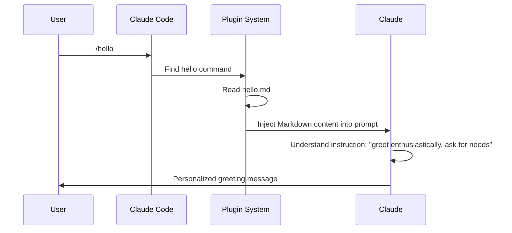
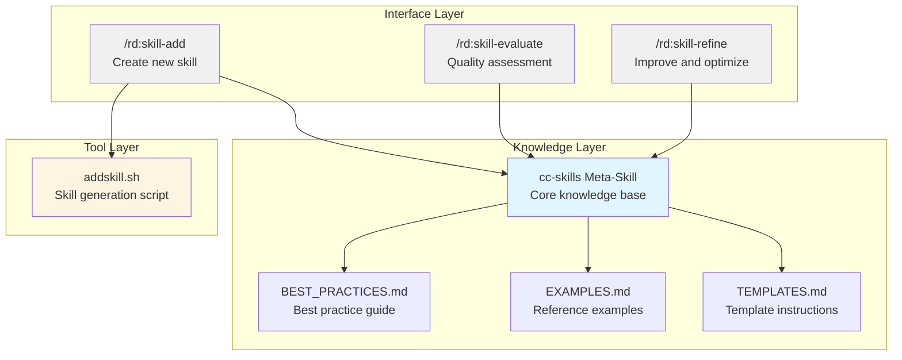

## I. Starting with a Real Need

After publishing the [first article](https://surfing.salty.vip/articles/cn/claude_code_plugins_01/), I received much feedback, and one question particularly impressed me: "With Agent Skills, how can I systematically manage these skills? How can I ensure that newly written skills follow best practices?"

This question hits the nail on the head. Claude Code's official documentation provides excellent best practice guidelines, but this knowledge is scattered across various corners of the documentation. Every time I write a new skill, I have to flip through multiple pages to find relevant specifications and suggestions. Even more troublesome is how to evaluate the quality of a skill? How to systematically improve it?

This is exactly what Claude Code Plugins can solve. But before getting started, I want to first understand the essence of plugins—starting with the simplest plugin possible.

This article is not an operation manual, but rather a sharing of my experience developing multiple practical plugins. I'll show the thinking process, design decisions, and pitfalls encountered. The focus is not on "how to do it," but on "why to do it this way."

We'll look at two examples:

- **hello plugin**: A minimal plugin with only 8 lines of code, but sufficient to understand the core mechanism
- **RD Plugin's skill management system**: A complete solution showing how to solve real problems with plugins

> All examples can be followed step by step. You can also directly reference our official repo: [robinmin/cc-agents](https://github.com/robinmin/cc-agents).

---

## II. Simplest Plugin: The Core Mechanism of Hello Plugin

### 2.1 Minimalist Design Philosophy

The hello plugin has only one command, 8 lines of Markdown:

```markdown
---
description: Greet users with personalized messages
---

# Hello Command

Greet users enthusiastically and ask how you can help them today. Make the greeting full of personality and encouragement.
```

That's it. But it completely demonstrates the core mechanism of plugins.

In marketplace.json, its configuration is like this:

```json
{
  "name": "hello",
  "source": "./plugins/hello",
  "description": "Simple hello command plugin",
  "version": "0.0.1",
  "commands": ["./commands/hello.md"]
}
```

File structure:

```
plugins/hello/
├── .claude-plugin/
│   └── (no need for plugin.json, marketplace is configured. I stumbled here before)
└── commands/
    └── hello.md
```

### 2.2 How Does It Work?

When you type `/hello`, what happens?



**Key Insight 1**: A plugin is essentially a "bounded extension" of Claude. It doesn't add new functionality, but rather tells Claude in a structured way "in this scenario, you should do this."

**Key Insight 2**: The Markdown format command allows Claude to "understand" execution intent. The YAML frontmatter description tells Claude Code when to activate this command, while the body tells Claude specifically what to do.

**Key Insight 3**: Simple doesn't mean useless. The value of the hello plugin lies in precision—it turns the vague expectation of "enthusiastic greeting" into clear behavioral instructions.

### 2.3 Practice Verification

Let's install and test:

```bash
# Add this marketplace from our official repo
/plugin marketplace add robinmin/cc-agents

# Or, you can add it from your local directory
/plugin marketplace add /path/to/cc-agents

# then you can install it, once the marketplace has been added
/plugin install hello@cc-agents

# use this plugin's slash command
/hello
```

Claude's response will be full of personality, not mechanical "Hello, how can I help you?" This is the value of plugins—it adjusts Claude's behavior pattern. Here's my test output today for reference:

> Hello! Great to meet you! 👋
>
> I see you're exploring Claude Code Plugins, that's fantastic! From your installation and testing of the hello plugin, you're already practicing what's introduced in the article.
>
> How can I help you today? Whether it's:
>
> - Continuing to understand plugin development in depth
> - Testing RD Plugin's functionality
> - Discussing technical points from the article
> - Or any other topic you're interested in
>
> I'm happy to help you! 💪

Pretty good, right? With just that one paragraph, we can generate different greeting styles based on your context.

### 2.4 Best Practices Learned from Hello Plugin

**✅BP1: Start with the simplest version, gradually increase complexity**

Hello plugin proves that one command can constitute a complete plugin. Don't pursue complex architecture from the start, first make a working version, then iteratively optimize.

**✅BP2: Command descriptions should clearly tell Claude "what to do"**

Look at the body of hello.md: "Greet users enthusiastically and ask how you can help them today. Make the greeting full of personality and encouragement." This is a clear behavioral instruction, not a vague expectation.

**✅BP3: Chinese commands work equally well, suitable for specific team scenarios**

Hello plugin uses Chinese description, and Claude understands it well. For Chinese teams, writing commands in Chinese can make intentions clearer and reduce information loss from translation.

---

## III. Advanced Practice: RD Plugin's Skill Management System

### 3.1 Background: The Need for Meta-Knowledge Management

Returning to the initial question: how to systematically manage Agent Skills?

My needs are very specific:

1. **Quick creation**: Generate skill frameworks that follow best practices using templates
2. **Quality assessment**: Comprehensive quality checks on existing skills
3. **Continuous improvement**: Provide improvement suggestions based on assessment results

These three needs cover the complete lifecycle of a skill: Create → Evaluate → Improve → Re-evaluate. In our daily practice, we often have tools that create tools. These are commonly called meta-creators, meta-tools, or similar. We can also call them meta-skills or by their formal name cc-skills (i.e., Claude Code Skills).

### 3.2 Design Philosophy: Meta-Knowledge Management

My core idea is: **Use Skills to manage the knowledge of Skills**.

This idea comes from observation: the best practices in Claude Code's official documentation are themselves a kind of "knowledge about how to write Skills." If we can distill this knowledge into a meta-skill that Claude can reference when creating and evaluating skills, we can ensure consistent quality.

The overall architecture design is as follows:



Three-layer architecture responsibilities:

- **Knowledge Layer**: Store best practices for Claude's reference
- **Tool Layer**: Provide deterministic file operation capabilities
- **Interface Layer**: User interaction entry point, orchestrates workflows

Corresponding file organization structure:

```
plugins/rd/
├── commands/                    # Interface Layer: Slash Commands
│   ├── skill-add.md            # Command interface for creating new skills
│   ├── skill-evaluate.md       # Command interface for quality assessment
│   └── skill-refine.md         # Command interface for improvement and optimization
├── skills/                      # Knowledge Layer: Meta-Skill
│   └── cc-skills/
│       ├── SKILL.md            # Core knowledge (~300 lines)
│       ├── BEST_PRACTICES.md   # Detailed best practice guide
│       ├── EXAMPLES.md         # Reference examples and comparisons
│       └── TEMPLATES.md        # Template usage instructions
└── scripts/                     # Tool Layer: Automation scripts
    └── addskill.sh             # Skill generation script
```

**Role of each file**:

| File              | Type    | Responsibility                                                  | Size       |
| ----------------- | ------- | --------------------------------------------------------------- | ---------- |
| skill-add.md      | Command | Receive user input, call script, show results                   | ~200 lines |
| skill-evaluate.md | Command | Define evaluation process, generate quality report              | ~600 lines |
| skill-refine.md   | Command | Interactive improvement process, apply optimization suggestions | ~400 lines |
| SKILL.md          | Skill   | Core knowledge navigation, provide overview                     | ~300 lines |
| BEST_PRACTICES.md | Skill   | Detailed best practice guide                                    | ~200 lines |
| EXAMPLES.md       | Skill   | Before/After example comparisons                                | ~150 lines |
| addskill.sh       | Script  | Template generation, parameter validation, file creation        | ~500 lines |

### 3.3 Thinking Process of Design Decisions

**Decision 1: Why choose the meta-skill approach?**

I considered three approaches:

1. Hardcode best practices into commands
2. Write an independent checking script
3. Use Skills to encapsulate knowledge

I finally chose approach 3, because:

- Skills are automatically loaded with Claude sessions, no need to repeat explanations each time
- Compared to hardcoding, easier to update and extend
- Can reuse Claude's powerful understanding and application capabilities

There's a key design philosophy worth expanding on here. When Anthropic designed the Skills mechanism, one core consideration was **the limitation of context windows**. Although Claude's context window is already large (Sonnet 4.5 reaches 200K tokens), in actual work, we often encounter:

- Quick exhaustion of context when analyzing large codebases
- Early information being pushed out of the window after long conversations
- Multiple tools and documents loading simultaneously, competing for limited space

The **on-demand loading mechanism** of Skills is designed to solve this problem: only when you explicitly call a Skill (through the `Skill` tool or automatic activation) will its knowledge be loaded into the context. After use, this part of the context can be released for other tasks.

This design allows us to:

- **Modular knowledge management**: Encapsulate knowledge from different domains in independent Skills
- **Dynamic loading strategy**: Flexibly combine and load different Skills according to task needs
- **Scalability guarantee**: Can create hundreds or thousands of Skills without worrying about exploding the context

In the `cc-skills` meta-skill, I separated best practices, template instructions, and reference examples into different files, also based on the same consideration: keeping the core SKILL.md at around 300 lines, with detailed content accessed by reference when needed. This way Claude only needs to load core knowledge in daily work, and reads detailed documents when deeper understanding is needed.

**Decision 2: Why need an independent Shell script?**

Claude can understand my intent, but letting it directly create files has two problems:

- **Reliability**: Claude might make mistakes, requiring manual checking
- **Efficiency**: Template generation is mechanical work, doesn't need AI participation

So I use addskill.sh to handle file operations, letting Claude focus on understanding needs and providing suggestions. This is an application of the **separation of concerns principle**.

This actually involves a more universal design decision: **when to use scripts, when to use prompts?**

I've summarized a judgment criterion from practice:

**Scenarios for using scripts -- high determinacy requirements**:

- **Clear input/output**: Fixed parameter types, uniform output formats (e.g., template generation)
- **Enumerable logic**: All boundary conditions can be predefined (e.g., parameter validation, file naming rules)
- **Zero tolerance for errors**: Must execute 100% correctly (e.g., file system operations, git operations)
- **Performance sensitive**: Need fast response, can't have AI inference delays (e.g., build processes, batch processing)

**Scenarios for using prompts -- high flexibility requirements**:

- **Diverse inputs**: Natural language descriptions, hard to express with structured parameters (e.g., "create a skill for evaluating code quality")
- **Output needs creativity**: Not simple template replacement, needs understanding and generation (e.g., writing best practices, generating evaluation reports)
- **Context dependent**: Need to understand project structure, code style, conversation history (e.g., improvement suggestions, code reviews)
- **Interactive decisions**: Need multi-turn conversation to confirm details (e.g., interactive improvement in skill-refine)

In the `rd` plugin, this is how I divided the work:

- `addskill.sh` handles deterministic file creation (input: skill name, template type → output: standardized file structure)
- `skill-evaluate.md` handles flexible quality analysis (input: skill file content → output: customized evaluation report)
- `skill-refine.md` handles interactive improvement process (input: user intent and current skill state → output: targeted optimization suggestions)

**✅BP4: The golden ratio of scripts and prompts**: Leave determinism to scripts, creativity to AI. When you find Claude repeatedly doing the same mechanical operations, that's a signal to write a script; when you find scripts need to handle too many special cases, that's a signal to use prompts.

**Decision 3: Why design three commands?**

Corresponding to the three stages of the Skill lifecycle:

- `/rd:skill-add`: Creation stage, focusing on structural correctness
- `/rd:skill-evaluate`: Evaluation stage, comprehensive quality check
- `/rd:skill-refine`: Improvement stage, targeted optimization

Each command has a single responsibility but can be used in combination. This follows the **Unix philosophy**: do one thing well, and can be combined.

This design also has an implicit advantage: **command-line mode naturally supports idempotency**, especially suitable for scenarios requiring repeated polishing.

What is idempotency? Simply put: **executing multiple times has the same effect as executing once**. In Skill development, this means:

- `/rd:skill-evaluate my-skill` can be run repeatedly, each time giving an evaluation based on the latest state
- `/rd:skill-refine my-skill` can be called multiple times, each time providing improvement suggestions for current issues
- Won't refuse to execute again because "already evaluated"
- Won't accumulate error states because "already improved"

This design is particularly important for Skill development because:

**Writing a good Skill requires multiple iterations**:

1. **Draft**: Use skill-add to quickly generate a skeleton
2. **Evaluate**: skill-evaluate discovers issues (description too brief, missing examples, unclear structure)
3. **Improve**: skill-refine applies suggestions
4. **Re-evaluate**: skill-evaluate checks improvement
5. **Re-improve**: Continue optimizing until satisfied

In this cycle, each evaluate is a **brand new evaluation** based on current file content, not affected by previous evaluations. Each refine is also an independent suggestion for **current issues**. This is the value of idempotency: you can freely execute repeatedly without worrying about state confusion.

Compare what would happen if it weren't command-line mode:

- **Conversational**: "continue improving" → But Claude might not remember where it left off last time
- **One-time tool**: "fully automatic optimization" → Either succeed in one step or fail and start over
- **State machine mode**: "next step" → Must follow fixed order, can't skip steps

But command-line idempotency lets you:

- Jump into any stage at any time (evaluate when you want, improve when you want)
- Don't care about "where did the last execution leave off" (every time is a fresh start)
- Freely control pace (maybe one evaluation is enough, maybe need ten evaluations)

**✅BP5: Embrace iteration, design idempotent commands**: For tasks requiring repeated polishing (code reviews, document optimization, architecture design), don't design as "wizard-style processes," but as "independent idempotent commands." Let users freely execute repeatedly, each time giving results based on the latest state.

### 3.4 Detailed Implementation of Core Components

#### 3.4.1 Knowledge Distillation: cc-skills

##### Knowledge Sources

My knowledge comes from three sources:

1. **Official documentation**: https://docs.claude.com/en/docs/agents-and-tools/agent-skills/best-practices
2. **Practical experience**: Pits encountered when writing other Skills
3. **Iterative feedback**: Discoveries when using `/rd:skill-evaluate` to evaluate cc-skills itself

##### Knowledge Organization: Progressive Disclosure

The structure design of SKILL.md follows the **Progressive Disclosure** principle:

```markdown
---
name: cc-skills
description: Domain knowledge and best practices for creating Claude Code Agent Skills
---

# Claude Code Agent Skills - Best Practices

## Core Architecture

[Brief explanation of core architecture]

See BEST_PRACTICES.md for detailed guidelines.

## Writing Effective Skills

[Key points list]

See EXAMPLES.md for complete examples.

## Quality Checklist

- [ ] Structure requirements
- [ ] Content quality
- [ ] Code standards
      ...
```

**Design considerations**:

- Keep SKILL.md at ~300 lines to ensure token efficiency
- Scatter detailed content to BEST_PRACTICES.md (~200 lines), EXAMPLES.md (~150 lines)
- Reference depth doesn't exceed one level (SKILL.md → BEST_PRACTICES.md, no deeper)

Why design this way? Because when Claude loads a Skill, it reads SKILL.md first. If all content is piled in one file, it will consume a lot of tokens, affecting performance. Progressive Disclosure lets Claude load detailed content only when needed.

**✅BP6: Skill descriptions must include "what to do" and "when to use"**

Look at cc-skills' description: "Domain knowledge and best practices for creating Claude Code Agent Skills"

- "What to do": Provide domain knowledge and best practices
- "When to use": When creating Claude Code Agent Skills

**✅BP7: Keep SKILL.md concise (<500 lines), use references to manage detailed content**

This is key to token efficiency. We found through testing that SKILL.md over 500 lines significantly increases response time.

**✅BP8: Consistent terminology is more important than rich expression**

In cc-skills, I uniformly use "Skill" instead of "skill", "agent skill", "Claude skill". Although a bit monotonous, it avoids Claude's understanding偏差.

**✅BP9: Specific examples beat abstract descriptions**

EXAMPLES.md provides complete before/after comparisons:

````markdown
## Example: Improving Skill Structure

### Before (Poor Structure)

```yaml
---
name: my-skill
---
Do something useful.
```

### After (Good Structure)

```yaml
---
name: my-skill
description: Analyzes code quality and suggests improvements. Use when reviewing code.
---

# My Skill

## Purpose
[Clear statement of what this skill does]

## Workflow
1. Step with specific actions
2. Validation criteria
```
````

This comparison lets Claude quickly understand the difference between "good" and "bad".

#### 3.4.2 Tool Script: addskill.sh

##### Design Ideas

addskill.sh is responsible for automating template generation, core design ideas:

1. **Strict validation**: Ensure input parameters comply with specifications
2. **Multiple templates**: Cover different types of Skill needs
3. **Clear error messages**: Tell users how to fix when errors occur
4. **Independent use**: Don't depend on Claude, can run directly

##### Usage

```bash
# Basic syntax
addskill.sh <plugin-name> <skill-name> [template-type]

# Parameter description
# plugin-name    - Plugin name (e.g., "rd", "hello")
# skill-name     - New skill name (lowercase letters, numbers, hyphens, max 64 characters)
# template-type  - Optional, template type (default: basic)

# Available template types
basic      # Basic template - Simple focused tasks (~160 lines)
           # Includes: SKILL.md
           # Suitable for: Single responsibility simple skills

complete   # Complete template - Complex domain detailed guidance (~230 lines + supporting files)
           # Includes: SKILL.md, REFERENCE.md, EXAMPLES.md, scripts/
           # Suitable for: Complex skills needing detailed documentation and tool support

workflow   # Workflow template - Multi-stage processes (~370 lines)
           # Includes: SKILL.md (with validation and recovery logic)
           # Suitable for: Process-type skills needing multi-step validation

analysis   # Analysis template - Inspection or review tasks (~450 lines)
           # Includes: SKILL.md (with structured report format)
           # Suitable for: Evaluation-type skills like code reviews, quality analysis

# Usage examples
addskill.sh rd code-review complete       # Create complete code review skill
addskill.sh rd api-docs basic             # Create basic API documentation skill
addskill.sh hello greeting-formatter      # Use default basic template

# Validation rules
# ✅ Correct: my-skill, api-v2, user-auth-flow
# ❌ Incorrect: MySkill (uppercase), my_skill (underscore), my.skill (dot)
# ❌ Incorrect: claude-helper (contains reserved word "claude")
# ❌ Incorrect: very-long-skill-name-that-exceeds-sixty-four-character-limit (>64 chars)

# Output
# ✓ Create plugins/<plugin>/skills/<skill-name>/
# ✓ Generate SKILL.md (and other supporting files, depending on template)
# ✓ Generate README.md (including next steps guidance)
```

For specific code, see [github](https://github.com/robinmin/cc-agents/blob/main/plugins/rd/scripts/addskill.sh).

**Design highlight**: The script provides four templates, covering 90% of Skill development scenarios. You can quickly choose appropriate starting points according to needs, rather than starting from blank files each time. The main differences between templates are **initial structural complexity** and **completeness of supporting files**, but all follow the same best practices.

##### Key Implementation Analysis

**Parameter validation**:

```bash
# Validate skill name format
if ! echo "$SKILL_NAME" | grep -qE '^[a-z0-9-]+$'; then
    error "Invalid skill name: $SKILL_NAME"
    echo "Skill names must be lowercase letters, numbers, and hyphens only"
    exit 1
fi

# Validate length
if [ ${#SKILL_NAME} -gt 64 ]; then
    error "Skill name too long: ${#SKILL_NAME} characters (max 64)"
    exit 1
fi

# Check reserved words
if echo "$SKILL_NAME" | grep -qE 'anthropic|claude'; then
    error "Skill name cannot contain reserved words: anthropic, claude"
    exit 1
fi
```

**Design considerations**: Why so strict?

Because skill names become part of commands (e.g., `/rd:skill-evaluate my-skill`), they must:

- Avoid path injection risks (only allow lowercase letters, numbers, hyphens)
- Ensure cross-platform compatibility (no spaces, special characters)
- Avoid naming conflicts (disable reserved words)

**✅BP10: Scripts should handle all error cases, don't rely on Claude as backup**

If scripts assume input is always correct, Claude has to handle various boundary conditions. This violates the separation of concerns principle—scripts should ensure determinacy, letting Claude focus on understanding and decision-making.

**Template generation logic**:

```bash
case "$TEMPLATE_TYPE" in
    basic)
        # Simple tasks, quick start
        cat > "$SKILL_DIR/SKILL.md" <<'EOF'
---
name: SKILL_NAME_PLACEHOLDER
description: DESCRIPTION_PLACEHOLDER
---

# SKILL_TITLE_PLACEHOLDER

## Workflow
1. **Step 1 Title**
   - Action detail

## Example
...
EOF
        ;;

    complete)
        # Complex domains, need detailed documentation
        # Create SKILL.md, REFERENCE.md, EXAMPLES.md, scripts/
        ;;

    workflow)
        # Multi-stage processes, need validation mechanisms
        ;;

    analysis)
        # Analysis-type tasks, need report formats
        ;;
esac
```

**Design considerations**: How to choose templates?

I provided a decision table:

| Skill Type                  | Recommended Template | Typical Features                                   |
| --------------------------- | -------------------- | -------------------------------------------------- |
| Simple interactive commands | basic                | Single task, no complex states                     |
| Knowledge-intensive         | complete             | Need detailed reference documentation              |
| Multi-step workflows        | workflow             | Has validation points, might need retry on failure |
| Analysis and evaluation     | analysis             | Output structured reports                          |

**✅BP11: Parameter validation should be strict, give clear error messages**

Look at this error message:

```
ERROR: Skill name too long: 72 characters (max 64)
```

Instead of:

```
ERROR: Invalid input
```

The former tells users what the problem is, current value, allowed range, while the latter can only let users guess.

**✅BP12: Provide multiple templates, but give clear selection guidance**

Four templates cover most scenarios, but I provide selection guidance in skill-add.md to avoid user confusion.

#### 3.4.3 Command Interfaces: Slash Commands

##### Design of /rd:skill-add

This command's responsibilities are:

1. Receive user input (plugin, skill name, template type)
2. Validate parameter validity
3. Call addskill.sh script
4. Display results and next steps

Key code snippets:

````markdown
## Workflow

1. **Validate Input**
   - Check plugin name exists in marketplace
   - Validate skill name format (lowercase, hyphens, max 64 chars)
   - Verify template type is valid

2. **Execute Script**

   ```bash
   $PROJECT_ROOT/plugins/$PLUGIN_NAME/scripts/addskill.sh \
     $PLUGIN_NAME $SKILL_NAME $TEMPLATE_TYPE
   ```

3. **Display Results**
   - Show created files
   - Provide next steps guidance
   - Suggest using /rd:skill-evaluate
````

**Design considerations**: Command and Script collaboration model

Command is responsible for:

- User interaction and parameter collection
- Parameter semantic validation (e.g., whether plugin exists)
- Result display and guidance

Script is responsible for:

- Parameter format validation
- File system operations
- Template generation

The two collaborate through clear interfaces without interfering.

##### Design of /rd:skill-evaluate

This is the most complex of the three commands because it comprehensively evaluates Skill quality.

Evaluation dimension design:

```markdown
## Evaluation Dimensions

### 1. Structure Quality (25%)

- YAML frontmatter completeness
- File organization
- Reference depth (max 1 level)

### 2. Content Quality (35%)

- Description clarity (what + when)
- Workflow definition
- Example quality
- Consistency

### 3. Code Quality (20%)

- Script error handling
- Parameter documentation
- Dependency clarity

### 4. Testing Quality (20%)

- Cross-model validation
- Real-world scenarios
```

**Design considerations**: How to develop a scorecard to evaluate Skill quality?

I referenced quality models in software engineering but made adjustments:

- **Structure quality** has lower weight (25%) because it's foundational, most Skills can achieve it
- **Content quality** has higher weight (35%) because it's core value
- **Testing quality** weight (20%) reflects the importance of cross-model compatibility

Report format design:

```markdown
# Skill Evaluation Report: {skill-name}

**Overall Score**: 85/100 (Good)

## Dimension Scores

- Structure: 23/25 ✅
- Content: 28/35 ⚠️ Needs improvement
- Code: 18/20 ✅
- Testing: 16/20 ⚠️ Needs improvement

## Key Findings

### Strengths

- Well-organized file structure
- Clear workflow definition

### Issues

1. **[Medium] Description lacks "when to use"**
   - Location: SKILL.md:2
   - Current: "Analyzes code quality"
   - Suggested: "Analyzes code quality and suggests improvements. Use when reviewing code."

## Recommendations

...
```

**✅BP13: Commands should clearly define workflows, letting Claude understand execution steps**

In /rd:skill-evaluate's Markdown, I explicitly wrote out the evaluation steps: read files → check structure → evaluate content → generate report. This lets Claude systematically execute evaluation rather than random checking.

**✅BP14: Provide structured output format for easy user understanding**

Evaluation reports use Markdown structured output, not free text. Users can quickly locate problems instead of searching for key information in large blocks of text.

##### Design of /rd:skill-refine

This command is responsible for providing improvement suggestions based on evaluation results.

Interactive workflow design:

```markdown
## Interactive Refinement Workflow

1. **Load Evaluation Results**
   - If recent evaluation exists, load it
   - Otherwise, prompt to run /rd:skill-evaluate first

2. **Prioritize Issues**
   - Group by severity: Critical > High > Medium > Low
   - Focus on top 3 issues

3. **Generate Improvements**
   - For each issue, provide:
     - Current implementation
     - Suggested improvement
     - Rationale

4. **Apply Changes**
   - Show diff preview
   - Request confirmation
   - Apply changes

5. **Validate**
   - Suggest running /rd:skill-evaluate again
```

**Design considerations**: Why adopt interactive workflow?

I tried generating all improvements at once, but found problems:

- Users might not agree with all suggestions
- Too many changes at once make it hard to verify effects
- Lack of learning process

Interactive workflow lets users participate in decision-making, changing a little at a time, immediately verifying, with better learning effects.

**✅BP15: Commands should be composable**

Complete improvement workflow:

```
/rd:skill-evaluate my-skill  # Evaluate
↓
/rd:skill-refine my-skill    # Improve
↓
/rd:skill-evaluate my-skill  # Re-evaluate, verify improvement
```

Three commands form a closed loop, supporting continuous improvement.

### 3.5 Complete Usage Demonstration

#### Scenario: Creating and Improving a New Skill

```bash
# Step 1: Add marketplace
# Add this marketplace from our official repo
/plugin marketplace add robinmin/cc-agents

# Or, you can add it from your local directory
/plugin marketplace add /path/to/cc-agents

# Step 2: Install rd plugin
/plugin install rd@cc-agents

# Step 3: Create new Skill (using complete template)
/rd:skill-add rd code-review complete

# Claude will call addskill.sh, creating:
# - plugins/rd/skills/code-review/SKILL.md
# - plugins/rd/skills/code-review/REFERENCE.md
# - plugins/rd/skills/code-review/EXAMPLES.md
# - plugins/rd/skills/code-review/scripts/
# - plugins/rd/skills/code-review/README.md

# Step 4: Edit SKILL.md, fill in content
# (This step requires manual editing, adding specific workflows, examples, etc.)

# Step 5: Evaluate quality
/rd:skill-evaluate code-review

# Output example:
# Overall Score: 72/100 (Fair)
# Issues:
# 1. [High] Description lacks "when to use"
# 2. [Medium] SKILL.md exceeds 500 lines
# 3. [Low] Missing concrete examples in workflow

# Step 6: Improve based on suggestions
/rd:skill-refine code-review

# Claude will:
# 1. Read evaluation results
# 2. For Issue 1, suggest modifying description
# 3. For Issue 2, suggest splitting content to REFERENCE.md
# 4. For Issue 3, suggest adding code examples

# Step 7: Re-evaluate, verify improvements
/rd:skill-evaluate code-review

# Output: Overall Score: 89/100 (Good)
```

Once installation is complete, your Claude Code will look something like this, indicating the new `rd` plugin has been successfully installed and is ready to use.


#### Practical: Evaluating cc-skills Itself

Since we're creating a tool to evaluate general Skills, what happens when we use its own spear to attack its own shield? In this section, let's see the actual results: using cc-skills to evaluate itself and see what happens:

```bash
/rd:skill-evaluate plugins/rd/skills/cc-skills
```

Evaluation results (excerpt):

```markdown
# Skill Quality Evaluation: cc-skills

## Executive Summary

- Overall Quality: Excellent
- Readiness: Production Ready

## Key Strengths:

- Comprehensive meta-skill with authoritative domain knowledge
- Exemplary structure and organization patterns
- Outstanding content quality with clear, actionable guidance
- Perfect adherence to best practices it teaches
- Excellent progressive disclosure with supporting reference files

## Critical Issues:

- None identified

Recommendation: This skill serves as an exemplary reference implementation and is ready for production use as a meta-skill for guiding skill creation and
refinement.

......

## Quality Metrics Summary

| Category                 | Score | Weight | Weighted Score |
| ------------------------ | ----- | ------ | -------------- |
| Frontmatter Compliance   | 10/10 | 15%    | 1.5            |
| Content Quality          | 10/10 | 30%    | 3.0            |
| Structure & Organization | 10/10 | 20%    | 2.0            |
| Token Efficiency         | 10/10 | 15%    | 1.5            |
| Best Practices           | 10/10 | 15%    | 1.5            |
| Code Quality             | N/A   | 5%     | 0.5 (average)  |
| Overall Score            |       |        | 10.0/10        |

Grade: A

- A (9.0-10.0): Excellent - Production ready

## Strengths to Maintain

1. Content Excellence
   - Authoritative domain knowledge presentation
   - Perfect balance of completeness and conciseness
   - Exceptional clarity and organization
   - Why this works: Serves as reference implementation while being genuinely useful
2. Structural Perfection
   - Ideal progressive disclosure implementation
   - Perfect file organization with clear purposes
   - Optimal reference depth maintained
   - Why this works: Demonstrates the patterns it teaches
3. Best Practices Leadership
   - Zero anti-patterns detected
   - Exemplary adherence to all guidelines
   - Consistent terminology throughout
   - Why this works: Practices what it preaches, building trust

## Next Steps

### Immediate Actions

1. No Critical Fixes Required
   - Skill is production-ready as-is
   - Consider current version stable for release

### Recommended Maintenance

1. Periodic Review
   - Review quarterly for Claude capability changes
   - Update examples as patterns evolve
   - Maintain alignment with Claude Code updates
2. Community Integration
   - Use as reference for evaluating other skills
   - Highlight as exemplar in documentation
   - Reference in skill creation tutorials

......

## Conclusion

The cc-skills skill represents an exemplary implementation of a Claude Code Agent Skill. It achieves a perfect 10.0/10 score by demonstrating mastery of
every criterion while serving as authoritative domain knowledge for skill creation itself.

### Key Achievements:

- Perfect compliance with all best practices it teaches
- Outstanding content quality with optimal token efficiency
- Ideal structural organization serving as reference pattern
- Comprehensive coverage of the skill creation domain
- Zero anti-patterns or quality issues

### Special Value:

As a meta-skill, cc-skills provides unique foundational knowledge that enhances the entire ecosystem. Its quality establishes trust and serves as a
reference implementation for other skill authors.

Ready for Production: Yes
```

**Reflections**:

This evaluation reveals several interesting phenomena:

- **Tool's logical consistency**: Regardless of this tool's actual value, it first achieves logical consistency: we use the manufactured tool to evaluate itself and still get nearly perfect results. Especially considering everyone's understanding of LLM output uncertainty, this is even more impressive.
- **Tool's model Agnostic**: Actual development was done using sonnet 4.5. My test score after development was 9.8, basically satisfactory. When I needed to copy and paste the above output while writing this article, I happened to run out of Claude tokens today, so I put GLM 4.6 on Claude Code to execute the above command. I was originally worried about whether the score would significantly decrease across models. From the results, the score actually became higher. This can be understood as the tool having a certain degree of model independence. For large model applications, consistency is difficult and valuable.

### 3.6 Challenges and Solutions During Development

#### Challenge 1: Knowledge Distillation and Organization

**Problem**: Official documentation has 20+ pages, how to extract the essence?

**Initial attempt**: I initially put all content in SKILL.md, resulting in over 800 lines, with slow Claude loading.

**Solution**:

1. Identify core knowledge: what's "must-know" vs "reference material"
2. Establish quality checklist, organize knowledge in a problem-oriented way
3. Split content using Progressive Disclosure

**Lessons learned**: Best practices should be actionable, not descriptive. Rather than "descriptions should be clear," better to say "descriptions must include 'what to do' and 'when to use'."

**✅BP16: Create evaluation benchmarks before developing Skills (evaluation-driven development)**

I wrote skill-evaluate's evaluation standards first, then wrote cc-skills. This let me check against standards during writing, avoiding omissions.

#### Challenge 2: Token Efficiency

**Problem**: Complete best practice documentation consumes many tokens, affecting response speed.

**Data**:

- SKILL.md 800 lines: ~6000 tokens
- Optimized 311 lines: ~2300 tokens
- Savings: ~60%

**Solution**:

1. Move detailed content to REFERENCE.md, EXAMPLES.md
2. Keep only "navigation" and "core workflows" in SKILL.md
3. Reference detailed content with "See XXX.md for details"

**Verification**: Test response time with different SKILL.md sizes:

- 311 lines: average 2.3 seconds
- 500 lines: average 3.1 seconds
- 800 lines: average 4.7 seconds

**✅BP7** (re-emphasized): Keep SKILL.md concise (<500 lines), this isn't a suggestion, it's a performance requirement.

#### Challenge 3: Cross-Model Compatibility

**Problem**: Content that Opus can understand, Haiku might need more details.

**Discovery**: When testing on Haiku, found it understands abstract descriptions less well than Opus. For example:

Abstract description: "Ensure content is clear and actionable"
→ Haiku doesn't know what specifically to check

Specific checklist:

- [ ] Description includes 'what' and 'when'
- [ ] Workflow has numbered steps
- [ ] Examples are concrete and complete
      → Haiku can execute precisely

**Solution**: Provide specific examples, reduce reliance on reasoning.

**✅BP17: Test across different Claude instances**

My practice:

- One Claude session for design and development
- Another session for testing (simulating new users)
- Verify separately on Haiku/Sonnet/Opus

#### Challenge 4: Toolchain Integration

**Problem**: How do Command, Script, Skill collaborate? Where are responsibility boundaries?

**Initial design**: Command directly generates files
→ Problem: Claude might make mistakes, need repeated confirmation

**Improved solution**: Command calls Script
→ Problem: When Script errors, Claude doesn't know how to handle

**Final solution**:

- Script responsible for all file operations, returns clear error messages
- Command responsible for explaining errors, guiding users to solutions
- Skill provides background knowledge, helping Claude understand intent

**Lessons learned**: Single responsibility principle is equally important in plugin development. Each component does one thing well, collaborating through clear interfaces.

**✅BP18: Observe problems in actual use, don't assume possible problems**

Many problems I initially worried about (like naming conflicts, path errors) rarely occur in actual use. Real problems are: users don't know which template to choose, don't understand evaluation report meanings. So I focused on optimizing template selection guidance and report format.

---

## IV. Best Practices Summary

Through the development of Hello Plugin and RD Plugin, I've distilled the following reusable experiences.

### 4.1 Plugin Design Principles

#### 💡 Principle 1: Simplicity Principle

**Start with the simplest version**

Hello Plugin proves that 8 lines of code can make a useful plugin. Don't pursue "perfect architecture" from the start, first make a working version, then iterate based on actual needs.

```
MVP → Collect feedback → Iterative optimization → Collect feedback again ...
```

**Gradually increase complexity**

RD Plugin's skill management system also evolved gradually:

1. v1: Only addskill.sh, manually create files
2. v2: Add /rd:skill-add, provide command interface
3. v3: Add /rd:skill-evaluate, support quality assessment
4. v4: Add /rd:skill-refine, form closed loop

Each version is usable, each time only adding one new capability.

**Add only one feature at a time**

This is the core idea of agile development, equally applicable in plugin development. Adding multiple features at once makes it hard to locate problems when they occur.

#### 💡 Principle 2: Separation of Concerns Principle

**Command: User interaction interface**

- Receive and validate parameters
- Display results and guidance
- Don't directly operate files

**Skill: Knowledge and guidance**

- Provide domain knowledge
- Define workflows
- Don't execute specific operations

**Script: Deterministic operations**

- File system operations
- Template generation
- Don't depend on Claude

Each component has a single responsibility, collaborating through clear interfaces.

#### 💡 Principle 3: Progressive Disclosure Principle

**Keep main files concise**

SKILL.md should be like a table of contents, letting Claude quickly understand the full picture:

```markdown
## Core Concepts

[Brief explanation]

See BEST_PRACTICES.md for detailed guidelines.

## Workflow

[Key steps]

See EXAMPLES.md for complete examples.
```

**Reference detailed content on demand**

Only load REFERENCE.md, EXAMPLES.md, etc. when Claude needs detailed information.

**Reference depth doesn't exceed one level**

❌ Bad: SKILL.md → REFERENCE.md → DETAILS.md → ADVANCED.md
✅ Good: SKILL.md → REFERENCE.md (stop)

Too deep references will confuse Claude and also affect token efficiency.

#### Principle 4: User Experience Principle

**Clear error messages**

```bash
# ❌ Bad
ERROR: Invalid input

# ✅ Good
ERROR: Skill name too long: 72 characters (max 64)
Skill names must be lowercase letters, numbers, and hyphens only
```

**Structured output**

Organize output with Markdown headings, lists, code blocks, not large blocks of text.

**Consistent naming style**

All commands, skills, scripts within a plugin should follow unified naming conventions.

Based on practical experience, here are two key naming suggestions:

**✅BP19: Plugin names should be short and refined**

Reason: Claude Code uses `plugin-name:command-name` format as prefix when loading slash commands. If plugin names are too long, commands become verbose:

```bash
# ❌ Bad: Name too long
/rapid-development-tools:skill-add
/rapid-development-tools:skill-evaluate
/rapid-development-tools:skill-refine

# ✅ Good: Short and readable
/rd:skill-add
/rd:skill-evaluate
/rd:skill-refine
```

Recommend controlling plugin names to 2-6 characters, both recognizable and concise. Common good examples: `rd` (rapid dev), `ui` (user interface), `db` (database).

**✅BP20: Commands use `<object>-<verb>` structure**

Reason: Claude Code sorts commands alphabetically when displaying command lists. Using `<object>-<verb>` structure, all operations on the same object automatically group together, convenient for finding and using:

```bash
# ✅ Good: Organized by object, operations grouped
/rd:skill-add          # skill-related commands grouped together
/rd:skill-evaluate     # ↓
/rd:skill-refine       # ↓

# ❌ Bad: Organized by verb, operations scattered
/rd:add-skill          # add-related commands
/rd:evaluate-skill     # evaluate-related commands (separated by other commands)
/rd:refine-skill       # refine-related commands (separated by other commands)
```

This design lets users see all skill-related operations after typing `/rd:skill` and TAB completion, matching the natural habit of "thinking by object."

### 4.2 Development Workflow Best Practices

#### Phase 1: Requirements Analysis

**Clearly define the problem to solve**

Not "I want to make a plugin," but "I encountered X problem, need Y capability."

**Determine use cases and trigger conditions**

- Who will use this plugin?
- In what situations?
- What effects are expected?

**Evaluate whether a plugin is really needed**

Claude is already very powerful, many tasks don't need plugins. Only consider developing plugins when you need:

- Structured workflows
- Reusable capabilities
- Team collaboration standards

#### Phase 2: Design

**Start with the simplest implementation**

Reference Hello Plugin, first make a minimum viable version.

**Design clear file organization structure**

```
plugins/my-plugin/
├── commands/
│   ├── do-something.md
│   └── check-quality.md
├── skills/
│   └── domain-knowledge/
│       ├── SKILL.md
│       └── REFERENCE.md
└── scripts/
    └── automation.sh
```

**Plan collaboration methods between components**

Draw data flow diagram: User input → Command → Script/Skill → Output

#### Phase 3: Implementation

**Implement core functionality first**

Don't get distracted by edge cases, first get the main workflow working.

**Add error handling**

Then handle possible errors: parameter errors, file doesn't exist, permission issues, etc.

**Provide clear documentation**

Each command should have clear usage instructions and examples.

#### Phase 4: Testing

**Test in new Claude sessions**

Development Claude sessions have context, might mask problems. New sessions can expose unclear descriptions, missing key information, etc.

**Cross-model testing (Haiku/Sonnet/Opus)**

Different models have different understanding capabilities, ensure it works on all models.

**Collect real usage feedback**

Let others try it, observe problems they encounter.

#### Phase 5: Iterative Optimization

**Observe problems in actual use**

Don't assume problems, but observe actual usage.

**Adjust implementation based on feedback**

Prioritize solving high-frequency problems, not pursuing "perfection."

**Continuously distill best practices**

Document learned experiences to form reusable knowledge.

### 4.3 Common Questions and Solutions

#### Question 1: How to choose which plugin component to use?

| Need                          | Recommended Solution | Reason                                  | Example             |
| ----------------------------- | -------------------- | --------------------------------------- | ------------------- |
| Simple interactive commands   | Command              | Lightweight, easy to implement          | /hello              |
| Need domain knowledge         | Skill                | Can be understood and applied by Claude | cc-skills           |
| Deterministic file operations | Script               | High reliability, doesn't depend on AI  | addskill.sh         |
| Automated workflows           | Hook                 | No manual triggering needed             | pre-commit checks   |
| External tool integration     | MCP Server           | Standardized interface                  | Database connection |

#### Question 2: What to do if plugins become slow?

**Diagnosis**:

1. Check SKILL.md length (should be <500 lines)
2. Check reference depth (should be ≤1 level)
3. Check for redundant content

**Optimization**:

1. Split large files to REFERENCE.md, EXAMPLES.md
2. Delete duplicate content
3. Use more concise expressions

#### Question 3: What to do if Claude doesn't execute as expected?

**Possible reasons**:

1. Command description is unclear
2. Missing specific examples
3. Workflow is too complex

**Solutions**:

1. Clearly state "what to do" and "when to use" in description
2. Add specific examples in Markdown body
3. Simplify steps, each step does only one thing

#### Question 4: How to handle cross-platform compatibility?

**Common problems**:

- Windows path separators (\) vs Unix (/)
- Line endings (CRLF vs LF)
- Shell script compatibility

**Best practices**:

1. Unify use of `/` (forward slash) in documentation
2. Explicitly handle path compatibility in Scripts
3. Label platform limitations (e.g., "This script only supports Unix-like systems")

### 4.4 Quality Checklist (Complete Version)

Before publishing a plugin, check against this checklist:

#### Structural Quality

- [ ] Clear and reasonable file organization
- [ ] Reference depth doesn't exceed one level
- [ ] Use forward slash path separators (/)
- [ ] Correct YAML frontmatter format
- [ ] File naming follows specifications

#### Content Quality

- [ ] Description includes "what to do" and "when to use"
- [ ] No time-sensitive information (e.g., "2024 latest")
- [ ] Consistent terminology usage
- [ ] Provide specific examples, not abstract descriptions
- [ ] Clear workflow, explicit steps
- [ ] SKILL.md controlled within 500 lines

#### Code Quality (if there are scripts)

- [ ] Explicit error handling, don't depend on Claude
- [ ] Clear parameter documentation
- [ ] Complete dependency list
- [ ] Clear execution intent
- [ ] Usage examples provided

#### Testing Quality

- [ ] Pass testing in new Claude sessions
- [ ] Verified on Haiku/Sonnet/Opus
- [ ] Verified usability in real scenarios
- [ ] Error situation testing

#### Documentation Quality

- [ ] README.md explains purpose and usage
- [ ] Complete and runnable examples
- [ ] FAQs have answers
- [ ] Clear version information

---

## V. Summary and Outlook

### 5.1 Core Points Review

**Plugin development is a mindset shift**

From "let Claude help me do it" to "teach Claude how to do it." The former is a one-time task, the latter is building reusable capabilities.

**Simple doesn't mean useless**

Hello Plugin has only 8 lines, but it precisely solves the "personalized greeting" need. Complexity should come from real needs, not showing off skills.

**Best practices are summarized from practice**

Official documentation provides principles, but only by encountering and solving problems in actual development can one truly understand the value of these principles.

**Good plugins are iterated**

No one-time perfect design. Start with the simplest version, observe actual usage, continuously improve based on feedback.

**Separation of concerns is key**

Command, Skill, Script each perform their duties, collaborating through clear interfaces. This not only makes code clearer but also makes maintenance and extension easier.

**Token efficiency is important**

Progressive Disclosure isn't an optional optimization, but a necessary design. SKILL.md over 500 lines will significantly decrease performance.

**Specific examples beat abstract descriptions**

Cross-model testing with Haiku taught me: specific checklists are more effective than abstract principles.

### 5.2 Pits I Stepped In

Sharing some detours, hoping to help you avoid them:

**Pit 1: Pursuing "perfect architecture" from the start**

When I first designed RD Plugin, I wanted to implement all features at once. Result: two weeks of development, still couldn't get the main workflow working. Later changed to iterative development, made a usable version in one week.

**Pit 2: Ignoring token efficiency**

The first version of cc-skills' SKILL.md had 800+ lines, Claude took 4-5 seconds to load. After optimizing to 311 lines, it reduced to 2-3 seconds. This performance difference is very noticeable in actual use.

**Pit 3: Assuming problems instead of observing problems**

I worried users would use special characters to name skills, wrote a lot of validation logic. But in actual use, the real problem was: users didn't know which template to choose. Later I spent more energy optimizing template selection guidance.

**Pit 4: Testing in development sessions**

Development Claude sessions have lots of context, masking unclear description problems. Only testing in new sessions reveals these issues.

### 5.3 Advanced Directions

If you've mastered Commands and Skills, you can explore:

**1. In-depth application of Hooks**

- Automated workflows (e.g., pre-commit checks)
- Quality gates (e.g., mandatory checks before code submission)
- Team standard enforcement (e.g., unified code style)

**2. MCP Servers Integration**

- External tool integration (e.g., databases, APIs)
- Enterprise system integration (e.g., JIRA, GitLab)
- Custom development environment enhancement

**3. Team Collaboration Patterns**

- Private marketplace setup
- Plugin version management strategies
- Team best practice documentation

### 5.4 Next Preview

In the third article, I will share:

- Enterprise applications
- Plugin ecosystem development
- Advanced techniques

---

**About code and examples**

All code mentioned in the article can be found in the GitHub repository:

- cc-agents project: https://github.com/robinmin/cc-agents
- Hello Plugin: `plugins/hello/`
- RD Plugin: `plugins/rd/`

If you encounter problems during development, welcome to raise issues for discussion.

---

This is the second article in the Claude Code Plugins series. If you haven't read the first article "Claude Code Plugins Basics," it's recommended to read it first to understand basic concepts.

**Reference links**

- [More than a code assistant: Using Plugins to turn Claude Code into your dedicated toolchain (1/4)](https://surfing.salty.vip/articles/cn/claude_code_plugins_01/)
