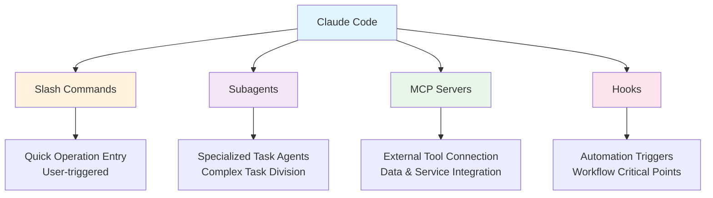
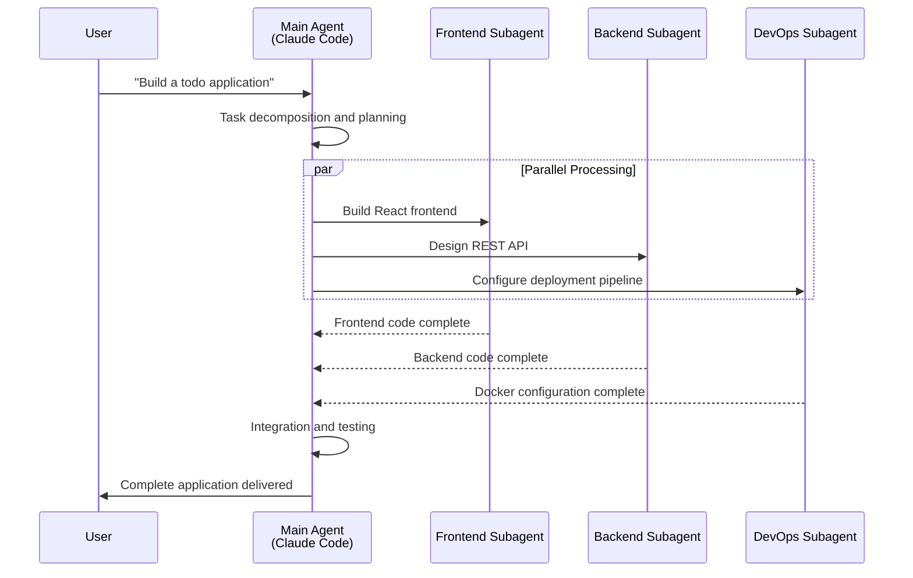
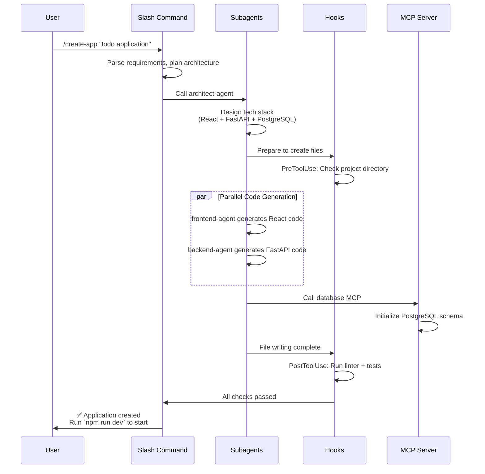
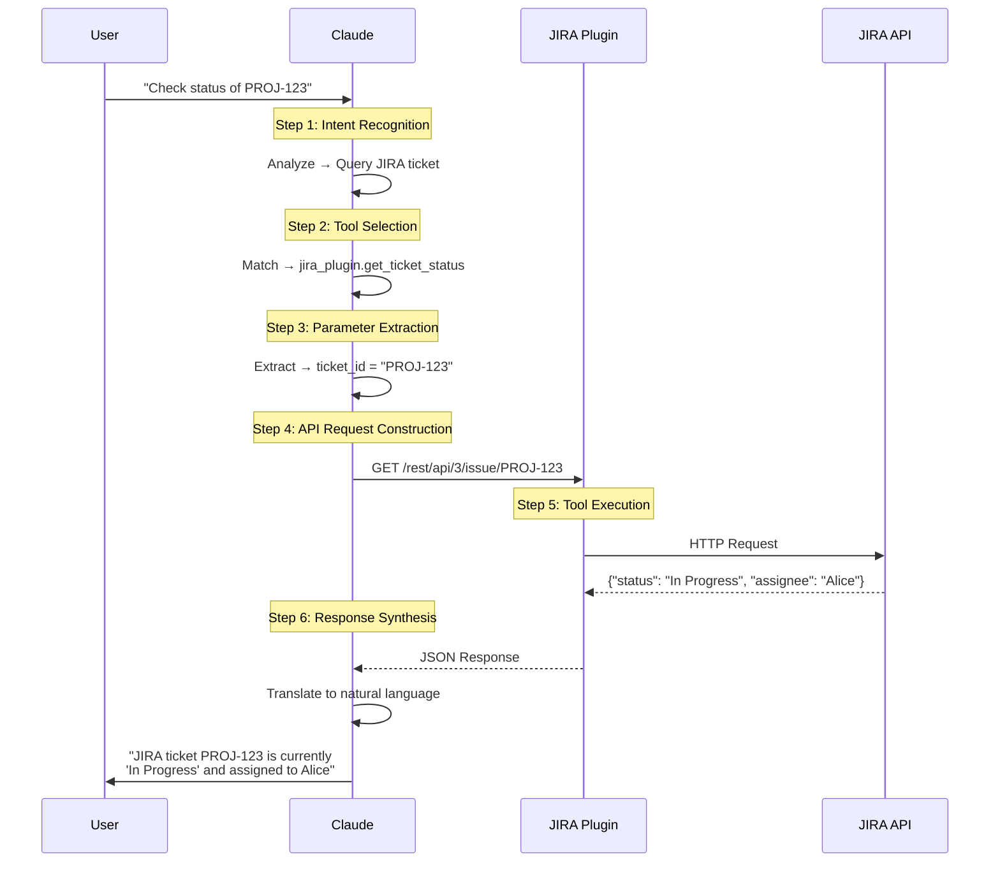
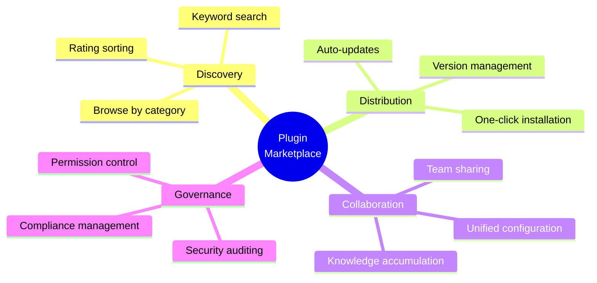
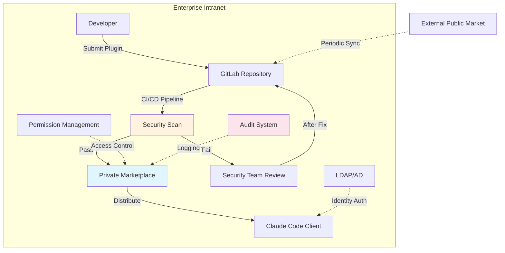

## 第1部:概念編 - AIアシスタントの「次元の壁」を打ち破る

> **シリーズ紹介**:本記事は Claude Code Plugins シリーズの第1弾で、コアコンセプトと動作原理に焦点を当てています。今後の記事では、実践的な開発、エンタープライズアプリケーション、将来展望を取り上げる予定です。フィードバックやご提案をお待ちしております。

## **Claude Code Plugins の誕生背景**

`Claude` は、Anthropic が開発した大規模言語モデルで、安全性と使いやすさで知られています。`Claude Code` は Claude をベースに構築されたコマンドラインツールで、AI を開発者の日常ワークフローに深く統合することを目的としています。開発者がより強力なカスタム設定を構築し続け、それらの経験をチームやコミュニティと共有したいと考えるようになったことを受けて、Anthropic は **2025年10月9日に Plugins メカニズムを正式リリース**しました(現在パブリックベータ版)。これにより、Claude Code は AI コードアシスタントから拡張可能な開発プラットフォームへと進化を遂げました。

Plugins メカニズムの核心的な目的は明確です:**これまで分散していた Slash Commands、Subagents、MCP Servers、Hooks を統一されたパッケージにまとめ、ワンクリックインストールと簡単な共有を実現すること**です。これは設定管理の複雑さを解決するだけでなく、AI ネイティブ開発ツールエコシステム構築の新たな章を開きます。私のように様々な `Slash Commands`、`Subagents`、`MCPs` を試してきた方なら、`~/.claude` ディレクトリがどれほど混沌としているか見れば理解できるでしょう。

---

## I. シナリオ設定:開発者の日常的な「窮地」

このようなシナリオを経験したことはありませんか?

午前2時、本番システムが停止。慌ててノートPCを開くと、画面には瞬時に何十ものウィンドウが開きます:チケット管理の JIRA、ドキュメントの Confluence、コード管理の GitLab、監視システムの Grafana... システム間の切り替えで疲弊し、AI コードアシスタントがこれらについて何も知らないことに気づきます。ため息をつきながら、各システムの情報を手動でコピー&ペーストするしかありません。

これは不運な開発者の孤立した出来事ではなく、無数のエンジニアが毎日経験している「日常」なのです。具体的なケースを通じて、この窮地がどれほど問題であるかを見てみましょう...

シニア開発者の張三(架空の人物)の一日は、しばしばこのように始まります:監視システムがバグについて警告し、即座の対応が必要です。彼の画面は瞬時に様々なウィンドウで埋め尽くされます:

**午前10:05 - 問題診断の「ツールマラソン」**

1. **JIRA**:まず JIRA を開き、プロジェクトボードで該当チケット `PROJ-1234` を見つけ、ユーザーフィードバックを読みます:「決済インターフェースで断続的なタイムアウトが発生し、注文の約5%に影響」。

2. **Confluence**:次に Confluence に移動し、決済モジュールに関連する技術設計ドキュメントを検索し、複雑なサードパーティ統合ロジックとタイムアウト設定を理解しようとします。

3. **GitLab**:その後 GitLab に切り替え、`git blame` とログ検索を使用して、最近の疑わしいコードコミット3件を特定し、各変更を注意深くレビューします。

4. **Grafana**:問題を再現するために、Grafana にもログインし、バグ発生時のシステム監視メトリクス(API レイテンシ、データベース接続数、Redis ヒット率)をクエリする必要があります。

5. **AI アシスタントに戻る**:30分かけて情報を収集した後、張三は AI コードアシスタントに根本原因の分析を手伝ってもらいたいと考えます。しかし、AI は JIRA、Confluence、GitLab、Grafana について何も知りません。彼はため息をつき、各システムから重要な情報を AI の対話ボックスに手動でコピー&ペーストし始めるしかありません。

**午前10:40 - 疲弊した要約**

張三はようやく完全な問題記述をまとめましたが、この時点で彼は:

- **5つの異なるツール**を切り替え
- **12のブラウザタブ**を開き
- **7つのテキストセグメント**をコピー&ペーストし
- ツールの切り替えと情報整理に**35分**を浪費しました

これこそ、無数の開発者が日々経験している「窮地」です:**頻繁なコンテキスト切り替え、サイロ化された情報の孤島、そしてチームの実際のワークフローに真に統合できない AI アシスタント**。

---

## II. 根本原因:汎用AIの「知識境界」

### 2.1 汎用モデルの限界

根本原因は、現在のほとんどの AI コードアシスタントが本質的に公開データで訓練された「ジェネラリストモデル」であることにあります。それらは公開コード、アルゴリズム知識、プログラミング言語では優れていますが、以下については何も知りません:

- 自社のプライベートコードベースとビジネスロジック
- 内部 API とマイクロサービスアーキテクチャ
- チーム固有のワークフローと標準
- リアルタイムのシステム実行状態と監視データ

それらは透明な「ブラックボックス」に閉じ込められているかのように見えます。入力された情報は見えますが、実際の作業環境にはアクセスできません。

### 2.2 従来のAIアシスタントの能力境界

比較表を通じて、これらの限界を明確に見てみましょう:

| 次元             | 従来の AI コードアシスタント   | 理想的な AI ワークパートナー                                 |
| ---------------- | ------------------------------ | ------------------------------------------------------------ |
| **知識ソース**   | 静的な訓練データ(ある時点まで) | エンタープライズシステムと動的データへのリアルタイムアクセス |
| **作業モード**   | 観察者、コンサルタントの役割   | 実行者、深い協力者                                           |
| **能力範囲**     | Q&A、コード生成、テキスト要約  | クロスシステムオペレーション、自動タスク実行                 |
| **システム境界** | クローズドシステム、拡張不可   | オープンプラットフォーム、無限に拡張可能                     |
| **チーム適応**   | 汎用設定、カスタマイズ困難     | 深いカスタマイズ、チームプロセスに適応                       |

### 2.3 「張三」が本当に必要としているものは?

冒頭のシナリオに戻ると、張三の理想的なワークフローは次のようになるはずです:

```
張三:「Claude、PROJ-1234 の決済タイムアウト問題の根本原因を分析してください。」

AI アシスタント:
1. [自動で JIRA をクエリ] 問題の説明とユーザーフィードバックを取得
2. [自動で GitLab を検索] 決済モジュールの最近のコード変更を特定
3. [自動で Grafana をクエリ] 問題発生時のパフォーマンスメトリクスを取得
4. [自動で Confluence を検索] 関連する技術ドキュメントを発見

総合分析結果:
根本原因:先週水曜日のコミット a3f9c2b が決済ゲートウェイのタイムアウト
設定を5秒から3秒に変更し、高並行性の状況下で断続的なタイムアウトを引き起こしました。
また、監視データによると、この期間中にサードパーティ決済インターフェースの
P99レイテンシが3.2秒に達し、新しいタイムアウト閾値を超えていました。

推奨ソリューション:
1. タイムアウト設定を5秒に戻すか、8秒に調整する
2. リトライメカニズムと降格戦略を追加
3. サードパーティ決済プロバイダーとSLA保証を確認

修正PRを作成しましょうか?
```

これこそが真に効率を向上させる AI アシスタントです。もはや情報の運び手ではなく、**データを主体的に収集し、問題を自律的に分析し、実行可能なソリューションを提供できる**インテリジェントな協力者なのです。

### 2.4 Plugins 以前の「ツール分断」時代

Plugins メカニズムが導入される前、開発者は設定管理の課題に直面していました:

**4つの主要機能が独立して動作**:

- **Slash Commands**:`.claude` ディレクトリで個別に設定が必要
- **Subagents**:独立したエージェント設定ファイル
- **MCP Servers**:分散したサーバー設定
- **Hooks**:個別のフック定義

**これが生み出した問題**:

1. **分散した設定**:完全なワークフローを共有するには、複数の設定ファイルを個別にコピーする必要がある
2. **困難なバージョン管理**:コンポーネントのバージョンが独立しており、統一された依存関係管理が欠如
3. **チーム協力の障壁**:チームメンバーが同一の設定を使用していることを保証するのが困難
4. **知識のサイロ化**:優れた設定がコミュニティ内で広まりにくい

**Plugins のソリューション**:
これら4つの主要コンポーネントを単一のプラグインにパッケージ化し、以下を実現:

- ✅ 完全な機能のワンクリックインストール
- ✅ 統一されたバージョン管理
- ✅ 便利なチーム共有
- ✅ アクティブなコミュニティエコシステム

では、このような理想的なワークフローをどのように実現するのでしょうか? これこそが Claude Code Plugins が解決しようとしている核心的な問題です。

---

## III. ゲームチェンジャーの登場:Claude Code Plugins


### 3.1 コアポジショニング

今こそ、この「次元の壁」を打ち破る時です。Anthropic の **Claude Code Plugins** メカニズムは、私たちに鍵を提供します:

> **Plugins は、Claude と外部世界(特にチームプライベートツールチェーン)を接続する橋です**

Plugins を通じて、Claude Code は3つの大きなブレークスルーを達成します:

1. **知識境界の打破**:静的な訓練データから動的な API 呼び出しへ、エンタープライズシステム情報をリアルタイムで取得
2. **能力の再定義**:「会話生成」から「タスク実行」へ、AI が真の行動者となる
3. **ユーザーコントロール**:Claude がアクセス、呼び出し、操作できるものを正確に定義

### 3.2 コア哲学:Bring Your Own Tools (BYOT)

Claude Code Plugins の設計哲学は、一言で要約できます:**「Bring Your Own Tools」**。

**類推による理解**:

- **Claude** がスマートフォンのオペレーティングシステム(OS)だとすれば
- **Plugins** はその上にインストールできるアプリケーション(App)です

アプリのないスマートフォンは非常に限定的な機能しか持ちませんが、豊富なアプリエコシステムは世界と接続し、特定のタスクを処理する無限の可能性を与えます。

**BYOT の核心的な意味**:

1. **あなたがツールの提供者です**
   - Claude に提供するツールを決定
   - データアクセスと操作権限を完全にコントロール

2. **セキュリティはあなたの管理下**
   - 各プラグインの権限範囲を正確に定義
   - すべてのデータインタラクションがあなたの監督下

3. **柔軟性と拡張性**
   - 任意の内部システム用にプラグインを構築可能
   - いつでもプラグインの追加、更新、削除が可能

### 3.3 パラダイムシフト:「会話」から「実行」へ

Plugins の導入は、根本的なパラダイムシフトをもたらします。表を通じて、この革命的な違いを明確に見てみましょう:

| 特徴             | 従来の AI コードアシスタント                 | Plugins を統合した Claude Code                                                            |
| ---------------- | -------------------------------------------- | ----------------------------------------------------------------------------------------- |
| **知識ソース**   | 静的、ある時点でのデータ cutoff              | 動的、任意の API から取得されたデータへのリアルタイムアクセス                             |
| **能力範囲**     | Q&A、コード生成、テキスト要約                | 前述のすべての能力 + **操作の実行**(データベースクエリ、チケット作成、デプロイのトリガー) |
| **作業モード**   | 独立した「コンサルタント」として並行して作業 | ワークフローに深く組み込まれた「インテリジェントエージェント」として作業                  |
| **システム境界** | クローズドシステム、固定機能                 | オープンシステム、無限に拡張可能                                                          |
| **チーム協力**   | 個人用ツール、設定の共有が困難               | チーム共有、統一されたワークフロー                                                        |

**変革の例**:

**従来モード**:

```
開発者:「このコードの何が問題ですか?」
AI:「ここにパフォーマンス問題がある可能性があります。クエリ文を最適化することをお勧めします。」
開発者:[手動でコードを修正] → [手動でテストを実行] → [手動でコミット]
```

**Plugins モード**:

```
開発者:「このコードのパフォーマンスを最適化し、テストを実行して検証してください。」
Claude Code:
1. [コードを分析] パフォーマンスボトルネックを特定
2. [最適化計画を生成] クエリロジックを改善
3. [test_runner_plugin を呼び出し] 自動的にユニットテストを実行
4. [profiler_plugin を呼び出し] 最適化前後のパフォーマンスを比較
5. [結果を報告]「最適化後のクエリ時間が230msから45msに短縮、すべてのテストが合格」
```

### 3.4 記事のロードマップ

Plugins のコア哲学と価値を理解したところで、疑問が浮かぶかもしれません:この「魔法」は実際にどのように機能するのでしょうか? 技術的な詳細に深く入りましょう。

以下の内容では、次のことを詳しく探求します:

- **第IV章**:Plugins の4つのコアコンポーネントとその協調メカニズム
- **第V章**:Claude が OpenAPI 仕様を通じてツールの使い方を「学習」する方法
- **第VI章**:プラグインマーケットプレイスエコシステムと開発者にとっての意義

この探索の旅を始めましょう。

---

## IV. コアコンセプト:Plugins の4つのコンポーネント

Claude Code Plugins は単一の技術メカニズムではなく、4つのコアコンポーネントが相乗的に機能するエコシステムです。これら4つのコンポーネントとその協調を理解することが、Plugins をマスターする鍵となります。

### 4.1 全体アーキテクチャ



### 4.2 Slash Commands(スラッシュコマンド)

#### 定義

`/command` の入力でトリガーされるカスタムクイックオペレーション。VS Code の Command Palette や Slack のスラッシュコマンドに似ています。

#### 典型的なアプリケーションシナリオ

```bash
# コードレビュー
/review-pr
→ 現在のブランチの変更を自動分析し、チームのコーディング標準と比較し、レビューレポートを生成

# ログ分析
/query-logs "payment error" --last 1h
→ 本番環境のログを検索し、決済関連のエラーをフィルタリングし、時間で集約

# チケット作成
/create-ticket "API Timeout Issue" --priority high
→ JIRA チケットを作成し、現在のコンテキスト情報を自動入力
```

#### 動作メカニズム

Slash Commands は、以下の構造を持つ Markdown ファイルで定義されます:

```markdown
---
name: review-pr
description: Automated Pull Request review
tags: [code-review, git]
---

# Pull Request Review Instructions

You are helping review a Pull Request. Follow these steps:

1. **Analyze Changes**
   - Read the git diff
   - Identify modified files and functions

2. **Check Standards**
   - Compare against style guide: ./docs/CODE_STYLE.md
   - Verify test coverage requirements

3. **Security Scan**
   - Check for hardcoded credentials
   - Identify potential SQL injection risks

4. **Generate Report**
   Format findings as:
   ✅ Passed checks
   ⚠️ Warnings
   ❌ Must fix before merge
```

**主要な特徴**:

- タスクステップを記述するために自然言語を使用
- Claude が指示に基づいて自律的に実行
- プロジェクトのドキュメントと設定ファイルを参照可能

### 4.3 Subagents(サブエージェント)

#### 定義

特定のドメインやタスクに最適化された専門的な AI エージェント。独立したシステムプロンプトとツールセットを持ちます。

#### 協調モデル



#### アプリケーション例

**シナリオ:コードセキュリティレビュー**

```json
# security-reviewer subagent の専門的な設定
{
  "name": "security-reviewer",
  "system_prompt": """
    You are a security expert specializing in code vulnerability detection.

    Focus areas:
    - SQL injection and XSS vulnerabilities
    - Authentication and authorization flaws
    - Sensitive data exposure
    - Insecure dependencies

    Always provide:
    1. Severity level (Critical/High/Medium/Low)
    2. Affected code location
    3. Remediation steps
    4. CWE reference if applicable
  """,
  "tools": [
    "static_analysis_scanner",
    "dependency_checker",
    "secret_detector"
  ]
}
```

**使用効果**:

```
開発者:「このコードのセキュリティをレビューしてください」

[security-reviewer subagent が引き継ぐ]

🔴 Critical: SQL Injection Vulnerability
Location: src/api/users.py:45
Code: f"SELECT * FROM users WHERE id = {user_id}"
CWE: CWE-89

Remediation:
Use parameterized queries:
cursor.execute("SELECT * FROM users WHERE id = ?", (user_id,))

🟡 Medium: Hardcoded Secret Detected
Location: src/config.py:12
Code: API_KEY = "sk_live_abc123..."
Recommendation: Use environment variables or secret management services
```

**主要な利点**:

- **専門化**:各 subagent が特定のドメインに焦点を当て、より効果的にパフォーマンス
- **並列化**:複数の subagent が同時に作業でき、効率を向上
- **再利用性**:優れた subagent はチーム内で共有可能

### 4.4 MCP Servers(Model Context Protocol)


#### MCP (Model Context Protocol) の紹介

**定義**: MCP は、Anthropic が導入したオープン標準プロトコルで、AI ツール(Claude Code など)を外部サービスやデータソースに接続するためのものです。その普遍的な適応性により、業界で広く受け入れられ、事実上の業界標準となっています。大規模言語モデル時代の USB と呼ぶ人もいます。基本構成は一般的に、`MCP Host`、`MCP Client`、`MCP Server` の3つの部分で構成されています。

**コア機能**:

- **標準化されたインターフェース**:HTTP、SSE、stdio などの複数の接続方法をサポートする統一されたプロトコル仕様
- **広範な互換性**:データベースから監視システムまで、何百ものツールやサービスに接続可能
- **柔軟なデプロイ**:Local(プロジェクトレベル)、Project(チームレベル)、User(ユーザーレベル)の3つのインストール範囲をサポート

**現在の状態(2025年10月)**:

- 豊富なコミュニティ MCP Server が利用可能
- Issue Trackers、Monitoring、Databases、Design Tools を含む複数の統合をサポート
- CLI コマンドで簡単に追加と設定が可能

MCP の導入により、Claude Code はクローズドからオープンへと移行し、真に拡張可能な AI 開発プラットフォームとなりました。

#### MCP Server の定義

標準化されたプロトコルベースの外部ツールとデータソースのコネクタ。Claude が外部システムにアクセスするための「翻訳者」として機能します。

#### コア価値

1. **統一されたインターフェース**:バックエンドがデータベース、API、ファイルシステムのいずれであっても、すべて統一された MCP プロトコルを通じてインタラクション
2. **セキュリティ境界**:明確な権限制御とデータアクセスルール
3. **エコシステムの相互運用性**:コミュニティから既存の MCP サーバーを再利用可能

#### 接続能力の例

**シナリオ1:安全なデータベースクエリ**

```json
{
  "mcpServers": {
    "analytics-db": {
      "command": "python",
      "args": ["${CLAUDE_PLUGIN_ROOT}/servers/db_server.py"],
      "env": {
        "DB_URL": "${ANALYTICS_DB_URL}",
        "READ_ONLY": "true",
        "ALLOWED_TABLES": "users,orders,events"
      }
    }
  }
}
```

**対話例**:

```
開発者:「昨日、ミニプログラムチャネル経由で登録した新規ユーザーは何人ですか?」

Claude Code:
1. [analytics-db MCP Server を呼び出し]
2. [NL to SQL] 自然言語をクエリに変換:
   SELECT COUNT(*) FROM users
   WHERE registration_channel = 'miniprogram'
   AND created_at >= '2025-10-09 00:00:00'
3. [クエリを実行] 読み取り専用レプリカで安全に実行
4. [結果を返す]「昨日、ミニプログラムユーザーが1,247人追加されました」
```

**シナリオ2:内部 API 統合**

```json
{
  "mcpServers": {
    "k8s-cluster": {
      "command": "npx",
      "args": ["-y", "@company/mcp-k8s-server"],
      "env": {
        "KUBE_CONFIG": "${HOME}/.kube/config",
        "CLUSTER": "production"
      }
    }
  }
}
```

**対話例**:

```
開発者:「payment-service の Pod の状態はどうですか?」

Claude Code:
[k8s-cluster MCP Server を呼び出し]

現在の状態:
- Total Pods: 5
- Running: 3
- CrashLoopBackOff: 2 ⚠️

異常な Pod:
1. payment-service-7d9f8-x4k2j
   Restart count: 12
   Last error: "Database connection timeout"

2. payment-service-7d9f8-p8m1q
   Restart count: 8
   Last error: "OOMKilled (memory limit exceeded)"

提案:データベース接続設定とメモリ制限設定を確認する必要があります
```

### 4.5 Hooks(フック)

#### 定義

ワークフロー内の特定のイベントポイントで自動的にトリガーされるアクション。Git Hooks に似ていますが、より強力です。

#### 主要なトリガーポイント

| Hook タイプ    | トリガータイミング      | 典型的な用途                                 |
| -------------- | ----------------------- | -------------------------------------------- |
| `PreToolUse`   | ツール呼び出し前        | 権限チェック、パラメータ検証                 |
| `PostToolUse`  | ツール呼び出し後        | 自動テスト、コードフォーマット               |
| `PrePrompt`    | ユーザー入力処理前      | コンテキスト注入、セキュリティフィルタリング |
| `PostResponse` | Claude レスポンス生成後 | 監査ログ、コンプライアンスチェック           |

#### アプリケーション例

**シナリオ:自動テスト Hook**

```json
{
  "hooks": {
    "PostToolUse": [
      {
        "matcher": "Write.*\\.py$",
        "hooks": [
          {
            "type": "command",
            "command": "pytest tests/ -v",
            "description": "Running unit tests..."
          }
        ],
        "onFailure": "warn",
        "failureMessage": "⚠️ Tests failed. Review changes before committing."
      }
    ]
  }
}
```

**ワークフロー**:

```
1. Claude が Python ファイルを修正(例: src/api/payment.py)
2. [PostToolUse Hook をトリガー]
3. 自動的に pytest tests/ を実行
4. テストが失敗した場合 → 警告プロンプトを表示するが、操作はブロックしない
5. テストが合格した場合 → サイレントに継続
```

**シナリオ:コンプライアンス監査 Hook**

```json
{
  "hooks": {
    "PostToolUse": [
      {
        "matcher": "Write|Edit",
        "hooks": [
          {
            "type": "command",
            "command": "${CLAUDE_PLUGIN_ROOT}/scripts/audit_log.sh",
            "async": true
          }
        ]
      }
    ]
  }
}
```

**監査ログ出力**:

```json
{
  "timestamp": "2025-10-10T14:32:15Z",
  "user": "[email protected]",
  "action": "file_write",
  "file": "src/payment/processor.py",
  "changes": {
    "lines_added": 12,
    "lines_removed": 3
  },
  "compliance_tags": ["PCI-DSS", "SOC2"]
}
```

### 4.6 4つのコンポーネントの相乗作業

完全なシナリオを通じて、4つのコンポーネントがどのように連携するかを見てみましょう:

**シナリオ:フルスタックアプリケーション生成プラグイン**

```
開発者: /create-app "todo application"
```

**実行フロー**:



**主要な洞察**:

- **Slash Commands** がエントリーポイントとして機能し、プロセス全体を調整
- **Subagents** が異なる技術スタックのコード生成を並列処理
- **Hooks** が重要なポイントで自動的にチェックとテストを実行
- **MCP Servers** がデータベース初期化などの外部操作を処理
- 4つすべてが明確な境界を持ちながらシームレスに協調

---

## V. 動作原理:Claude がツールの使い方を「学習」する方法

4つの主要コンポーネントを理解したところで、重要な疑問が浮かびます:Claude はいつ、どのようにこれらのツールを使用するかをどのように知るのでしょうか? 答えは:**OpenAPI Specification** です。

### 5.1 インタラクションライフサイクル:完全なツール呼び出しの旅

具体的な例を通じて、完全なツール呼び出しプロセスを歩んでみましょう:

**ユーザー入力**:

```
"Claude, check the status of ticket PROJ-123 on JIRA."
```

**実行ステップ**:



**6つの主要ステップの説明**:

1. **意図認識(Intent Recognition)**
   - Claude がユーザーの自然言語入力を分析
   - コア意図を識別: JIRA チケットの状態をクエリ

2. **ツール選択(Tool Selection)**
   - 登録されたプラグイン「ツールボックス」を検索
   - `get_ticket_status` 機能を含む `jira_plugin` を発見

3. **パラメータ抽出(Parameter Extraction)**
   - ユーザー入力から必要なパラメータを抽出
   - `ticket_id` = "PROJ-123"

4. **API リクエスト構築(Request Formulation)**
   - プラグイン定義の仕様に従ってリクエストを組み立て
   - JIRA API 準拠の呼び出しを構築

5. **ツール実行(Tool Execution)**
   - 実際に JIRA API に HTTP リクエストを発行
   - 返されたデータを待機して受信

6. **レスポンス合成(Response Synthesis)**
   - 機械可読な JSON データを自然言語に翻訳
   - 会話コンテキストに統合し、ユーザーに流暢に応答

### 5.2 技術基盤:OpenAPI Specification

プロセス全体で最も重要なステップは:**Claude はツールの使用方法をどのように正確に理解するのか?**

答えは曖昧な自然言語の説明ではなく、正確で機械可読な「ツールマニュアル」—**OpenAPI Specification**(以前は Swagger として知られていた)です。

#### なぜ OpenAPI を選ぶのか?

1. **業界標準**:広く採用されている API 記述仕様
2. **機械可読**:構造化された YAML/JSON 形式
3. **ツールエコシステム**:豊富なエディタ、バリデータ、コードジェネレータ
4. **正確で曖昧さがない**:入力、出力、データ型を明確に定義

#### 完全な例:内部 GitLab サービスプラグイン

```yaml
# これは Claude に内部 Git サービスの使用方法を教えるツール定義ファイルです
openapi: 3.0.1

info:
  # 基本メタデータ
  title: Internal GitLab Service Plugin
  description: A plugin for interacting with company's private GitLab repository
  version: 1.0.0

servers:
  # API ベース URL
  - url: https://gitlab.internal.company.com/api/v4

paths:
  # 利用可能なすべてのエンドポイントを定義
  /projects/{project_id}/repository/commits:
    get:
      # Claude がこれを使用してツールの機能を理解
      summary: Get recent commits for a project
      description: Retrieves a list of the most recent commits from a specified project repository
      operationId: getRecentCommits

      parameters:
        # すべての入力パラメータ
        - name: project_id
          in: path # URL パスパラメータ
          required: true
          description: The ID of the project
          schema:
            type: string
            example: '42'

        - name: ref_name
          in: query # URL クエリパラメータ (?ref_name=main)
          required: false
          description: The name of a branch or tag
          schema:
            type: string
            default: 'main'

        - name: per_page
          in: query
          required: false
          description: Number of commits to return
          schema:
            type: integer
            minimum: 1
            maximum: 100
            default: 20

      responses:
        # 可能な応答結果を記述
        '200':
          description: A successful response with a list of commits
          content:
            application/json:
              schema:
                type: array
                items:
                  type: object
                  properties:
                    id:
                      type: string
                      description: Commit SHA
                      example: 'a3f9c2b1d5e8...'
                    message:
                      type: string
                      description: Commit message
                      example: 'feat: add payment integration'
                    author_name:
                      type: string
                      description: Author of the commit
                      example: 'Alice Wang'
                    created_at:
                      type: string
                      format: date-time
                      description: Commit timestamp

        '404':
          description: Project not found
          content:
            application/json:
              schema:
                type: object
                properties:
                  error:
                    type: string
                    example: 'Project not found'

        '401':
          description: Unauthorized - invalid or missing credentials
```

#### OpenAPI ファイルの主要コンポーネント

各部分を解析してみましょう:

**1. Info ブロック:プラグイン識別情報**

```yaml
info:
  title: Internal GitLab Service Plugin
  description: A plugin for interacting with company's private GitLab repository
  version: 1.0.0
```

- 基本的なプラグイン情報を提供
- Claude がこの情報を使用してプラグインを識別し、説明

**2. Servers ブロック:API ベースアドレス**

```yaml
servers:
  - url: https://gitlab.internal.company.com/api/v4
```

- API のルート URL を定義
- 複数の環境(開発、テスト、本番)をサポート

**3. Paths ブロック:利用可能な操作**

```yaml
paths:
  /projects/{project_id}/repository/commits:
    get:
      summary: Get recent commits for a project
      operationId: getRecentCommits
```

- 利用可能なすべての API エンドポイントをリスト
- `operationId` は Claude の内部固有参照識別子

**4. Parameters ブロック:入力パラメータ**

```yaml
parameters:
  - name: project_id
    in: path # パラメータの場所: path/query/header/cookie
    required: true # 必須かどうか
    schema:
      type: string # データ型
      example: '42' # 例示値
```

- 各パラメータの型、場所、制約を詳細に記述
- Claude がこの情報に基づいて正しい API 呼び出しを構築

**5. Responses ブロック:返却データ構造**

```yaml
responses:
  '200':
    description: A successful response
    content:
      application/json:
        schema:
          type: array
          items:
            properties:
              id: { type: string }
              message: { type: string }
```

- 異なるステータスコードでのレスポンス形式を定義
- Claude がこの情報を使用して返されたデータを解析し理解

#### Claude が OpenAPI 仕様をどのように使用するか

**シナリオ:ユーザーが最近のコミットをクエリ**

```
ユーザー:「payment-gateway プロジェクトの最後の5つのコミットを表示してください」

Claude の内部処理:
1. [operationId をマッチ] getRecentCommits
2. [パラメータを抽出]
   - project_id: "payment-gateway" (プロジェクト名を通じて ID を検索する必要がある)
   - per_page: 5
   - ref_name: "main" (デフォルト値を使用)
3. [API 呼び出しを構築]
   GET https://gitlab.internal.company.com/api/v4/projects/{id}/repository/commits?per_page=5
4. [レスポンスを解析] スキーマに基づいて返された JSON 構造を理解
5. [返信を生成] データを自然言語に変換
```

**Claude のレスポンス**:

```
最後の5つのコミット記録:

1. a3f9c2b - feat: add payment integration (2025-10-09)
   作成者: Alice Wang

2. b7e4d1a - fix: resolve timeout issue (2025-10-08)
   作成者: Bob Chen

3. c9f2e5b - refactor: improve error handling (2025-10-08)
   作成者: Alice Wang

4. d1a8c3f - docs: update API documentation (2025-10-07)
   作成者: Carol Liu

5. e5b9d2a - test: add integration tests (2025-10-07)
   作成者: Bob Chen
```

### 5.3 なぜ OpenAPI が最良の選択なのか?

**他のアプローチとの比較**:

| アプローチ         | 利点                                 | 欠点                                   |
| ------------------ | ------------------------------------ | -------------------------------------- |
| **自然言語記述**   | 理解しやすい                         | 曖昧、あいまい、機械解析が困難         |
| **コードコメント** | 実装と密接に関連                     | 形式が不統一、標準化の欠如             |
| **カスタム DSL**   | 柔軟なカスタマイズ                   | 学習曲線が高い、ツールサポートが限定的 |
| **OpenAPI** ✅     | 標準化、正確、ツールが豊富、広く採用 | 仕様形式の学習が必要                   |

**OpenAPI の独自の利点**:

1. **正確性**:各フィールドに明確な型と制約がある
2. **検証可能**:ツールが仕様の正確性を自動検証できる
3. **視覚化可能**:インタラクティブな API ドキュメント(Swagger UI)を生成できる
4. **コード生成**:クライアントとサーバーコードを自動生成できる
5. **コミュニティサポート**:直接使用できる豊富なツールとライブラリ

---

## VI. プラグインマーケットプレイスエコシステム

> **コアハイライト**: **Plugin Marketplaces は、この Plugins アップデートの重要なインフラストラクチャ**であり、プラグイン配布の問題を解決するだけでなく、より重要なことに、Claude Code エコシステムの繁栄のための基盤を築いています。マーケットプレイスメカニズムを通じて、開発者はプラグインを簡単に共有し再利用でき、車輪の再発明を避け、コミュニティ全体のイノベーションを加速します。

すべての開発者がすべてのツール用のプラグインをゼロから構築する必要がある場合、それは大規模な事業となるでしょう。幸運なことに、**Plugin Marketplaces** メカニズムにより、プラグインを発見、共有、管理することができます。

### 6.1 コアコンセプト:能力の「App Store」

#### 類推による理解

**Plugin Marketplace** は次のようなものです:

- **VS Code Extension Marketplace**:エディタ拡張を発見しインストール
- **Chrome Web Store**:ブラウザプラグインを閲覧しインストール
- **npm Registry**:JavaScript パッケージを検索し使用

しかし、さらに柔軟です。次のことができます:

- 公式パブリックマーケットプレイスを使用
- エンタープライズプライベートマーケットプレイスを作成
- 複数のマーケットプレイスソースに同時に接続

#### マーケットプレイスのコア価値



### 6.2 パブリックマーケットプレイス vs プライベートマーケットプレイス

#### 比較分析

| 次元                   | Public Marketplace                                           | Private Marketplace                                     |
| ---------------------- | ------------------------------------------------------------ | ------------------------------------------------------- |
| **アクセス範囲**       | グローバルのすべての開発者                                   | エンタープライズ内部従業員                              |
| **プラグインタイプ**   | 汎用 SaaS サービス(GitHub、AWS、Slack)                       | 内部システム統合(エンタープライズデータベース、監視)    |
| **セキュリティモデル** | コミュニティレビュー + ユーザー評価 + Anthropic 公式レビュー | エンタープライズセキュリティチーム監査 + きめ細かい権限 |
| **リリースプロセス**   | 提出 → レビュー → 公開リリース                               | 内部提出 → セキュリティスキャン → 内部リリース          |
| **ホスティング方法**   | Anthropic 公式ホスティング                                   | エンタープライズ自社構築(GitLab/GitHub Enterprise)      |
| **典型的なユーザー**   | 個人開発者、小規模チーム                                     | 中大規模企業、コンプライアンス要件のある組織            |

#### パブリックマーケットプレイスの例

```bash
# Anthropic 公式マーケットプレイスを追加
/plugin marketplace add anthropics/claude-code-plugins

# 利用可能なプラグインを閲覧
/plugin

# 出力例:
📦 Available Plugins (anthropics/claude-code-plugins)

🔧 Development Tools
  - github-integration (v2.1.0)
    Connect to GitHub repos, PRs, and issues
    ⭐ 4.8/5.0 | 12.5k installs

  - gitlab-integration (v1.8.3)
    GitLab repository management
    ⭐ 4.6/5.0 | 8.2k installs

☁️ Cloud Services
  - aws-toolkit (v3.0.1)
    Manage AWS resources (EC2, S3, Lambda)
    ⭐ 4.9/5.0 | 15.1k installs

  - gcp-helper (v2.5.0)
    Google Cloud Platform integration
    ⭐ 4.7/5.0 | 9.8k installs

🔒 Security
  - security-scanner (v1.5.2)
    Static code analysis and vulnerability detection
    ⭐ 4.8/5.0 | 11.3k installs
```

#### プライベートマーケットプレイスアーキテクチャ



**プライベートマーケットプレイスの主要機能**:

1. **セキュリティ隔離**:完全にエンタープライズイントラネット上で実行、データ漏洩リスクなし
2. **きめ細かい権限**:部門、役割、プロジェクトごとにプラグインアクセス権限を割り当て可能
3. **コンプライアンス保証**:SOC 2、ISO 27001、GDPR などの要件を満たす
4. **監査追跡可能性**:すべてのプラグインインストールと使用行動が完全に記録

### 6.3 マーケットプレイスのコア機能

#### 6.3.1 プラグインの発見とインストール

**マーケットプレイスソースの追加**:

```bash
# 方法1: GitHub リポジトリ(最も一般的)
/plugin marketplace add anthropics/claude-code-plugins

# 方法2: 完全な Git URL
/plugin marketplace add https://gitlab.com/company/plugins.git

# 方法3: ローカルディレクトリ(開発テスト)
/plugin marketplace add /Users/alice/my-marketplace

# 方法4: HTTP(S) URL(CDN ホスト)
/plugin marketplace add https://plugins.company.com/marketplace.json
```

**インタラクティブブラウジング**:(インターフェース例)

```bash
/plugin

# プラグインブラウザインターフェースを起動:
┌─────────────────────────────────────────┐
│ Plugin Browser                          │
├─────────────────────────────────────────┤
│ Marketplaces: ▼                         │
│ ☑ anthropics/claude-code-plugins        │
│ ☑ company-internal                      │
│                                         │
│ Categories:                             │
│ → Development Tools (24)                │
│   Cloud Services (18)                   │
│   Security (12)                         │
│   Data & Analytics (9)                  │
│                                         │
│ Search: [payment________]  [Search]     │
│                                         │
│ Results:                                │
│ 📦 payment-gateway-plugin               │
│    Integrate with Stripe, PayPal        │
│    ⭐ 4.7 | company-internal            │
│    [Install] [More Info]                │
└─────────────────────────────────────────┘
```

**コマンドラインインストール**:

```bash
# 指定したマーケットプレイスからインストール
/plugin install payment-gateway@company-internal

# 特定のバージョンをインストール
/plugin install [email protected]

# 最新バージョンをインストール
/plugin install security-scanner@anthropics
```

#### 6.3.2 バージョン管理

**セマンティックバージョニング(SemVer)**:

```json
{
  "name": "my-plugin",
  "version": "2.3.1"
  //          │ │ └─ Patch: 後方互換性のあるバグ修正
  //          │ └─── Minor: 後方互換性のある新機能
  //          └───── Major: 破壊的変更(後方互換性なし)
}
```

**バージョン制約の例**:

```bash
# 正確なバージョン
/plugin install my-plugin@2.3.1

# 最新の 2.x バージョン(将来サポートされる可能性)
/plugin install my-plugin@^2.0.0

# 最新バージョン
/plugin install my-plugin@latest
```

**更新管理**:

```bash
# マーケットプレイスのプラグインリストを更新
/plugin marketplace update <marketplace-name>

# すべてのマーケットプレイスを更新
/plugin marketplace update --all

# プラグインを再インストール(最新バージョンを取得)
/plugin uninstall <plugin-name>
/plugin install <plugin-name>@latest
```

**注意**: 現在、Claude Code はプラグインを再インストールすることでバージョンを更新します。将来のバージョンでは、より便利な更新メカニズムが追加される可能性があります。

#### 6.3.3 セキュリティと権限宣言

**プラグインマニフェストの例**:

```json
{
  "name": "internal-db-query",
  "version": "1.0.0",
  "description": "Safe database query interface",

  "permissions": ["database:read:users", "database:read:orders", "network:internal:10.0.0.0/8"],

  "denied_permissions": ["database:write", "database:delete", "filesystem:write", "network:external"],

  "security": {
    "data_retention": "none",
    "audit_logging": true,
    "encryption_required": true
  },

  "compliance": {
    "certifications": ["SOC2", "ISO27001"],
    "data_classification": "confidential"
  }
}
```

**ユーザーインストール時の権限プロンプト**:

```
📦 Installing: internal-db-query v1.0.0

⚠️ This plugin requires the following permissions:

✅ Read access to:
   - users table
   - orders table

✅ Network access:
   - Internal network only (10.0.0.0/8)

🔒 Security features:
   - No data retention
   - Audit logging enabled
   - Encrypted connections required

❌ Denied permissions:
   - Cannot write to database
   - Cannot delete records
   - Cannot write to filesystem
   - Cannot access external network

Do you want to proceed? [y/N]
```

### 6.4 他のプラグインエコシステムとの比較

#### Claude Plugins vs ChatGPT Plugins

| 特徴                         | Claude Plugins                                                             | ChatGPT Plugins                   |
| ---------------------------- | -------------------------------------------------------------------------- | --------------------------------- |
| **アーキテクチャモデル**     | 4つのコンポーネント(Commands/Agents/MCP/Hooks)                             | 単一の API 呼び出しモデル         |
| **ローカル実行**             | ローカルコマンドとスクリプトをサポート                                     | リモート API 呼び出しのみサポート |
| **セキュリティモデル**       | きめ細かい権限 + エンタープライズレベルの制御                              | OAuth 2.0 認証                    |
| **エンタープライズサポート** | プライベートマーケットプレイスとイントラネットデプロイのネイティブサポート | 主に公開 SaaS サービス向け        |
| **ワークフロー統合**         | Hooks が自動化ワークフローをサポート                                       | 手動トリガーが必要                |
| **開発複雑度**               | 中程度(マルチコンポーネント協調の理解が必要)                               | 低い(標準 REST API)               |

#### Claude Plugins vs VS Code Extensions

| 次元             | Claude Plugins                                   | VS Code Extensions                               |
| ---------------- | ------------------------------------------------ | ------------------------------------------------ |
| **主な目的**     | AI 能力を拡張し、外部システムに接続              | エディタ機能を拡張し、開発体験を向上             |
| **実行環境**     | Claude Code コンテキスト                         | VS Code プロセス内                               |
| **API アクセス** | リモート API + ローカルコマンド                  | ローカルファイルシステム + VS Code API           |
| **配布方法**     | Git リポジトリ + Marketplace                     | 中央集権的な Marketplace                         |
| **類似点**       | バージョン管理、権限宣言、マーケットプレイス配布 | バージョン管理、権限宣言、マーケットプレイス配布 |

### 6.5 開発者エコシステムの展望

#### 現在の状態(2025年10月)

- **公式プラグイン**:Anthropic が約20以上の公式プラグインを提供(GitHub、AWS、Google Cloud など)
- **コミュニティ貢献**:初期段階で、活発な開発者が専門的なプラグインを貢献
- **エンタープライズ採用**:一部のテクノロジー企業が内部プライベートマーケットプレイスの構築を開始

#### 著名な貢献者の事例

[**Dan Ávila - DevOps 自動化スイート**](https://github.com/davila7/claude-code-templates)

```
📦 devops-automation
   - 80以上の事前設定された DevOps ツール
   - CI/CD 統合(Jenkins、GitLab CI、GitHub Actions)
   - 監視統合(Prometheus、Grafana、Datadog)
   - ログ分析(ELK、Loki)
   ⭐ 4.9/5.0 | エンタープライズレベルの採用
```

[**Seth Hobson - エキスパートエージェントコレクション**](https://github.com/wshobson/agents)

```
📦 expert-agents-collection
   - 80以上のドメイン専門 subagents
   - カテゴリ:セキュリティ、パフォーマンス、ドキュメント、テスト、アーキテクチャ
   - 各エージェントは特定のタスクに深く最適化
   ⭐ 4.8/5.0 | コミュニティ推奨
```

#### 将来の発展方向

1. **プラグイン増加**:2026年までに1000以上のプラグインを超えると予想
2. **ビジネスモデル**:有料プレミアムプラグインの出現の可能性
3. **標準化の進化**:プラグインプロトコルの継続的な反復と洗練
4. **AI 支援開発**:Claude が開発者のプラグインコード生成を支援

---

## VII. まとめと展望

### 7.1 コア価値の振り返り

本記事を通じて、Claude Code Plugins のコアコンセプトと動作原理を体系的に探求しました。主要なポイントを振り返りましょう:

**1. 問題と機会**

- 従来の AI アシスタントは「知識境界」内に閉じ込められ、エンタープライズプライベートシステムにアクセスできない
- 開発者は頻繁なツール切り替えと情報サイロに直面
- Plugins メカニズムはこれらの制限を打破し、AI アシスタントの能力境界を再定義

**2. 4つのコアコンポーネント**

```
Slash Commands  → クイックオペレーションエントリー、ユーザートリガー
Subagents       → 専門的なタスクエージェント、複雑なタスク分割
MCP Servers     → 外部ツール接続、データ & サービス統合
Hooks           → 自動化トリガー、ワークフロー重要ポイント
```

**3. 技術基盤**

- OpenAPI Specification は Claude がツールの使い方を「学習」する鍵
- 正確な API 仕様が曖昧さを排除し、信頼性の高いツール呼び出しを可能に

**4. エコシステムの価値**

- プラグインマーケットプレイスが能力の共有と知識の蓄積を促進
- パブリック + プライベートマーケットプレイスが異なるシナリオのニーズを満たす
- 開発者コミュニティが急速に成長

### 7.2 パラダイムシフトのより深い意味

Claude Code Plugins は単なる技術革新ではなく、根本的な開発パラダイムの転換を表しています:

**「ツール」から「プラットフォーム」へ**:

- 過去:Claude はクローズドなコードアシスタントツール
- 現在:Claude はオープンな AI 開発プラットフォーム

**「会話」から「実行」へ**:

- 過去:AI が提案を提供し、人間が操作を実行
- 現在:AI がタスクを直接実行し、人間が結果を監督

**「汎用」から「カスタマイズ」へ**:

- 過去:すべてのユーザーが同じ AI 能力を使用
- 現在:各チームが独自の AI 作業環境を構築

### 7.3 次のエピソード予告

このシリーズの第2弾記事では、**実践的な開発**フェーズに入ります:

**📘 第2部:実践ガイド - ゼロから最初のプラグインを構築**

コンテンツ予告:

- 「プリコミットチェック」プラグインの完全な構築(完全なコード付き)
- ディレクトリ構造設計とファイル組織
- ローカルテストとデバッグ技術
- プラグイン構成とパフォーマンス最適化
- 一般的なトラブルシューティングチェックリスト

**🎯 学べること**:

- 日常の反復タスクをプラグイン化する方法
- plugin.json、commands、hooks を書くための実践的なヒント
- プラグインをテストおよびデバッグする方法
- マルチプラグイン協調のベストプラクティス

### 7.4 アクションの推奨事項

**今、1分間考えてみてください:**

あなたの日常業務で、**最初のプラグイン**になるのに最も適したタスクはどれですか?

評価基準:

- ✅ 毎日3回以上繰り返す
- ✅ 2つ以上のツールの切り替えが必要
- ✅ ステップが比較的固定され標準化されている
- ✅ 発生ごとに10分以上節約できる

**例シナリオ:**

- プリコミット自動チェック(linter + test + ドキュメント更新)
- 本番環境ログクイッククエリと分析
- JIRA チケット作成とステータス同期
- コードレビューチェックリスト自動化
- デプロイ前セキュリティスキャンとコンプライアンスチェック

**コメントでの共有を歓迎:**

- 💬 どのようなプラグインを構築する予定ですか?
- 🤔 どのような技術的な質問に遭遇しましたか?
- 💡 どのようなユニークなアプリケーションシナリオのアイデアをお持ちですか?

コメントでアイデアを交換し、AI ネイティブ開発の無限の可能性を一緒に探求しましょう!

---

## 関連リソース

- [📚 **Claude Code Plugins**](https://docs.anthropic.com/claude/docs/claude-code/plugins) - チュートリアルと実用的な使用法
- [📚 **Claude Code Plugin marketplaces**](https://docs.anthropic.com/claude/docs/claude-code/plugin-marketplaces) - マーケットプレイスの作成と管理
- [📚 **Claude Code Slash commands**](https://docs.anthropic.com/claude/docs/claude-code/slash-commands) - コマンド開発の詳細
- [📚 **Claude Code Subagents**](https://docs.anthropic.com/claude/docs/claude-code/sub-agents) - エージェント設定と機能
- [📚 **Claude Code Hooks**](https://docs.anthropic.com/claude/docs/claude-code/hooks) - イベント処理と自動化
- [📚 **Claude Code MCP**](https://docs.anthropic.com/claude/docs/claude-code/mcp) - 外部ツール統合
- [📚 **Claude Code Settings**](https://docs.anthropic.com/claude/docs/claude-code/settings) - プラグインの設定オプション
- 💻 **公式 GitHub サンプル**: https://github.com/anthropics/claude-code-plugins
- [💠 **OpenAPI Specification**](https://swagger.io/specification/)
- 📖 **シリーズ次回作**:実践ガイド - ゼロから最初のプラグインを構築(近日公開)

---

**著者注**: 本記事は Claude Code Plugins シリーズの第1弾です。今後のアップデートでは、実践的な開発、エンタープライズアプリケーション、セキュリティのベストプラクティスを取り上げます。役立つと感じた場合は、フォロー、いいね、シェアをお願いします!

---

_免責事項:本記事の一部のシナリオと例は、概念の明確さのために簡略化されています。実際のアプリケーションでは、特定の状況に応じて調整してください。_
