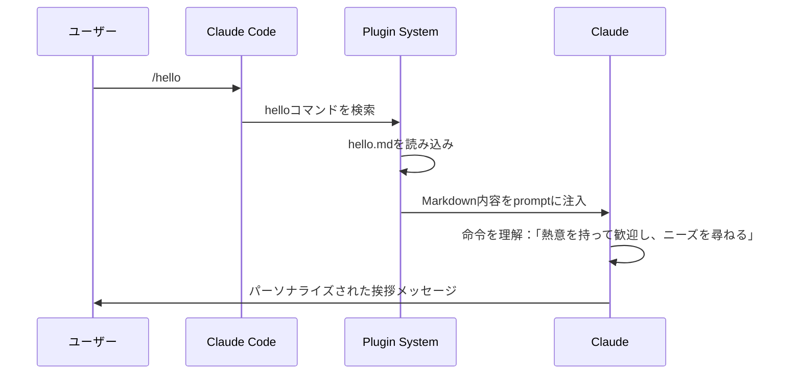
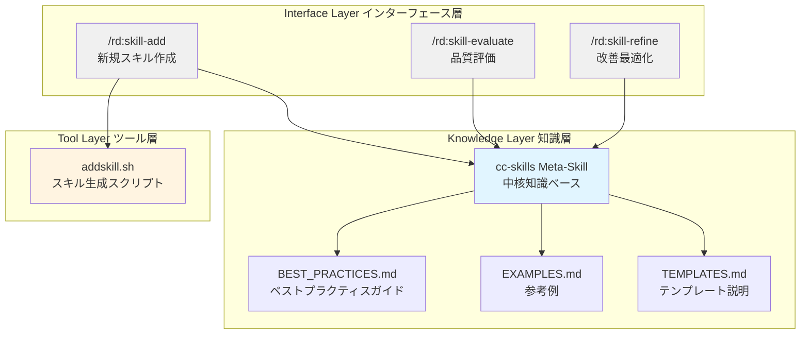

## Ⅰ. 実際のニーズから始める

[前回の記事](https://surfing.salty.vip/articles/cn/claude_code_plugins_01/)を公開後、多くのフィードバックをいただきました。その中で特に印象的だった質問があります：「Agent Skills があるのですが、これらのスキルを体系的に管理するにはどうすればよいでしょうか？新しく書いたスキルがベストプラクティスに準拠していることを確認するにはどうすればよいでしょうか？」

この質問は本質を突いています。Claude Codeの公式ドキュメントには優れたベストプラクティスガイドがありますが、この知識はドキュメントの各所に散らばっています。新しいスキルを書くたびに、複数のページをめくって関連する仕様や提案を探す必要があります。さらに厄介なのは、スキルの品質を評価するにはどうすればよいか、体系的に改善するにはどうすればよいかという問題です。

これこそがClaude Code Pluginsが解決できる問題です。しかし、手を動かす前に、まずプラグインの本質を理解したいと思います——最も単純なプラグインから始めて。

この記事は操作マニュアルではありません。複数の実際のプラグインを開発した際の経験共有です。思考プロセス、設計判断、そして踏んだ坑を紹介します。重要なのは「どうやってやるか」ではなく、「なぜこのようにするのか」です。

2つの例を見ていきます：

- **hello plugin**: 8行のコードしかない最小限のプラグインですが、主要な仕組みを理解するのに十分です
- **rd pluginのスキル管理システム**: 実際の問題をプラグインで解決する方法を示す完全なソリューション

> すべての例はサンプルに沿って段階的に学習・実行できます。公式リポジトリも直接参照できます：[robinmin/cc-agents](https://github.com/robinmin/cc-agents)

---

## Ⅱ. 最も単純なプラグイン：Hello Pluginの主要な仕組み

### 2.1 ミニマリスト設計哲学

Hello pluginは1つのコマンドしかありません。8行のMarkdown：

```markdown
---
description: パーソナライズされたメッセージでユーザーを歓迎する
---

# Hello コマンド

ユーザーを熱意を持って歓迎し、今日どのようにお手伝いできるか尋ねる。挨拶に個性と励ましを込める。
```

ただそれだけです。しかし、プラグインの主要な仕組みを完全に示しています。

marketplace.jsonでの設定は次のとおりです：

```json
{
  "name": "hello",
  "source": "./plugins/hello",
  "description": "Simple hello command plugin",
  "version": "0.0.1",
  "commands": ["./commands/hello.md"]
}
```

ファイル構造：

```
plugins/hello/
├── .claude-plugin/
│   └── (plugin.jsonは不要、marketplaceで設定済み。ここで踏んだことがあります)
└── commands/
    └── hello.md
```

### 2.2 どのように動作するか？

`/hello`と入力したとき、何が起こるのでしょうか？



**重要な洞察1**: プラグインは本質的にClaudeの「境界のある拡張」です。新しい機能を追加するのではなく、構造化された方法でClaudeに「このシナリオでは、このようにすべき」と伝えます。

**重要な洞察2**: Markdown形式のコマンドにより、Claudeは実行意図を「理解」できます。YAML frontmatterのdescriptionはClaude Codeにいつこのコマンドを活性化するかを伝え、本文はClaudeに具体的に何をすべきかを伝えます。

**重要な洞察3**: 単純だからといって無意味ではありません。Hello pluginの価値は正確さにあります——「熱意のある歓迎」という漠然とした期待を、明確な動作命令に変換します。

### 2.3 実践検証

インストールしてテストしてみましょう：

```bash
# 公式リポジトリからこのmarketplaceを追加
/plugin marketplace add robinmin/cc-agents

# または、ローカルディレクトリから追加
/plugin marketplace add /path/to/cc-agents

# marketplaceが追加されたらインストール
/plugin install hello@cc-agents

# プラグインのスラッシュコマンドを使用
/hello
```

Claudeの反応は個性豊かな挨拶になり、機械的な「こんにちは、何かお手伝いできることはありますか？」ではありません。これがプラグインの価値です——Claudeの動作パターンを調整します。今日テストしたときの出力を参考として紹介します：

> こんにちは！お会いできて嬉しいです！👋
>
> Claude Code Pluginsを探索されているとのこと、素晴らしいですね！先ほどhello pluginをインストールしてテストされた操作から、記事の内容を実践されているのがわかります。
>
> 本日どのようにお手伝いできますか？以下のようなことでも構いません：
>
> - プラグイン開発の継続的な理解
> - RD Pluginの機能テスト
> - 記事内の技術的な点の議論
> - または他に興味のあるトピック
>
> お手伝いできることを嬉しく思います！💪

いかがでしょうか？私たちはその一文だけを書きましたが、文脈に応じて様々な挨拶方法を生成できます。

### 2.4 Hello Pluginから学んだベストプラクティス

**✅BP1: 最も単純なものから始め、徐々に複雑さを増やす**

Hello pluginは1つのコマンドで完全なプラグインを構成できることを証明しています。最初から完璧なアーキテクチャを追求せず、動作するバージョンを作ってから、反復して最適化してください。

**✅BP2: コマンドの説明はClaudeに「何をするか」を明確に伝えるべき**

hello.mdの本文を見てください：「ユーザーを熱意を持って歓迎し、今日どのようにお手伝いできるか尋ねる。挨拶に個性と励ましを込める。」これは明確な動作命令であり、漠然とした期待ではありません。

**✅BP3: 日本語コマンドも同様に有効で、特定のチームシナリオに適している**

Hello pluginは日本語のdescriptionを使用しており、Claudeはよく理解しています。日本語チームの場合、日本語でコマンドを書くことで意図がより明確になり、翻訳による情報損失を減らすことができます。

---

## Ⅲ. 応用実践：RD Pluginのスキル管理システム

### 3.1 背景：メタ知識管理のニーズ

最初の問題に戻りましょう：Agent Skillsを体系的に管理するにはどうすればよいでしょうか？

私のニーズは具体的です：

1. **迅速な作成**: ベストプラクティスに準拠したスキルフレームワークをテンプレートで生成
2. **品質評価**: 既存のスキルを包括的な品質チェック
3. **継続的改善**: 評価結果に基づいて改善提案を提供

これら3つのニーズはスキルの完全なライフサイクルをカバーします：作成 → 評価 → 改善 → 再評価。日常の実践では、ツールを作成するツールをよく見かけます。一般にメタクリエイター、メタツールなどと呼ばれます。私たちはこれをメタスキル、または正式名称のcc-skills（Claude Code Skills）と呼ぶこともできます。

### 3.2 設計理念：メタ知識管理

私の中核的なアイデアは：**スキルを使ってスキルの知識を管理する**ことです。

このアイデアは観察から来ています：Claude Codeの公式ドキュメントのベストプラクティスは、それ自体が「スキルの書き方に関する知識」の一種です。この知識をメタスキルに蒸留し、Claudeがスキルを作成・評価する際に参照できるようにすれば、品質の一貫性を保証できます。

全体のアーキテクチャ設計は次のとおりです：



3層アーキテクチャの責務：

- **知識層**: ベストプラクティスを保存し、Claudeが参照できるようにする
- **ツール層**: 決定論的なファイル操作機能を提供
- **インターフェース層**: ユーザー対話のエントリーポイント、ワークフローを調整

対応するファイル組織構造：

```
plugins/rd/
├── commands/                    # インターフェース層：スラッシュコマンド
│   ├── skill-add.md            # 新規スキル作成のコマンドインターフェース
│   ├── skill-evaluate.md       # 品質評価のコマンドインターフェース
│   └── skill-refine.md         # 改善最適化のコマンドインターフェース
├── skills/                      # 知識層：メタスキル
│   └── cc-skills/
│       ├── SKILL.md            # 中核知識（~300行）
│       ├── BEST_PRACTICES.md   # 詳細なベストプラクティスガイド
│       ├── EXAMPLES.md         # 参考例と比較
│       └── TEMPLATES.md        # テンプレート使用説明
└── scripts/                     # ツール層：自動化スクリプト
    └── addskill.sh             # スキル生成スクリプト
```

**各ファイルの役割**：

| ファイル          | タイプ  | 責務                                                     | サイズ |
| ----------------- | ------- | -------------------------------------------------------- | ------ |
| skill-add.md      | Command | ユーザー入力を受け取り、スクリプトを呼び出し、結果を表示 | ~200行 |
| skill-evaluate.md | Command | 評価プロセスを定義し、品質レポートを生成                 | ~600行 |
| skill-refine.md   | Command | 対話型改善プロセス、最適化提案を適用                     | ~400行 |
| SKILL.md          | Skill   | 中核知識ナビゲーション、概要を提供                       | ~300行 |
| BEST_PRACTICES.md | Skill   | 詳細なベストプラクティスガイド                           | ~200行 |
| EXAMPLES.md       | Skill   | Before/After例の比較                                     | ~150行 |
| addskill.sh       | Script  | テンプレート生成、パラメータ検証、ファイル作成           | ~500行 |

### 3.3 設計判断の思考プロセス

**判断1: なぜメタスキルアプローチを選択したのか？**

3つのアプローチを検討しました：

1. ベストプラクティスをコマンドにハードコーディングする
2. 独立したチェックスクリプトを書く
3. スキルで知識をカプセル化する

最終的にアプローチ3を選択した理由：

- スキルはClaudeセッションで自動的にロードされ、毎回説明を繰り返す必要がない
- ハードコーディングに比べて更新・拡張が容易
- Claudeの強力な理解・適用能力を再利用できる

ここで展開する価値のある重要な設計哲学があります。Anthropicがスキルメカニズムを設計した際、中核的な考慮事項の一つは**コンテキストウィンドウの有限性**でした。Claudeのコンテキストウィンドウはすでに大きいですが（Sonnet 4.5で200K tokens）、実際の作業ではよく遭遇します：

- 大規模なコードベースを分析する際、コンテキストを急速に消費する
- 長時間対話後、初期の情報がウィンドウから押し出される
- 複数のツールやドキュメントが同時にロードされ、限られた空間を競合する

スキルの**オンデマンド読み込みメカニズム**はこの問題を解決するために設計されました：明示的に特定のスキル（`Skill`ツールまたは自動活性化を通じて）を呼び出したときのみ、その知識がコンテキストにロードされます。使用後、このコンテキスト部分を他のタスクに解放できます。

この設計により、以下が可能になります：

- **モジュール型知識管理**: 異なるドメインの知識を独立したスキルにカプセル化
- **動的読み込み戦略**: タスクのニーズに応じて、異なるスキルを柔軟に組み合わせて読み込み
- **拡張性保証**: 何百ものスキルを作成でき、コンテキストが爆発する心配がない

`cc-skills`メタスキルでは、ベストプラクティス、テンプレート説明、参考例を異なるファイルに分割したのも同様の考慮からです：中核のSKILL.mdを300行程度に保ち、詳細な内容は参照方式で必要なときに読み込むようにします。これによりClaudeは日常作業で中核知識のみを読み込み、深い理解が必要なときに詳細なドキュメントを読み込めます。

**判断2: なぜ独立したシェルスクリプトが必要なのか？**

Claudeは私の意図を理解できますが、直接ファイルを作成させるには2つの問題があります：

- **信頼性**: Claudeが間違える可能性があり、手動での確認が必要
- **効率**: テンプレート生成は機械的操作で、AIの関与は不要

そのため、addskill.shでファイル操作を処理し、Claudeはニーズの理解と提案の提供に集中させます。これは**関心分離の原則**の適用です。

ここではより普遍的な設計判断に関わる問題があります：**いつスクリプトを使い、いつプロンプトを使うか？**

実践から判断基準をまとめました：

**スクリプトを使うシーン -- 高い決定性要求**：

- **入出力が明確**: パラメータタイプが固定、出力形式が統一（例：テンプレート生成）
- **論理が列挙可能**: すべての境界条件を事前に定義可能（例：パラメータ検証、ファイル命名規則）
- **ゼロ容错要求**: 100%正確に実行する必要がある（例：ファイルシステム操作、git操作）
- **パフォーマンス敏感**: AI推論遅延なく高速応答が必要（例：ビルドプロセス、バッチ処理）

**プロンプトを使うシーン -- 高い柔軟性要求**：

- **入力が多様**: 自然言語説明で、構造化パラメータで表現が困難（例：「コード品質を評価するスキルを作成」）
- **出力に創造性が必要**: 単純なテンプレート置換ではなく、理解と生成が必要（例：ベストプラクティス作成、評価レポート生成）
- **コンテキスト依存**: プロジェクト構造、コードスタイル、対話履歴を理解する必要（例：改善提案、コードレビュー）
- **対話型決定**: 詳細を確認するための多ラウンド対話が必要（例：skill-refineの対話型改善）

`rd`プラグインでは、このように分業しています：

- `addskill.sh`は決定論的なファイル作成を処理（入力: スキル名、テンプレートタイプ → 出力: 標準化されたファイル構造）
- `skill-evaluate.md`は柔軟な品質分析を処理（入力: スキルファイル内容 → 出力: カスタマイズされた評価レポート）
- `skill-refine.md`は対話型改善プロセスを処理（入力: ユーザー意図とスキル現状 → 出力: ターゲットを絞った最適化提案）

**✅BP4: スクリプトとプロンプトの黄金比**: 決定性はスクリプトに、創造性はAIに。Claudeが同じ機械的操作を繰り返していることに気づいたら、それがスクリプトを書くサインです。スクリプトが太多くの特殊ケースを処理する必要があることに気づいたら、それがプロンプトを使うサインです。

**判断3: なぜ3つのコマンドを設計したのか？**

スキルライフサイクルの3つの段階に対応：

- `/rd:skill-add`: 作成段階、構造の正確性に焦点
- `/rd:skill-evaluate`: 評価段階、全面的な品質チェック
- `/rd:skill-refine`: 改善段階、ターゲットを絞った最適化

各コマンドは単一責務ですが、組み合わせて使用できます。これは**Unix哲学**に従います：一つのことをうまくやり、組み合わせ可能です。

この設計には暗黙的な利点もあります：**コマンドラインモードは自然にべき等性をサポート**し、繰り返し研磨が必要なシーンに特に適しています。

べき等性とは何か？簡単に言えば：**複数回実行しても1回実行しても同じ効果**ということです。スキル開発では、これを意味します：

- `/rd:skill-evaluate my-skill`は繰り返し実行でき、毎回最新状態に基づいて評価を提供
- `/rd:skill-refine my-skill`は複数回呼び出せ、毎回現在の問題に対して改善提案を提供
- 「すでに評価した」という理由で再実行を拒否しない
- 「すでに改善した」という理由でエラー状態を蓄積しない

この設計はスキル開発にとって特に重要です。なぜなら：

**良いスキルを書くには複数回の反復が必要**です：

1. **下書き**: skill-addで素早く骨格を生成
2. **評価**: skill-evaluateが問題を発見（説明が簡略すぎる、例がない、構造が不明確）
3. **改善**: skill-refineで提案を適用
4. **再評価**: skill-evaluateで改善効果を確認
5. **再改善**: 満足するまで継続して最適化

このサイクルでは、各evaluateは現在のファイル内容に基づく**全く新しい評価**であり、以前の評価の影響を受けません。各refineも**現在の問題**に対する独立した提案です。これがべき等性の価値です：自由に繰り返し実行でき、状態混乱を心配する必要がありません。

コマンドラインモードでない場合と比較してみましょう：

- **対話式**: 「改善を続ける」→しかしClaudeは前回どこまで修正したか覚えていないかもしれない
- **ワンショットツール**: 「全自動最適化」→一発で成功するか、失敗してやり直し
- **状態機械モード**: 「次へ」→固定順序で実行する必要があり、飛ばせない

コマンドラインのべき等性により：

- いつでも任意の段階にジャンプできる（評価したければ評価、改善したければ改善）
- 「前回どこまで実行したか」を気にする必要がない（毎回が新たな開始）
- リズムを自由に制御できる（評価1回で十分かもしれないし、10回必要かもしれない）

**✅BP5: 反復を受け入れ、べき等コマンドを設計する**: 繰り返し研磨が必要なタスク（コードレビュー、ドキュメント最適化、アーキテクチャ設計）については、「ウィザード形式プロセス」ではなく「独立したべき等コマンド」を設計してください。ユーザーが自由に繰り返し実行でき、毎回最新状態に基づいて結果を得られるようにします。

### 3.4 中核コンポーネント実装詳解

#### 3.4.1 知識蒸留：cc-skills

##### 知識ソース

私の知識ソースは3つあります：

1. **公式ドキュメント**: https://docs.claude.com/en/docs/agents-and-tools/agent-skills/best-practices
2. **実践経験**: 他のスキル作成時に踏んだ坑
3. **反復フィードバック**: `/rd:skill-evaluate`でcc-skills自体を評価したときの発見

##### 知識組織：プログレッシブ開示

SKILL.mdの構造設計は**プログレッシブ開示（Progressive Disclosure）**原則に従っています：

```markdown
---
name: cc-skills
description: Claude Code Agent Skills作成のドメイン知識とベストプラクティス
---

# Claude Code Agent Skills - ベストプラクティス

## 中核アーキテクチャ

[中核アーキテクチャの簡潔な説明]

詳細なガイドラインはBEST_PRACTICES.mdを参照。

## 効果的なスキル作成

[主要なポイントリスト]

完全な例はEXAMPLES.mdを参照。

## 品質チェックリスト

- [ ] 構造要件
- [ ] コンテンツ品質
- [ ] コード標準
      ...
```

**設計考慮事項**：

- SKILL.mdを~300行に制御し、トークン効率を確保
- 詳細な内容をBEST_PRACTICES.md（約200行）、EXAMPLES.md（約150行）に分散
- 参照の深さは1層を超えない（SKILL.md → BEST_PRACTICES.md、それ以上は深入りしない）

なぜこのように設計したのか？Claudeがスキルをロードする際、まずSKILL.mdを読み込みます。すべての内容を1つのファイルに詰め込むと、大量のトークンを消費し、パフォーマンスに影響します。プログレッシブ開示により、Claudeは必要なときのみ詳細な内容を読み込めます。

**✅BP6: スキルの説明には「何をするか」と「いつ使用するか」を含める必要がある**

cc-skillsのdescriptionを見てください：「Claude Code Agent Skills作成のドメイン知識とベストプラクティス」

- 「何をするか」：ドメイン知識とベストプラクティスを提供
- 「いつ使用するか」：Claude Code Agent Skillsを作成する際

**✅BP7: SKILL.mdを簡潔に保つ（<500行）、参照で詳細な内容を管理**

これはトークン効率の鍵です。テストで500行を超えるSKILL.mdは応答時間を明らかに増加させることを発見しました。

**✅BP8: 一貫した用語使用が豊かな表現より重要**

cc-skillsでは、「skill」「agent skill」「claude skill」ではなく一貫して「Skill」を使用しています。少し単調かもしれませんが、Claudeの理解のずれを避けられます。

**✅BP9: 具体的な例が抽象的な説明に勝る**

EXAMPLES.mdでは完全なbefore/after比較を提供：

````markdown
## 例：スキル構造の改善

### 修正前（悪い構造）

```yaml
---
name: my-skill
---
何か有用なことを実行。
```
````

````

### 修正後（良い構造）
```yaml
---
name: my-skill
description: コード品質を分析し、改善を提案する。コードレビュー時に使用。
---

# My Skill

## 目的
[このスキルが何をするかの明確な記述]

## ワークフロー
1. 具体的なアクションを伴うステップ
2. 検証基準
...
````

```

```

この比較により、Claudeは「良い」と「悪い」の違いを迅速に理解できます。

#### 3.4.2 ツールスクリプト：addskill.sh

##### 設計アイデア

addskill.shはテンプレート生成の自動化を担当し、中核的な設計アイデア：

1. **厳格な検証**: 入力パラメータが仕様に準拠していることを確認
2. **複数のテンプレート**: 異なるタイプのスキルニーズをカバー
3. **明確なエラーメッセージ**: エラー時にユーザーに修正方法を伝える
4. **独立使用可能**: Claudeに依存せず、直接実行可能

##### 使用方法

```bash
# 基本構文
addskill.sh <plugin-name> <skill-name> [template-type]

# パラメータ説明
# plugin-name    - プラグイン名（例："rd", "hello"）
# skill-name     - 新規スキル名（小文字、数字、ハイフン、最大64文字）
# template-type  - オプション、テンプレートタイプ（デフォルト: basic）

# 利用可能なテンプレートタイプ
basic      # 基本テンプレート - シンプルなフォーカスされたタスク（~160行）
           # 含む: SKILL.md
           # 適用: 単一責任のシンプルなスキル

complete   # 完全テンプレート - 複雑なドメインの詳細ガイド（~230行 + サポートファイル）
           # 含む: SKILL.md, REFERENCE.md, EXAMPLES.md, scripts/
           # 適用: 詳細なドキュメントとツールサポートが必要な複雑なスキル

workflow   # ワークフローテンプレート - 多段階プロセス（~370行）
           # 含む: SKILL.md（検証と回復ロジック付き）
           # 適用: 多段階検証が必要なプロセス型スキル

analysis   # 分析テンプレート - 検査またはレビュータスク（~450行）
           # 含む: SKILL.md（構造化レポート形式付き）
           # 適用: コードレビュー、品質分析などの評価型スキル

# 使用例
addskill.sh rd code-review complete       # 完全なコードレビュースキルを作成
addskill.sh rd api-docs basic             # 基本的なAPIドキュメントスキルを作成
addskill.sh hello greeting-formatter      # デフォルトのbasicテンプレートを使用

# 検証ルール
# ✅ 正しい: my-skill, api-v2, user-auth-flow
# ❌ 間違い: MySkill (大文字), my_skill (アンダースコア), my.skill (ドット)
# ❌ 間違い: claude-helper (予約語 "claude" を含む)
# ❌ 間違い: very-long-skill-name-that-exceeds-sixty-four-character-limit (>64文字)

# 出力
# ✓ plugins/<plugin>/skills/<skill-name>/ を作成
# ✓ SKILL.mdを生成（およびその他サポートファイル、テンプレートに依存）
# ✓ README.mdを生成（次のステップガイドを含む）
```

具体的なコードは[github](https://github.com/robinmin/cc-agents/blob/main/plugins/rd/scripts/addskill.sh)を参照。

**設計のハイライト**: スクリプトは4つのテンプレートを提供し、90%のスキル開発シナリオをカバーします。ニーズに応じて適切な開始点を迅速に選択でき、毎回空白ファイルから始める必要はありません。テンプレート間の主な違いは**初期構造の複雑さ**と**サポートファイルの完全性**ですが、すべて同じベストプラクティスに従います。

##### 主要な実装解析

**パラメータ検証**:

```bash
# スキル名フォーマットを検証
if ! echo "$SKILL_NAME" | grep -qE '^[a-z0-9-]+$'; then
    error "Invalid skill name: $SKILL_NAME"
    echo "Skill names must be lowercase letters, numbers, and hyphens only"
    exit 1
fi

# 長さを検証
if [ ${#SKILL_NAME} -gt 64 ]; then
    error "Skill name too long: ${#SKILL_NAME} characters (max 64)"
    exit 1
fi

# 予約語をチェック
if echo "$SKILL_NAME" | grep -qE 'anthropic|claude'; then
    error "Skill name cannot contain reserved words: anthropic, claude"
    exit 1
fi
```

**設計考慮事項**: なぜこれほど厳格なのか？

スキル名はコマンドの一部になるため（例：`/rd:skill-evaluate my-skill`）、以下を保証する必要があります：

- パスインジェクションリスクを回避（小文字、数字、ハイフンのみ許可）
- クロスプラットフォーム互換性を確保（スペース、特殊文字を使用しない）
- 命名競合を回避（予約語を禁止）

**✅BP10: スクリプトはすべてのエラー状況を処理し、Claudeに頼らない**

スクリプトが入力が常に正しいと仮定すると、Claudeが様々な境界状況を処理する必要があります。これは関心分離の原則に違反します——スクリプトは決定性を保証し、Claudeは理解と判断に集中させるべきです。

**テンプレート生成ロジック**:

```bash
case "$TEMPLATE_TYPE" in
    basic)
        # シンプルなタスク、迅速な開始
        cat > "$SKILL_DIR/SKILL.md" <<'EOF'
---
name: SKILL_NAME_PLACEHOLDER
description: DESCRIPTION_PLACEHOLDER
---

# SKILL_TITLE_PLACEHOLDER

## Workflow
1. **Step 1 Title**
   - Action detail

## Example
...
EOF
        ;;

    complete)
        # 複雑なドメイン、詳細なドキュメントが必要
        # SKILL.md, REFERENCE.md, EXAMPLES.md, scripts/ を作成
        ;;

    workflow)
        # 多段階プロセス、検証メカニズムが必要
        ;;

    analysis)
        # 分析タイプのタスク、レポート形式が必要
        ;;
esac
```

**設計考慮事項**: テンプレートを選択するには？

意思決定テーブルを提供：

| スキルタイプ           | 推奨テンプレート | 典型的な特徴                         |
| ---------------------- | ---------------- | ------------------------------------ |
| シンプルな対話コマンド | basic            | 単一タスク、複雑な状態なし           |
| 知識集約型             | complete         | 詳細な参考ドキュメントが必要         |
| 多段階ワークフロー     | workflow         | 検証ポイントあり、失敗時リトライ必要 |
| 分析評価型             | analysis         | 構造化レポートを出力                 |

**✅BP11: パラメータ検証は厳格にし、明確なエラーメッセージを提供**

このエラーメッセージを見てください：

```
ERROR: Skill name too long: 72 characters (max 64)
```

ではなく：

```
ERROR: Invalid input
```

前者はユーザーに問題が何か、現在値、許容範囲を伝え、後者はユーザーに推測させるしかできません。

**✅BP12: 複数のテンプレートを提供するが、明確な選択ガイダンスを与える**

4つのテンプレートが大部分のシナリオをカバーしますが、skill-add.mdで選択ガイダンスを提供し、ユーザーの混乱を避けています。

#### 3.4.3 コマンドインターフェース：スラッシュコマンド

##### /rd:skill-addの設計

このコマンドの責務：

1. ユーザー入力を受け取る（plugin、skill名、テンプレートタイプ）
2. パラメータの妥当性を検証
3. addskill.shスクリプトを呼び出す
4. 結果と次のステップを表示

主要なコードスニペット：

````markdown
## Workflow

1. **入力を検証**
   - marketplaceにplugin名が存在するか確認
   - スキル名フォーマットを検証（小文字、ハイフン、最大64文字）
   - テンプレートタイプが有効であることを確認

2. **スクリプトを実行**

   ```bash
   $PROJECT_ROOT/plugins/$PLUGIN_NAME/scripts/addskill.sh \
     $PLUGIN_NAME $SKILL_NAME $TEMPLATE_TYPE
   ```

3. **結果を表示**
   - 作成されたファイルを表示
   - 次のステップガイダンスを提供
   - /rd:skill-evaluateの使用を提案
````

**設計考慮事項**: コマンドとスクリプトの協調モデル

コマンドは以下を担当：

- ユーザー対話とパラメータ収集
- パラメータの意味論検証（例：pluginが存在するか）
- 結果表示とガイダンス

スクリプトは以下を担当：

- パラメータフォーマット検証
- ファイルシステム操作
- テンプレート生成

両者は明確なインターフェースを通じて協調し、互いに干渉しません。

##### /rd:skill-evaluateの設計

3つのコマンドの中で最も複雑で、スキル品質を包括的に評価するためです。

評価次元設計：

```markdown
## 評価次元

### 1. 構造品質（25%）

- YAML frontmatterの完全性
- ファイル組織
- 参照深度（最大1レベル）

### 2. コンテンツ品質（35%）

- 説明の明確さ（what + when）
- ワークフロー定義
- 例の品質
- 一貫性

### 3. コード品質（20%）

- スクリプトエラーハンドリング
- パラメータドキュメント
- 依存関係の明確さ

### 4. テスト品質（20%）

- クロスモデル検証
- 実世界シナリオ
```

**設計考慮事項**: 評価基準はどのように制定したか？

ソフトウェア工学の品質モデルを参考にしましたが、調整しました：

- **構造品質**のウェイトが低い（25%）、これが基礎だからで、ほとんどのスキルが達成可能
- **コンテンツ品質**のウェイトが高い（35%）、これが中核価値だから
- **テスト品質**のウェイト（20%）、クロスモデル互換性の重要性を反映

レポート形式設計：

```markdown
# スキル評価レポート: {skill-name}

**総合スコア**: 85/100（良い）

## 次元スコア

- 構造: 23/25 ✅
- コンテンツ: 28/35 ⚠️ 改善が必要
- コード: 18/20 ✅
- テスト: 16/20 ⚠️ 改善が必要

## 主要な発見

### 強み

- 整然としたファイル構成
- 明確なワークフロー定義

### 問題点

1. **[中程度] 説明に「いつ使用するか」が欠如**
   - 場所: SKILL.md:2
   - 現在: "コード品質を分析"
   - 提案: "コード品質を分析し、改善を提案する。コードレビュー時に使用。"

## 推奨事項

...
```

**✅BP13: コマンドはワークフローを明確に定義し、Claudeが実行ステップを理解できるようにする**

/rd:skill-evaluateのMarkdownで、評価のステップを明確に記述：ファイルを読み込む → 構造を確認する → コンテンツを評価する → レポートを生成。これによりClaudeは系統的に評価を実行でき、ランダムなチェックを避けられます。

**✅BP14: 構造化された出力形式を提供し、ユーザーの理解を容易にする**

評価レポートはMarkdown構造化出力を使用し、自由なテキストではありません。ユーザーは問題を迅速に特定でき、大段落の文字列でキー情報を探す必要がありません。

##### /rd:skill-refineの設計

このコマンドは評価結果に基づいて改善提案を提供する責務があります。

対話型ワークフロー設計：

```markdown
## 対話型改善ワークフロー

1. **評価結果を読み込む**
   - 最近の評価が存在すれば読み込む
   - そうでなければ、まず/rd:skill-evaluateを実行するよう促す

2. **問題を優先順位付け**
   - 重要度でグループ化：Critical > High > Medium > Low
   - 上位3つの問題に焦点を当てる

3. **改善を生成**
   - 各問題について、以下を提供：
     - 現在の実装
     - 改善提案
     - 根拠

4. **変更を適用**
   - 差分プレビューを表示
   - 確認を要求
   - 変更を適用

5. **検証**
   - 再度/rd:skill-evaluateを実行することを提案
```

**設計考慮事項**: なぜ対話型ワークフローを採用するのか？

一度ですべての改善を生成しようと試みましたが、問題を発見：

- ユーザーがすべての提案に同意しないかもしれない
- 一度に変更が多すぎると、効果を検証するのが難しい
- 学習プロセスが欠けている

対話型ワークフローにより、ユーザーが意思決定に参加し、少しずつ変更し、すぐに検証でき、学習効果がより高くなります。

**✅BP15: コマンドは組み合わせて使用できるべき**

完全な改善ワークフロー：

```
/rd:skill-evaluate my-skill  # 評価
↓
/rd:skill-refine my-skill    # 改善
↓
/rd:skill-evaluate my-skill  # 再評価、改善効果を検証
```

3つのコマンドが閉ループを形成し、継続的改善をサポートします。

### 3.5 完全な使用デモンストレーション

#### シナリオ：新しいスキルを作成し改善する

```bash
# ステップ1: marketplaceを追加
# 公式リポジトリからこのmarketplaceを追加
/plugin marketplace add robinmin/cc-agents

# または、ローカルディレクトリから追加
/plugin marketplace add /path/to/cc-agents

# ステップ2: rd pluginをインストール
/plugin install rd@cc-agents

# ステップ3: 新しいスキルを作成（completeテンプレートを使用）
/rd:skill-add rd code-review complete

# Claudeはaddskill.shを呼び出し、以下を作成：
# - plugins/rd/skills/code-review/SKILL.md
# - plugins/rd/skills/code-review/REFERENCE.md
# - plugins/rd/skills/code-review/EXAMPLES.md
# - plugins/rd/skills/code-review/scripts/
# - plugins/rd/skills/code-review/README.md

# ステップ4: SKILL.mdを編集し、内容を記入
# （このステップは手動編集が必要で、具体的なワークフロー、例などを追加）

# ステップ5: 品質を評価
/rd:skill-evaluate code-review

# 出力例:
# 総合スコア: 72/100（普通）
# 問題点:
# 1. [高] 説明に「いつ使用するか」が欠如
# 2. [中程度] SKILL.mdが500行を超過
# 3. [低] ワークフローに具体的な例が欠如

# ステップ6: 提案に基づいて改善
/rd:skill-refine code-review

# Claudeは以下を実行：
# 1. 評価結果を読み込む
# 2. 問題1に対し、descriptionの修正を提案
# 3. 問題2に対し、内容をREFERENCE.mdに分割することを提案
# 4. 問題3に対し、コード例を追加することを提案

# ステップ7: 再評価し、改善を検証
/rd:skill-evaluate code-review

# 出力: 総合スコア: 89/100（良い）
```

インストールが完了すると、Claude Codeはこのようになり、新しい`rd` pluginが正常にインストールされ、使用可能になったことが示されます。


#### 実践：cc-skills自体を評価

一般的なスキルを評価するツールを作成しているのですが、ではその槍でその盾を攻撃するとどうなるのでしょうか？この節では実際の結果を見てみましょう：cc-skillsを使ってそれ自体を評価し、どのような結果になるかを見てみましょう：

```bash
/rd:skill-evaluate plugins/rd/skills/cc-skills
```

評価結果（抜粋）：

```markdown
# スキル品質評価: cc-skills

## エグゼクティブサマリー

- 全体品質: 優秀
- 準備状態: 本番稼働可能

## 主要な強み:

- 権威あるドメイン知識を持つ包括的なメタスキル
- 模範的な構造と組織パターン
- 明確で実行可能なガイダンスを持つ優れたコンテンツ品質
- 教えるベストプラクティスへの完全な準拠
- サポートリファレンスファイルを持つ優れたプログレッシブ開示

## 重要な問題:

- 特定の問題はありません

推奨事項: このスキルは模範的な参考実装として機能し、スキル作成と洗練のためのメタスキルとして本番稼働の準備ができています。

......

## 品質メトリクスサマリー

| カテゴリ           | スコア | ウェイト | ウェイトスコア |
| ------------------ | ------ | -------- | -------------- |
| Frontmatter準拠    | 10/10  | 15%      | 1.5            |
| コンテンツ品質     | 10/10  | 30%      | 3.0            |
| 構造と組織         | 10/10  | 20%      | 2.0            |
| トークン効率       | 10/10  | 15%      | 1.5            |
| ベストプラクティス | 10/10  | 15%      | 1.5            |
| コード品質         | N/A    | 5%       | 0.5 (平均)     |
| 総合スコア         |        |          | 10.0/10        |

グレード: A

- A (9.0-10.0): 優秀 - 本番稼働可能

## 維持すべき強み

1. コンテンツの優秀性
   - 権威あるドメイン知識の提示
   - 完全性と簡潔性の完璧なバランス
   - 例外の明確さと組織
   - なぜこれが機能するのか： genuineに有用であると同時に参考実装として機能
2. 構造の完全性
   - 理想的なプログレッシブ開示実装
   - 明確な目的を持つ完璧なファイル組織
   - 最適な参照深度を維持
   - なぜこれが機能するのか：教えるパターンを実証
3. ベストプラクティスリーダーシップ
   - アンチパターンを検出せず
   - すべてのガイドラインへの模範的な準拠
   - 全体を通じた一貫した用語
   - なぜこれが機能するのか：実践する教えを信頼を構築

## 次のステップ

### 即時アクション

1. 重要な修正は不要
   - スキルは現状のままで本番稼働可能
   - 現バージョンをリリース用の安定版とみなす

### 推奨メンテナンス

1. 定期的レビュー
   - 四半期ごとにレビューし、Claude能力の変化を確認
   - パターンが進化するにつれて例を更新
   - Claude Codeの更新との整合性を維持
2. コミュニティ統合
   - 他のスキル評価の参考として使用
   - ドキュメントで模範として強調
   - スキル作成チュートリアルで参照

......

## 結論

cc-skillsスキルはClaude Code Agentスキルの模範的な実装を表しています。スキル作成自体のための権威あるドメイン知識として機能しながら、すべての基準の習熟を実証することで10.0/10の完全なスコアを達成しています。

### 主要な成果:

- 教えるすべてのベストプラクティスへの完全な準拠
- 最適なトークン効率を持つ優れたコンテンツ品質
- 参考パターンとして機能する理想的な構造組織
- スキル作成ドメインの包括的なカバー
- アンチパターンや品質問題のゼロ

### 特別な価値:

メタスキルとして、cc-skillsはエコシステム全体を強化するユニークな基礎知識を提供します。その品質は信頼を確立し、他のスキル作者のための参考実装として機能します。

本番稼働準備完了: はい
```

**反省**:

この評価はいくつかの興味深い現象を明らかにしました：

- **ツールの論理的一貫性**: このツール自体の価値がどうであれ、まず論理的一貫性を達成しています：私たちが作成したツールでそれ自体を評価し、ほぼ満点の効果を得られます。特に、LLMの出力の不確実性を理解していると、さらに印象深くなります。
- **ツールのモデル独立性**: 実際の開発ではsonnet 4.5を使用しました。開発後のテストスコアは9.8で、基本的に満足でした。この記事を書く際に上記の出力を截取する必要があり、今日たまたまClaudeのトークンが切れたので、GLM 4.6をClaude Codeに乗せて上記のコマンドを実行しました。モデルを跨いだ後にスコアが明らかに低下するのではないかと心配でした。結果から見ると、スコアは逆に高くなりました。これはツールが一定のモデル独立性を持つと理解できます。大規模モデルアプリケーションにとって、確実性は困難であり、さらに良いことです。

### 3.6 開発プロセスでの挑戦と解決策

#### 挑戦1: 知識の蒸留と組織

**問題**: 公式ドキュメントは20+ページあり、どのようにエッセンスを抽出するか？

**最初の試み**: 最初はすべての内容をSKILL.mdに入れましたが、結果として800行を超え、Claudeの読み込みが非常に遅くなりました。

**解決策**:

1. 中核知識を確定：何が「必須知識」で、何が「参考資料」か
2. 品質チェックリストを確立し、問題志向で知識を組織
3. プログレッシブ開示で内容を分割

**学んだ経験**: ベストプラクティスは実行可能であるべきで、記述的ではないべきです。「説明は明確であるべき」と言うより、「説明には『何をするか』と『いつ使用するか』を含める必要がある」と言うべきです。

**✅BP16: スキル開発前に評価基準を作成する（評価駆動開発）**

私はまずskill-evaluateの評価基準を書き、それからcc-skillsを書きました。これにより、書く過程で基準に照らして確認でき、抜け漏れを避けられました。

#### 挑戦2: トークン効率

**問題**: 完全なベストプラクティスドキュメントは大量のトークンを消費し、応答速度に影響します。

**データ**:

- SKILL.md 800行: ~6000 tokens
- 最適化後311行: ~2300 tokens
- 節約: ~60%

**解決策**:

1. 詳細な内容をREFERENCE.md、EXAMPLES.mdに移動
2. SKILL.mdには「ナビゲーション」と「中核ワークフロー」のみを保持
3. 「詳細はXXX.mdを参照」で詳細内容を参照

**検証**: 異なるサイズのSKILL.mdで応答時間をテスト:

- 311行: 平均2.3秒
- 500行: 平均3.1秒
- 800行: 平均4.7秒

**✅BP7**（再強調）: SKILL.mdを簡潔に保つ（<500行）、これは提案ではなく、パフォーマンス要件です。

#### 挑戦3: クロスモデル互換性

**問題**: Opusが理解できる内容は、Haikuはより多くの詳細が必要かもしれません。

**発見**: Haikuでテストした際、抽象的な説明の理解がOpusより劣ることがわかりました。例：

抽象的な説明：「Ensure content is clear and actionable」
→ Haikuは具体的に何をチェックすべきかわからない

具体的なチェックリスト：

- [ ] 説明に 'what' と 'when' が含まれる
- [ ] ワークフローに番号付きステップがある
- [ ] 例が具体的で完全
      → Haikuは正確に実行できる

**解決策**: 具体的な例を提供し、推論への依存を減らす。

**✅BP17: 異なるClaudeインスタンスでテストする**

私の実践:

- 1つのClaudeセッションを設計・開発に使用
- もう1つのセッションをテストに使用（新規ユーザーをシミュレート）
- Haiku/Sonnet/Opusでそれぞれ検証

#### 挑戦4: ツールチェーン統合

**問題**: Command、Script、Skillはどのように協調するか？責務境界はどこにあるか？

**初期設計**: Commandが直接ファイルを生成
→ 問題:Claudeが間違える可能性があり、繰り返し確認が必要

**改善案**: CommandがScriptを呼び出す
→ 問題:Scriptがエラーになったとき、Claudeが対処方法を知らない

**最終案**:

- Scriptがすべてのファイル操作を担当し、明確なエラー情報を返す
- Commandがエラーを説明し、ユーザーに解決を導く
- Skillが背景知識を提供し、Claudeが意図を理解するのを助ける

**学んだ経験**: 単一責任原則はプラグイン開発でも同様に重要です。各コンポーネントが一つのことをうまくやり、明確なインターフェースを通じて協調します。

**✅BP18: 実際の使用での問題を観察し、考えられる問題を仮定しない**

最初に心配した多くの問題（命名競合、パスエラーなど）は実際の使用ではほとんど発生しません。本当に問題なのは：ユーザーがどのテンプレートを選択すべきかわからない、評価レポートの意味を理解できないことでした。そのため、テンプレート選択ガイダンスとレポート形式の最適化に多くの時間を費やしました。

---

## Ⅳ. ベストプラクティスのまとめ

Hello PluginとRD Pluginの開発を通じて、以下の再利用可能な経験を蒸留しました。

### 4.1 プラグイン設計原則

#### 💡 原則1: 簡単性原則

**最も単純なバージョンから始める**

Hello Pluginは8行のコードで有用なプラグインを作成できることを証明しています。最初から「完璧なアーキテクチャ」を追求せず、まず動作するバージョンを作り、実際のニーズに基づいて反復してください。

```
MVP → フィードバック収集 → 反復的最適化 → 再フィードバック収集 ...
```

**徐々に複雑さを増やす**

RD Pluginのスキル管理システムも徐々に進化しました：

1. v1: addskill.shのみ、手動でファイル作成
2. v2: /rd:skill-addを追加、コマンドインターフェースを提供
3. v3: /rd:skill-evaluateを追加、品質評価をサポート
4. v4: /rd:skill-refineを追加、閉ループを形成

各バージョンが使用可能で、毎回新しい能力を一つだけ追加しています。

**一度に一つの機能のみを追加**

これはアジャイル開発の中核思想で、プラグイン開発にも同様に適用されます。一度に複数の機能を追加すると、問題が発生したときに特定するのが難しくなります。

#### 💡 原則2: 関心分離原則

**Command: ユーザー対話インターフェース**

- パラメータを受け取り検証
- 結果を表示しガイダンス
- 直接ファイル操作しない

**Skill: 知識とガイダンス**

- ドメイン知識を提供
- ワークフローを定義
- 具体的な操作を実行しない

**Script: 決定論的操作**

- ファイルシステム操作
- テンプレート生成
- Claudeに依存しない

各コンポーネントは単一責務を持ち、明確なインターフェースを通じて協調します。

#### 💡 原則3: プログレッシブ開示原則

**メインファイルは簡潔に保つ**

SKILL.mdは目次のようにし、Claudeが全体を迅速に理解できるようにする：

```markdown
## 中核概念

[簡潔な説明]

詳細なガイドラインはBEST_PRACTICES.mdを参照。

## ワークフロー

[主要なステップ]

完全な例はEXAMPLES.mdを参照。
```

**詳細な内容は必要に応じて参照**

Claudeが詳細な情報が必要なときのみ、REFERENCE.md、EXAMPLES.mdなどをロードします。

**参照の深さは1層を超えない**

❌ 悪い: SKILL.md → REFERENCE.md → DETAILS.md → ADVANCED.md
✅ 良い: SKILL.md → REFERENCE.md (停止)

深すぎる参照はClaudeを混乱させ、トークン効率にも影響します。

#### 原則4: ユーザー体験原則

**明確なエラーメッセージ**

```bash
# ❌ 悪い
ERROR: Invalid input

# ✅ 良い
ERROR: Skill name too long: 72 characters (max 64)
Skill names must be lowercase letters, numbers, and hyphens only
```

**構造化された出力**

Markdownの見出し、リスト、コードブロックで出力を整理し、大段落の文字列を使用しない。

**一貫した命名スタイル**

プラグイン内のすべてのコマンド、スキル、スクリプトは統一された命名規則に従うべきです。

実際の使用経験に基づき、2つの重要な命名提案があります：

**✅BP19: プラグイン名は短く精錬すべき**

理由：Claude Codeがスラッシュコマンドをロードする際、`plugin-name:command-name`形式をプレフィックスとして使用します。プラグイン名が長すぎると、コマンドが冗長になります：

```bash
# ❌ 悪い: 名前が長すぎる
/rapid-development-tools:skill-add
/rapid-development-tools:skill-evaluate
/rapid-development-tools:skill-refine

# ✅ 良い: 短く読みやすい
/rd:skill-add
/rd:skill-evaluate
/rd:skill-refine
```

プラグイン名を2-6文字に制御することを提案し、認識性と簡潔さを両立させます。一般的な良い例：`rd`(rapid dev)、`ui`(user interface)、`db`(database)。

**✅BP20: コマンドは`<オブジェクト>-<動詞>`構造を採用**

理由：Claude Codeがコマンドリストを表示する際、アルファベット順にソートします。`<object>-<verb>`構造を使用すると、同じオブジェクトのすべての操作が自動的に集約され、検索と使用に便利です：

```bash
# ✅ 良い: オブジェクトで整理、操作が集約
/rd:skill-add          # skill関連コマンドが集約
/rd:skill-evaluate     # ↓
/rd:skill-refine       # ↓

# ❌ 悪い: 動詞で整理、操作が分散
/rd:add-skill          # add関連コマンド
/rd:evaluate-skill     # evaluate関連コマンド（他のコマンドで分割）
/rd:refine-skill       # refine関連コマンド（他のコマンドで分割）
```

この設計により、ユーザーが`/rd:skill`と入力した後、TAB補完ですべてのskill関連操作を確認でき、「オブジェクトで考える」自然な習慣に合致します。

### 4.2 開発ワークフローベストプラクティス

#### フェーズ1: 要件分析

**解決する問題を明確にする**

「プラグインを作りたい」ではなく、「X問題に遭遇し、Y能力が必要」です。

**使用シナリオとトリガー条件を確定**

- 誰がこのプラグインを使用するか？
- どのような状況で使用するか？
- どのような効果を期待するか？

**プラグインが本当に必要か評価**

Claude自体がすでに非常に強力で、多くのタスクはプラグインを必要としません。以下が必要な場合のみプラグイン開発を検討：

- 構造化されたワークフロー
- 再利用可能な能力
- チーム協力標準

#### フェーズ2: 設計

**最も単純な実装から始める**

Hello Pluginを参考に、最小実行可能バージョンを作成してください。

**明確なファイル組織構造を設計**

```
plugins/my-plugin/
├── commands/
│   ├── do-something.md
│   └── check-quality.md
├── skills/
│   └── domain-knowledge/
│       ├── SKILL.md
│       └── REFERENCE.md
└── scripts/
    └── automation.sh
```

**コンポーネント間の協調方法を計画**

データフロー図を描く：ユーザー入力 → Command → Script/Skill → 出力

#### フェーズ3: 実装

**中核機能を先に実装**

境界状況に気を取られず、まずメインフローを通してください。

**エラーハンドリングを追加**

その後、発生しうるエラーを処理：パラメータエラー、ファイルが存在しない、権限問題など。

**明確なドキュメントを提供**

各コマンドには明確な使用説明と例が必要です。

#### フェーズ4: テスト

**新しいClaudeセッションでテスト**

開発時のClaudeセッションにはコンテキストがあり、問題を隠す可能性があります。新規セッションは説明が不明確、重要な情報が欠けているなどの問題を暴露できます。

**クロスモデルテスト（Haiku/Sonnet/Opus）**

異なるモデルの理解能力は異なり、すべてのモデルで動作することを確認する必要があります。

**実際の使用フィードバックを収集**

他の人に試してもらい、遭遇した問題を観察してください。

#### フェーズ5: 反復的最適化

**実際の使用での問題を観察**

問題を仮定せず、実際の使用状況を観察してください。

**フィードバックに基づいて実装を調整**

高頻度の問題を優先的に解決し、「完璧」を追求しないでください。

**継続的にベストプラクティスを蒸留**

学んだ経験を文書化し、再利用可能な知識を形成してください。

### 4.3 一般的な問題と解決策

#### 問題1: どのプラグインコンポーネントを使用するかを選択するには？

| ニーズ                 | 推奨ソリューション | 理由                         | 例                  |
| ---------------------- | ------------------ | ---------------------------- | ------------------- |
| シンプルな対話コマンド | Command            | 軽量、実装が簡単             | /hello              |
| ドメイン知識が必要     | Skill              | Claudeが理解・適用可能       | cc-skills           |
| 決定論的ファイル操作   | Script             | 信頼性が高く、AIに依存しない | addskill.sh         |
| 自動化ワークフロー     | Hook               | 手動トリガー不要             | pre-commit チェック |
| 外部ツール統合         | MCP Server         | 標準化インターフェース       | データベース接続    |

#### 問題2: プラグインが遅くなった場合はどうするか？

**診断**:

1. SKILL.mdの長さを確認（<500行べき）
2. 参照深度を確認（≤1レベルべき）
3. 冗長な内容があるか確認

**最適化**:

1. 大きなファイルをREFERENCE.md、EXAMPLES.mdに分割
2. 重複内容を削除
3. より簡潔な表現を使用

#### 問題3: Claudeが期待通りに実行しない場合はどうするか？

**可能な原因**:

1. コマンド説明が不明確
2. 具体的な例が欠けている
3. ワークフローが複雑すぎる

**解決策**:

1. descriptionに「何をするか」と「いつ使用するか」を明確に記述
2. Markdown本文に具体的な例を追加
3. ステップを簡素化し、各ステップで一つのことだけを行う

#### 問題4: クロスプラットフォーム互換性を処理するには？

**一般的な問題**:

- Windowsパス区切り文字(\) vs Unix(/)
- 改行コード(CRLF vs LF)
- シェルスクリプト互換性

**ベストプラクティス**:

1. ドキュメントでは統一して `/` (フォワードスラッシュ) を使用
2. スクリプトでパス互換性を明示的に処理
3. プラットフォーム制約を明記（例：「このスクリプトはUnix系システムのみサポート」）

### 4.4 品質チェックリスト（完全版）

プラグイン公開前に、このチェックリストで確認してください：

#### 構造品質

- [ ] ファイル組織が明確で合理的
- [ ] 参照深度が1層を超えない
- [ ] フォワードスラッシュパス区切り文字(/)を使用
- [ ] YAML frontmatterフォーマットが正しい
- [ ] ファイル命名が仕様に準拠

#### コンテンツ品質

- [ ] 説明に「何をするか」と「いつ使用するか」を含む
- [ ] 時間に敏感な情報がない（例：「2024年最新」）
- [ ] 用語使用が一貫
- [ ] 具体的な例を提供し、抽象的な説明にしない
- [ ] ワークフローが明確で、ステップが明確
- [ ] SKILL.mdを500行以内に制御

#### コード品質（スクリプトがある場合）

- [ ] 明示的なエラーハンドリング、Claudeに依存しない
- [ ] パラメータに明確な説明がある
- [ ] 依存リストが完全
- [ ] 実行意図が明確
- [ ] 使用例がある

#### テスト品質

- [ ] 新しいClaudeセッションでテストに合格
- [ ] Haiku/Sonnet/Opusで検証
- [ ] 実際のシナリオで可用性を検証
- [ ] エラー状況テスト

#### ドキュメント品質

- [ ] README.mdが用途と使用法を説明
- [ ] 例が完全で実行可能
- [ ] 一般的な質問に回答がある
- [ ] バージョン情報が明確

---

## Ⅴ. まとめと展望

### 5.1 中核ポイントのレビュー

**プラグイン開発は思考様式の転換**

「Claudeにやらせる」から「Claudeにやり方を教える」へ。前者は一回限りのタスク、後者は再利用可能な能力を構築します。

**単純は無意味を意味しない**

Hello Pluginは8行しかありませんが、「パーソナライズされた挨拶」というニーズを正確に解決します。複雑さは実際のニーズから来るべきで、技術見せびらかしからではありません。

**ベストプラクティスは実践からまとめられる**

公式ドキュメントは原則を提供しますが、実際の開発で問題に遭遇し、解決することによってのみ、これらの原則の価値を真に理解できます。

**良いプラグインは反復から生まれる**

一度で完璧な設計はありません。最も単純なバージョンから始め、実際の使用状況を観察し、フィードバックに基づいて継続的に改善してください。

**関心分離が鍵**

Command、Skill、Scriptはそれぞれの職務を持ち、明確なインターフェースを通じて協調します。これはコードをより明確にするだけでなく、保守・拡張もより容易にします。

**トークン効率は重要**

プログレッシブ開示はオプションの最適化ではなく、必須の設計です。SKILL.mdが500行を超えると、パフォーマンスが明らかに低下します。

**具体的な例が抽象的な説明に勝る**

Haikuのクロスモデルテストは教えてくれました：具体的なチェックリストは抽象的な原則より効果的です。

### 5.2 私が踏んだ坑

いくつかの遠回りを共有し、避ける手助けができれば：

**坑1: 最初から「完璧なアーキテクチャ」を追求する**

RD Pluginを最初に設計した際、すべての機能を一度に実装しようとしました。結果：2週間開発してもメインフローが動作しませんでした。後に反復開発に変更し、1週間で使用可能なバージョンを作成しました。

**坑2: トークン効率を無視する**

最初のバージョンのcc-skillsのSKILL.mdは800+行あり、Claudeの読み込みに4-5秒かかりました。311行に最適化後、2-3秒に短縮されました。このパフォーマンス差は実際の使用で非常に明確です。

**坑3: 問題を仮定し、観察しない**

ユーザーが特殊文字でスキルを命名することを心配し、多くの検証ロジックを書きました。しかし実際の使用では、本当に問題なのは：ユーザーがどのテンプレートを選択すべきかわからないことでした。後にテンプレート選択ガイダンスの最適化に多くの時間を費やしました。

**坑4: 開発セッションでテストする**

開発時のClaudeセッションには大量のコンテキストがあり、説明が不明確な問題を隠しています。新規セッションでテストすることによってのみ、これらの問題を発見できます。

### 5.3 発展的方向

CommandとSkillをマスターした場合、探索できます：

**1. Hooksの応用**

- 自動化ワークフロー（例：pre-commit チェック）
- 品質ゲート（例：コード提出前の強制チェック）
- チーム標準強制（例：統一されたコードスタイル）

**2. MCP Servers統合**

- 外部ツール統合（例：データベース、API）
- エンタープライズシステム接続（例：JIRA、GitLab）
- カスタム開発環境強化

**3. チーム協力パターン**

- プライベートmarketplace構築
- プラグインバージョン管理戦略
- チームベストプラクティス文書化

### 5.4 次回予告

第3回目の記事では、以下を共有します：

- エンタープライズレベルの応用
- プラグインエコシステム構築
- 上級テクニック

---

**コードと例について**

記事で言及したすべてのコードはGitHubリポジトリで見つかります：

- cc-agentsプロジェクト: https://github.com/robinmin/cc-agents
- Hello Plugin: `plugins/hello/`
- RD Plugin: `plugins/rd/`

開発過程で問題に遭遇した場合、issueを上げて議論することを歓迎します。

---

この記事はClaude Code Pluginsシリーズの第2回です。まだ第1回「Claude Code Plugins基礎編」を読んでいない場合、基本概念を理解するために先に読むことをお勧めします。

**参考リンク**

- [単なるコードアシスタント以上：PluginsでClaude Codeを専用ツールチェーンにする(1/4)](https://surfing.salty.vip/articles/cn/claude_code_plugins_01/)
