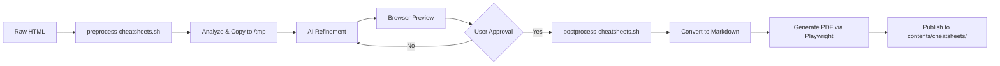

# AGENTS.md - Surfing Project Context

## Project Overview

**Surfing** is a modern, AI-powered static site generator for content creators, researchers, and writers. Built on Astro 5, it provides a clean, performant space to publish knowledge and AI-driven creations with zero client-side JavaScript by default.

**Core Value Proposition:**

- **Content-First Architecture:** Type-safe collections with Zod validation
- **Multi-Format Support:** Markdown, MDX, HTML with intelligent conversion
- **AI-Powered Workflows:** Automated content processing and PDF generation
- **Production-Ready:** SEO, i18n, accessibility, and performance built-in

**Key Features:**

- 4 content types: Articles (Obsidian-compatible), Showcase (portfolios), Documents (HTML pages), Cheatsheets (AI-generated references)
- Automated publishing via PostSurfing CLI with frontmatter validation
- Native i18n (en/zh/ja) with proper routing and hreflang
- SEO-optimized with JSON-LD, automated sitemaps, and meta tags
- PDF generation for cheatsheets with AI refinement pipeline
- Full Obsidian markdown compatibility (aliases, tags, frontmatter)

## Architecture & Tech Stack

### Core Framework

- **Astro 5.12.9** - Static site generator, zero JS by default
- **TypeScript 5.8.3** - Strict null checks, path aliases (`~/*` → `src/*`, `@contents/*`, `@assets/*`)
- **Node.js 18.17.1+ | 20.3.0+ | 21+** - Runtime requirement
- **Tailwind CSS 3.4.17** - Utility-first styling with @tailwindcss/typography

### Essential Integrations

**Content & SEO:**

- `@astrojs/sitemap` - XML sitemap generation
- `@astrojs/rss` - RSS feeds for all collections
- `astro-robots-txt` - Automated robots.txt
- `@astrolib/seo` - SEO meta tags and structured data

**Code & Markdown:**

- `astro-expressive-code` - Syntax highlighting (GitHub Dark theme)
- `astro-pagefind` - Client-side search
- `@astrojs/mdx` - MDX component support
- `rehype-mermaid` - Diagram rendering
- `remark-toc` - Table of contents generation
- `rehype-external-links` - External link handling

**Performance:**

- `astro-compress` - CSS/HTML/JS/SVG compression
- `@astrojs/partytown` - Third-party script isolation
- `astro-icon` - SVG icon optimization
- `unpic` - Image optimization utilities

**Privacy & Analytics:**

- `@jop-software/astro-cookieconsent` - GDPR-compliant consent
- `@astrolib/analytics` - Privacy-focused analytics

### Content Management

- **Content Collections API** - File-based with `glob()` loader
- **Zod Schemas** - Runtime validation in `src/content/config.ts`
- **Multi-language** - Astro i18n with prefixDefaultLocale: false
- **Custom Loader** - Supports `.md`, `.mdx`, `.html` files

## Content Types & Structure

### 1. Articles Collection (`articles`)

**Location:** `contents/articles/{lang}/`
**Formats:** `.md`, `.mdx`
**Purpose:** Long-form content, technical posts, research articles

**Key Schema Fields:**

```typescript
{
  title: string                    // Required
  description?: string
  publishDate?: Date
  updateDate?: Date
  tags: string[]                   // Default: []
  category?: string
  draft: boolean                   // Default: false
  featured: boolean                // Default: false

  // Obsidian compatibility
  aliases?: string[]               // Alternative titles
  cssclass?: string                // Custom CSS class

  // Auto-generated
  readingTime?: number             // Via remark plugin
  wordCount?: number
}
```

### 2. Showcase Collection (`showcase`)

**Location:** `contents/showcase/{lang}/`
**Formats:** `.md`, `.mdx`
**Purpose:** Project portfolios with demos and GitHub links

**Key Schema Fields:**

```typescript
{
  title: string                    // Required
  description: string              // Required
  publishDate: Date                // Required
  image: string                    // Required
  projectUrl?: string              // Live demo URL
  githubUrl?: string               // Repository URL
  technologies: string[]           // Tech stack tags
  featured: boolean                // Default: false
  tags: string[]
}
```

### 3. Documents Collection (`documents`)

**Location:** `contents/documents/{lang}/`
**Formats:** `.html`, `.md`
**Purpose:** Legacy HTML content, rich-formatted pages with custom styling

**Key Schema Fields:**

```typescript
{
  title: string
  contentType: 'page' | 'snippet' | 'template' | 'legacy'  // Default: 'page'

  // Custom styling support
  externalCSS?: string[]           // CDN CSS URLs
  externalJS?: string[]            // CDN JS URLs
  customCSS?: string               // Inline CSS
  customJS?: string                // Inline JS
  preserveStyles: boolean          // Default: true

  // Auto-extracted metadata
  headings?: string[]
  links?: string[]
  wordCount?: number
  readingTime?: number
}
```

### 4. Cheatsheets Collection (`cheatsheets`)

**Location:** `contents/cheatsheets/{lang}/`
**Formats:** `.html`, `.md`
**Purpose:** AI-generated reference materials with PDF downloads

**Key Schema Fields:**

```typescript
{
  title: string
  topic?: string                   // Main technology/topic
  difficulty?: 'beginner' | 'intermediate' | 'advanced'
  format: 'html' | 'markdown'      // Default: 'html'

  // PDF generation
  pdfUrl?: string                  // Generated PDF path
  downloadUrl?: string

  // AI metadata
  generatedBy?: string             // AI model used
  prompt?: string                  // Original prompt
  version?: string                 // Cheatsheet version

  // Custom styling (for HTML format)
  externalCSS?: string[]
  customCSS?: string
  preserveStyles: boolean          // Default: true
}
```

**Content Organization:**

```
contents/
├── articles/
│   ├── en/           # English articles
│   ├── zh/           # Chinese articles (if exists)
│   └── ja/           # Japanese articles (if exists)
├── showcase/
│   └── {lang}/
├── documents/
│   └── {lang}/
└── cheatsheets/
    └── en/           # Currently English only
```

## CLI Tools & Workflows

### PostSurfing CLI

**Main Script:** `scripts/postsurfing/postsurfing.mjs`
**Modules:**

- `lib/content-processor.mjs` - Content parsing and transformation
- `lib/frontmatter-manager.mjs` - Zod schema validation
- `lib/html-converter.mjs` - HTML → Markdown conversion
- `lib/build-validator.mjs` - Pre-publish build verification
- `lib/git-manager.mjs` - Git operations
- `lib/logger.mjs` - Colored console output

**Capabilities:**

1. **Frontmatter Validation** - Validates against Zod schemas from `src/content/config.ts`
2. **HTML → Markdown** - Converts HTML with asset extraction (CSS, images)
3. **Build Verification** - Runs `npm run build` before publishing
4. **Git Integration** - Auto-staging, committing (optional push)
5. **Multi-language** - Detects language from directory structure
6. **Interactive Mode** - User prompts for missing frontmatter fields

**Usage Examples:**

```bash
# Publish markdown article
node scripts/postsurfing/postsurfing.mjs ./my-article.md --type articles

# Convert HTML document with auto-conversion
node scripts/postsurfing/postsurfing.mjs ./page.html --type documents --auto-convert

# Interactive showcase publishing (prompts for missing fields)
node scripts/postsurfing/postsurfing.mjs ./project.md --type showcase --interactive

# Dry run without git operations
node scripts/postsurfing/postsurfing.mjs ./content.md --type articles --dry-run
```

### Cheatsheet Processing Pipeline

**Scripts:**

- `scripts/preprocess-cheatsheets.sh` - Stage 1: Preparation
- `scripts/postprocess-cheatsheets.sh` - Stage 2: Finalization

**Workflow:**



**Stage 1: Preprocessing**

- Analyzes HTML structure
- Generates configuration JSON
- Copies to `/tmp/cheatsheet-preview/` for AI review

**Stage 2: Postprocessing**

- Converts approved HTML to markdown
- Generates PDF using Playwright (headless Chrome)
- Copies to `contents/cheatsheets/{lang}/`
- Updates frontmatter with `pdfUrl`

## Code Quality Standards

### Tooling Configuration

**Biome (`biome.json`):**

- **Purpose**: Unified tool for linting and formatting
- **Rules**: Replaces ESLint and Prettier
- **Usage**: `bun run check` (type check + biome)
- **Critical:** Never bypass Biome checks

**TypeScript (`tsconfig.json`):**

- Strict null checks enabled
- Path aliases: `~/*` → `src/*`, `@contents/*`, `@assets/*`
- Type-safe content collections with Zod inference

### Code Style Enforcement

**Strict Rules:**

- ❌ No explicit `any` types (except content collections in `.astro` files)
- ✅ Unused variables prefixed with `_` are allowed
- ✅ Smart tabs for indentation
- ❌ No mixed spaces and tabs
- ❌ Never bypass Prettier/ESLint via ignore files
- ❌ No git commands except `git diff` for inspecting changes

**Git Workflow Constraints:**

- Use PostSurfing CLI for content commits
- Build must pass before merge
- Linting errors block CI/CD

### Development Commands

```bash
# Development
bun run dev              # Start Astro dev server (localhost:4321)
bun run build            # Production build to dist/
bun run preview          # Preview production build

# Code Quality (run before commits)
bun run check            # Astro check + Biome check
bun run check:astro      # Type checking only
bun run check:biome      # Linting + Formatting check

# Auto-fix
bun run fix              # Fix Biome issues (linting + formatting)
```

## Testing Strategy

### Test Structure

```
tests/
├── postsurfing/
│   ├── fixtures/              # Test data (sample markdown, HTML)
│   ├── integration/           # E2E CLI workflow tests
│   │   └── content-processing.test.mjs
│   └── unit/                  # Module unit tests
│       └── content-processor.test.mjs
├── test-runner.mjs            # Custom test runner
└── test-utils.mjs             # Shared test utilities
```

### Testing Tools

- **Playwright** - HTML processing and PDF generation (headless Chrome)
- **Custom Runner** - Lightweight test framework (`tests/test-runner.mjs`)
- **Node.js Assert** - Built-in assertion library
- **Test Utilities** - Fixtures, mocks, temp file management

### Test Categories

**Unit Tests:**

- Content processor module logic
- Frontmatter validation
- HTML converter functionality

**Integration Tests:**

- End-to-end PostSurfing CLI workflows
- Build verification
- Git operations (mocked)

**Content Processing Tests:**

- HTML → Markdown conversion accuracy
- Asset extraction (CSS, images)
- Frontmatter parsing edge cases

**Running Tests:**

```bash
# Run all tests
node tests/test-runner.mjs

# Run specific test file
node tests/postsurfing/unit/content-processor.test.mjs
```

## Project Structure

### Source Code (`src/`)

```
src/
├── components/
│   ├── blog/              # Blog UI (PostList, Tags, Categories)
│   ├── common/            # Shared (Header, Footer, Metadata)
│   ├── ui/                # Primitives (Button, Image, Icon)
│   └── widgets/           # Features (Hero, Features, Stats)
├── content/
│   └── config.ts          # Content collections + Zod schemas
├── i18n/
│   ├── index.ts           # i18n utilities
│   └── translations/      # en.ts, zh.ts, ja.ts
├── layouts/
│   ├── Layout.astro       # Base layout
│   └── PageLayout.astro   # Content page layout
├── pages/
│   ├── articles/          # Article routes + RSS
│   ├── showcase/          # Showcase routes + RSS
│   ├── documents/         # Document routes + RSS
│   ├── cheatsheets/       # Cheatsheet routes + RSS
│   ├── browse.astro       # Content browser
│   └── [...blog]/         # Dynamic blog routes
├── utils/
│   ├── blog.ts            # Blog utilities
│   ├── content.ts         # Content collection helpers
│   ├── frontmatter.ts     # Remark/rehype plugins
│   ├── images.ts          # Image processing
│   ├── navigation.ts      # Menu generation
│   └── permalinks.ts      # URL generation
├── navigation.ts          # Site navigation config
├── types.d.ts             # TypeScript types
└── env.d.ts               # Astro environment types
```

### Content (`contents/`)

```
contents/
├── articles/{lang}/       # Markdown articles
├── showcase/{lang}/       # Project showcases
├── documents/{lang}/      # HTML documents
└── cheatsheets/{lang}/    # Cheatsheet HTML/MD
```

### Scripts (`scripts/`)

```
scripts/
├── postsurfing/
│   ├── postsurfing.mjs                # Main CLI entry
│   └── lib/
│       ├── content-processor.mjs      # Core processing
│       ├── frontmatter-manager.mjs    # Schema validation
│       ├── html-converter.mjs         # HTML → MD
│       ├── build-validator.mjs        # Build testing
│       ├── git-manager.mjs            # Git operations
│       └── logger.mjs                 # Console output
├── preprocess-cheatsheets.sh          # Stage 1
└── postprocess-cheatsheets.sh         # Stage 2
```

### Configuration Files

**Core:**

- `astro.config.ts` - Astro + integrations setup
- `tsconfig.json` - TypeScript + path aliases
- `package.json` - Dependencies, scripts, Node version

**Code Quality:**

- `eslint.config.js` - Linting rules
- `.prettierrc` - Formatting config (via prettier-plugin-astro)

**Styling:**

- `tailwind.config.js` - Tailwind + typography plugin
- `src/config.yaml` - Site config (metadata, i18n, features)

**Other:**

- `vendor/integration/` - Custom Astro integration

## Internationalization (i18n)

### Configuration

**Astro Config (`astro.config.ts`):**

```typescript
i18n: {
  defaultLocale: 'en',
  locales: ['en', 'zh', 'ja'],
  routing: {
    prefixDefaultLocale: false  // English URLs: /articles/post
  }
}
```

### Supported Languages

| Code | Language             | URL Prefix     | Example                |
| ---- | -------------------- | -------------- | ---------------------- |
| `en` | English              | None (default) | `/articles/my-post`    |
| `zh` | Chinese (Simplified) | `/zh/`         | `/zh/articles/my-post` |
| `ja` | Japanese             | `/ja/`         | `/ja/articles/my-post` |

### Translation System

**Translation Files:** `src/i18n/translations/{lang}.ts`

**Structure:**

```typescript
export default {
  'nav.home': 'Home',
  'nav.articles': 'Articles',
  'footer.copyright': '© 2024 Surfing',
  // ... more translations
};
```

**Usage in Components:**

```astro
---
import { getTranslation } from '~/i18n';
const t = getTranslation(Astro.currentLocale);
---

<p>{t('nav.home')}</p>
```

### Content Organization

```
contents/
├── articles/
│   ├── en/          # English articles
│   ├── zh/          # Chinese articles
│   └── ja/          # Japanese articles
└── [other collections follow same pattern]
```

### SEO & Hreflang

- Automatic hreflang tags for multi-language content
- Language-specific sitemaps
- Proper canonical URLs per language

## SEO & Performance

### SEO Features

**Automated Meta Tags:**

- OpenGraph (og:title, og:image, og:description, og:type)
- Twitter Cards (twitter:card, twitter:site)
- Canonical URLs
- Language alternates (hreflang)

**Structured Data (JSON-LD):**

- Article schema for blog posts
- Website schema
- BreadcrumbList for navigation
- Organization schema

**Discovery:**

- `@astrojs/sitemap` - XML sitemap at `/sitemap-index.xml`
- `@astrojs/rss` - RSS feeds at `/[collection]/rss.xml`
- `astro-robots-txt` - robots.txt with sitemap reference
- `astro-pagefind` - Static search index

### Performance Optimizations

**Build-Time:**

- Static site generation (SSG) - Zero server latency
- `astro-compress` - Minifies CSS, HTML, JS, SVG
- Image optimization via `unpic` and Astro Image
- Code splitting (automatic per-page bundles)

**Runtime:**

- **Zero JS by default** - Astro's core principle
- `@astrojs/partytown` - Third-party scripts in web workers
- Lazy loading images (via `rehype` plugin)
- Responsive images with `srcset`

**Privacy:**

- `@jop-software/astro-cookieconsent` - GDPR compliance
- Consent-based Google Analytics (gtag consent mode)
- Configurable cookie categories (necessary, analytics, marketing)

**Monitoring:**

- Lighthouse CI ready
- Core Web Vitals tracking via GA4

## Deployment & Hosting

### Build Process

```bash
npm run build                    # Builds to dist/
npm run preview                  # Preview production build locally
```

**Output:**

- Static HTML files in `dist/`
- Compressed assets (CSS, JS, images)
- Sitemap, robots.txt, RSS feeds
- No server-side rendering required

### Deployment Targets

**Compatible Platforms:**

- **Cloudflare Pages** - Recommended for global CDN
- **Netlify** - Easy setup with drag-and-drop
- **Vercel** - Zero-config Astro support
- **GitHub Pages** - Free hosting for open-source

**Configuration:**

- Site URL: `https://surfing.salty.vip/`
- Base path: `/` (root deployment)
- Output mode: `static` (no SSR)

### CI/CD Considerations

**Pre-deploy Checks:**

1. `npm run check` - Linting + type checking
2. `npm run build` - Production build test
3. Test runner (optional)

**Recommended Pipeline:**

```yaml
# Example GitHub Actions
- run: bun install --frozen-lockfile
- run: bun run check
- run: bun run build
- deploy: dist/
```

## Development Workflow

### Content Creation Workflow

**Option 1: Manual (Direct file creation)**

1. Create file in `contents/{collection}/{lang}/my-content.md`
2. Add frontmatter matching Zod schema
3. Test locally with `npm run dev`
4. Commit via git

**Option 2: PostSurfing CLI (Recommended)**

```bash
# 1. Create content file with frontmatter
# 2. Run PostSurfing CLI
node scripts/postsurfing/postsurfing.mjs ./my-article.md --type articles

# PostSurfing will:
# - Validate frontmatter against schema
# - Move file to correct location
# - Run build verification
# - Stage and commit to git
# - Optionally push to remote
```

### Code Development Workflow

**Before Starting:**

```bash
npm run dev              # Start dev server
```

**While Developing:**

1. Make code changes
2. Check browser at `localhost:4321`
3. Fix TypeScript errors in editor

**Before Committing:**

```bash
bun run check            # Verify no errors
bun run fix              # Auto-fix formatting
bun run build            # Ensure production build works
```

**Commit Workflow:**

```bash
git add .
git diff --staged        # Review changes (ONLY allowed git command)
git commit -m "feat: add feature X"
```

## Common Patterns & Conventions

### File Naming

**Content Files:**

- Kebab-case: `my-article.md`, `javascript-cheatsheet.html`
- No language prefix in filename (directory-based: `en/`, `zh/`)
- Descriptive slugs: `getting-started-with-astro.md`

**Component Files:**

- PascalCase: `BlogPost.astro`, `ArticleList.astro`
- Feature-based: `CheatsheetFooter.astro`

**Utility Files:**

- camelCase: `blogUtils.ts`, `permalinks.ts`

### Frontmatter Standards

**Required vs Optional:**

```yaml
# Articles (required)
title: 'My Article Title'
# Optional but recommended
description: 'SEO description'
publishDate: 2024-01-15
tags: [astro, typescript]
category: 'tutorials'
draft: false
featured: false
```

**Date Formats:**

- ISO 8601: `2024-01-15` or `2024-01-15T10:30:00Z`
- Zod parses as Date objects automatically

### Component Patterns

**Astro Component Template:**

```astro
---
// TypeScript in frontmatter
interface Props {
  title: string;
  description?: string;
}

const { title, description } = Astro.props;
---

<div>
  <h1>{title}</h1>
  {description && <p>{description}</p>}
</div>
```

**Utility Function Pattern:**

```typescript
// src/utils/myUtil.ts
export function processContent(content: string): string {
  // Pure function, no side effects
  return content.trim();
}
```

### Import Aliases

```typescript
import Layout from '~/layouts/Layout.astro'; // src/
import article from '@contents/articles/en/post.md'; // contents/
import logo from '@assets/logo.png'; // assets/
```

## Troubleshooting

### Build Issues

**Problem:** Build fails with type errors

```bash
npm run check:astro          # Identify specific errors
npm run fix                  # Auto-fix formatting issues
```

**Problem:** Node version mismatch

- Required: Node.js 18.17.1+ | 20.3.0+ | 21+
- Check: `node --version`
- Solution: Use nvm or update Node.js

**Problem:** Dependencies out of sync

```bash
rm -rf node_modules package-lock.json
npm install
```

### Content Issues

**Problem:** Content not appearing on site

- Check `draft: false` in frontmatter
- Verify file is in correct `contents/{collection}/{lang}/` directory
- Run `npm run build` and check for Zod validation errors

**Problem:** Frontmatter validation fails

```bash
# Use PostSurfing CLI for detailed error messages
node scripts/postsurfing/postsurfing.mjs ./article.md --type articles
```

**Problem:** Images not loading

- Use paths relative to `public/`: `/images/photo.jpg`
- Or use Astro assets: `import img from '@assets/photo.jpg'`
- Supported formats: JPG, PNG, WebP, AVIF, SVG

### Performance Issues

**Problem:** Slow build times

- Check `astro-compress` settings in `astro.config.ts`
- Disable compression during development
- Reduce image sizes before importing

**Problem:** Large bundle size

- Run `npm run build` and check `dist/` sizes
- Use `astro:assets` for image optimization
- Ensure third-party scripts use Partytown

## Quick Reference

### Essential Commands

```bash
# Development
npm run dev              # Start dev server (localhost:4321)
npm run build            # Production build
npm run preview          # Preview production build

# Code Quality
npm run check            # Astro + ESLint + Prettier
npm run fix              # Auto-fix all issues

# Content Publishing
node scripts/postsurfing/postsurfing.mjs <file> --type <collection>

# Testing
node tests/test-runner.mjs
```

### Key File Locations

| Purpose           | Location                              |
| ----------------- | ------------------------------------- |
| Content schemas   | `src/content/config.ts`               |
| Site config       | `src/config.yaml`                     |
| Astro config      | `astro.config.ts`                     |
| Navigation        | `src/navigation.ts`                   |
| i18n translations | `src/i18n/translations/`              |
| PostSurfing CLI   | `scripts/postsurfing/postsurfing.mjs` |

### Content Collections Reference

| Collection  | Path                           | Formats        | Key Fields                    |
| ----------- | ------------------------------ | -------------- | ----------------------------- |
| Articles    | `contents/articles/{lang}/`    | `.md`, `.mdx`  | title, tags, category         |
| Showcase    | `contents/showcase/{lang}/`    | `.md`, `.mdx`  | title, image, projectUrl      |
| Documents   | `contents/documents/{lang}/`   | `.html`, `.md` | title, customCSS, externalCSS |
| Cheatsheets | `contents/cheatsheets/{lang}/` | `.html`, `.md` | title, topic, pdfUrl          |

### Common Tasks

**Add new article:**

```bash
# 1. Create file
vim contents/articles/en/my-post.md

# 2. Add frontmatter
---
title: "My Post"
publishDate: 2024-01-15
tags: [astro]
draft: false
---

# 3. Publish with PostSurfing
node scripts/postsurfing/postsurfing.mjs contents/articles/en/my-post.md --type articles
```

**Fix linting errors:**

```bash
npm run check            # See errors
npm run fix              # Auto-fix
npm run build            # Verify build works
```

**Add new language:**

1. Update `astro.config.ts` i18n.locales
2. Create `src/i18n/translations/{lang}.ts`
3. Add content directories: `contents/articles/{lang}/`

---

## Task Master AI Integration

### Essential Commands

#### Core Workflow Commands

```bash
# Project Setup
task-master init                                    # Initialize Task Master in current project
task-master parse-prd .taskmaster/docs/prd.txt      # Generate tasks from PRD document
task-master models --setup                        # Configure AI models interactively

# Daily Development Workflow
task-master list                                   # Show all tasks with status
task-master next                                   # Get next available task to work on
task-master show <id>                             # View detailed task information (e.g., task-master show 1.2)
task-master set-status --id=<id> --status=done    # Mark task complete

# Task Management
task-master add-task --prompt="description" --research        # Add new task with AI assistance
task-master expand --id=<id> --research --force              # Break task into subtasks
task-master update-task --id=<id> --prompt="changes"         # Update specific task
task-master update --from=<id> --prompt="changes"            # Update multiple tasks from ID onwards
task-master update-subtask --id=<id> --prompt="notes"        # Add implementation notes to subtask

# Analysis & Planning
task-master analyze-complexity --research          # Analyze task complexity
task-master complexity-report                      # View complexity analysis
task-master expand --all --research               # Expand all eligible tasks

# Dependencies & Organization
task-master add-dependency --id=<id> --depends-on=<id>       # Add task dependency
task-master move --from=<id> --to=<id>                       # Reorganize task hierarchy
task-master validate-dependencies                            # Check for dependency issues
task-master generate                                         # Update task markdown files (usually auto-called)
```

### Key Files & Project Structure

#### Core Files

- `.taskmaster/tasks/tasks.json` - Main task data file (auto-managed)
- `.taskmaster/config.json` - AI model configuration (use `task-master models` to modify)
- `.taskmaster/docs/prd.txt` - Product Requirements Document for parsing
- `.taskmaster/tasks/*.txt` - Individual task files (auto-generated from tasks.json)
- `.env` - API keys for CLI usage

#### Claude Code Integration Files

- `CLAUDE.md` - Auto-loaded context for Claude Code (this file)
- `.claude/settings.json` - Claude Code tool allowlist and preferences
- `.claude/commands/` - Custom slash commands for repeated workflows
- `.mcp.json` - MCP server configuration (project-specific)

#### Directory Structure

```
project/
├── .taskmaster/
│   ├── tasks/              # Task files directory
│   │   ├── tasks.json      # Main task database
│   │   ├── task-1.md      # Individual task files
│   │   └── task-2.md
│   ├── docs/              # Documentation directory
│   │   ├── prd.txt        # Product requirements
│   ├── reports/           # Analysis reports directory
│   │   └── task-complexity-report.json
│   ├── templates/         # Template files
│   │   └── example_prd.txt  # Example PRD template
│   └── config.json        # AI models & settings
├── .claude/
│   ├── settings.json      # Claude Code configuration
│   └── commands/         # Custom slash commands
├── .env                  # API keys
├── .mcp.json            # MCP configuration
└── CLAUDE.md            # This file - auto-loaded by Claude Code
```

### MCP Integration

Task Master provides an MCP server that Claude Code can connect to. Configure in `.mcp.json`:

```json
{
  "mcpServers": {
    "task-master-ai": {
      "command": "npx",
      "args": ["-y", "task-master-ai"],
      "env": {
        "ANTHROPIC_API_KEY": "your_key_here",
        "PERPLEXITY_API_KEY": "your_key_here",
        "OPENAI_API_KEY": "OPENAI_API_KEY_HERE",
        "GOOGLE_API_KEY": "GOOGLE_API_KEY_HERE",
        "XAI_API_KEY": "XAI_API_KEY_HERE",
        "OPENROUTER_API_KEY": "OPENROUTER_API_KEY_HERE",
        "MISTRAL_API_KEY": "MISTRAL_API_KEY_HERE",
        "AZURE_OPENAI_API_KEY": "AZURE_OPENAI_API_KEY_HERE",
        "OLLAMA_API_KEY": "OLLAMA_API_KEY_HERE"
      }
    }
  }
}
```

#### Essential MCP Tools

```javascript
help; // = shows available taskmaster commands
// Project setup
initialize_project; // = task-master init
parse_prd; // = task-master parse-prd

// Daily workflow
get_tasks; // = task-master list
next_task; // = task-master next
get_task; // = task-master show <id>
set_task_status; // = task-master set-status

// Task management
add_task; // = task-master add-task
expand_task; // = task-master expand
update_task; // = task-master update-task
update_subtask; // = task-master update-subtask
update; // = task-master update

// Analysis
analyze_project_complexity; // = task-master analyze-complexity
complexity_report; // = task-master complexity-report
```

### Claude Code Workflow Integration

#### Standard Development Workflow

##### 1. Project Initialization

```bash
# Initialize Task Master
task-master init

# Create or obtain PRD, then parse it
task-master parse-prd .taskmaster/docs/prd.txt

# Analyze complexity and expand tasks
task-master analyze-complexity --research
task-master expand --all --research
```

If tasks already exist, another PRD can be parsed (with new information only!) using parse-prd with --append flag. This will add the generated tasks to the existing list of tasks.

##### 2. Daily Development Loop

```bash
# Start each session
task-master next                           # Find next available task
task-master show <id>                     # Review task details

# During implementation, check in code context into the tasks and subtasks
task-master update-subtask --id=<id> --prompt="implementation notes..."

# Complete tasks
task-master set-status --id=<id> --status=done
```

##### 3. Multi-Claude Workflows

For complex projects, use multiple Claude Code sessions:

```bash
# Terminal 1: Main implementation
cd project && claude

# Terminal 2: Testing and validation
cd project-test-worktree && claude

# Terminal 3: Documentation updates
cd project-docs-worktree && claude
```

#### Custom Slash Commands

Create `.claude/commands/taskmaster-next.md`:

```markdown
Find the next available Task Master task and show its details.

Steps:

1. Run `task-master next` to get the next task
2. If a task is available, run `task-master show <id>` for full details
3. Provide a summary of what needs to be implemented
4. Suggest the first implementation step
```

Create `.claude/commands/taskmaster-complete.md`:

```markdown
Complete a Task Master task: $ARGUMENTS

Steps:

1. Review the current task with `task-master show $ARGUMENTS`
2. Verify all implementation is complete
3. Run any tests related to this task
4. Mark as complete: `task-master set-status --id=$ARGUMENTS --status=done`
5. Show the next available task with `task-master next`
```

### Tool Allowlist Recommendations

Add to `.claude/settings.json`:

```json
{
  "allowedTools": [
    "Edit",
    "Bash(task-master *)",
    "Bash(git commit:*)",
    "Bash(git add:*)",
    "Bash(npm run *)",
    "mcp__task_master_ai__*"
  ]
}
```

### Configuration & Setup

#### API Keys Required

At least **one** of these API keys must be configured:

- `ANTHROPIC_API_KEY` (Claude models) - **Recommended**
- `PERPLEXITY_API_KEY` (Research features) - **Highly recommended**
- `OPENAI_API_KEY` (GPT models)
- `GOOGLE_API_KEY` (Gemini models)
- `MISTRAL_API_KEY` (Mistral models)
- `OPENROUTER_API_KEY` (Multiple models)
- `XAI_API_KEY` (Grok models)

An API key is required for any provider used across any of the 3 roles defined in the `models` command.

#### Model Configuration

```bash
# Interactive setup (recommended)
task-master models --setup

# Set specific models
task-master models --set-main claude-3-5-sonnet-20241022
task-master models --set-research perplexity-llama-3.1-sonar-large-128k-online
task-master models --set-fallback gpt-4o-mini
```

### Task Structure & IDs

#### Task ID Format

- Main tasks: `1`, `2`, `3`, etc.
- Subtasks: `1.1`, `1.2`, `2.1`, etc.
- Sub-subtasks: `1.1.1`, `1.1.2`, etc.

#### Task Status Values

- `pending` - Ready to work on
- `in-progress` - Currently being worked on
- `done` - Completed and verified
- `deferred` - Postponed
- `cancelled` - No longer needed
- `blocked` - Waiting on external factors

#### Task Fields

```json
{
  "id": "1.2",
  "title": "Implement user authentication",
  "description": "Set up JWT-based auth system",
  "status": "pending",
  "priority": "high",
  "dependencies": ["1.1"],
  "details": "Use bcrypt for hashing, JWT for tokens...",
  "testStrategy": "Unit tests for auth functions, integration tests for login flow",
  "subtasks": []
}
```

### Claude Code Best Practices with Task Master

#### Context Management

- Use `/clear` between different tasks to maintain focus
- This CLAUDE.md file is automatically loaded for context
- Use `task-master show <id>` to pull specific task context when needed

#### Iterative Implementation

1. `task-master show <subtask-id>` - Understand requirements
2. Explore codebase and plan implementation
3. `task-master update-subtask --id=<id> --prompt="detailed plan"` - Log plan
4. `task-master set-status --id=<id> --status=in-progress` - Start work
5. Implement code following logged plan
6. `task-master update-subtask --id=<id> --prompt="what worked/didn't work"` - Log progress
7. `task-master set-status --id=<id> --status=done` - Complete task

#### Complex Workflows with Checklists

For large migrations or multi-step processes:

1. Create a markdown PRD file describing the new changes: `touch task-migration-checklist.md` (prds can be .txt or .md)
2. Use Taskmaster to parse the new prd with `task-master parse-prd --append` (also available in MCP)
3. Use Taskmaster to expand the newly generated tasks into subtasks. Consider using `analyze-complexity` with the correct --to and --from IDs (the new ids) to identify the ideal subtask amounts for each task. Then expand them.
4. Work through items systematically, checking them off as completed
5. Use `task-master update-subtask` to log progress on each task/subtask and/or updating/researching them before/during implementation if getting stuck

#### Git Integration

Task Master works well with `gh` CLI:

```bash
# Create PR for completed task
gh pr create --title "Complete task 1.2: User authentication" --body "Implements JWT auth system as specified in task 1.2"

# Reference task in commits
git commit -m "feat: implement JWT auth (task 1.2)"
```

#### Parallel Development with Git Worktrees

```bash
# Create worktrees for parallel task development
git worktree add ../project-auth feature/auth-system
git worktree add ../project-api feature/api-refactor

# Run Claude Code in each worktree
cd ../project-auth && claude    # Terminal 1: Auth work
cd ../project-api && claude     # Terminal 2: API work
```

### Troubleshooting

#### AI Commands Failing

```bash
# Check API keys are configured
cat .env                           # For CLI usage

# Verify model configuration
task-master models

# Test with different model
task-master models --set-fallback gpt-4o-mini
```

#### MCP Connection Issues

- Check `.mcp.json` configuration
- Verify Node.js installation
- Use `--mcp-debug` flag when starting Claude Code
- Use CLI as fallback if MCP unavailable

#### Task File Sync Issues

```bash
# Regenerate task files from tasks.json
task-master generate

# Fix dependency issues
task-master fix-dependencies
```

DO NOT RE-INITIALIZE. That will not do anything beyond re-adding the same Taskmaster core files.

### Important Notes

#### AI-Powered Operations

These commands make AI calls and may take up to a minute:

- `parse_prd` / `task-master parse-prd`
- `analyze_project_complexity` / `task-master analyze-complexity`
- `expand_task` / `task-master expand`
- `expand_all` / `task-master expand --all`
- `add_task` / `task-master add-task`
- `update` / `task-master update`
- `update_task` / `task-master update-task`
- `update_subtask` / `task-master update-subtask`

#### File Management

- Never manually edit `tasks.json` - use commands instead
- Never manually edit `.taskmaster/config.json` - use `task-master models`
- Task markdown files in `tasks/` are auto-generated
- Run `task-master generate` after manual changes to tasks.json

#### Claude Code Session Management

- Use `/clear` frequently to maintain focused context
- Create custom slash commands for repeated Task Master workflows
- Configure tool allowlist to streamline permissions
- Use headless mode for automation: `claude -p "task-master next"`

#### Multi-Task Updates

- Use `update --from=<id>` to update multiple future tasks
- Use `update-task --id=<id>` for single task updates
- Use `update-subtask --id=<id>` for implementation logging

#### Research Mode

- Add `--research` flag for research-based AI enhancement
- Requires a research model API key like Perplexity (`PERPLEXITY_API_KEY`) in environment
- Provides more informed task creation and updates
- Recommended for complex technical tasks

---

**Documentation Version:** 2.0.0
**Last Updated:** January 2025
**Project Version:** 1.0.0-beta.52
**Astro Version:** 5.12.9
