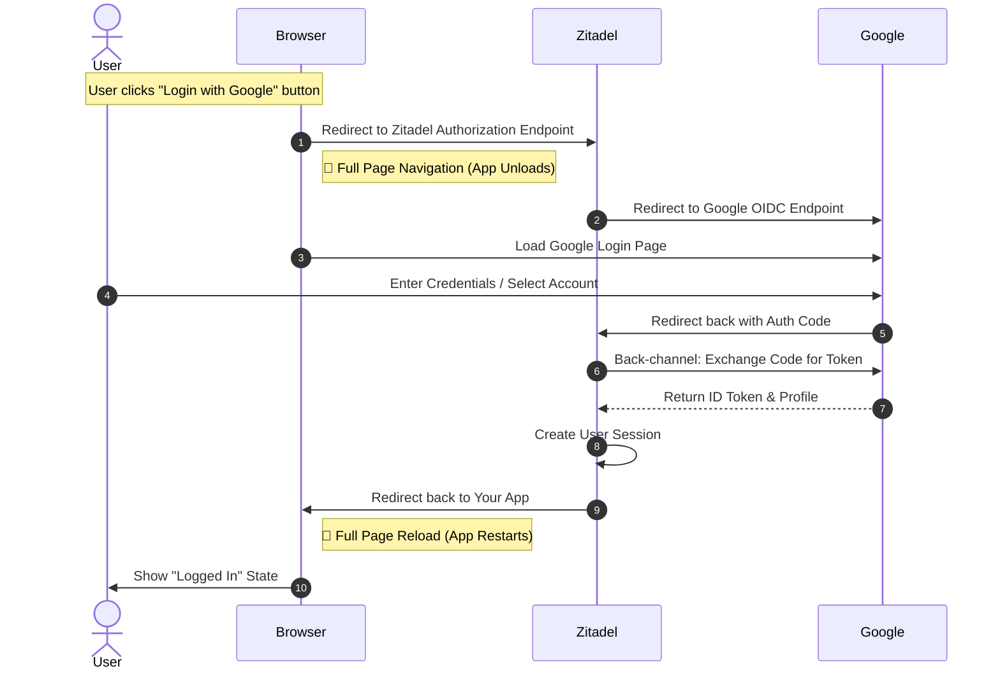
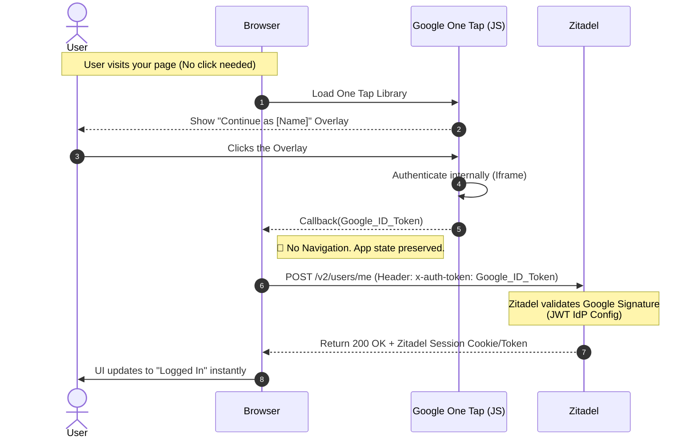

Here are the two sequence diagrams that illustrate the difference in user experience and technical flow.

### 1. The Standard OIDC Flow (Generic Google Provider)

**Key Characteristic:** The user is physically redirected away from your app to Zitadel, then to Google, and then back. The state of your current page (e.g., scroll position, unsaved form inputs) is lost unless carefully managed.

Code snippet

---

### 2. The Google One Tap Flow (JWT IdP)

**Key Characteristic:** The user never leaves the page. The Google login happens in an overlay (iframe), and the authentication with Zitadel happens in the background (AJAX/Fetch).

Code snippet

### The Trade-off

- **Diagram 1 (Standard)** is robust, standard, and works for _all_ providers (GitHub, Microsoft, etc.) identically.
- **Diagram 2 (One Tap)** is smoother ("magic"), but requires custom handling just for Google and is strictly limited to Google accounts.
