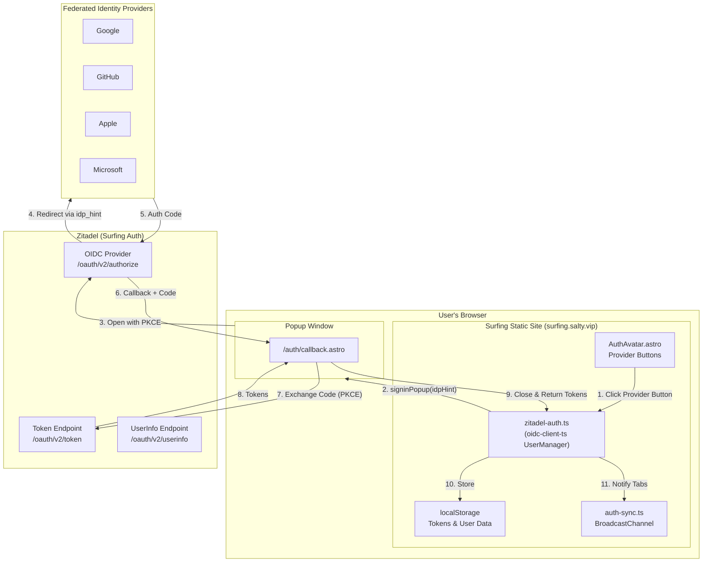
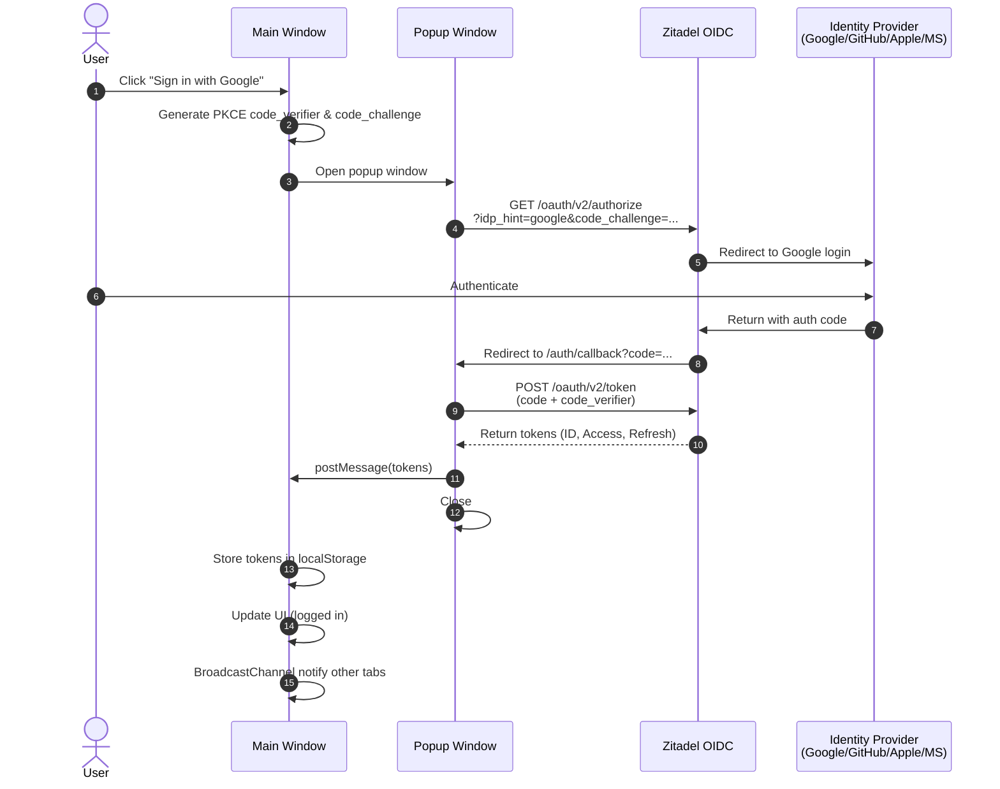

## Replace Google One Tap Login with Generic OIDC

### Background

So far, we integrated Google One Tap Login into our application. However, for a better user experience and convenience to manage users across multiple platforms, we need to replace current solution(Google One Tap Login) with a generic OpenID Connect (OIDC) solution way.

Under the hood, we already integrated the follwoing Identity Providers:

- Google
- Github
- Apple
- Microsoft

I also prepared a document in @docs/prompts/0001/OIDC_Google_One_Tap.md to show the difference sequence between Google One Tap Login and Generic OIDC, FYR.

I found a library(https://github.com/nowaythatworked/auth-astro) on zitade's official website with a sample code at https://github.com/zitadel/example-auth-astro.

### Requirements / Objectives

- Evaluate the feasibility of replacing Google One Tap Login and Supabase with a generic OIDC solution using Zitadel as the unified authentication backend, supporting Google, GitHub, Apple, and Microsoft providers;
- Evaluate the feasibility of library [Auth Astro](https://github.com/nowaythatworked/auth-astro) can be used to replace Google One Tap Login or not;

- Figure out how to replace Google One Tap Login with a generic OIDC solution using Auth Astro library as a solid execution plan;
  - Zitadel as Auth Backend: Complete replacement of Supabase - Zitadel will manage users, sessions, and identity providers
  - UX Acceptable: Page navigation is acceptable (can use popup dialog for better UX than full redirect)
  - All 4 Providers Required: Google, GitHub, Apple, Microsoft (already integrated "under the hood" in Zitadel as "Surfing Auth")
  - Complete Replacement: Remove Google One Tap and Supabase entirely (no gradual migration)
- Have an comprehensive code review for security check on the login flow related things. In case of any security issues, we need to address them immediately.

### Solutions / Goals

#### Feasibility Analysis Summary

##### Auth Astro Library Evaluation

**Finding: NOT FEASIBLE for current architecture**

The [auth-astro](https://github.com/nowaythatworked/auth-astro) library wraps `@auth/core` and requires:

- SSR mode (`output: 'server'`) - the site currently uses `output: 'static'`
- Node.js runtime for session management
- Server-side endpoints for OAuth callbacks

Switching to SSR would require:

- Deploying to a Node.js runtime (Cloudflare Workers, Vercel, etc.)
- Changing hosting infrastructure
- Modifying all static build pipelines

**Decision**: Keep static site architecture and use `oidc-client-ts` instead.

##### Alternative: oidc-client-ts Library

**Finding: FEASIBLE and RECOMMENDED**

The [oidc-client-ts](https://github.com/authts/oidc-client-ts) library is:

- Designed for client-side JavaScript/TypeScript applications
- Supports Authorization Code Flow with PKCE (OAuth 2.1 compliant)
- Provides `signinPopup()` for popup-based authentication
- Works with static sites (no SSR required)
- Mature, well-maintained successor to `oidc-client-js`

##### Zitadel as Unified Auth Backend

**Finding: FEASIBLE**

Zitadel supports:

- Federated identity providers (Google, GitHub, Apple, Microsoft already configured)
- PKCE flow for public clients (SPAs/static sites)
- `idp_hint` parameter to pre-select provider
- Client-side OIDC without server secrets

---

#### Architecture Overview



**Authentication Flow (Popup Mode with PKCE):**



**Key Changes from Current Architecture:**

1. Remove Supabase client and all Supabase-related code
2. Replace Google One Tap JS SDK with `oidc-client-ts`
3. Tokens stored in browser (localStorage via UserManager)
4. Session validation via Zitadel's userinfo endpoint or JWT validation
5. Cross-tab sync via existing BroadcastChannel pattern

---

#### Core Components

##### 1. ZitadelAuthService (`src/lib/zitadel-auth.ts`)

Replaces `src/lib/google-auth.ts`. Wraps `oidc-client-ts` UserManager.

```typescript
interface ZitadelConfig {
  authority: string; // Zitadel instance URL
  client_id: string; // PKCE app client ID (no secret)
  redirect_uri: string; // Callback URL on static site
  post_logout_redirect_uri: string;
  scope: string; // "openid profile email"
}

class ZitadelAuthService {
  private userManager: UserManager;

  constructor(config: ZitadelConfig);

  // Popup-based login with optional IdP hint
  async signInPopup(idpHint?: 'google' | 'github' | 'apple' | 'microsoft'): Promise<User>;

  // Handle callback in popup window
  async handleCallback(): Promise<User>;

  // Sign out (local + Zitadel session)
  async signOut(): Promise<void>;

  // Get current user (from cache or renew)
  async getUser(): Promise<User | null>;

  // Subscribe to auth events
  onUserLoaded(callback: (user: User) => void): void;
  onUserUnloaded(callback: () => void): void;
}
```

##### 2. AuthCallback Page (`src/pages/auth/callback.astro`)

Static page that handles the OIDC callback in the popup window:

```astro
---
// Static page - no server code
---

<html>
  <head><title>Authenticating...</title></head>
  <body>
    <script>
      import { handlePopupCallback } from '~/lib/zitadel-auth';
      handlePopupCallback(); // Processes tokens, closes popup
    </script>
  </body>
</html>
```

##### 3. Updated AuthAvatar Component

Modify `src/components/auth/AuthAvatar.astro` to:

- Replace Google One Tap initialization with ZitadelAuthService
- Keep existing UI with provider selection buttons
- Call `signInPopup('google')` etc. based on button clicked

##### 4. Environment Variables

```bash
# Remove these:
# PUBLIC_SUPABASE_URL
# PUBLIC_SUPABASE_ANON_KEY
# PUBLIC_GOOGLE_CLIENT_ID

# Add these:
PUBLIC_ZITADEL_AUTHORITY="https://surfing-auth.zitadel.cloud"
PUBLIC_ZITADEL_CLIENT_ID="your-pkce-app-client-id"
PUBLIC_ZITADEL_REDIRECT_URI="https://surfing.salty.vip/auth/callback"
```

---

#### Data Model

**User Object (from oidc-client-ts)**

```typescript
interface User {
  id_token: string; // JWT for identity claims
  access_token: string; // For API calls to Zitadel
  refresh_token?: string; // For silent renewal
  token_type: string; // "Bearer"
  expires_at: number; // Unix timestamp
  profile: {
    sub: string; // Zitadel user ID
    email?: string;
    email_verified?: boolean;
    name?: string;
    picture?: string;
    preferred_username?: string;
  };
}
```

**Storage**: localStorage via UserManager (configurable key prefix)

---

#### API / Interface Design

**Zitadel OIDC Endpoints Used:**

| Endpoint                            | Purpose                                  |
| ----------------------------------- | ---------------------------------------- |
| `/.well-known/openid-configuration` | Discovery document                       |
| `/oauth/v2/authorize`               | Authorization endpoint (with `idp_hint`) |
| `/oauth/v2/token`                   | Token exchange (PKCE, no secret)         |
| `/oauth/v2/userinfo`                | User info endpoint                       |
| `/oidc/v1/end_session`              | Logout endpoint                          |

**Client-Side Routes:**

| Route            | Purpose                             |
| ---------------- | ----------------------------------- |
| `/auth/callback` | OIDC callback handler (popup mode)  |
| `/auth/logout`   | Post-logout landing page (optional) |

---

#### Key Implementation Details

1. **PKCE Flow**: Generate `code_verifier` and `code_challenge` client-side using Web Crypto API. No client secret needed.

2. **IdP Hint**: Pass `idp_hint=google` (or `github`, `apple`, `microsoft`) to skip Zitadel's IdP selection screen and go directly to the provider.

3. **Popup Configuration**: Use `signinPopup()` with `popupWindowFeatures` to control popup size and position.

4. **Token Storage**: UserManager stores tokens in localStorage by default. Consider sessionStorage for stricter security.

5. **Silent Renewal**: Configure `automaticSilentRenew: true` to refresh tokens in hidden iframe before expiry.

6. **Cross-Tab Sync**: Keep existing `auth-sync.ts` pattern, trigger events on `userLoaded` and `userUnloaded`.

7. **Headers for Popup**: May need to set `Cross-Origin-Opener-Policy: unsafe-none` to avoid popup communication issues.

---

#### Edge Cases Handled

| Edge Case               | Solution                                                        |
| ----------------------- | --------------------------------------------------------------- |
| **Popup blocked**       | Catch error, fall back to redirect flow with `signinRedirect()` |
| **Token expired**       | Silent renewal via hidden iframe, or force re-auth              |
| **User denies consent** | Handle `access_denied` error, show friendly message             |
| **IdP unavailable**     | Show error toast, suggest trying another provider               |
| **Multiple tabs**       | BroadcastChannel sync (existing pattern)                        |
| **Returning user**      | Check for existing valid session on page load                   |
| **Logout from Zitadel** | Handle `userUnloaded` event, clear local state                  |

---

#### Security Considerations

1. **PKCE Required**: Prevents authorization code interception attacks
2. **No Client Secret**: Public client model is secure for SPAs
3. **Token Validation**: Validate JWT signature and claims client-side using Zitadel's JWKS
4. **HTTPS Only**: All auth endpoints must use HTTPS
5. **State Parameter**: `oidc-client-ts` automatically handles CSRF via state
6. **Nonce Validation**: Built into OIDC flow for replay protection
7. **Secure Token Storage**: localStorage is XSS-vulnerable; consider:
   - CSP headers to mitigate XSS
   - Short token lifetimes with silent renewal
   - sessionStorage for stricter isolation

---

#### Files to Remove (Complete Supabase/One Tap Cleanup)

```
src/lib/supabase.ts
src/lib/google-auth.ts
src/components/auth/GoogleOneTap.astro
```

#### Files to Modify

```
src/lib/config.ts             # Update auth config types
src/lib/auth-provider.ts      # Update provider types
src/lib/auth-sync.ts          # Keep, update event types
src/components/auth/AuthAvatar.astro
src/components/auth/AuthContainer.astro
astro.config.ts               # No SSR change needed
.env.example                  # Update env vars
src/config.yaml               # Update auth section
```

#### Files to Create

```
src/lib/zitadel-auth.ts       # New OIDC client wrapper
src/pages/auth/callback.astro # Callback handler page
```

---

#### Implementation Plan

##### Phase 1: Foundation [Complexity: Low] ✅ COMPLETE

**Goal**: Set up Zitadel PKCE app and install oidc-client-ts

- [x] Configure Zitadel PKCE application in Zitadel Console
  - Create new "Native" or "User Agent" application type
  - Set redirect URI: `https://surfing.salty.vip/auth/callback`
  - Set post-logout redirect URI: `https://surfing.salty.vip`
  - Enable PKCE, disable client secret requirement
  - Note the Client ID
- [x] Add IdP hints mapping for each provider in Zitadel
- [x] Install `oidc-client-ts` package: `npm install oidc-client-ts`
- [x] Create new environment variables in `.env.example`
- [x] Update `src/config.yaml` auth section with new provider config

**Deliverable**: Zitadel app configured, package installed

##### Phase 2: Core Auth Service [Complexity: Medium] ✅ COMPLETE

**Goal**: Implement ZitadelAuthService with popup authentication

- [x] Create `src/lib/zitadel-auth.ts` with UserManager wrapper
  - Configure UserManager with Zitadel settings
  - Implement `signInPopup(idpHint?)` method
  - Implement `signOut()` method
  - Implement `getUser()` method
  - Add event handlers for userLoaded/userUnloaded
- [x] Create `src/pages/auth/callback.astro` callback handler
  - Handle popup callback using `signinPopupCallback()`
  - Close popup and notify parent window
- [x] Update `src/lib/auth-sync.ts` to work with new auth service
- [x] Add fallback to redirect flow if popup is blocked

**Deliverable**: Working popup authentication with one provider (Google)

##### Phase 3: UI Integration [Complexity: Medium] ✅ COMPLETE

**Goal**: Update components to use new auth service

- [x] Update `src/components/auth/AuthAvatar.astro`
  - Replace Google One Tap initialization with ZitadelAuthService
  - Update login button handlers to call `signInPopup(idpHint)`
  - Update logout handler to call `signOut()`
  - Update session check to use `getUser()`
- [x] Update `src/components/auth/LoginPopupMenu.astro` with all 4 providers
- [x] Update `src/lib/config.ts` with new auth config types
- [x] Removed obsolete `src/lib/auth-provider.ts` and `src/components/auth/AuthContainer.astro`

**Deliverable**: All 4 providers working via popup (Google, GitHub, Apple, Microsoft)

##### Phase 4: Cleanup & Migration [Complexity: Low] ✅ COMPLETE

**Goal**: Remove Supabase and Google One Tap code

- [x] Remove `src/lib/supabase.ts`
- [x] Remove `src/lib/google-auth.ts`
- [x] Remove `src/lib/apple-auth.ts`
- [x] Remove `src/lib/auth.ts`
- [x] Remove `src/components/auth/GoogleOneTap.astro`
- [x] Remove `src/components/auth/AppleSignIn.astro`
- [x] Remove `src/components/auth/AuthContainer.astro`
- [x] Remove `src/types/auth.d.ts`
- [x] Remove Supabase and Google-related env vars from `.env.example`
- [x] Remove `@supabase/supabase-js` package

**Deliverable**: Clean codebase with no legacy auth code

##### Phase 5: Security Review & Testing [Complexity: Medium] ✅ COMPLETE

**Goal**: Comprehensive security audit and testing

- [x] Security review checklist:
  - [x] Verify PKCE is enforced (no code without verifier)
  - [x] Verify state parameter prevents CSRF
  - [x] Verify tokens are properly validated
  - [x] Check for XSS vectors in callback handling
  - [x] Verify logout clears all tokens
  - [x] Test cross-tab synchronization
- [x] Created `docs/SECURITY_AUDIT_OIDC.md` with comprehensive security analysis
- [ ] Create test scenarios (manual testing required):
  - [ ] Happy path: login with each provider
  - [ ] Popup blocked: fallback to redirect
  - [ ] Token expiry: silent renewal
  - [ ] Logout: local and Zitadel session cleared
  - [ ] Multiple tabs: sync on login/logout

**Deliverable**: Security-audited authentication system

##### Phase 6: Documentation & Deployment [Complexity: Low] ✅ COMPLETE

**Goal**: Update docs and deploy

- [x] Created `docs/ZITADEL_SETUP.md` with Zitadel setup guide
- [x] Created `docs/SECURITY_AUDIT_OIDC.md` with security analysis
- [x] Updated `.env.example` with new env vars
- [ ] Add environment variables to production (Cloudflare, GitHub Secrets)
- [ ] Deploy and verify in production

**Deliverable**: Production-ready OIDC authentication

---

#### Risks and Mitigations

| Risk                              | Likelihood | Impact | Mitigation                          |
| --------------------------------- | ---------- | ------ | ----------------------------------- |
| Popup blocked by browsers         | Medium     | High   | Implement redirect fallback         |
| Cross-Origin-Opener-Policy issues | Medium     | Medium | Configure headers if needed         |
| Token storage security (XSS)      | Low        | High   | Strong CSP, short token lifetime    |
| Silent renewal fails              | Low        | Medium | Force re-auth on failure            |
| Zitadel downtime                  | Low        | High   | Monitor, consider caching user info |

### References

- [Zitadel Doc for Astro](https://zitadel.com/docs/sdk-examples/astro)
- [Zitadel OIDC Login Guide](https://zitadel.com/docs/guides/integrate/login/oidc/login-users)
- [Zitadel Identity Providers](https://zitadel.com/docs/guides/integrate/identity-providers/introduction)
- [oidc-client-ts (Recommended Library)](https://github.com/authts/oidc-client-ts)
- [Auth Astro](https://github.com/nowaythatworked/auth-astro) - NOT recommended (requires SSR)
- [Auth Astro Example](https://github.com/zitadel/example-auth-astro)
- [The difference between Google One Tap Login and Generic OIDC](docs/prompts/0001/OIDC_Google_One_Tap.md)
