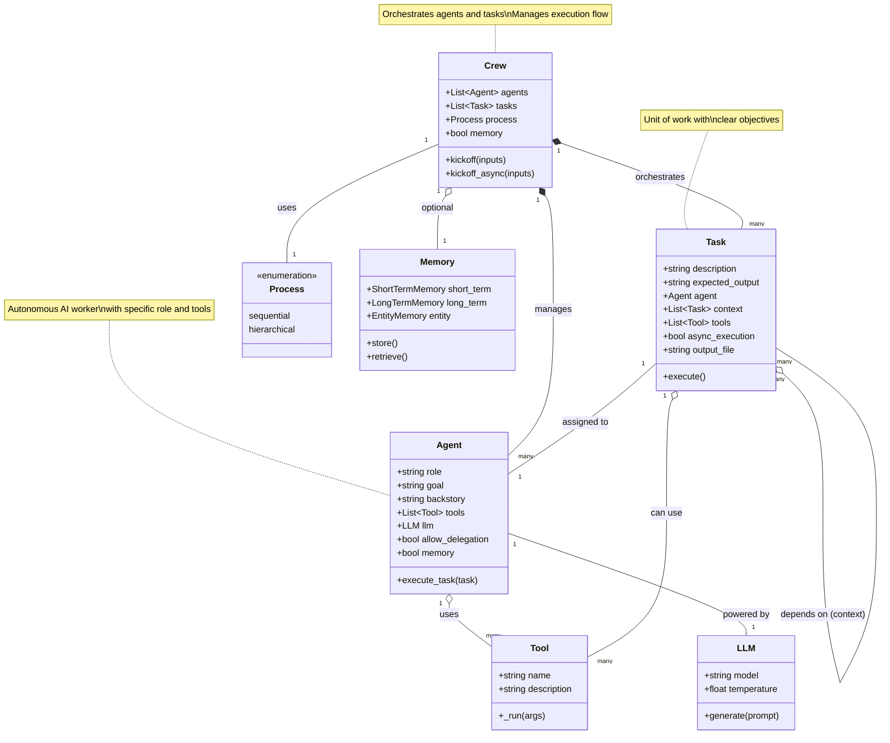

# CrewAI Tutorial for Full Stack Developers

## Architecture Overview



## What is CrewAI?

CrewAI is a Python framework for orchestrating autonomous AI agents that work together to accomplish complex tasks. Think of it as a way to create a team of AI specialists that collaborate like human developers would.

## Core Concepts

### 1. **Agents**
Individual AI workers with specific roles, goals, and expertise. Like team members with specialized skills.

### 2. **Tasks**
Specific jobs assigned to agents. Each task has a description, expected output, and an assigned agent.

### 3. **Crew**
The orchestrator that manages agents and tasks, defining how they work together.

### 4. **Tools**
Functions that agents can use to perform actions (API calls, file operations, web searches, etc.).

## Installation

```bash
pip install crewai crewai-tools
```

For the latest features:
```bash
pip install 'crewai[tools]'
```

## Quick Start Example

Here's a simple crew that researches and writes a blog post:

```python
from crewai import Agent, Task, Crew, Process
from crewai_tools import SerperDevTool

# Initialize tools
search_tool = SerperDevTool()

# Define agents
researcher = Agent(
    role='Senior Researcher',
    goal='Uncover cutting-edge developments in {topic}',
    backstory="""You're a seasoned researcher with a knack for 
    uncovering the latest developments in technology.""",
    verbose=True,
    allow_delegation=False,
    tools=[search_tool]
)

writer = Agent(
    role='Tech Content Writer',
    goal='Craft compelling content about {topic}',
    backstory="""You're a famous technical writer known for 
    clear and engaging articles about complex topics.""",
    verbose=True,
    allow_delegation=False
)

# Define tasks
research_task = Task(
    description="""Research the latest trends in {topic}. 
    Focus on innovations from the last 6 months.""",
    expected_output='A comprehensive report on latest trends',
    agent=researcher
)

write_task = Task(
    description="""Using the research, write an engaging blog post 
    about {topic}. Make it accessible yet informative.""",
    expected_output='A 4-paragraph blog post in markdown',
    agent=writer,
    context=[research_task]  # This task depends on research_task
)

# Create crew
crew = Crew(
    agents=[researcher, writer],
    tasks=[research_task, write_task],
    process=Process.sequential,  # Tasks executed in order
    verbose=2
)

# Execute
result = crew.kickoff(inputs={'topic': 'AI in healthcare'})
print(result)
```

## Agent Configuration

### Key Parameters

```python
agent = Agent(
    role='Software Architect',           # Job title
    goal='Design scalable systems',      # What they aim to achieve
    backstory='...',                     # Context for behavior
    verbose=True,                        # Show reasoning
    allow_delegation=True,               # Can assign to other agents
    tools=[tool1, tool2],                # Available tools
    max_iter=15,                         # Max iterations for task
    memory=True,                         # Remember past interactions
    llm=custom_llm                       # Custom LLM (optional)
)
```

### Using Custom LLMs

```python
from langchain_openai import ChatOpenAI

llm = ChatOpenAI(
    model="gpt-4",
    temperature=0.7
)

agent = Agent(
    role='Analyst',
    goal='Analyze data',
    backstory='Expert analyst',
    llm=llm
)
```

## Task Configuration

```python
task = Task(
    description="""Detailed description of what needs to be done.
    Use {variable} for dynamic inputs.""",
    
    expected_output='Specific format or content expected',
    
    agent=assigned_agent,
    
    context=[previous_task],  # Tasks this depends on
    
    tools=[specialized_tool],  # Task-specific tools
    
    async_execution=False,     # Run in parallel if True
    
    output_file='output.txt'   # Save result to file
)
```

## Process Types

### Sequential (Default)
Tasks run one after another. Each agent completes their task before the next starts.

```python
crew = Crew(
    agents=[agent1, agent2],
    tasks=[task1, task2],
    process=Process.sequential
)
```

### Hierarchical
One agent (manager) delegates and supervises others.

```python
crew = Crew(
    agents=[agent1, agent2, agent3],
    tasks=[task1, task2],
    process=Process.hierarchical,
    manager_llm=ChatOpenAI(model="gpt-4")
)
```

## Built-in Tools

CrewAI provides many ready-to-use tools:

```python
from crewai_tools import (
    SerperDevTool,      # Google search
    WebsiteSearchTool,  # Search specific website
    FileReadTool,       # Read files
    DirectoryReadTool,  # Read directories
    CodeDocsSearchTool, # Search code documentation
    ScrapeWebsiteTool,  # Scrape websites
    YoutubeVideoSearchTool
)

# Example: Search tool
search_tool = SerperDevTool(
    api_key="your_serper_api_key"
)

# Example: Scraping tool
scrape_tool = ScrapeWebsiteTool(
    website_url="https://example.com"
)
```

## Creating Custom Tools

### Method 1: Function Decorator

```python
from crewai_tools import tool

@tool("Calculate ROI")
def calculate_roi(investment: float, return_value: float) -> float:
    """Calculates return on investment percentage.
    
    Args:
        investment: Initial investment amount
        return_value: Final return amount
    """
    return ((return_value - investment) / investment) * 100

# Use in agent
agent = Agent(
    role='Financial Analyst',
    tools=[calculate_roi]
)
```

### Method 2: BaseTool Class

```python
from crewai_tools import BaseTool

class DatabaseQueryTool(BaseTool):
    name: str = "Database Query Tool"
    description: str = "Queries the production database"
    
    def _run(self, query: str) -> str:
        # Your database logic here
        result = execute_db_query(query)
        return result
```

## Real-World Example: Code Review Crew

```python
from crewai import Agent, Task, Crew
from crewai_tools import FileReadTool, DirectoryReadTool

# Tools
file_tool = FileReadTool()
dir_tool = DirectoryReadTool()

# Agents
code_analyzer = Agent(
    role='Senior Code Reviewer',
    goal='Identify code quality issues and security vulnerabilities',
    backstory='Expert in code review with 15 years experience',
    tools=[file_tool, dir_tool],
    verbose=True
)

documentation_reviewer = Agent(
    role='Documentation Specialist',
    goal='Ensure code is well-documented and follows standards',
    backstory='Technical writer specializing in developer documentation',
    tools=[file_tool],
    verbose=True
)

architect = Agent(
    role='Software Architect',
    goal='Evaluate architectural decisions and design patterns',
    backstory='Principal architect specializing in scalable systems',
    tools=[dir_tool],
    verbose=True
)

# Tasks
analyze_code = Task(
    description="""Review the code in {directory} for:
    - Code quality issues
    - Security vulnerabilities
    - Performance concerns
    - Best practice violations""",
    expected_output='Detailed code analysis report',
    agent=code_analyzer
)

review_docs = Task(
    description="""Review documentation in {directory} for:
    - Completeness
    - Clarity
    - Consistency with code
    - Missing docstrings""",
    expected_output='Documentation review report',
    agent=documentation_reviewer,
    context=[analyze_code]
)

evaluate_architecture = Task(
    description="""Evaluate the architecture based on:
    - Code structure analysis
    - Design pattern usage
    - Scalability considerations
    - Provide recommendations""",
    expected_output='Architecture evaluation with recommendations',
    agent=architect,
    context=[analyze_code, review_docs]
)

# Create crew
review_crew = Crew(
    agents=[code_analyzer, documentation_reviewer, architect],
    tasks=[analyze_code, review_docs, evaluate_architecture],
    process=Process.sequential,
    verbose=2
)

# Execute
result = review_crew.kickoff(inputs={
    'directory': './src'
})
```

## Memory and Context

CrewAI supports different memory types:

```python
from crewai import Crew

crew = Crew(
    agents=[agent1, agent2],
    tasks=[task1, task2],
    memory=True,              # Enable memory
    embedder={
        "provider": "openai",
        "config": {
            "model": "text-embedding-3-small"
        }
    }
)
```

Memory types:
- **Short-term**: Conversation context within current execution
- **Long-term**: Persistent learning across executions
- **Entity**: Information about specific entities (people, places, concepts)

## Error Handling and Retries

```python
task = Task(
    description='Complex task that might fail',
    expected_output='Result',
    agent=agent,
    max_retry_limit=3,  # Retry up to 3 times
    retry_delay=2       # Wait 2 seconds between retries
)
```

## Output Management

### Structured Output

```python
from pydantic import BaseModel

class BlogPost(BaseModel):
    title: str
    content: str
    tags: list[str]

task = Task(
    description='Write a blog post about AI',
    expected_output='A structured blog post',
    agent=writer,
    output_pydantic=BlogPost  # Get structured output
)
```

### Save to File

```python
task = Task(
    description='Generate report',
    expected_output='Detailed report',
    agent=analyst,
    output_file='report.md'  # Auto-save result
)
```

## Best Practices

1. **Clear Role Definition**: Give agents specific, well-defined roles
2. **Detailed Backstories**: Help agents understand their expertise and approach
3. **Explicit Expected Outputs**: Clearly define what you want from each task
4. **Tool Selection**: Only provide relevant tools to each agent
5. **Task Dependencies**: Use `context` to pass information between tasks
6. **Error Handling**: Implement retry logic for critical tasks
7. **Testing**: Test individual agents before combining into crews
8. **Verbose Mode**: Use during development, disable in production

## Common Patterns

### Research → Analysis → Action

```python
researcher_task → analyst_task → implementer_task
```

### Parallel Processing

```python
task1 = Task(..., async_execution=True)
task2 = Task(..., async_execution=True)
synthesis_task = Task(..., context=[task1, task2])
```

### Hierarchical Teams

```python
crew = Crew(
    agents=[manager, developer1, developer2],
    process=Process.hierarchical
)
```

## Integration with Your Stack

### FastAPI Integration

```python
from fastapi import FastAPI
from crewai import Crew, Agent, Task

app = FastAPI()

@app.post("/analyze")
async def analyze_code(repo_url: str):
    crew = create_analysis_crew()
    result = crew.kickoff(inputs={'repo': repo_url})
    return {"analysis": result}
```

### Async Execution

```python
import asyncio

async def run_crew_async():
    result = await crew.kickoff_async(inputs={'topic': 'AI'})
    return result
```

## Debugging Tips

1. **Enable verbose mode**: `verbose=True` or `verbose=2`
2. **Check agent reasoning**: Review thought process in logs
3. **Validate tools**: Test tools independently first
4. **Simplify**: Start with one agent/task, then expand
5. **Monitor costs**: Track API calls if using paid LLMs

## CrewAI vs Competitors

### Comparison Matrix

| Feature | CrewAI | LangGraph | AutoGen | AgentOps |
|---------|--------|-----------|---------|----------|
| **Learning Curve** | Low-Medium | Medium-High | Medium | Low |
| **Flexibility** | High | Very High | High | Medium |
| **Production Ready** | Yes | Yes | Beta | Yes |
| **Team Simulation** | Excellent | Good | Excellent | Good |
| **Documentation** | Good | Excellent | Good | Good |

### CrewAI Pros

**Strengths:**
1. **Intuitive API** - Natural role-based agent definition that mirrors real team structures
2. **Built-in Tools** - Rich ecosystem of pre-built tools for common tasks
3. **Easy Sequential/Hierarchical Flows** - Simple to create complex workflows
4. **Memory Management** - Built-in short-term, long-term, and entity memory
5. **Production Ready** - Stable, well-tested, and used in production by many companies
6. **Low Boilerplate** - Get started quickly with minimal setup
7. **Active Community** - Growing ecosystem and frequent updates
8. **Process Flexibility** - Easy to switch between sequential and hierarchical execution

**Best For:**
- Building multi-agent workflows quickly
- Simulating team collaboration patterns
- Projects requiring role-based agent specialization
- Teams wanting quick prototyping to production
- Business process automation

### CrewAI Cons

**Limitations:**
1. **Less Graph Control** - Not as flexible as LangGraph for complex state machines
2. **Python Only** - No native support for other languages
3. **Opinionated Structure** - Role-based approach may not fit all use cases
4. **Limited Async Patterns** - Async execution is simpler than some alternatives
5. **Debugging Complexity** - Multi-agent interactions can be hard to trace
6. **Cost Management** - Can rack up LLM costs quickly with many agents
7. **Version Churn** - Rapid development means occasional breaking changes

**Not Ideal For:**
- Simple single-agent tasks (overkill)
- Complex cyclic workflows requiring fine-grained control
- Projects requiring non-LLM orchestration
- Tight budget constraints (multiple LLM calls)

### LangGraph

**When to Choose LangGraph:**
- Need fine-grained control over agent state and transitions
- Building complex cyclic workflows with conditional branching
- Require explicit graph-based orchestration
- Want maximum flexibility in agent communication patterns

**Trade-offs:**
- Steeper learning curve
- More boilerplate code
- Greater flexibility but more complexity

### AutoGen (Microsoft)

**When to Choose AutoGen:**
- Working within Microsoft ecosystem
- Need advanced multi-agent conversations
- Require strong code execution capabilities
- Want built-in human-in-the-loop patterns

**Trade-offs:**
- Less mature than CrewAI
- More experimental features
- Different abstraction model

### When to Use CrewAI

**Ideal Scenarios:**
1. Building a research → analysis → reporting pipeline
2. Code review and documentation automation
3. Content creation workflows (research, write, edit)
4. Data analysis with multiple perspectives
5. Customer support automation with specialist agents
6. Business process automation with clear roles

**Decision Framework:**
```
Need simple multi-agent workflow? → CrewAI
Need complex state management? → LangGraph
Working in Microsoft ecosystem? → AutoGen
Need just orchestration? → LangChain
Need enterprise features? → Commercial solutions
```


## CrewAI vs Competitors

### Comparison Matrix

| Feature | CrewAI | LangGraph | AutoGen | AgentOps |
|---------|--------|-----------|---------|----------|
| **Learning Curve** | Low-Medium | Medium-High | Medium | Low |
| **Flexibility** | High | Very High | High | Medium |
| **Production Ready** | Yes | Yes | Beta | Yes |
| **Team Simulation** | Excellent | Good | Excellent | Good |
| **Documentation** | Good | Excellent | Good | Good |

### CrewAI Pros

**Strengths:**
1. **Intuitive API** - Natural role-based agent definition that mirrors real team structures
2. **Built-in Tools** - Rich ecosystem of pre-built tools for common tasks
3. **Easy Sequential/Hierarchical Flows** - Simple to create complex workflows
4. **Memory Management** - Built-in short-term, long-term, and entity memory
5. **Production Ready** - Stable, well-tested, and used in production by many companies
6. **Low Boilerplate** - Get started quickly with minimal setup
7. **Active Community** - Growing ecosystem and frequent updates
8. **Process Flexibility** - Easy to switch between sequential and hierarchical execution

**Best For:**
- Building multi-agent workflows quickly
- Simulating team collaboration patterns
- Projects requiring role-based agent specialization
- Teams wanting quick prototyping to production
- Business process automation

### CrewAI Cons

**Limitations:**
1. **Less Graph Control** - Not as flexible as LangGraph for complex state machines
2. **Python Only** - No native support for other languages
3. **Opinionated Structure** - Role-based approach may not fit all use cases
4. **Limited Async Patterns** - Async execution is simpler than some alternatives
5. **Debugging Complexity** - Multi-agent interactions can be hard to trace
6. **Cost Management** - Can rack up LLM costs quickly with many agents
7. **Version Churn** - Rapid development means occasional breaking changes

**Not Ideal For:**
- Simple single-agent tasks (overkill)
- Complex cyclic workflows requiring fine-grained control
- Projects requiring non-LLM orchestration
- Tight budget constraints (multiple LLM calls)

### LangGraph

**When to Choose LangGraph:**
- Need fine-grained control over agent state and transitions
- Building complex cyclic workflows with conditional branching
- Require explicit graph-based orchestration
- Want maximum flexibility in agent communication patterns

**Trade-offs:**
- Steeper learning curve
- More boilerplate code
- Greater flexibility but more complexity

### AutoGen (Microsoft)

**When to Choose AutoGen:**
- Working within Microsoft ecosystem
- Need advanced multi-agent conversations
- Require strong code execution capabilities
- Want built-in human-in-the-loop patterns

**Trade-offs:**
- Less mature than CrewAI
- More experimental features
- Different abstraction model

### When to Use CrewAI

**Ideal Scenarios:**
1. Building a research → analysis → reporting pipeline
2. Code review and documentation automation
3. Content creation workflows (research, write, edit)
4. Data analysis with multiple perspectives
5. Customer support automation with specialist agents
6. Business process automation with clear roles

**Decision Framework:**
```
Need simple multi-agent workflow? → CrewAI
Need complex state management? → LangGraph
Working in Microsoft ecosystem? → AutoGen
Need just orchestration? → LangChain
Need enterprise features? → Commercial solutions
```

## Next Steps

1. Install CrewAI and run the quick start example
2. Modify the example with your own use case
3. Create custom tools for your specific needs
4. Build a simple crew with 2-3 agents
5. Iterate and expand based on results

Start small, test thoroughly, and gradually increase complexity as you understand how agents interact. CrewAI is powerful for automating complex workflows that require multiple specialized perspectives.

## Reference Links

### Official Resources
- **CrewAI Documentation**: https://docs.crewai.com
- **GitHub Repository**: https://github.com/joaomdmoura/crewAI
- **Official Examples**: https://github.com/joaomdmoura/crewAI-examples
- **CrewAI Tools**: https://github.com/joaomdmoura/crewai-tools
- **Discord Community**: https://discord.com/invite/X4JWnZnxPb

### Tutorials and Guides
- **CrewAI Quickstart Guide**: https://docs.crewai.com/introduction
- **Building Your First Crew**: https://docs.crewai.com/how-to/create-custom-tools
- **Advanced Features Tutorial**: https://docs.crewai.com/core-concepts/agents
- **Memory and Context**: https://docs.crewai.com/core-concepts/memory

### Video Tutorials
- **CrewAI Official YouTube**: https://www.youtube.com/@crewAIInc
- **Multi-Agent Systems with CrewAI**: Search "CrewAI tutorial" on YouTube
- **Building Production Apps**: Search "CrewAI production" on YouTube

### Blog Posts and Articles
- **Introducing CrewAI**: https://blog.langchain.dev/crewai/
- **Multi-Agent Frameworks Comparison**: https://ai.gopubby.com/multi-agent-frameworks-comparison
- **CrewAI Best Practices**: https://medium.com/tag/crewai (search for latest articles)
- **Production Deployment Guide**: https://docs.crewai.com/deployment

### Tools and Extensions
- **LangChain Integration**: https://python.langchain.com/docs/integrations/tools
- **CrewAI + LangSmith**: https://docs.smith.langchain.com
- **Custom Tools Examples**: https://github.com/joaomdmoura/crewai-tools/tree/main/crewai_tools

### Community Projects
- **Awesome CrewAI**: https://github.com/topics/crewai (GitHub projects using CrewAI)
- **CrewAI Templates**: Search GitHub for "crewai template"
- **Real-World Examples**: https://github.com/crewAIInc/crewAI-examples

### Comparison and Analysis
- **LangGraph vs CrewAI**: https://blog.langchain.dev/langgraph-vs-crewai
- **Multi-Agent Orchestration Frameworks**: https://arxiv.org/search/?query=multi-agent+orchestration
- **AI Agent Frameworks 2024**: Search for latest comparison articles

### API and Integration
- **OpenAI API Docs**: https://platform.openai.com/docs
- **Anthropic API Docs**: https://docs.anthropic.com
- **LangChain Docs**: https://python.langchain.com/docs/get_started/introduction

### Troubleshooting and Support
- **GitHub Issues**: https://github.com/joaomdmoura/crewAI/issues
- **Stack Overflow**: https://stackoverflow.com/questions/tagged/crewai
- **Reddit Community**: https://www.reddit.com/r/CrewAI

### Newsletter and Updates
- **CrewAI Newsletter**: Subscribe via https://crewai.com
- **LangChain Blog**: https://blog.langchain.dev (covers CrewAI updates)

### Research Papers
- **Multi-Agent Systems**: https://arxiv.org/list/cs.MA/recent
- **LLM Agents**: https://arxiv.org/search/?query=large+language+model+agents

**Pro Tip**: Join the Discord community for real-time help, and check GitHub issues for common problems and solutions. The CrewAI repository is actively maintained with frequent updates.